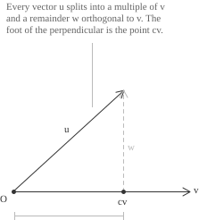
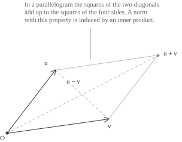
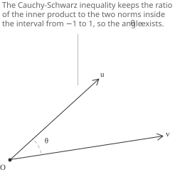
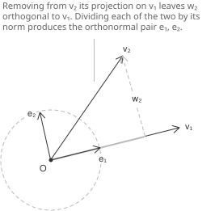

## Length and angle as algebraic data

A [vector space](../vector-spaces/) has two specified operations, addition and scalar multiplication, and its axioms say nothing about size or direction. We can add and scale vectors and test them for linear independence, but an arbitrary vector space has neither length nor angle. In $\mathbb{R}^n$ both notions are defined in terms of the [dot product](../vectors/) of two vectors:

$$\mathbf{x}\cdot\mathbf{y}=x_1y_1+\cdots+x_ny_n$$

The length of a vector and the angle between two vectors can both be expressed through this operation.

$$\|\mathbf{x}\|=\sqrt{\mathbf{x}\cdot\mathbf{x}}\qquad\cos\theta=\frac{\mathbf{x}\cdot\mathbf{y}}{\|\mathbf{x}\|\|\mathbf{y}\|}$$

These formulas depend on three properties of the dot product. It is linear in each argument, it is symmetric, and $\mathbf{x}\cdot\mathbf{x}$ is positive whenever $\mathbf{x}\neq\mathbf{0}.$ Taking these properties as axioms defines lengths and angles on spaces of [matrices](../matrices/), [polynomials](../polynomials/), [continuous functions](../continuous-functions/), or random variables. Their elements need not have a direct geometric representation, but the same computations remain valid.

- - - 

A first attempt to extend the dot product to $\mathbb{C}^n$ is to keep the same formula and set $\mathbf{z}\cdot\mathbf{w}=z_1w_1+\cdots+z_nw_n.$ Positivity fails for $\mathbf{z}=(1,i)$ in $\mathbb{C}^2,$ since:

$$\mathbf{z}\cdot\mathbf{z}=1^2+i^2=1-1=0$$

The vector is not zero, so $\mathbf{z}\cdot\mathbf{z}=0$ does not imply $\mathbf{z}=\mathbf{0}$ and the expression $\sqrt{\mathbf{z}\cdot\mathbf{z}}$ cannot define a length. For a [complex number](../complex-numbers/) $z,$ however, its [complex conjugate](../complex-number-operations/) satisfies $z\overline{z}=|z|^2,$ which is a nonnegative real number. We therefore conjugate one of the two arguments:

$$\langle\mathbf{w},\mathbf{z}\rangle=w_1\overline{z_1}+\cdots+w_n\overline{z_n}$$

With this convention $\langle\mathbf{z},\mathbf{z}\rangle=|z_1|^2+\cdots+|z_n|^2,$ which is nonnegative and vanishes only for $\mathbf{z}=\mathbf{0}.$ The operation is no longer symmetric, since exchanging its arguments conjugates its value. It is linear in the first argument and conjugate-linear in the second. Over $\mathbb{R}$ conjugation is the identity, so the inner product is again symmetric and bilinear. The same axioms therefore apply over both fields.

## Axioms of an inner product

Throughout, $\mathbb{F}$ denotes either $\mathbb{R}$ or $\mathbb{C},$ and $V$ is a vector space over $\mathbb{F}.$ An inner product on $V$ assigns to every ordered pair of vectors a scalar $\langle\mathbf{u},\mathbf{v}\rangle\in\mathbb{F}$ subject to three requirements, stated for all $\mathbf{u},\mathbf{v},\mathbf{w}\in V$ and all $\lambda\in\mathbb{F}.$

+ Linearity in the first argument, that is $\langle\mathbf{u}+\mathbf{v},\mathbf{w}\rangle=\langle\mathbf{u},\mathbf{w}\rangle+\langle\mathbf{v},\mathbf{w}\rangle$ and $\langle\lambda\mathbf{u},\mathbf{v}\rangle=\lambda\langle\mathbf{u},\mathbf{v}\rangle.$
+ Conjugate symmetry, that is $\langle\mathbf{u},\mathbf{v}\rangle=\overline{\langle\mathbf{v},\mathbf{u}\rangle}.$
+ Positive definiteness, that is $\langle\mathbf{v},\mathbf{v}\rangle>0$ for every $\mathbf{v}\neq\mathbf{0}.$

Setting $\mathbf{u}=\mathbf{v}$ in conjugate symmetry gives $\langle\mathbf{v},\mathbf{v}\rangle=\overline{\langle\mathbf{v},\mathbf{v}\rangle},$ so this scalar is real and the inequality in the third axiom is meaningful. Homogeneity with $\lambda=0$ gives $\langle\mathbf{0},\mathbf{v}\rangle=0$ for every $\mathbf{v},$ hence $\langle\mathbf{0},\mathbf{0}\rangle=0.$ The third axiom is therefore equivalent to $\langle\mathbf{v},\mathbf{v}\rangle\geq0$ for every vector, with equality only for the zero vector.

The first two axioms determine the behaviour of the second argument. Applying conjugate symmetry twice proves additivity:

$$
\begin{align}
\langle\mathbf{u},\mathbf{v}+\mathbf{w}\rangle &= \overline{\langle\mathbf{v}+\mathbf{w},\mathbf{u}\rangle} \\[6pt]
&= \overline{\langle\mathbf{v},\mathbf{u}\rangle}+\overline{\langle\mathbf{w},\mathbf{u}\rangle} \\[6pt]
&= \langle\mathbf{u},\mathbf{v}\rangle+\langle\mathbf{u},\mathbf{w}\rangle
\end{align}
$$

For a scalar multiple, the same argument gives conjugate homogeneity:

$$
\begin{align}
\langle\mathbf{u},\lambda\mathbf{v}\rangle &= \overline{\langle\lambda\mathbf{v},\mathbf{u}\rangle} \\[6pt]
&= \overline{\lambda\langle\mathbf{v},\mathbf{u}\rangle} \\[6pt]
&= \overline{\lambda}\langle\mathbf{u},\mathbf{v}\rangle
\end{align}
$$

A map that is linear in one argument and conjugate-linear in the other is called sesquilinear. Over $\mathbb{R}$ conjugation is the identity, and an inner product is a symmetric positive definite bilinear form.

A vector space that has an inner product is an inner product space. When $\mathbb{F}=\mathbb{R}$ the space is also called a Euclidean space, and when $\mathbb{F}=\mathbb{C}$ it is called a unitary space.

> Physics and parts of engineering use the opposite convention, with the inner product conjugate-linear in the first argument and linear in the second. The two conventions are equivalent, and exchanging the two arguments converts a formula from one convention to the other. Different sources may therefore state the same formula with the arguments reversed.

## Examples of inner products

On $\mathbb{F}^n,$ the standard inner product is the one defined above. Unless another inner product is specified, the symbol $\langle\cdot,\cdot\rangle$ has this meaning on $\mathbb{R}^n$ and $\mathbb{C}^n.$ Positive weights $c_1,\ldots,c_n$ on the coordinates define a different inner product on the same space.

$$\langle\mathbf{x},\mathbf{y}\rangle=c_1x_1\overline{y_1}+\cdots+c_nx_n\overline{y_n}$$

Each axiom can be verified coordinate by coordinate, and positive definiteness follows from $c_k>0.$ The weights may describe coordinates of unequal importance. The resulting geometry differs from the standard geometry because vectors orthogonal for one choice of weights need not be orthogonal for another.

Both constructions are special cases of a matrix formula. When the vectors of $\mathbb{F}^n$ are columns and $\mathbf{y}^{*}$ is the conjugate transpose of $\mathbf{y},$ every Hermitian positive definite matrix $A$ defines an inner product.

$$\langle\mathbf{x},\mathbf{y}\rangle=\mathbf{y}^{*}A\mathbf{x}$$

Conversely, the values of an inner product on the standard basis determine it completely. If $a_{ij}=\langle\mathbf{e}_j,\mathbf{e}_i\rangle,$ expansion by sesquilinearity gives the formula above. The inner products on $\mathbb{F}^n$ are therefore in one-to-one correspondence with the Hermitian positive definite matrices. The matrix $A$ is the Gram matrix of the basis, and $A=I$ gives the standard inner product.

- - -

The space of continuous functions $f:[a,b]\to\mathbb{C}$ has the inner product

$$\langle f,g\rangle=\int_a^b f(x)\overline{g(x)} \ dx$$

The three axioms follow from the corresponding properties of the [integral](../definite-integrals/). Positive definiteness depends on continuity. If $\int_a^b|f(x)|^2 \ dx=0$ and $f$ is continuous, then $f$ vanishes identically. Indeed, if $f$ were nonzero at some point, continuity would make $|f|^2$ positive on a neighbourhood of that point, and the integral would be positive. Without continuity, positive definiteness fails. A function that vanishes outside a finite set can have zero norm without being the zero function.

The space of $m\times n$ complex matrices has the Frobenius inner product, defined by the sum of the products of corresponding entries.

$$\langle A,B\rangle=\mathrm{tr}(B^{*}A)=\sum_{i=1}^{m}\sum_{j=1}^{n}a_{ij}\overline{b_{ij}}$$

The two expressions agree because the $i$-th diagonal entry of $B^{*}A$ is $\sum_k \overline{b_{ki}}a_{ki},$ and the sum of the diagonal entries includes every pair of corresponding entries. Under the identification of an $m\times n$ matrix with a vector in $\mathbb{C}^{mn},$ the Frobenius inner product is the standard inner product.

Another example is the vector space of real random variables with finite second moment. In terms of the [expected value](../mean-or-expected-value-of-a-random-variable/), the formula $\langle X,Y\rangle=E[XY]$ is linear in each argument and satisfies $\langle X,X\rangle=E[X^2]\geq0.$ Positive definiteness holds only after random variables that agree with probability one are identified, since $E[X^2]=0$ implies that $X=0$ with probability one rather than at every outcome. The [variance and covariance](../variance-and-covariance-of-a-random-variable/) are obtained from this inner product by centring the random variables.

## The norm induced by an inner product

Every inner product has an associated norm, defined by:

$$\|\mathbf{v}\|=\sqrt{\langle\mathbf{v},\mathbf{v}\rangle}$$

The square root is real because $\langle\mathbf{v},\mathbf{v}\rangle$ is a nonnegative real number. The norm is zero exactly when $\mathbf{v}=\mathbf{0},$ and it satisfies absolute homogeneity:

$$\|\lambda\mathbf{v}\|^2=\langle\lambda\mathbf{v},\lambda\mathbf{v}\rangle=\lambda\overline{\lambda}\langle\mathbf{v},\mathbf{v}\rangle=|\lambda|^2\|\mathbf{v}\|^2$$

Taking square roots gives $\|\lambda\mathbf{v}\|=|\lambda|\|\mathbf{v}\|.$ Computations are shorter with squared norms, and the basic expansion follows from sesquilinearity:

$$
\begin{align}
\|\mathbf{u}+\mathbf{v}\|^2 &= \langle\mathbf{u}+\mathbf{v},\mathbf{u}+\mathbf{v}\rangle \\[6pt]
&= \langle\mathbf{u},\mathbf{u}\rangle+\langle\mathbf{u},\mathbf{v}\rangle+\langle\mathbf{v},\mathbf{u}\rangle+\langle\mathbf{v},\mathbf{v}\rangle \\[6pt]
&= \|\mathbf{u}\|^2+2\mathrm{Re}\langle\mathbf{u},\mathbf{v}\rangle+\|\mathbf{v}\|^2
\end{align}
$$

The two middle terms are conjugates, and their sum is twice the real part of either one. In a real space the middle term is $2\langle\mathbf{u},\mathbf{v}\rangle,$ so the expansion has the usual binomial form. The Cauchy-Schwarz inequality below will imply the remaining norm axiom, the triangle inequality.

## Orthogonality and the Pythagorean identity

Two vectors are orthogonal when their inner product vanishes:

$$\mathbf{u}\perp\mathbf{v}\iff\langle\mathbf{u},\mathbf{v}\rangle=0$$

The relation is symmetric, since $\langle\mathbf{v},\mathbf{u}\rangle$ is the conjugate of $\langle\mathbf{u},\mathbf{v}\rangle$ and one is zero exactly when the other is zero. The zero vector is orthogonal to every vector, and positive definiteness implies that it is the only vector orthogonal to itself.

If $\mathbf{u}$ and $\mathbf{v}$ are orthogonal, then $\mathrm{Re}\langle\mathbf{u},\mathbf{v}\rangle=0.$ The expansion of $\|\mathbf{u}+\mathbf{v}\|^2$ then gives the abstract form of the [Pythagorean theorem](../pythagorean-theorem/).

$$\|\mathbf{u}+\mathbf{v}\|^2=\|\mathbf{u}\|^2+\|\mathbf{v}\|^2$$

For the unit vector $(\cos\theta,\sin\theta)$ in $\mathbb{R}^2,$ the same norm formula is the trigonometric [Pythagorean identity](../pythagorean-identity/) $\cos^2\theta+\sin^2\theta=1.$

The same identity holds for every finite family $\mathbf{v}_1,\ldots,\mathbf{v}_m$ of pairwise orthogonal vectors, as follows by induction.

$$\left\|\sum_{k=1}^{m}\mathbf{v}_k\right\|^2=\sum_{k=1}^{m}\|\mathbf{v}_k\|^2$$

The identity holds precisely when $\mathrm{Re}\langle\mathbf{u},\mathbf{v}\rangle=0.$ In a real space this condition is equivalent to orthogonality, so the converse of the theorem holds. In a complex space the condition is weaker. For any $\mathbf{u}\neq\mathbf{0},$ set $\mathbf{v}=i\mathbf{u}.$ Then $\langle\mathbf{u},i\mathbf{u}\rangle=\overline{i}\|\mathbf{u}\|^2=-i\|\mathbf{u}\|^2$ is nonzero but has real part zero. The vectors are not orthogonal, although their norms satisfy the Pythagorean identity.

$$\|\mathbf{u}+i\mathbf{u}\|^2=|1+i|^2\|\mathbf{u}\|^2=2\|\mathbf{u}\|^2=\|\mathbf{u}\|^2+\|i\mathbf{u}\|^2$$

The converse of the Pythagorean theorem therefore fails in a complex inner product space.

## Projection onto a line

Let $\mathbf{v}\neq\mathbf{0},$ and let $\mathbf{u}$ be arbitrary. We seek a decomposition of $\mathbf{u}$ into a multiple of $\mathbf{v}$ and a remainder orthogonal to $\mathbf{v}.$ Thus we need a scalar $c$ such that $\mathbf{u}-c\mathbf{v}\perp\mathbf{v}.$ The orthogonality condition is:

$$\langle\mathbf{u}-c\mathbf{v},\mathbf{v}\rangle=\langle\mathbf{u},\mathbf{v}\rangle-c\|\mathbf{v}\|^2=0$$

The unique solution is $c=\langle\mathbf{u},\mathbf{v}\rangle/\|\mathbf{v}\|^2,$ so the decomposition is:

$$\mathbf{u}=\frac{\langle\mathbf{u},\mathbf{v}\rangle}{\|\mathbf{v}\|^2}\mathbf{v}+\mathbf{w}\qquad\langle\mathbf{w},\mathbf{v}\rangle=0$$

The first summand is the orthogonal projection of $\mathbf{u}$ onto the line spanned by $\mathbf{v}.$ In $\mathbb{R}^2$ and $\mathbb{R}^3$ it is the component of $\mathbf{u}$ along that line. Since the two summands are orthogonal, the Pythagorean identity applies. Moreover, $\|c\mathbf{v}\|^2=|c|^2\|\mathbf{v}\|^2=|\langle\mathbf{u},\mathbf{v}\rangle|^2/\|\mathbf{v}\|^2.$ Hence:

$$\|\mathbf{u}\|^2=\frac{|\langle\mathbf{u},\mathbf{v}\rangle|^2}{\|\mathbf{v}\|^2}+\|\mathbf{w}\|^2$$

## The Cauchy-Schwarz inequality

Since $\|\mathbf{w}\|^2\geq0,$ the last identity implies an inequality. Multiplying by $\|\mathbf{v}\|^2$ and taking square roots gives the Cauchy-Schwarz inequality, valid for all vectors in an inner product space:

$$|\langle\mathbf{u},\mathbf{v}\rangle|\leq\|\mathbf{u}\|\|\mathbf{v}\|$$

The case $\mathbf{v}=\mathbf{0}$ was excluded in the construction of the projection, and there both sides equal zero. For $\mathbf{v}\neq\mathbf{0},$ equality holds exactly when $\|\mathbf{w}\|^2=0,$ that is when $\mathbf{w}=\mathbf{0}$ and $\mathbf{u}$ is a multiple of $\mathbf{v}.$ Including the degenerate case, equality characterises the pairs of linearly dependent vectors.

For the standard inner product on $\mathbb{R}^n,$ the inequality is:

$$\left(\sum_{k=1}^{n}x_ky_k\right)^2\leq\left(\sum_{k=1}^{n}x_k^2\right)\left(\sum_{k=1}^{n}y_k^2\right)$$

For complex coordinates, the corresponding statement is the [finite Cauchy-Schwarz inequality for complex numbers](../complex-number-fundamental-inequalities/).

For continuous real-valued functions on $[a,b],$ it is:

$$\left(\int_a^b f(x)g(x) \ dx\right)^2\leq\left(\int_a^b f(x)^2 \ dx\right)\left(\int_a^b g(x)^2 \ dx\right)$$

For random variables, it is $E[XY]^2\leq E[X^2]E[Y^2].$ Applied to the centred variables $X-E[X]$ and $Y-E[Y],$ it bounds the absolute value of the covariance by the product of the standard deviations. Hence the correlation coefficient belongs to $[-1,1].$

## The triangle inequality

The Cauchy-Schwarz inequality implies the triangle inequality for the induced norm. We first bound the real part of the inner product by its absolute value and then apply Cauchy-Schwarz.

$$
\begin{align}
\|\mathbf{u}+\mathbf{v}\|^2 &= \|\mathbf{u}\|^2+2\mathrm{Re}\langle\mathbf{u},\mathbf{v}\rangle+\|\mathbf{v}\|^2 \\[6pt]
&\leq \|\mathbf{u}\|^2+2|\langle\mathbf{u},\mathbf{v}\rangle|+\|\mathbf{v}\|^2 \\[6pt]
&\leq \|\mathbf{u}\|^2+2\|\mathbf{u}\|\|\mathbf{v}\|+\|\mathbf{v}\|^2 \\[6pt]
&= (\|\mathbf{u}\|+\|\mathbf{v}\|)^2
\end{align}
$$

Taking square roots gives $\|\mathbf{u}+\mathbf{v}\|\leq\|\mathbf{u}\|+\|\mathbf{v}\|.$ Equality requires equality at both steps, so $\mathrm{Re}\langle\mathbf{u},\mathbf{v}\rangle=|\langle\mathbf{u},\mathbf{v}\rangle|=\|\mathbf{u}\|\|\mathbf{v}\|.$ Equality in Cauchy-Schwarz implies that the vectors are linearly dependent. Equality between the real part and the absolute value requires the scalar relating them to be real and nonnegative. Thus equality in the triangle inequality holds precisely when one vector is a nonnegative real multiple of the other.

The three properties now proved show that $\|\cdot\|$ is a norm. Every inner product space is therefore a normed space. The formula $d(\mathbf{u},\mathbf{v})=\|\mathbf{u}-\mathbf{v}\|$ defines a metric, so an inner product space also has the notions of convergence, continuity, and [Cauchy sequence](../cauchy-sequence/).

## Norms that come from an inner product

The norm induced by an inner product determines that inner product uniquely. Moreover, a norm is induced by an inner product precisely when it satisfies the parallelogram law. Adding the expansions of $\|\mathbf{u}+\mathbf{v}\|^2$ and $\|\mathbf{u}-\mathbf{v}\|^2$ cancels the terms containing the real part and gives:

$$\|\mathbf{u}+\mathbf{v}\|^2+\|\mathbf{u}-\mathbf{v}\|^2=2\|\mathbf{u}\|^2+2\|\mathbf{v}\|^2$$

For the parallelogram with adjacent sides $\mathbf{u}$ and $\mathbf{v},$ the identity says that the sum of the squares of the diagonals equals the sum of the squares of the four sides. Every norm that satisfies the parallelogram law is therefore induced by a unique inner product. The polarization identities recover this inner product from the norm. In a real space, one difference of squared norms is sufficient.

$$\langle\mathbf{u},\mathbf{v}\rangle=\frac{\|\mathbf{u}+\mathbf{v}\|^2-\|\mathbf{u}-\mathbf{v}\|^2}{4}$$

In a complex space four terms are needed, one for each fourth [root of unity](../roots-of-unity/):

$$\langle\mathbf{u},\mathbf{v}\rangle=\frac{1}{4}\sum_{k=0}^{3}i^k\|\mathbf{u}+i^k\mathbf{v}\|^2$$

Expansion of the squared norms verifies the formula. After summation, the coefficients of $\|\mathbf{u}\|^2,$ $\|\mathbf{v}\|^2,$ and $\langle\mathbf{v},\mathbf{u}\rangle$ are zero, while the coefficient of $\langle\mathbf{u},\mathbf{v}\rangle$ is one.

For example, the norm $\|\mathbf{x}\|_1=|x_1|+|x_2|$ on $\mathbb{R}^2$ does not satisfy the parallelogram law. With $\mathbf{u}=(1,0)$ and $\mathbf{v}=(0,1),$ both $\mathbf{u}+\mathbf{v}$ and $\mathbf{u}-\mathbf{v}$ have norm $2.$ The left side of the parallelogram law is therefore $8,$ while the right side is $4.$ Hence no inner product on $\mathbb{R}^2$ induces this norm.

## The angle between two vectors

In a real inner product space, the Cauchy-Schwarz inequality gives:

$$-1\leq\frac{\langle\mathbf{u},\mathbf{v}\rangle}{\|\mathbf{u}\|\|\mathbf{v}\|}\leq1$$

For nonzero vectors, the quotient in the middle belongs to the domain of the [arccosine](../arcsine-and-arccosine/). The [angle](../angles-and-angular-measure/) between $\mathbf{u}$ and $\mathbf{v}$ is the unique $\theta\in[0,\pi]$ such that:

$$\cos\theta=\frac{\langle\mathbf{u},\mathbf{v}\rangle}{\|\mathbf{u}\|\|\mathbf{v}\|}$$

In $\mathbb{R}^2$ and $\mathbb{R}^3$ with the standard inner product, this definition agrees with the usual Euclidean angle. The value $\theta=\pi/2$ is equivalent to orthogonality, while $\theta=0$ and $\theta=\pi$ correspond to vectors with the same and opposite directions, respectively. [Cosine similarity](../cosine-similarity/) between two data vectors is the value $\cos\theta.$

For $\mathbf{u}=(1,2,2)$ and $\mathbf{v}=(2,-1,2)$ in $\mathbb{R}^3,$ the inner product and norms are:

$$\langle\mathbf{u},\mathbf{v}\rangle=2-2+4=4\qquad\|\mathbf{u}\|=\|\mathbf{v}\|=3$$

The cosine of the angle is $4/9,$ so $\theta=\arccos(4/9),$ which is approximately $63.6$ degrees. The vectors are neither orthogonal nor parallel. Since their cosine is positive, their angle is acute.

In a complex space the quotient may be nonreal, so it does not determine an angle in $[0,\pi].$ An alternative definition uses the absolute value of the inner product:

$$q=\frac{|\langle\mathbf{u},\mathbf{v}\rangle|}{\|\mathbf{u}\|\|\mathbf{v}\|}$$

The Cauchy-Schwarz inequality gives $q\in[0,1],$ so $\arccos q$ is an unoriented angle in $[0,\pi/2].$ This angle is $\pi/2$ for orthogonal vectors and $0$ for linearly dependent nonzero vectors.

## Orthonormal lists and bases

A list $\mathbf{e}_1,\ldots,\mathbf{e}_m$ is orthonormal when its vectors are pairwise orthogonal and each has norm $1.$ These two conditions are equivalent to:

$$\langle\mathbf{e}_i,\mathbf{e}_j\rangle=\delta_{ij}=\begin{cases}1 & i=j \\[6pt] 0 & i\neq j\end{cases}$$

For a [linear combination](../linear-combinations/) of orthonormal vectors, every mixed term in the squared norm is zero. Therefore:

$$\left\|\sum_{k=1}^{m}a_k\mathbf{e}_k\right\|^2=\sum_{k=1}^{m}|a_k|^2$$

Linear independence follows. If the combination equals $\mathbf{0},$ the right side vanishes, hence every $|a_k|^2$ vanishes and every coefficient is zero. An orthonormal list of length $\dim V$ is therefore a basis, called an orthonormal basis.

An orthonormal basis gives the coordinates of a vector without requiring a linear system. If $\mathbf{v}=a_1\mathbf{e}_1+\cdots+a_n\mathbf{e}_n,$ taking the inner product with $\mathbf{e}_j$ gives $\langle\mathbf{v},\mathbf{e}_j\rangle=a_j.$ Hence:

$$\mathbf{v}=\sum_{k=1}^{n}\langle\mathbf{v},\mathbf{e}_k\rangle\mathbf{e}_k$$

The formula for the norm of an orthonormal combination now gives Parseval's identity.

$$\|\mathbf{v}\|^2=\sum_{k=1}^{n}|\langle\mathbf{v},\mathbf{e}_k\rangle|^2$$

For an orthonormal list that is not necessarily a basis, subtracting the projections of $\mathbf{v}$ onto $\mathbf{e}_1,\ldots,\mathbf{e}_m$ gives a remainder orthogonal to every vector in the list. The Pythagorean identity then gives Bessel's inequality:

$$\sum_{k=1}^{m}|\langle\mathbf{v},\mathbf{e}_k\rangle|^2\leq\|\mathbf{v}\|^2$$

In finite dimension, equality for every $\mathbf{v}$ holds exactly when the orthogonal remainder is always zero, which is equivalent to the list being a basis.

> Given $S\subseteq V,$ the orthogonal complement $S^{\perp}$ is the set of vectors orthogonal to every element of $S.$ Linearity in the first argument implies that $S^{\perp}$ is a [subspace](../subspaces/) for every subset $S,$ and positive definiteness gives $S\cap S^{\perp}\subseteq\{\ \mathbf{0}\ \}.$

## The Gram-Schmidt process

Every finite-dimensional inner product space has an orthonormal basis. The Gram-Schmidt process constructs one from any basis, one vector at a time. For a linearly independent list $\mathbf{v}_1,\ldots,\mathbf{v}_m,$ the first normalised vector is:

$$\mathbf{e}_1=\frac{\mathbf{v}_1}{\|\mathbf{v}_1\|}$$

At step $j,$ the remainder after subtracting the projections onto the vectors already obtained is $\mathbf{w}_j,$ and its normalisation is $\mathbf{e}_j$:

$$\mathbf{w}_j=\mathbf{v}_j-\sum_{k=1}^{j-1}\langle\mathbf{v}_j,\mathbf{e}_k\rangle\mathbf{e}_k\qquad\mathbf{e}_j=\frac{\mathbf{w}_j}{\|\mathbf{w}_j\|}$$

For $i<j,$ taking the inner product of $\mathbf{w}_j$ with $\mathbf{e}_i$ gives $\langle\mathbf{v}_j,\mathbf{e}_i\rangle-\langle\mathbf{v}_j,\mathbf{e}_i\rangle=0.$ Thus the new vector is orthogonal to all its predecessors, and the list remains orthonormal. The division by $\|\mathbf{w}_j\|$ is legitimate because $\mathbf{w}_j$ cannot be zero. Indeed, induction shows that $\mathbf{e}_1,\ldots,\mathbf{e}_{j-1}$ and $\mathbf{v}_1,\ldots,\mathbf{v}_{j-1}$ have the same span. If $\mathbf{w}_j=\mathbf{0},$ then $\mathbf{v}_j$ would belong to this span, contrary to linear independence. The same induction shows that the two lists have equal spans at every stage.

When the initial list is a basis of a finite-dimensional space, the resulting orthonormal list has length $\dim V$ and is therefore a basis. If an orthonormal list is first completed to a basis, Gram-Schmidt leaves its original vectors unchanged because they already have norm $1$ and are orthogonal to their predecessors. Hence every orthonormal list extends to an orthonormal basis.

- - -

For example, consider the basis $\mathbf{v}_1=(1,1,1),$ $\mathbf{v}_2=(1,1,0),$ $\mathbf{v}_3=(1,0,0)$ of $\mathbb{R}^3$ with the standard inner product. The first vector has norm $\sqrt{3},$ so its normalisation is:

$$\mathbf{e}_1=\frac{1}{\sqrt{3}}(1,1,1)$$

The projection of $\mathbf{v}_2$ onto $\mathbf{e}_1$ has coefficient $\langle\mathbf{v}_2,\mathbf{e}_1\rangle=2/\sqrt{3}.$ The remainder after its subtraction is:

$$
\begin{align}
\mathbf{w}_2 &= (1,1,0)-\frac{2}{\sqrt{3}}\cdot\frac{1}{\sqrt{3}}(1,1,1) \\[6pt]
&= (1,1,0)-\frac{2}{3}(1,1,1) \\[6pt]
&= \left(\frac{1}{3},\frac{1}{3},-\frac{2}{3}\right)
\end{align}
$$

The vector $\mathbf{w}_2$ has norm $\sqrt{6}/3,$ so its normalisation is:

$$\mathbf{e}_2=\frac{1}{\sqrt{6}}(1,1,-2)$$

For $\mathbf{v}_3,$ the two projection coefficients are $\langle\mathbf{v}_3,\mathbf{e}_1\rangle=1/\sqrt{3}$ and $\langle\mathbf{v}_3,\mathbf{e}_2\rangle=1/\sqrt{6}.$ Thus:

$$
\begin{align}
\mathbf{w}_3 &= (1,0,0)-\frac{1}{3}(1,1,1)-\frac{1}{6}(1,1,-2) \\[6pt]
&= \left(1-\frac{1}{3}-\frac{1}{6},-\frac{1}{3}-\frac{1}{6},-\frac{1}{3}+\frac{1}{3}\right) \\[6pt]
&= \left(\frac{1}{2},-\frac{1}{2},0\right)
\end{align}
$$

This remainder has norm $1/\sqrt{2},$ so the last vector of the basis is:

$$\mathbf{e}_3=\frac{1}{\sqrt{2}}(1,-1,0)$$

The three inner products $\langle\mathbf{e}_1,\mathbf{e}_2\rangle,$ $\langle\mathbf{e}_1,\mathbf{e}_3\rangle,$ $\langle\mathbf{e}_2,\mathbf{e}_3\rangle$ all vanish and each vector has norm $1,$ so $\mathbf{e}_1,\mathbf{e}_2,\mathbf{e}_3$ is an orthonormal basis of $\mathbb{R}^3.$

## Beyond finite dimension

All the algebraic identities proved above remain valid in infinite-dimensional inner product spaces, but completeness is no longer automatic. Every finite-dimensional inner product space is complete, so each Cauchy sequence converges to a vector in the space. By contrast, the space of continuous functions on $[0,1]$ with the integral inner product is not complete. For $n\geq2,$ define $f_n$ to be $0$ on $[0,1/2],$ linear from $0$ to $1$ on $[1/2,1/2+1/n],$ and $1$ on $[1/2+1/n,1].$ The sequence $(f_n)$ is Cauchy for the induced norm because $f_n$ and $f_m$ can differ only on an interval whose length tends to zero as $m,n\to\infty.$ It has no continuous limit in that norm, since any limit would agree almost everywhere with the discontinuous step function.

An inner product space that is complete for its induced norm is a Hilbert space. Every inner product space has a completion that is a Hilbert space, and the original space is a dense subspace of its completion. The inner product extends to the completion by continuity. In the Hilbert space of square-integrable periodic functions, the normalised trigonometric functions form an orthonormal basis. 

A [Fourier series](../fourier-series/) is the corresponding orthonormal expansion, and its coefficients are inner products, just as the coordinates in a finite-dimensional orthonormal basis are inner products.
