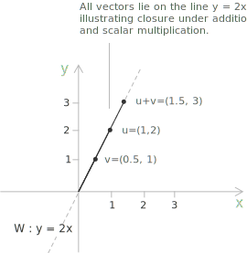

## Definition

A vector space is an algebraic structure that formalises the idea of quantities that can be scaled and [combined linearly](../linear-combinations/). The concept arises wherever one encounters objects that can be added and multiplied by numbers in a coherent way: geometric arrows in the plane, [polynomials](../polynomials/) with real coefficients, sequences of [real numbers](../real-numbers/), and [continuous functions](../continuous-functions/) on an interval all share this common pattern.

Unlike a [group](../groups/) or a [ring](../rings/), which are defined on a single set, a vector space involves two distinct sets: a [field](../fields/) $F,$ whose elements are called scalars, and a set $V,$ whose elements are called [vectors](../vectors/). A vector space over $F$ is a set $V$ together with two operations, vector addition $+ : V \times V \to V$ and scalar multiplication $\cdot : F \times V \to V,$ satisfying the following axioms:

+ $(V, +)$ is an abelian group. There exists a zero vector $\mathbf{0} \in V$ such that $\mathbf{v} + \mathbf{0} = \mathbf{v}$ for all $\mathbf{v} \in V,$ and every vector $\mathbf{v}$ has an additive inverse $-\mathbf{v}.$
+ Compatibility with field multiplication: for all $\alpha, \beta \in F$ and $\mathbf{v} \in V,$ the identity $\alpha \cdot (\beta \cdot \mathbf{v}) = (\alpha\beta) \cdot \mathbf{v}$ holds.
+ Identity element of scalar multiplication: for all $\mathbf{v} \in V,$ the multiplicative identity $1 \in F$ satisfies $1 \cdot \mathbf{v} = \mathbf{v}.$
+ Distributivity of scalar multiplication over vector addition: for all $\alpha \in F$ and $\mathbf{u}, \mathbf{v} \in V,$ the identity $\alpha \cdot (\mathbf{u} + \mathbf{v}) = \alpha \cdot \mathbf{u} + \alpha \cdot \mathbf{v}$ holds.
+ Distributivity of scalar multiplication over field addition: for all $\alpha, \beta \in F$ and $\mathbf{v} \in V,$ the identity $(\alpha + \beta) \cdot \mathbf{v} = \alpha \cdot \mathbf{v} + \beta \cdot \mathbf{v}$ holds.

> The field $F$ over which $V$ is defined is called the scalar field of $V.$ In most applications encountered at the undergraduate level, $F$ is either $\mathbb{R}$ or $\mathbb{C},$ and one speaks of a real vector space or a complex vector space accordingly.

## Properties

Several elementary consequences follow directly from the axioms. For any scalar $\alpha \in F$ and any vector $\mathbf{v} \in V,$ multiplication by zero satisfies $0 \cdot \mathbf{v} = \mathbf{0}.$ To see this:

$$0 \cdot \mathbf{v} = (0 + 0) \cdot \mathbf{v} = 0 \cdot \mathbf{v} + 0 \cdot \mathbf{v}$$

and the cancellation of $0 \cdot \mathbf{v}$ from both sides through the group structure of $(V, +)$ yields the result. Similarly, for any $\mathbf{v} \in V$ one has $\alpha \cdot \mathbf{0} = \mathbf{0}$ and $(-1) \cdot \mathbf{v} = -\mathbf{v},$ and more generally $(-\alpha) \cdot \mathbf{v} = -(\alpha \cdot \mathbf{v})$ for every $\alpha \in F.$

When $\alpha \cdot \mathbf{v} = \mathbf{0},$ either $\alpha = 0$ or $\mathbf{v} = \mathbf{0}.$ This is a direct consequence of the invertibility of nonzero scalars: when $\alpha \neq 0$:

$$\mathbf{v} = 1 \cdot \mathbf{v} = (\alpha^{-1}\alpha) \cdot \mathbf{v} = \alpha^{-1} \cdot (\alpha \cdot \mathbf{v}) = \alpha^{-1} \cdot \mathbf{0} = \mathbf{0}$$

This property is the vector space analogue of the absence of zero divisors in a field, and the theory of linear independence relies on it.

Distinct scalars give distinct multiples of a fixed nonzero vector. When $\mathbf{v} \neq \mathbf{0}$ and $\alpha \neq \beta,$ the difference $(\alpha - \beta) \cdot \mathbf{v}$ is nonzero by the property just proved, so $\alpha \cdot \mathbf{v} \neq \beta \cdot \mathbf{v}.$ Over an infinite field such as $\mathbb{R}$ this forces every nontrivial space to be infinite, since a single nonzero vector $\mathbf{v}$ already produces one distinct multiple $\alpha \cdot \mathbf{v}$ for each scalar $\alpha.$ A real vector space therefore has either one element or infinitely many, and the trivial space $\\{\ \mathbf{0} \ \\}$ is the only finite one.

## Algebraic hierarchy

A vector space sits above groups, rings, and fields in the standard classification of algebraic structures, since it depends on the presence of a field of scalars.

A group consists of a set with a single operation admitting inverses. A ring introduces a second operation that need not be invertible. A field requires both operations to be fully invertible on nonzero elements. A vector space then takes a field as a given and builds a new structure on top of it, one in which the field acts on a separate set of vectors by scaling. The three underlying structures form a chain of increasing rigidity:

+ A group has one operation with inverses.
+ A ring has two operations, with inverses guaranteed only for addition.
+ A field has two operations, with inverses guaranteed for both addition and all nonzero elements under multiplication.

> A vector space is not itself a further step in this chain but rather a structure that presupposes a field. Every vector space over $\mathbb{R}$ or $\mathbb{C}$ depends on the field axioms being in force for its scalar multiplication to be well defined. When the scalars are drawn from a [ring](../rings/) rather than a field, the resulting structure is a [module](../modules/), which generalises the notion of a vector space and is treated on the dedicated page.

## Examples

The smallest vector space is the trivial one, $\\{\ \mathbf{0} \ \\},$ consisting of the zero vector alone over any field $F.$ The operations are forced: $\mathbf{0} + \mathbf{0} = \mathbf{0}$ and $\alpha \cdot \mathbf{0} = \mathbf{0}$ for every $\alpha \in F.$ Its basis is the empty set, so it has dimension $0,$ and it is the only vector space of dimension $0.$

The set $\mathbb{R}^n$ of all ordered $n$-tuples of real numbers is a vector space over $\mathbb{R}$ under componentwise addition and scalar multiplication. For $n = 2,$ addition is defined by $(a_1, a_2) + (b_1, b_2) = (a_1 + b_1, a_2 + b_2)$ and scalar multiplication by $\alpha \cdot (a_1, a_2) = (\alpha a_1, \alpha a_2).$ The zero vector is $(0, 0).$ This is the prototype of a finite-dimensional real vector space, and it gives the geometric intuition for the general theory.

The set $\mathbb{C}^n$ of all ordered $n$-tuples of complex numbers is a vector space over $\mathbb{C}$ under the analogous operations. It can also be regarded as a vector space over $\mathbb{R},$ though in that case its dimension doubles: $\mathbb{C}^n$ as a real vector space has dimension $2n.$

The set $M_{m \times n}(\mathbb{R})$ of all [matrices](../matrices/) with $m$ rows and $n$ columns and real entries is a vector space over $\mathbb{R}$ under entrywise addition and scalar multiplication. The sum of $A = (a_{ij})$ and $B = (b_{ij})$ is the matrix with entries $a_{ij} + b_{ij},$ and the scalar multiple $\alpha A$ has entries $\alpha a_{ij}.$ The zero vector is the matrix with every entry equal to $0.$ A basis consists of the $mn$ matrices having a single entry equal to $1$ and all others $0,$ so this space has dimension $mn.$ A single row reproduces $\mathbb{R}^n$ as $M_{1 \times n}(\mathbb{R}),$ and a single column gives the same space as $M_{n \times 1}(\mathbb{R}),$ so [row and column vectors](../vectors/) are particular matrices. When $m = n$ the matrices are square of order $n,$ and $M_{n \times n}(\mathbb{R})$ has dimension $n^2.$

- - -

The set $\mathbb{R}[x]_{\leq n}$ of all [polynomials](../polynomials/) with real coefficients of degree at most $n$ is a vector space over $\mathbb{R}$ under the usual addition of polynomials and multiplication of a polynomial by a real constant. The zero vector is the zero polynomial. A natural basis for this space is $\\{\ 1, x, x^2, \ldots, x^n \ \\},$ which contains $n + 1$ elements, so the dimension of this space is $n + 1.$ Removing the bound on the degree gives the space $\mathbb{R}[x]$ of all real polynomials, with basis $\\{\ 1, x, x^2, \ldots \ \\}$ and infinite dimension.

The set $\mathcal{C}([a, b])$ of all continuous real-valued functions on a closed interval $[a, b]$ is a vector space over $\mathbb{R}$ under pointwise addition and scalar multiplication: $(f + g)(x) = f(x) + g(x)$ and $(\alpha f)(x) = \alpha f(x).$ This space is infinite-dimensional, since the polynomials of all degrees form a linearly independent subset with no finite spanning set.

## Subspaces

A nonempty subset $W \subseteq V$ is called a subspace of $V$ when $W$ is itself a vector space over $F$ under the operations inherited from $V.$ Rather than verifying all axioms separately, it is sufficient to check two conditions: for all $\mathbf{u}, \mathbf{v} \in W$ and all $\alpha \in F,$ the membership $\mathbf{u} + \mathbf{v} \in W$ and $\alpha \cdot \mathbf{v} \in W$ must hold. These two conditions together are called closure under linear combinations. The zero vector $\mathbf{0}$ must belong to every subspace, since setting $\alpha = 0$ gives $0 \cdot \mathbf{v} = \mathbf{0} \in W.$

As an example, the set $W = \\{\ (x, y) \in \mathbb{R}^2 : y = 2x \ \\}$ is a subspace of $\mathbb{R}^2.$ For any two vectors $(x_1, 2x_1)$ and $(x_2, 2x_2)$ in $W,$ their sum $(x_1 + x_2, 2x_1 + 2x_2) = (x_1 + x_2, 2(x_1 + x_2))$ belongs to $W,$ and for any scalar $\alpha \in \mathbb{R}$ the vector $\alpha(x_1, 2x_1) = (\alpha x_1, 2\alpha x_1)$ also belongs to $W.$ Both conditions are satisfied, so $W$ is a subspace of $\mathbb{R}^2.$ Geometrically, $W$ is the line through the origin with slope $2.$

> Any vector in $W$ lies on the line through the origin with slope $2.$ Adding two such vectors or multiplying one by a scalar always produces a vector that remains on the same line, so $W$ is closed under both operations.

## Basis and dimension

A set of vectors $\\{\ \mathbf{v}_1, \mathbf{v}_2, \ldots, \mathbf{v}_n \ \\}$ in $V$ is called linearly independent when the only solution to the equation:

$$\alpha_1 \mathbf{v}_1 + \alpha_2 \mathbf{v}_2 + \cdots + \alpha_n \mathbf{v}_n = \mathbf{0}$$

is $\alpha_1 = \alpha_2 = \cdots = \alpha_n = 0.$ A set of vectors that is not linearly independent is called linearly dependent, which means that at least one vector in the set can be expressed as a [linear combination](../linear-combinations/) of the others. A basis of $V$ is a linearly independent set of vectors that spans $V,$ meaning that every vector in $V$ can be written as a linear combination of the basis vectors. The representation of any vector in terms of a given basis is unique. If:

$$\mathbf{v} = \alpha_1 \mathbf{v}_1 + \cdots + \alpha_n \mathbf{v}_n = \beta_1 \mathbf{v}_1 + \cdots + \beta_n \mathbf{v}_n$$

then subtracting yields:

$$(\alpha_1 - \beta_1)\mathbf{v}_1 + \cdots + (\alpha_n - \beta_n)\mathbf{v}_n = \mathbf{0}$$

and linear independence forces $\alpha_k = \beta_k$ for all $k.$

- - -

Any two bases of the same vector space contain the same number of elements. The argument rests on the observation that when a set of $m$ vectors spans $V$ and a set of $n$ vectors is linearly independent in $V,$ the inequality $n \leq m$ holds. Applying this inequality twice, once in each direction, to any two bases forces their cardinalities to be equal. This common cardinality is called the dimension of $V$ and is denoted $\dim V.$

The standard basis of $\mathbb{R}^n$ consists of the $n$ vectors $\mathbf{e}_1, \mathbf{e}_2, \ldots, \mathbf{e}_n,$ where $\mathbf{e}_k$ has a $1$ in position $k$ and $0$ everywhere else. For example, in $\mathbb{R}^3$ the standard basis is:

$$\mathbf{e}_1 = (1, 0, 0), \quad \mathbf{e}_2 = (0, 1, 0), \quad \mathbf{e}_3 = (0, 0, 1)$$

Every [vector](../vectors/) $(a, b, c) \in \mathbb{R}^3$ can be written uniquely as $a \mathbf{e}_1 + b \mathbf{e}_2 + c \mathbf{e}_3,$ confirming that these three vectors form a basis and that $\dim \mathbb{R}^3 = 3.$

## Linear maps

A linear map, or linear transformation, is a [function](../functions/) $\varphi : V \to W$ between two vector spaces over the same field $F$ that preserves the vector space structure. Explicitly, $\varphi$ is linear when for all $\mathbf{u}, \mathbf{v} \in V$ and all $\alpha \in F$ the following two conditions hold:

$$\varphi(\mathbf{u} + \mathbf{v}) = \varphi(\mathbf{u}) + \varphi(\mathbf{v})$$

$$\varphi(\alpha \cdot \mathbf{v}) = \alpha \cdot \varphi(\mathbf{v})$$

These two conditions can be combined into the single requirement that $\varphi(\alpha \mathbf{u} + \beta \mathbf{v}) = \alpha\varphi(\mathbf{u}) + \beta\varphi(\mathbf{v})$ for all $\alpha, \beta \in F$ and $\mathbf{u}, \mathbf{v} \in V.$ A linear map that is bijective is called a linear isomorphism, and two vector spaces are isomorphic when a linear isomorphism between them exists. Every $n$-dimensional vector space over $F$ is isomorphic to $F^n,$ so finite-dimensional vector spaces are completely classified by their dimension and their scalar field.

The [kernel](../homomorphisms-and-isomorphisms/) and image of a linear map $\varphi : V \to W$ are defined as follows:

$$\ker(\varphi) = \\{\ \mathbf{v} \in V : \varphi(\mathbf{v}) = \mathbf{0} \ \\}$$

$$\mathrm{im}(\varphi) = \\{\ \varphi(\mathbf{v}) : \mathbf{v} \in V \ \\}$$

Both $\ker(\varphi)$ and $\mathrm{im}(\varphi)$ are subspaces of $V$ and $W$ respectively. The dimension theorem, also known as the rank-nullity theorem, states that for any linear map between finite-dimensional spaces the following identity holds:

$$\dim V = \dim \ker(\varphi) + \dim \mathrm{im}(\varphi)$$

The dimension of $\mathrm{im}(\varphi)$ is called the rank of $\varphi$ and the dimension of $\ker(\varphi)$ is called its nullity. The rank-nullity theorem underlies the theory of [systems of linear equations](../systems-of-linear-equations/), the analysis of [matrices](../matrices/), and the classification of linear maps between finite-dimensional spaces.

## Example

Consider the linear map $\varphi : \mathbb{R}^3 \to \mathbb{R}^2$ defined by:

$$\varphi(x, y, z) = (x + y, y + z)$$

To verify linearity, one checks that:

$$\varphi(\mathbf{u} + \mathbf{v}) = \varphi(\mathbf{u}) + \varphi(\mathbf{v})$$

$$\varphi(\alpha \mathbf{v}) = \alpha \varphi(\mathbf{v})$$

hold for all vectors and scalars, which follows immediately from the linearity of addition and scalar multiplication in $\mathbb{R}^3.$ The kernel consists of all vectors $(x, y, z)$ satisfying $x + y = 0$ and $y + z = 0,$ that is, $x = -y$ and $z = -y.$ Every element of $\ker(\varphi)$ therefore has the form:

$$(-y, y, -y) = y(-1, 1, -1)$$

for some $y \in \mathbb{R},$ so the kernel is the one-dimensional subspace spanned by $(-1, 1, -1).$ The image is all of $\mathbb{R}^2,$ since for any $(a, b) \in \mathbb{R}^2$ the vector $(a, 0, b)$ satisfies $\varphi(a, 0, b) = (a, b),$ which shows that $\varphi$ is surjective and thus $\dim \mathrm{im}(\varphi) = 2.$ The rank-nullity theorem is verified:

$$\dim \mathbb{R}^3 = \dim \ker(\varphi) + \dim \mathrm{im}(\varphi) = 1 + 2 = 3$$

The kernel of $\varphi$ is therefore the line through the origin in direction $(-1, 1, -1),$ while $\mathrm{im}(\varphi) = \mathbb{R}^2.$

> The notions of subspace, basis, dimension, and linear map all carry over, with minor adjustments, to the broader setting of [modules](../modules/) over a ring, where the absence of multiplicative inverses for scalars introduces phenomena that have no counterpart in linear algebra over a field. The unifying perspective on structure-preserving maps across algebraic structures is collected on the page about [homomorphisms and isomorphisms](../homomorphisms-and-isomorphisms/).
