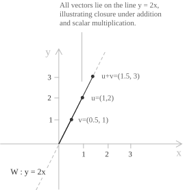

## Concrete models

The plane $\mathbb{R}^2$ is a vector space whose elements are ordered pairs. Its addition and scalar multiplication are:

$$(a_1, a_2) + (b_1, b_2) = (a_1 + b_1, a_2 + b_2)$$

$$\alpha(a_1, a_2) = (\alpha a_1, \alpha a_2)$$

Addition combines two [vectors](../vectors/), while the [real number](../real-numbers/) $\alpha$ scales a vector. With componentwise addition and scalar multiplication, $F^n$ is a vector space over any [field](../fields/) $F.$ Examples are $\mathbb{Q}^n$ over $\mathbb{Q},$ $\mathbb{R}^n$ over $\mathbb{R},$ and $\mathbb{F}_p^n$ over the finite field $\mathbb{F}_p.$

The elements need not be lists of numbers. The set $M_{m \times n}(F)$ of all $m \times n$ [matrices](../matrices/) over $F$ has entrywise addition and scalar multiplication. The set $F[x]$ of [polynomials](../polynomials/) has polynomial addition and multiplication by constants from $F.$ If $X$ is a nonempty set, the set $F^X$ of all [functions](../functions/) $f : X \to F$ has pointwise operations:

$$(f + g)(x) = f(x) + g(x)$$

$$(\alpha f)(x) = \alpha f(x)$$

A [sequence](../sequences/) of real numbers is an element of $\mathbb{R}^{\mathbb{N}}.$ For an interval $I,$ the [continuous functions](../continuous-functions/) and the [differentiable functions](../derivatives/) from $I$ to $\mathbb{R}$ are subsets of $\mathbb{R}^I$ closed under both operations. In every case, addition and scalar multiplication satisfy the same identities. The abstract definition lists them.

## Abstract definition

A vector space over a field $F$ is a set $V$ equipped with vector addition $+ : V \times V \to V$ and scalar multiplication $\cdot : F \times V \to V.$ These operations satisfy the following axioms:

+ $(V, +)$ is an abelian group.
+ $\alpha \cdot (\beta \cdot \mathbf{v}) = (\alpha\beta) \cdot \mathbf{v}$ for all $\alpha, \beta \in F$ and $\mathbf{v} \in V.$
+ $1 \cdot \mathbf{v} = \mathbf{v}$ for all $\mathbf{v} \in V.$
+ $\alpha \cdot (\mathbf{u} + \mathbf{v}) = \alpha \cdot \mathbf{u} + \alpha \cdot \mathbf{v}$ for all $\alpha \in F$ and $\mathbf{u}, \mathbf{v} \in V.$
+ $(\alpha + \beta) \cdot \mathbf{v} = \alpha \cdot \mathbf{v} + \beta \cdot \mathbf{v}$ for all $\alpha, \beta \in F$ and $\mathbf{v} \in V.$

The identity of the abelian group is the zero vector $\mathbf{0},$ and the elements of $F$ are the scalars. The choice of $F$ is part of the structure. For example, $\mathbb{C}^n$ is a vector space over the [complex numbers](../complex-numbers/) and over $\mathbb{R},$ but the two structures have different dimensions.

The axioms imply the rules for zero and additive inverses. Distributivity over scalar addition gives:

$$0 \cdot \mathbf{v} = (0 + 0) \cdot \mathbf{v} = 0 \cdot \mathbf{v} + 0 \cdot \mathbf{v}$$

Cancellation in the abelian group gives $0 \cdot \mathbf{v} = \mathbf{0}.$ Distributivity applied to $\alpha \cdot (\mathbf{0} + \mathbf{0})$ gives $\alpha \cdot \mathbf{0} = \mathbf{0}.$ The distributive laws also give $(-1) \cdot \mathbf{v} = -\mathbf{v}$ and $(-\alpha) \cdot \mathbf{v} = -(\alpha \cdot \mathbf{v}).$

Suppose that $\alpha \cdot \mathbf{v} = \mathbf{0}$ and $\alpha \neq 0.$ Multiplication by $\alpha^{-1}$ gives:

$$\mathbf{v} = (\alpha^{-1}\alpha) \cdot \mathbf{v} = \alpha^{-1} \cdot (\alpha \cdot \mathbf{v}) = \mathbf{0}$$

Hence $\alpha \cdot \mathbf{v} = \mathbf{0}$ implies $\alpha = 0$ or $\mathbf{v} = \mathbf{0}.$ Distinct scalars give distinct multiples of a nonzero vector, so every nonzero vector space over an infinite field is infinite.

> A vector space has an underlying abelian [group](../groups/) and a separate scalar field. A [module](../modules/) has a scalar [ring](../rings/) instead of a field, so several results below fail for modules.

## Subspaces and span

A [subspace](../subspaces/) of $V$ is a nonempty subset $W \subseteq V$ that is closed under addition and scalar multiplication. With the inherited operations, $W$ is a vector space over the same field. The zero vector belongs to $W,$ since $0 \cdot \mathbf{w} = \mathbf{0}$ for any $\mathbf{w} \in W.$

Given a subset $S \subseteq V,$ its span consists of all finite [linear combinations](../linear-combinations/) of elements of $S$:

$$\mathrm{span}(S) = \{\ \alpha_1\mathbf{v}_1 + \cdots + \alpha_n\mathbf{v}_n \mid n \geq 1,\ \alpha_i \in F,\ \mathbf{v}_i \in S\ \}$$

The convention $\mathrm{span}(\varnothing) = \{\ \mathbf{0}\ \}$ covers the empty set. The span of $S$ is the smallest subspace that contains $S,$ since every such subspace contains all finite linear combinations of elements of $S.$

For example, the vector $(1, 2)$ generates the subspace:

$$W = \mathrm{span}\{\ (1, 2)\ \} = \{\ (t, 2t) \mid t \in \mathbb{R}\ \}$$

This is the [line through the origin](../vector-and-parametric-equations-of-a-line/) with slope $2.$ If $s, t, \alpha \in \mathbb{R},$ then $(s, 2s) + (t, 2t) = (s + t, 2(s + t))$ and $\alpha(t, 2t) = (\alpha t, 2\alpha t),$ so the set is closed under both operations.

The page on [subspaces](../subspaces/) contains the closure criterion, sums and intersections, Grassmann's formula, direct sums and complements.

## Linear maps

A [function](../functions/) $T : V \to W$ between vector spaces over the same field is a [linear map](../linear-maps/) when it preserves addition and scalar multiplication:

$$T(\mathbf{u} + \mathbf{v}) = T(\mathbf{u}) + T(\mathbf{v})$$

$$T(\alpha \mathbf{v}) = \alpha T(\mathbf{v})$$

Equivalently, $T(\alpha\mathbf{u} + \beta\mathbf{v}) = \alpha T(\mathbf{u}) + \beta T(\mathbf{v})$ for all vectors $\mathbf{u}, \mathbf{v}$ and scalars $\alpha, \beta.$ Compositions of linear maps are linear, and a linear map from a space to itself is an endomorphism. A bijective linear map is a [linear isomorphism](../homomorphisms-and-isomorphisms/), and its inverse is linear.

The coordinate projection $P : F^3 \to F^2,$ defined by $P(x, y, z) = (x, y),$ is linear. The trace map $\mathrm{tr} : M_n(F) \to F$ is linear because $\mathrm{tr}(A + B) = \mathrm{tr}(A) + \mathrm{tr}(B)$ and $\mathrm{tr}(\alpha A) = \alpha\mathrm{tr}(A).$ The [formal derivative](../derivatives/) $D : F[x] \to F[x]$ is linear and satisfies:

$$D\left(\sum_{k=0}^n a_kx^k\right) = \sum_{k=1}^n ka_kx^{k-1}$$

The [kernel and image](../kernel-and-image-of-a-linear-map/) of $T$ are:

$$\ker(T) = \{\ \mathbf{v} \in V \mid T(\mathbf{v}) = \mathbf{0}\ \}$$

$$\mathrm{im}(T) = \{\ T(\mathbf{v}) \mid \mathbf{v} \in V\ \}$$

Both sets are subspaces. If $T(\mathbf{u}) = T(\mathbf{v}) = \mathbf{0},$ then $T(\alpha\mathbf{u} + \beta\mathbf{v}) = \mathbf{0}.$ For the image, $\alpha T(\mathbf{u}) + \beta T(\mathbf{v}) = T(\alpha\mathbf{u} + \beta\mathbf{v}),$ which belongs to $\mathrm{im}(T).$

## Bases, coordinates, and dimension

A subset $B \subseteq V$ is linearly independent when every vanishing finite linear combination of distinct elements of $B$ has all coefficients equal to zero. The empty set is linearly independent, while a set containing $\mathbf{0}$ is dependent. A basis of $V$ is a linearly independent subset whose span is $V.$

If $B = \{\ \mathbf{v}_1, \ldots, \mathbf{v}_n\ \}$ is a basis, every vector has a unique expansion:

$$\mathbf{v} = \alpha_1\mathbf{v}_1 + \cdots + \alpha_n\mathbf{v}_n$$

Existence follows from the spanning property. If a second expansion has coefficients $\beta_1, \ldots, \beta_n,$ subtraction gives:

$$(\alpha_1 - \beta_1)\mathbf{v}_1 + \cdots + (\alpha_n - \beta_n)\mathbf{v}_n = \mathbf{0}$$

Linear independence then gives $\alpha_i = \beta_i$ for every $i.$

The standard basis of $F^n$ consists of the vectors $\mathbf{e}_1, \ldots, \mathbf{e}_n,$ where $\mathbf{e}_i$ has entry $1$ in position $i$ and zero elsewhere. The matrices with one entry equal to $1$ and all other entries equal to zero form a basis of $M_{m \times n}(F).$ The monomials $1, x, \ldots, x^n$ form a basis of the polynomials of degree at most $n.$ These bases have $n,$ $mn$ and $n + 1$ elements respectively.

The polynomial space $F[x]$ has the infinite basis $\{\ 1, x, x^2, \ldots\ \}.$ The space of continuous real-valued functions on an interval with more than one point is infinite-dimensional, since it contains the linearly independent monomials of every degree. The scalar field affects dimension. The vectors $\mathbf{e}_1, \ldots, \mathbf{e}_n$ form a basis of $\mathbb{C}^n$ over $\mathbb{C},$ while $\mathbf{e}_1, \ldots, \mathbf{e}_n, i\mathbf{e}_1, \ldots, i\mathbf{e}_n$ form a basis over $\mathbb{R}.$ Hence $\dim_{\mathbb{C}}\mathbb{C}^n = n$ and $\dim_{\mathbb{R}}\mathbb{C}^n = 2n.$

A vector space is finite-dimensional when it has a finite spanning set. Removing dependent vectors from such a set produces a basis. If a set of $m$ vectors spans $V$ and a set of $n$ vectors is linearly independent, the exchange argument gives $n \leq m.$ Applying this inequality in both directions to two bases shows that they have the same number of elements. This number is the dimension $\dim V.$ The zero space $\{\ \mathbf{0}\ \}$ has the empty basis and dimension $0.$

A basis has two equivalent characterisations:

+ It is a minimal spanning set.
+ It is a maximal linearly independent set.

Removing a vector from a basis leaves a set that does not span $V.$ Adjoining a vector to a basis gives a dependent set. Conversely, a maximal independent set spans $V,$ since a vector outside its span could be adjoined without creating a relation.

If $W$ is a subspace of a finite-dimensional space $V,$ a linearly independent subset of $W$ extends to a basis of $W,$ and that basis extends to a basis of $V.$ Hence $\dim W \leq \dim V,$ with equality only when $W = V.$

> Assuming the axiom of choice, Zorn's lemma extends every linearly independent subset of an arbitrary vector space to a basis. Finite-dimensional spaces use the finite extension procedure above.

Ordering a basis $B = (\mathbf{v}_1, \ldots, \mathbf{v}_n)$ turns the coefficients of a vector into its coordinate vector:

$$[\mathbf{v}]_B = (\alpha_1, \ldots, \alpha_n)$$

The coordinate map $C_B : V \to F^n,$ defined by $C_B(\mathbf{v}) = [\mathbf{v}]_B,$ is a linear isomorphism. Every $n$-dimensional vector space over $F$ is therefore isomorphic to $F^n,$ although the isomorphism depends on the ordered basis.

A function on a basis determines one linear map on the whole space. Given $f : B \to U,$ the formula:

$$T\left(\sum_i \alpha_i\mathbf{v}_i\right) = \sum_i \alpha_i f(\mathbf{v}_i)$$

defines the unique linear map $T : V \to U$ whose restriction to $B$ is $f.$ Uniqueness of coordinates makes the formula well defined.

Suppose that $T : V \to U$ has finite-dimensional domain. If $\mathbf{k}_1, \ldots, \mathbf{k}_r$ is a basis of $\ker(T),$ extend it to a basis $\mathbf{k}_1, \ldots, \mathbf{k}_r, \mathbf{v}_{r+1}, \ldots, \mathbf{v}_n$ of $V.$ The vectors $T(\mathbf{v}_{r+1}), \ldots, T(\mathbf{v}_n)$ span $\mathrm{im}(T)$ because $T$ sends the kernel components to zero. If a linear combination of these images is zero, the corresponding combination of $\mathbf{v}_{r+1}, \ldots, \mathbf{v}_n$ lies in the kernel and is therefore a linear combination of $\mathbf{k}_1, \ldots, \mathbf{k}_r.$ Independence of the extended basis forces every coefficient to be zero. The images form a basis of $\mathrm{im}(T),$ so:

$$\dim V = \dim \ker(T) + \dim \mathrm{im}(T)$$

This is the rank-nullity theorem. The two terms on the right are the nullity and rank of $T,$ respectively.

For a matrix map $A : F^n \to F^m,$ $\dim \mathrm{im}(A)$ is the [rank of the matrix](../rank-of-a-matrix/), while $\ker(A)$ is the solution space of the [homogeneous system](../systems-of-linear-equations/) $A\mathbf{x} = \mathbf{0}.$

## Quotient spaces

A quotient space treats two vectors as equivalent when their difference lies in a subspace $N.$ The equivalence class of $\mathbf{v}$ is the coset $\mathbf{v} + N,$ and the set of all classes is:

$$V/N = \{\ \mathbf{v} + N \mid \mathbf{v} \in V\ \}$$

The vector space operations on classes are defined by:

$$(\mathbf{u} + N) + (\mathbf{v} + N) = (\mathbf{u} + \mathbf{v}) + N$$

$$\alpha(\mathbf{v} + N) = \alpha\mathbf{v} + N$$

If $\mathbf{v} + N = \mathbf{v}' + N,$ then $\mathbf{v} - \mathbf{v}' \in N.$ Closure of $N$ under addition and scalar multiplication shows that replacing representatives does not change either result. The quotient map $\pi_N : V \to V/N,$ defined by $\pi_N(\mathbf{v}) = \mathbf{v} + N,$ is linear and surjective, with kernel $N.$

The quotient map has a factorisation property. If $T : V \to U$ is linear and $N \subseteq \ker(T),$ then vectors in the same coset of $N$ have the same image under $T.$ The formula:

$$\widetilde{T}(\mathbf{v} + N) = T(\mathbf{v})$$

therefore defines the unique linear map $\widetilde{T} : V/N \to U$ such that $T = \widetilde{T} \circ \pi_N.$ Taking $N = \ker(T)$ and restricting the codomain to $\mathrm{im}(T)$ gives the homomorphism theorem:

$$V/\ker(T) \cong \mathrm{im}(T)$$

The isomorphism sends $\mathbf{v} + \ker(T)$ to $T(\mathbf{v}).$ Its kernel is zero, and it is surjective by the definition of $\mathrm{im}(T).$

When $T : V \to U$ is surjective, inverse image gives a bijection between the subspaces of $U$ and the subspaces of $V$ that contain $\ker(T).$ The inverse assignments send $L \subseteq U$ to $T^{-1}(L)$ and $M \subseteq V$ to $T(M).$ This is the correspondence theorem for vector spaces.

The homomorphism theorem gives two quotient identities. If $N \subseteq M \subseteq V,$ then:

$$(V/N)/(M/N) \cong V/M$$

If $A$ and $N$ are subspaces of $V,$ restricting the quotient map to $A$ gives:

$$(A + N)/N \cong A/(A \cap N)$$

The kernel of the restricted map is $A \cap N,$ while every coset in $(A + N)/N$ has a representative in $A.$

## Direct sums and complements

For subspaces $A$ and $B,$ the sum $A + B$ is direct when $A \cap B = \{\ \mathbf{0}\ \}.$ In this case every vector of $A + B$ has a unique expression $\mathbf{a} + \mathbf{b},$ with $\mathbf{a} \in A$ and $\mathbf{b} \in B.$ Grassmann's formula for finite-dimensional subspaces is:

$$\dim(A + B) = \dim A + \dim B - \dim(A \cap B)$$

When the intersection is trivial, the formula reduces to $\dim(A \oplus B) = \dim A + \dim B.$

Suppose that $N$ is a subspace of a finite-dimensional vector space $V.$ Choose a basis $\mathbf{n}_1, \ldots, \mathbf{n}_r$ of $N$ and extend it to a basis:

$$\mathbf{n}_1, \ldots, \mathbf{n}_r, \mathbf{m}_{r+1}, \ldots, \mathbf{m}_n$$

of $V.$ If $M = \mathrm{span}\{\ \mathbf{m}_{r+1}, \ldots, \mathbf{m}_n\ \},$ then each $\mathbf{v} \in V$ has a unique expression $\mathbf{v} = \mathbf{n} + \mathbf{m},$ with $\mathbf{n} \in N$ and $\mathbf{m} \in M.$ Thus $V = N \oplus M,$ and $M$ is a [complement](../subspaces/) of $N.$ The dimensions satisfy:

$$\dim V = \dim N + \dim M$$

For a linear map $T : V \to U,$ take $N = \ker(T).$ The restriction $T|_M : M \to \mathrm{im}(T)$ is an isomorphism. It is injective because $M \cap \ker(T) = \{\ \mathbf{0}\ \},$ and it is surjective because every vector of $V$ has a component in $M$ with the same image. Hence:

$$V \cong \ker(T) \oplus \mathrm{im}(T)$$

If $T$ is surjective, the inverse of $T|_M$ followed by the inclusion $M \subseteq V$ gives a linear map $S : U \to V$ with $T \circ S = \mathrm{id}_U.$ Thus every surjective linear map with finite-dimensional domain has a right inverse.

The restriction of the quotient map to $M$ is an isomorphism $M \cong V/N.$ These identifications depend on the chosen complement, and they give:

$$V \cong N \oplus V/N$$

$$\dim V = \dim N + \dim(V/N)$$

## Example

Consider the linear map $T : \mathbb{R}^3 \to \mathbb{R}^2$ defined by:

$$T(x, y, z) = (x + y, y + z)$$

Each output coordinate is a linear combination of $x, y, z,$ so $T$ is linear. A vector belongs to the kernel when $x + y = 0$ and $y + z = 0.$ Hence:

$$\ker(T) = \mathrm{span}\{\ (-1, 1, -1)\ \}$$

For any $(a, b) \in \mathbb{R}^2,$ the vector $(a, 0, b)$ maps to $(a, b),$ so $T$ is surjective. The rank-nullity identity becomes:

$$3 = \dim \ker(T) + \dim \mathrm{im}(T) = 1 + 2$$

The plane $M = \{\ (a, 0, b) \mid a, b \in \mathbb{R}\ \}$ meets the kernel only at the origin. Every vector has the decomposition:

$$(x, y, z) = (-y, y, -y) + (x + y, 0, y + z)$$

The first term belongs to $\ker(T)$ and the second to $M,$ so $\mathbb{R}^3 = \ker(T) \oplus M.$ The restriction $T|_M$ is the isomorphism $(a, 0, b) \mapsto (a, b),$ and its inverse gives the right inverse $S(a, b) = (a, 0, b).$ The homomorphism theorem identifies the quotient $\mathbb{R}^3/\ker(T)$ with $\mathbb{R}^2.$

> Subspaces, bases, dimension and linear maps extend to [modules](../modules/) over a ring, but coefficients cannot generally be divided by nonzero scalars. Modules therefore need not have bases, submodules need not have complements, and the dimension arguments used above no longer apply.

> For a development of vector spaces from group theory, see Frederick M. Goodman, Algebra: Abstract and Concrete, Section 3.3, listed in the [bibliography](../bibliography/).
