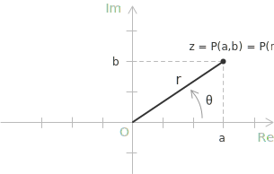
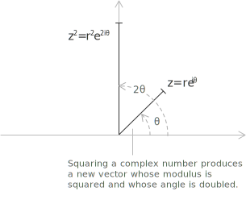

## Introduction

The [algebraic form](../complex-numbers-introduction/) $z = a + bi$ is the most familiar representation of a complex number, but it is not the most convenient one for handling multiplication, powers, and roots. An alternative description, equivalent to the algebraic one and especially suited to these operations, is the exponential form:

$$z = re^{i\theta}$$

The two quantities appearing in this expression have a direct geometric meaning:

+ $r = |z| = \sqrt{a^2 + b^2}$ is the [modulus](../complex-numbers-introduction/), representing the distance of $z$ from the origin in the complex plane.
+ $\theta = \arg(z)$ is the argument, the [angle in radians](../angles-and-angular-measure/) between the positive real axis and the [vector](../vectors/) representing $z$.

Both $r$ and $\theta$ retain the meaning they have in the [trigonometric form](../complex-numbers-trigonometric-form/) of a complex number.

> The point $P$ associated with $z$ can be described either by its rectangular coordinates $(a, b)$ or by its polar coordinates $(r, \theta)$. This duality is the bridge between the algebraic and the geometric descriptions of complex numbers.

- - -

The equation $z = re^{i\theta}$ is a direct consequence of [Euler's formula](../eulers-formula/):

$$e^{i\theta} = \cos\theta + i\sin\theta$$

Multiplying both sides by $r$ shows that the exponential representation coincides with the [trigonometric form](../complex-numbers-trigonometric-form/):

$$z = r(\cos\theta + i\sin\theta)$$

Euler's formula itself can be established by expanding $e^{ix}$, $\cos x$, and $\sin x$ as [Taylor series](../taylor-series/) and observing that the series for $e^{ix}$ splits into a real and an imaginary part:

$$e^{ix} = \sum_{n=0}^{\infty} \frac{(ix)^n}{n!} = \cos x + i\sin x$$

> The formula involves Euler's number $e$, a fundamental constant of analysis. Its origin as the limit of a sequence is discussed in the entry on [Euler's number](../euler-number-limit-sequence/).

- - -

Given the complex number $z = a + bi$, its complex conjugate is defined as:

$$\overline{z} = a - bi$$

In exponential form, the conjugate of $z = re^{i\theta}$ is obtained by negating the argument:

$$\overline{z} = re^{-i\theta}$$

Geometrically, this corresponds to a reflection of $z$ across the real axis in the complex plane.

## How to express a complex number in exponential form

Given a complex number $z = a + bi$, the conversion to exponential form proceeds in three steps.

+ Compute the modulus of $z$ according to its definition:

$$r = \sqrt{a^2 + b^2}$$

+ Determine the argument $\theta$, that is, the angle that the [vector](../vectors/) representing $z$ forms with the positive real axis. When $a > 0$, the argument can be obtained directly from the arctangent formula:

$$\theta = \arctan\left(\frac{b}{a}\right)$$

When $a \leq 0$, the quadrant of $z$ in the complex plane must be taken into account in order to select the correct value of $\theta$.

+ Substitute $r$ and $\theta$ into the exponential representation:

$$z = re^{i\theta}$$

- - -

The argument of a complex number is not uniquely determined. If $\theta$ is an argument of $z$, then so is $\theta + 2k\pi$ for every integer $k$, and one has:

$$z = re^{i(\theta + 2k\pi)} \qquad k \in \mathbb{Z}$$

The exponential representation is therefore defined modulo $2\pi$. To remove this ambiguity, one conventionally selects the principal argument, denoted $\mathrm{Arg}(z)$, which satisfies:

$$-\pi < \mathrm{Arg}(z) \leq \pi$$

Unless otherwise stated, the argument $\theta$ is understood to be the principal argument.

## Example 1

Consider the complex number $z = 2 + 3i$ and its conversion to exponential form. The modulus is computed by applying the definition directly. With $a = 2$ and $b = 3$, one obtains:

$$
\begin{align}
r = |z| &= \sqrt{a^2 + b^2} \\[6pt]
        &= \sqrt{2^2 + 3^2} \\[6pt]
        &= \sqrt{4 + 9} \\[6pt]
        &= \sqrt{13}
\end{align}
$$

The argument $\theta$ is the angle that the vector representing $z$ forms with the positive real axis. Since $a = 2 > 0$, the number lies in the first quadrant and the arctangent formula applies without any correction:

$$\theta = \arctan\left(\frac{b}{a}\right) = \arctan\left(\frac{3}{2}\right) \approx 0.98 \text{ rad}$$

Substituting $r = \sqrt{13}$ and $\theta \approx 0.98$ into the exponential form, the result is:

$$z = \sqrt{13}e^{i\cdot 0.98}$$

## Example 2

Consider the complex number $z = -1 + i$ and its conversion to exponential form. The modulus is again obtained by direct application of the definition. With $a = -1$ and $b = 1$, one has:

$$
\begin{align}
r = |z| &= \sqrt{(-1)^2 + 1^2} \\[6pt]
        &= \sqrt{1 + 1} \\[6pt]
        &= \sqrt{2}
\end{align}
$$

The argument requires more care. Since $a = -1 < 0$ and $b = 1 > 0$, the number lies in the second quadrant. The arctangent formula taken in isolation would give:

$$\arctan\left(\frac{b}{a}\right) = \arctan\left(\frac{1}{-1}\right) = \arctan(-1) = -\frac{\pi}{4}$$

This value corresponds to the fourth quadrant and is therefore not the correct argument of $z$. The actual argument is obtained by adding $\pi$ to compensate for the sign of $a$:

$$\theta = -\frac{\pi}{4} + \pi = \frac{3\pi}{4}$$

Substituting $r = \sqrt{2}$ and $\theta = \dfrac{3\pi}{4}$ into the exponential form, the result is:

$$z = \sqrt{2}e^{i\frac{3\pi}{4}}$$

## Properties of the exponential form

One of the principal advantages of the exponential form is the simplicity it confers on multiplication, division, and exponentiation of complex numbers. Given two complex numbers $z_1 = r_1 e^{i\theta_1}$ and $z_2 = r_2 e^{i\theta_2}$, their product is obtained by multiplying the moduli and adding the arguments:

$$z_1 z_2 = r_1 r_2 e^{i(\theta_1 + \theta_2)}$$

As a concrete illustration, consider $z_1 = 2e^{i\pi/3}$ and $z_2 = 3e^{i\pi/6}$. Their product is:

$$z_1 z_2 = 2 \cdot 3 \cdot e^{i(\pi/3 + \pi/6)} = 6e^{i\pi/2}$$

The modulus of the product is $6$ and its argument is $\pi/2$, corresponding to the imaginary unit direction in the complex plane.

- - -

Similarly, provided $z_2 \neq 0$, the quotient is obtained by dividing the moduli and subtracting the arguments:

$$\frac{z_1}{z_2} = \frac{r_1}{r_2}e^{i(\theta_1 - \theta_2)}$$

Both operations correspond to elementary geometric transformations in the complex plane: a dilation by the ratio of the moduli and a rotation by the sum or difference of the arguments. Integer [powers](../powers/) are handled with equal efficiency. For any integer $n$, the usual rules of exponentiation give the formula:

$$z^n = (re^{i\theta})^n = r^n e^{in\theta}$$

The modulus is raised to the $n$-th power and the argument is scaled by $n$. Applying [Euler's formula](../eulers-formula/) to $e^{in\theta}$, this identity is equivalent to [De Moivre's theorem](../de-moivre-theorem/):

$$(\cos\theta + i\sin\theta)^n = \cos(n\theta) + i\sin(n\theta)$$

As an illustration, squaring $z = re^{i\theta}$ gives:

$$z^2 = r^2 e^{i2\theta}$$

The resulting complex number has modulus $r^2$ and argument $2\theta$. Geometrically, the vector representing $z$ is stretched by a factor of $r$ in length and rotated to twice its original angle.

## Roots in exponential form

The exponential form provides a natural framework for computing the $n$-th roots of a complex number. Given $z = re^{i\theta}$ and an integer $n \geq 1$, the equation $w^n = z$ has exactly $n$ distinct solutions in $\mathbb{C}$, given by:

$$w_k = \sqrt[n]{r}e^{i(\theta + 2k\pi)/n} \qquad k = 0, 1, \ldots, n-1$$

The modulus of each root is $\sqrt[n]{r}$, while the arguments are equally spaced by $2\pi/n$. Geometrically, the $n$ roots correspond to the vertices of a regular polygon inscribed in a circle of radius $\sqrt[n]{r}$ centered at the origin. The case $r = 1$ and $\theta = 0$ recovers the [roots of unity](../roots-of-unity/), whose vertices lie on the unit circle.

- - -

As an illustration, consider the cube roots of $z = 8$. Writing $z = 8e^{i\cdot 0}$, one has $r = 8$ and $\theta = 0$, so the three roots are:

$$w_k = \sqrt[3]{8}e^{i\cdot 2k\pi/3} = 2e^{i\cdot 2k\pi/3} \qquad k = 0, 1, 2$$

Computing each root explicitly via [Euler's formula](../eulers-formula/) gives the following.

$$
\begin{align}
w_0 &= 2e^{i\cdot 0} = 2 \\[6pt]
w_1 &= 2e^{i\cdot 2\pi/3} = 2\left(-\frac{1}{2} + i\frac{\sqrt{3}}{2}\right) = -1 + i\sqrt{3} \\[6pt]
w_2 &= 2e^{i\cdot 4\pi/3} = 2\left(-\frac{1}{2} - i\frac{\sqrt{3}}{2}\right) = -1 - i\sqrt{3}
\end{align}
$$

> The three roots have equal modulus $2$ and are separated by angles of $2\pi/3$, forming the vertices of an equilateral triangle inscribed in the circle of radius $2$ centered at the origin.
