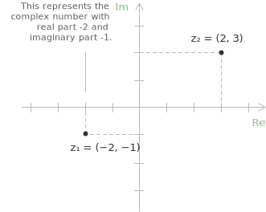
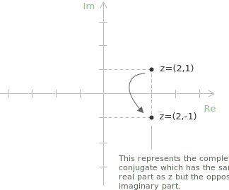
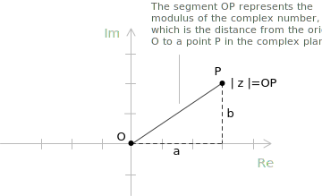

## Introduction

Complex numbers arise to overcome certain limitations of the set of [real numbers](../types-of-numbers) $\mathbb{R}$, in particular, the impossibility of taking even-indexed roots of negative numbers. An important consequence of this restriction is that some [quadratic equation](../quadratic-equations) with a negative [discriminant](../quadratic-formula) have no solution in $\mathbb{R}$.

In the set of [real numbers](../properties-of-real-numbers/) $\mathbb{R}$, there is no number whose square is $-1$, because the square of any real number is always non-negative. Consequently, the equation $p(x) = x^2 + 1 = 0$ has no solutions in $\mathbb{R}$. Indeed, solving it would require $x^2 = -1$, which is never satisfied in the set of real numbers $\mathbb{R}$.

To address this, we introduce the symbol $i$, known as the imaginary unit, which is defined by the property:

$$ i^2 = -1 $$

With this definition, the equation $x^2 + 1 = 0$ now has two distinct complex [roots](../roots-of-a-polynomial/), given by $\pm i$.

## Construction of the complex numbers

The introduction of complex numbers is sometimes treated as a matter of convenient notation, as though the symbol $i$ were simply declared to satisfy $i^2 = -1$ and the matter were settled.This approach leaves an important question unanswered: does such an object actually exist, and if so, in what mathematical sense? Answering this requires a short excursion into the construction of $\mathbb{C}$ from the [real numbers](../real-numbers).

The starting point is the Cartesian product $\mathbb{R}^2$, the set of all ordered pairs of real numbers. Each element of this set is a pair of the form $(a, b)$ with $a, b \in \mathbb{R}$. This [set](../sets/) is the familiar Euclidean plane, but here we want to equip it with an algebraic structure that makes it a [field](../fields/). To do so, we must define addition and multiplication on $\mathbb{R}^2$.

Addition is defined componentwise. Given two pairs $(a, b)$ and $(c, d)$, their sum is:

$$
(a, b) + (c, d) \ = \  (a + c, \\\ b + d)
$$

This is the natural extension of [vector](../vectors/) addition in the plane and presents no difficulty.

- - -

Multiplication is more subtle, and it is precisely here that the algebraic structure of the complex numbers diverges from that of $\mathbb{R}^2$ viewed merely as a [vector space](../vector-spaces/). The product of two pairs is defined by.

$$
(a, b) \cdot (c, d) \ = \ (ac - bd, \ ad + bc)
$$

This rule is the unique multiplication that turns $\mathbb{R}^2$ into a field extending $\mathbb{R}$, as will become apparent once we make the connection with the standard algebraic notation explicit. The set $\mathbb{R}^2$ equipped with these two operations is denoted $\mathbb{C}$ and its elements are called complex numbers.

The real numbers embed into $\mathbb{C}$ via the identification $a \mapsto (a, 0)$. One can verify directly that this map preserves both addition and multiplication, so $\mathbb{R}$ sits inside $\mathbb{C}$ as a subfield in a precise algebraic sense. The element $(0, 1)$, which has no counterpart in this embedded copy of $\mathbb{R}$ plays a distinguished role. Computing its square using the multiplication rule yelds:

$$
(0, 1) \cdot (0, 1) \ = \ (0 \cdot 0 - 1 \cdot 1,\ 0 \cdot 1 + 1 \cdot 0) \ =\ (-1,0)
$$

Under the identification above, the pair $(-1, 0)$ corresponds to the real number $-1$. In other words, the element $(0, 1)$ of $\mathbb{C}$ satisfies exactly the relation that the symbol $i$ is traditionally required to satisfy. This element is called the imaginary unit and is denoted $i$, so that by definition $i = (0, 1)$ and consequently $i^2 = -1$. The property $i^2 = -1$ is therefore not a postulate imposed on an undefined symbol: it is a theorem that follows from the multiplication rule on $\mathbb{R}^2$.

With this notation in place, every complex number $(a, b)$ can be decomposed as a combination of the two basis elements $(1, 0)$ and $(0, 1)$, which correspond to $1$ and $i$ respectively. The decomposition takes the familiar form $a + bi$, since the following chain of equalities holds:

$$
\begin{aligned}
(a, \ b) &= (a,\ 0) + (0,\ b) \\[6pt]
&= a\cdot(1,\ 0) + b\cdot(0,  1) \\[6pt]
&= a + bi
\end{aligned}
$$

The notation $z = a + bi$ is thus a compact encoding of the ordered pair $(a, b)$, with $a$ called the real part and $b$ the imaginary part of $z$. These are written as $\mathrm{Re}(z) = a$ and $\mathrm{Im}(z) = b$. Note that the imaginary part is the real number $b$, not the quantity $bi$.

- - -

It remains to verify that the algebraic properties required of a field actually hold. The verification is routine but worth summarising. Under addition, $\mathbb{C}$ forms an abelian [group](../groups/): commutativity and associativity are inherited from $\mathbb{R}$, the additive identity is $(0, 0)$, and the additive inverse of $(a, b)$ is $(-a, -b)$.

Multiplication is likewise commutative and associative, as can be confirmed by direct computation, and the multiplicative identity is $(1, 0)$. The distributive law also holds. The only property requiring attention is the existence of multiplicative inverses for nonzero elements. Given $(a, b) \neq (0, 0)$, one checks that its multiplicative inverse is the following pair:

$$
(a, \ b)^{-1} \ = \ \left(\frac{a}{a^2 + b^2}, \ \frac{-b}{a^2 + b^2}\right)
$$

The denominator $a^2 + b^2$ is strictly positive when $(a, b) \neq (0, 0)$, which ensures the formula is well defined for every nonzero complex number. The conclusion is that $\mathbb{C}$, as constructed, is a field. Moreover, since $\mathbb{R}$ embeds into it as a subfield, $\mathbb{C}$ is an extension field of $\mathbb{R}$. This is the precise mathematical sense in which the complex numbers extend the real number system.

One may also observe that, as a vector space over $\mathbb{R}$, the field $\mathbb{C}$ has dimension two, with basis $\{1, i\}$. This two-dimensionality underlies the natural geometric interpretation in the complex plane. The real and imaginary parts of a complex number serve as coordinates with respect to this basis.

The construction just described also generalises: replacing $\mathbb{R}$ with an arbitrary field $F$ and seeking an extension in which a chosen irreducible [polynomial](../polynomials/) has a root leads to the broader theory of [field](../fields/) extensions. The example $\mathbb{C} \cong \mathbb{R}[x]/(x^2 + 1)$ is the simplest and one of the most important instances of this general construction.

## Definition

A complex number $z$ is a number of the form $z = a + bi$, where $a$ and $b$ are real numbers. The set of complex numbers is denoted by $\mathbb{C}$ and is formally defined by:
$$
\mathbb{C} := \{ z = a + ib \mid a, b \in \mathbb{R}\}
$$

Let $z$ be any complex number. The quantity $a$ is the real part of $z$ and is denoted by $\mathrm{Re}(z)$, while $b$ is the imaginary part of $z$ and is denoted by $\mathrm{Im}(z)$:

$$
z = a + ib \quad \Longrightarrow \quad
\begin{cases}
\mathrm{Re}(z) = a \\[6pt]
\mathrm{Im}(z) = b \\
\end{cases}
$$

+ The expression $z = a + ib$ is called the algebraic form of a complex number. By the construction above, the complex number $a + bi$ is the ordered pair $(a, b) \in \mathbb{R} \times \mathbb{R}$, and the set $\mathbb{C}$ coincides with the Cartesian product $\mathbb{R} \times \mathbb{R}$ equipped with the usual operations defined there.
+ The complex number $z = 2 + 3i$ has real part of $2$ and imaginary part $3$.
+ Numbers of the form $z = ib$ are purely imaginary numbers.

While the algebraic form is the most familiar representation of complex numbers, an alternative and often more powerful way to express them is through their polar [trigonometric form](../complex-numbers-trigonometric-form):

$$z = r (\cos\theta + i\sin\theta) $$

Another widely used representation is the [exponential form](../complex-numbers-exponential-form/):

$$z = r e^{i\theta} $$

## Complex plane

Because the set $\mathbb{C}$ has the structure of a Cartesian product, complex numbers can be represented geometrically in the complex plane (also known as the Gaussian or Argand plane). In this representation, the real part corresponds to the $x$-coordinate and the imaginary part corresponds to the $y$-coordinate.

Thus, the complex number $z  = x + iy$ can be represented as the point $(x, y)$ in the complex plane.

A purely imaginary number is represented, for example, by the ordered pair $i = (0,1)$.

## Conjugate and modulus

Given a complex number $z = a + bi$ its conjugate is defined as the complex number:

$$ \overline{z} = a - bi $$

Geometrically, $\overline{z}$ is the reflection of $x$ across the real $x$-axis in the complex plane.

Given the complex number $z = a + bi$, the modulus of $z$ is defined as:  

$$
|z| = \sqrt{a^2 + b^2}
$$

It represents the distance from the origin to the point $(a, b)$ in the complex plane. This follows directly from the [Pythagorean theorem](../pythagorean-theorem/), since the modulus is the length of the hypotenuse of a right triangle whose legs have lengths $|a|$ and $|b|$:

$$
|z|^2 = a^2 + b^2
$$

For example, consider the complex number $z = 3 + 2i$. Substituting $a = 3$ and $b = 2$ into the formula for the modulus, we get:

$$|z| = \sqrt{3^2 + 2^2} = \sqrt{9 + 4} = \sqrt{13}$$

Thus, the modulus of $z = 3 + 2i$ is:

$$|z| = \sqrt{13} \approx 3.61 $$

> This value represents the distance of $z$ from the origin in the complex plane for the complex number $3 + 2i$.

## Argument

The argument of a complex number $z = a + bi$ is the angle $\theta$ between the positive real axis and the [line](../lines/) segment from the origin to the point $(a, b)$ in the complex plane. It is measured in radians, counterclockwise from the positive real axis, and is denoted by $\arg(z)$.

The argument is not uniquely determined. Any two angles differing by an integer multiple of $2\pi$ represent the same geometric direction. To remove this ambiguity, one usually works with the principal argument, denoted $\mathrm{Arg}(z)$, which is the unique value of $\theta$ satisfying the following condition.

$$
-\pi < \mathrm{Arg}(z) \leq \pi
$$

Computing the argument requires care, because the naive formula $\theta = \arctan(b/a)$ is inadequate. The [arctangent function](../arctangent-function/) returns values only in the interval $(-\pi/2,\, \pi/2)$, which covers only the right half of the complex plane and is undefined when $a = 0$. The correct value of $\theta$ depends on the quadrant containing $(a, b)$ and must be determined case by case.

**Case 1:** When $a > 0$, the point lies in the right half-plane and the principal argument is given by the [arctangent](../arctangent-and-arccotangent/):

$$
\mathrm{Arg}(z) = \arctan \left(\frac{b}{a}\right)
$$

**Case 2:** When $a < 0$ and $b \geq 0$, the point lies in the second quadrant, and a correction of $\pi$ must be added to bring the angle into the correct range.

$$
\mathrm{Arg}(z) = \arctan \left(\frac{b}{a}\right) + \pi
$$

**Case 3:** When $a < 0$ and $b < 0$, the point lies in the third quadrant, and the correction is $-\pi$.

$$
\mathrm{Arg}(z) = \arctan \left(\frac{b}{a}\right) - \pi
$$

**Case 4:** When $a = 0$, the point lies on the imaginary axis and the arctangent is undefined. In this case the argument is determined directly from the sign of $b$: if $b > 0$ then $\mathrm{Arg}(z) = \pi/2$, and if $b < 0$ then $\mathrm{Arg}(z) = -\pi/2$. The case $z = 0$ is excluded, since the argument of the origin is undefined.

As an illustration, consider the complex number $z = -1 + i$. Its real part is negative and its imaginary part is positive, so the point lies in the second quadrant. Applying the arctangent to the ratio $b/a = 1/(-1) = -1$ gives $\arctan(-1) = -\pi/4$, which lies in the fourth quadrant and therefore does not represent the correct argument. Since $a < 0$ and $b \geq 0$, we must apply the correction of $+\pi$:

$$
\mathrm{Arg}(z) = -\frac{\pi}{4} + \pi = \frac{3\pi}{4}
$$

> This value agree with the geometric position of $z = -1 + i$: the point is equidistant from both axes in the second quadrant, forming an angle of $135°$ with the positive real axis.

## Properties of $\mathbb{C}$

The [sum and product](../complex-number-operations) of complex numbers satisfy the associative, commutative, and distributive properties, just as the real numbers do.

Associative property for sum and product: when adding or multiplying complex numbers, the way in which the numbers are grouped does not affect the result.

$$(z_1 + z_2) + z_3 = z_1 + (z_2 + z_3) $$

$$(z_1 \cdot z_2) \cdot z_3 = z_1 \cdot (z_2 \cdot z_3) $$

Commutative property: the order in which two complex numbers are added or multiplied does not change the result.

$$z_1 + z_2 = z_2 + z_1 $$

$$z_1 \cdot z_2 = z_2 \cdot z_1 $$

Distributive property: multiplying a number by a sum gives the same result as multiplying each addend individually and then adding the products.

$$z_1 \cdot (z_2 + z_3) = z_1 \cdot z_2 + z_1 \cdot z_3 $$

- - -

The complex number $0 + 0i$ is the additive identity in $\mathbb{C}$, since for every complex number $z = a + bi$, we have:

$$
\begin{align}
z + (0 + 0i) &= (a + bi) + (0 + 0i) \\[6pt]
&= (a + 0) + (b + 0)i \\[6pt]
&= a + bi \\[6pt]
&= z
\end{align}
$$

The complex number $1 + 0i$ is the multiplicative identity in $\mathbb{C}$, since for every complex number $z = a + bi$, we have:

$$
\begin{align}
z \cdot (1 + 0i) &= (a + bi) \cdot (1 + 0i) \\[6pt]
&= a \cdot 1 + a \cdot 0i + bi \cdot 1 + bi \cdot 0i \\[6pt]
&= a + bi \\[6pt]
&= z
\end{align}
$$
- - -

The opposite of $a + bi$ is the complex number:

$$-(a + bi) = -a - bi $$

The reciprocal of a nonzero complex number $z = a + bi$ is the complex number:

$$\frac{1}{z} = \frac{a}{a^2 + b^2} - \frac{b}{a^2 + b^2} i $$

Complex numbers of the form $z = a + 0i$, where the imaginary part is zero, are precisely the real numbers.

The set of complex numbers $\mathbb{C}$ cannot be ordered in a way that is compatible with addition and multiplication. Suppose there existed a total order $\leq$ on $\mathbb{C}$, hat behaved well with these operations. Then we should be able to compare $i$ with $0$. There are two possible cases:  

+ If $i > 0$, multiplying both sides by $i$ gives $i^2 = -1 > 0$, which is a contradiction.  
+ If $i < 0$, multiplying both sides by $i$ again leads to $-1 > 0$, the same contradiction.

Since neither case is possible, no total order on $\mathbb{C}$ can be defined that is compatible with the [field](../fields/) operations.