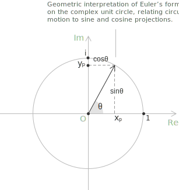

## Introduction

Euler's formula gives a relation between the exponential function and the trigonometric functions, forming a bridge between the algebraic and geometric viewpoints on [complex numbers](../complex-numbers-introduction/). The identity states that for every real number $\theta$ the following equality holds:

$$e^{i\theta} = \cos\theta + i\sin\theta$$

This relation underlies both the [exponential form](../complex-numbers-exponential-form/) and the [trigonometric form](../complex-numbers-trigonometric-form/) of a complex number, and it is the fact from which [De Moivre's theorem](../de-moivre-theorem/) and the description of the [roots of unity](../roots-of-unity/) follow. The status of the formula admits two readings. 

+ In the first, the complex exponential is defined through its [Taylor series](../taylor-series/) for an arbitrary complex argument, and Euler's identity is then established as a theorem. 
+ In the second, the formula is taken as the very definition of $e^{i\theta}$, and what becomes a theorem is the consistency of this definition with the algebraic properties of the real exponential. 

> These viewpoints are equivalent and lead to the same object. In what follows we adopt the first reading, since it places the formula within the broader analytic framework already used in the construction of the [exponential function](../exponential-function/).

## Statement

**Definition 1.** For every real number $\theta$ the following identity holds:

$$e^{i\theta} = \cos\theta + i\sin\theta$$

The left-hand side is the complex exponential evaluated at the imaginary argument $i\theta$. The right-hand side is a complex number whose real part is $\cos\theta$ and whose imaginary part is $\sin\theta$. The identity describes how the exponential function restricted to the imaginary axis parametrises the [unit circle](../unit-circle/) in the complex plane.

**Definition 2.** An immediate consequence concerns the modulus of $e^{i\theta}$. Computing directly from its algebraic form we obtain:

$$|e^{i\theta}|^2 = \cos^2\theta + \sin^2\theta = 1$$

For every real $\theta$ the value $e^{i\theta}$ has unit modulus, and as $\theta$ varies over $\mathbb{R}$ the function traces the unit circle counterclockwise. The period of this motion is $2\pi$, reflecting the common period of [sine and cosine](../sine-and-cosine).

## Proof via Taylor series

The most direct derivation of Euler's formula uses the [Taylor series](../taylor-series/) expansions of the exponential, sine, and cosine functions. These series converge for every real or complex argument, and the manipulations below are justified by absolute convergence, which allows us to rearrange terms without changing the value of the sum.

For a real variable $x$, the series of the three functions are the following:

$$e^x = \sum_{n=0}^{\infty} \frac{x^n}{n!}$$

$$\cos x = \sum_{n=0}^{\infty} (-1)^n \frac{x^{2n}}{(2n)!}$$

$$\sin x = \sum_{n=0}^{\infty} (-1)^n \frac{x^{2n+1}}{(2n+1)!}$$

The extension of the exponential to complex arguments is obtained by inserting a complex variable in place of the real one. For every $z \in \mathbb{C}$ we define:

$$e^z \\ := \\ \sum_{n=0}^{\infty} \frac{z^n}{n!}$$

This series converges absolutely for every $z$, because $\sum_{n=0}^{\infty} |z|^n / n!$ equals $e^{|z|}$, which is finite. With this definition, we evaluate $e^{i\theta}$ by substituting $z = i\theta$ into the series:

$$e^{i\theta} = \sum_{n=0}^{\infty} \frac{(i\theta)^n}{n!} = \sum_{n=0}^{\infty} \frac{i^n \ \theta^n}{n!}$$

The behaviour of the series depends on the powers of the imaginary unit. By direct computation we obtain:

$$
\begin{align}
i^0 &= 1 \\[6pt]
i^1 &= i \\[6pt]
i^2 &= -1 \\[6pt]
i^3 &= -i
\end{align}
$$

Beyond the fourth power the cycle repeats, since $i^4 = (i^2)^2 = 1$, and consequently $i^{n+4} = i^n$ for every $n$. The value of $i^n$ depends therefore only on the residue of $n$ [modulo](../modules/) $4$.

We now split the series according to the parity of the index. Writing $n = 2k$ for even terms and $n = 2k+1$ for odd terms, the corresponding powers of $i$ are $i^{2k} = (i^2)^k = (-1)^k$ and $i^{2k+1} = i \cdot (-1)^k$. The two contributions can be collected separately:

$$
\begin{align}
e^{i\theta} &= \sum_{k=0}^{\infty} \frac{i^{2k} \ \theta^{2k}}{(2k)!} + \sum_{k=0}^{\infty} \frac{i^{2k+1} \ \theta^{2k+1}}{(2k+1)!} \\[6pt]
&= \sum_{k=0}^{\infty} (-1)^k \frac{\theta^{2k}}{(2k)!} + i \sum_{k=0}^{\infty} (-1)^k \frac{\theta^{2k+1}}{(2k+1)!}
\end{align}
$$

The two series on the right-hand side are precisely the Taylor expansions of $\cos\theta$ and $\sin\theta$. Substituting these expressions yields Euler's formula:

$$e^{i\theta} = \cos\theta + i\sin\theta$$

> The rearrangement used in the proof is legitimate because the series for $e^{i\theta}$ converges absolutely. For an absolutely convergent series of complex terms, any reordering of the summands yields the same sum. This is the property that justifies splitting the series into its even and odd indices.

## Proof via differential equation

A second derivation, conceptually independent of the series expansion, uses the characterization of the [exponential function](../exponential-function/) as the unique solution of a first-order linear differential equation with prescribed initial value. Let $f : \mathbb{R} \to \mathbb{C}$ be the function defined by:

$$f(\theta) = \cos\theta + i\sin\theta$$

The [derivative](../derivatives/) of $f$ is taken componentwise, by differentiating the real and imaginary parts separately. Applying the derivatives of cosine and sine we obtain:

$$
\begin{align}
f'(\theta) &= -\sin\theta + i\cos\theta \\[6pt]
&= i\bigl(\cos\theta + i\sin\theta\bigr) \\[6pt]
&= i f(\theta)
\end{align}
$$

In the second line we factor out $i$ from the right-hand side, using the identity $-\sin\theta = i \cdot (i\sin\theta)$ which follows from $i^2 = -1$. Thus, $f$ satisfies the differential equation:

$$f'(\theta) = if(\theta)$$

with the initial value $f(0) = \cos 0 + i\sin 0 = 1$.

Now consider the complex exponential $g(\theta) = e^{i\theta}$, defined through its Taylor series. Differentiating the series term by term, justified by uniform convergence on bounded intervals, gives:

$$g'(\theta) = \sum_{n=1}^{\infty} \frac{i^n \ n \ \theta^{n-1}}{n!} = i \sum_{n=1}^{\infty} \frac{(i\theta)^{n-1}}{(n-1)!} = ig(\theta)$$

and the initial value is $g(0) = 1$. Two solutions of the same first-order linear differential equation that share the same value at one point coincide everywhere. We conclude that $f(\theta) = g(\theta)$ for every real $\theta$, which is Euler's formula.

> The uniqueness step can be made explicit by introducing the auxiliary function $h(\theta) = f(\theta) \ e^{-i\theta}$. Its derivative is identically zero, since $h'(\theta) = f'(\theta)e^{-i\theta} - i \ f(\theta)e^{-i\theta} = 0$, so $h$ is constant. The value $h(0) = 1$ then forces $f(\theta) = e^{i\theta}$ for every $\theta$.

## Euler's identity

Specialising Euler's formula at $\theta = \pi$ yields what is know to as Euler's identity. Substituting the value of the argument and computing the trigonometric functions gives:

$$e^{i\pi} = \cos\pi + i\sin\pi = -1$$

Rearranging the equality produces the more familiar form:

$$e^{i\pi} + 1 = 0$$

This identity combines five fundamental constants of mathematics in a single equation: 

+ the additive identity $0$
+ the multiplicative identity $1$
+ the imaginary unit $i$
+ the base of the natural exponential $e$
+ the ratio $\pi$ between the [circumference](../circumference/) and the diameter of a circle.

The identity states that the exponential of $i\pi$ produces the antipode of $1$ on the unit circle, that is, the rotation of the unit vector by an [angle of $\pi$ radians](../angles-and-angular-measure/).

The formula can also be specialized at other notable values of $\theta$ to recover further identities. Setting $\theta = \pi/2$ gives $e^{i\pi/2} = i$, the rotation by a quarter turn that sends $1$ to the imaginary unit. Setting $\theta = 2\pi$ gives $e^{2\pi i} = 1$, the periodicity relation that underpins the theory of [roots of unity](../roots-of-unity/).

## Trigonometric functions from the exponential

Euler's formula admits an immediate inversion: cosine and sine can be written as [linear combinations](../linear-combinations/) of $e^{i\theta}$ and $e^{-i\theta}$. Replacing $\theta$ with $-\theta$ in the formula, and using the fact that cosine is even and sine is odd, one obtains the following relation:

$$e^{-i\theta} = \cos\theta - i\sin\theta$$

Adding the two expressions $e^{i\theta}$ and $e^{-i\theta}$ eliminates the imaginary part, while subtracting them eliminates the real part. This yields the following identities which express the trigonometric functions in terms of the complex exponential:

$$\cos\theta = \frac{e^{i\theta} + e^{-i\theta}}{2}$$

$$\sin\theta = \frac{e^{i\theta} - e^{-i\theta}}{2i}$$

These formulas are the starting point for extending the trigonometric functions to complex arguments. Defining $\cos z$ and $\sin z$ for $z \in \mathbb{C}$ by the same expressions produces functions that agree with the real cosine and sine on $\mathbb{R}$ and inherit the algebraic identities of the exponential. This perspective unifies the trigonometric and hyperbolic functions, since the substitution $\theta = iy$ gives $\cos(iy) = \cosh y$ and $\sin(iy) = i\sinh y$, a relation with no analogue in the [real setting](../real-numbers/).

A consequence of Euler's formula is a derivation of the [addition formulas](../reduction-formulas-and-reference-angles/) for sine and cosine. The multiplicative law of the exponential gives:

$$e^{i(\alpha + \beta)} = e^{i\alpha} \cdot e^{i\beta}$$

Expanding both sides via Euler's formula produces:

$$\cos(\alpha + \beta) + i\sin(\alpha + \beta) = (\cos\alpha + i\sin\alpha)(\cos\beta + i\sin\beta)$$

Computing the product on the right and equating real and imaginary parts on the two sides of the equation yields the addition formulas:

$$\cos(\alpha + \beta) = \cos\alpha\cos\beta - \sin\alpha\sin\beta$$

$$\sin(\alpha + \beta) = \sin\alpha\cos\beta + \cos\alpha\sin\beta$$

The trigonometric identities become, in this perspective, consequences of the [homomorphism](../fields/) property of the exponential function, that is, of the rule $e^{a+b} = e^a e^b$.

## Connection with the trigonometric and exponential forms

Euler's formula underlies behind the equivalence between the [trigonometric form](../complex-numbers-trigonometric-form/) and the [exponential form](../complex-numbers-exponential-form/) of a complex number. A nonzero complex number $z = a + bi$, written in trigonometric form as $z = r(\cos\theta + i\sin\theta)$ with $r = |z|$ and $\theta = \arg(z)$, can be rewritten directly using Euler's formula. The resulting equality is:

$$
\begin{align}
z &= r(\cos\theta + i\sin\theta) \\[6pt]
&= r \ e^{i\theta}
\end{align}
$$

This passage replaces a sum of two real terms, weighted by trigonometric coefficients, with a single complex exponential. The advantages are immediate in computations involving multiplication, division, and integer powers, where the exponential rules reduce these operations to simple manipulations of moduli and arguments.

The identity also clarifies the effect of complex conjugation in the exponential representation. Since cosine is even and sine is odd, the conjugate of $e^{i\theta}$ is $e^{-i\theta}$. Consequently, the conjugate of $z = re^{i\theta}$ is given by the following expression:

$$\overline{z} = re^{-i\theta}$$

In exponential form, conjugation simply changes the sign of the argument, while the modulus unchanged. This matches with the geometric description of $\overline{z}$ as the reflection of $z$ across the real axis in the complex plane.

## Periodicity and the complex exponential

The periodicity of sine and cosine, both having common period $2\pi$, carries over via Euler's formula to a periodicity of $e^{i\theta}$ along the imaginary axis. For every $\theta \in \mathbb{R}$ and every integer $k$ one has the following identity:

$$e^{i(\theta + 2k\pi)} = \cos(\theta + 2k\pi) + i\sin(\theta + 2k\pi) = e^{i\theta}$$

Thus, the complex exponential, when restricted to purely imaginary arguments, is  periodic with imaginary period $2\pi i$. This periodicity is the analytic source of the non-uniqueness of the [argument](../complex-numbers-introduction/) of a complex number, and it is what necessitates the introduction of branch cuts in the definition of the complex logarithm.å

When the argument is fully complex, the relation extends without difficulty. For $z = x + iy$ with $x, y \in \mathbb{R}$, the multiplicative property of the exponential combined with Euler's formula gives:

$$
\begin{align}
e^z &= e^{x + iy} \\[6pt]
    &= e^x \cdot e^{iy} \\[6pt]
    &= e^x\bigl(\cos y + i\sin y\bigr)
\end{align}
$$

The complex exponential is thus completely determined by two pieces of information: the real exponential $e^x$, which controls the modulus of the result, and the imaginary part $y$, which controls the argument. The modulus and argument of $e^z$ are given respectively by the following expressions:

$$|e^z| = e^x \qquad \arg(e^z) = y + 2k\pi \quad k \in \mathbb{Z}$$

This decomposition is the gateway to the analytic theory of the complex exponential as an entire function on $\mathbb{C}$, and it makes precise the sense in which Euler's formula is the first instance of a broader structural correspondence between exponential growth and circular motion.