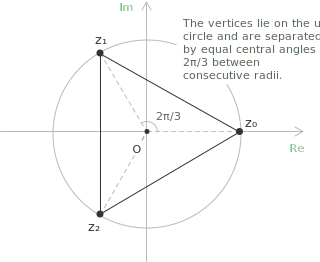

## Definition

Given a positive integer $n$, an $n$-th root of unity is a [complex number](../complex-numbers-introduction/) $z$ satisfying the [equation](../equations/) $z^n = 1$. There are exactly $n$ such numbers in $\mathbb{C}$, and they admit an explicit description through [Euler's formula](../eulers-formula/), which states that for every real $\theta$ the following identity holds:

$$e^{i\theta} = \cos\theta + i\sin\theta$$

The existence of exactly $n$ solutions is a consequence of the [fundamental theorem of algebra](../roots-of-a-polynomial/): the [polynomial](../polynomials/) $z^n - 1$ has degree $n$ and therefore admits at most $n$ roots in $\mathbb{C}$, and the explicit construction below shows that all $n$ candidates are distinct.

- - -

To obtain the roots in closed form, a complex number of unit modulus is written in [exponential form](../complex-numbers-exponential-form/) as $z = e^{i\theta}$, and the condition $z^n = 1$ becomes $e^{in\theta} = 1$. Since the complex exponential is periodic with period $2\pi$, this requires $n\theta = 2\pi k$ for some integer $k$, hence $\theta = 2\pi k/n$. As $k$ ranges over any $n$ consecutive [integers](../integers/), the resulting values of $\theta$ produce $n$ distinct points on the unit circle. It is customary to choose $k = 0, 1, \ldots, n-1$, which yields the $n$-th roots of unity in the form:

$$z_k = e^{2\pi ik/n} \qquad k = 0, 1, \ldots, n-1$$

Expanding via Euler's formula, each root admits the rectangular representation:

$$z_k = \cos\left(\frac{2\pi k}{n}\right) + i\sin\left(\frac{2\pi k}{n}\right)$$

For $k = 0$ one recovers $z_0 = 1$, which is an $n$-th root of unity for every $n$. When $n = 2$ the two roots are $1$ and $-1$. When $n = 4$ the four roots are $1, i, -1, -i$, familiar from the arithmetic of the Gaussian integers. For general $n$, the roots come in conjugate pairs: since the arguments $2\pi k/n$ and $2\pi(n-k)/n$ sum to $2\pi$, the identity $z_{n-k} = \overline{z_k}$ holds for every $k$.

## Group structure

The [set](../sets/) $\mu_n$ of all $n$-th roots of unity, equipped with complex multiplication, forms a [group](../groups/). Closure follows from the identity $z_j \cdot z_k = e^{2\pi i(j+k)/n}$, which is again an $n$-th root of unity since:

$$(z_j z_k)^n = z_j^n z_k^n = 1$$

The identity element is $z_0 = 1$, and the inverse of $z_k$ is $z_{n-k}$, which coincides with the complex conjugate $\overline{z_k}$ because $|z_k| = 1$. The multiplication law can be written compactly as:

$$z_j \cdot z_k = z_{(j+k) \bmod n}$$

The group $\mu_n$ is therefore a [cyclic group](../groups/) of order $n$, generated by the element $z_1 = e^{2\pi i/n}$. Every other root is a power of $z_1$, since $z_k = z_1^k$. The map $z_k \mapsto k$ is an isomorphism between $\mu_n$ and $\mathbb{Z}/n\mathbb{Z}$ under addition modulo $n$.

In particular, $\mu_n$ is abelian, and its subgroup structure mirrors that of $\mathbb{Z}/n\mathbb{Z}$: for every divisor $d$ of $n$, there is a unique subgroup of order $d$, namely $\mu_d$, which embeds naturally in $\mu_n$.

> Since $\mathbb{Z}/n\mathbb{Z}$ is abelian, the same is true of $\mu_n$: the order of multiplication of two roots is irrelevant, since the identity $z_j z_k = z_k z_j$ follows from the commutativity of addition among the exponents.

## Geometric interpretation

In the complex plane, the $n$-th roots of unity are located at the vertices of a regular $n$-gon inscribed in the unit circle, with one vertex fixed at the point $1$ on the real axis. The vertices are equally spaced, with an angular separation of $2\pi/n$ between any two consecutive roots.

This regularity is a direct consequence of the uniform spacing of the arguments $2\pi k/n$. As $k$ increases by one unit, the corresponding point on the unit circle advances by a fixed [angle](../angles-and-angular-measure/). The cases $n = 3, 4, 6$ are particularly natural, since the corresponding regular polygons tile the plane. For $n = 3$, the three vertices form an equilateral triangle and are given by:

$$
\begin{align}
z_0 &= 1 \\[6pt]
z_1 &= e^{2\pi i/3} = -\frac{1}{2} + i\frac{\sqrt{3}}{2} \\[6pt]
z_2 &= e^{4\pi i/3} = -\frac{1}{2} - i\frac{\sqrt{3}}{2}
\end{align}
$$

> For $n = 6$ the six roots are the vertices of a regular hexagon, and they include as a subset the roots for $n = 2$ and $n = 3$, a consequence of the divisibilities $2 \mid 6$ and $3 \mid 6$ and the corresponding subgroup inclusions $\mu_2, \mu_3 \subset \mu_6$.

## Primitive roots

A root of unity $z_k \in \mu_n$ is called primitive if its order in the group is exactly $n$, meaning that $z_k^m \neq 1$ for every positive integer $m < n$. Equivalently, $z_k$ is a generator of $\mu_n$: every element of the group can be written as a power of $z_k$. Since $z_k = z_1^k$, the order of $z_k$ in the cyclic group $\mu_n$ is $n / \gcd(k, n)$, and $z_k$ is primitive if and only if $\gcd(k, n) = 1$.

The number of primitive $n$-th roots of unity is therefore equal to the number of integers in $\{1, 2, \ldots, n\}$ coprime to $n$, which is by definition Euler's totient function $\varphi(n)$.

- - -

For example, when $n = 6$ one has $\varphi(6) = 2$, and the primitive roots are $z_1 = e^{\pi i/3}$ and $z_5 = e^{5\pi i/3}$, corresponding to $k = 1$ and $k = 5$. When $n$ is prime, every root except $z_0 = 1$ is primitive, since $\gcd(k, n) = 1$ for every $k \in \{1, \ldots, n-1\}$, and consequently $\varphi(n) = n - 1$.

If $\zeta$ is any primitive $n$-th root of unity, then the full set $\mu_n$ is recovered as the orbit of $\zeta$ under exponentiation:

$$\mu_n = \{1, \zeta, \zeta^2, \ldots, \zeta^{n-1}\}$$

The choice of a specific primitive root is therefore a matter of convention rather than mathematical substance, since all primitive roots generate the same group.

## Sum of the roots

The sum of all $n$-th roots of unity vanishes for every $n \geq 2$. To see this, observe that the polynomial $z^n - 1$ factors completely over $\mathbb{C}$ as:

$$z^n - 1 = (z - z_0)(z - z_1) \cdots (z - z_{n-1})$$

Expanding the right-hand side and comparing the coefficient of $z^{n-1}$ on both sides, this coefficient is zero on the left and equal to $-(z_0 + z_1 + \cdots + z_{n-1})$ on the right. The identification yields:

$$\sum_{k=0}^{n-1} z_k = 0$$

An alternative derivation uses the formula for a [geometric series](../geometric-series/). Since $z_1 \neq 1$ when $n \geq 2$, one has:

$$\sum_{k=0}^{n-1} z_1^k = \frac{z_1^n - 1}{z_1 - 1} = \frac{1 - 1}{z_1 - 1} = 0$$

Geometrically, the result states that the centroid of the vertices of a regular $n$-gon inscribed in the unit circle coincides with the origin, which is evident by symmetry.

## Product of the roots

The product of all $n$-th roots of unity is also determined by the factorisation of $z^n - 1$. Since the constant term of $z^n - 1$ is $-1$ and the leading coefficient is $1$, comparing constant terms in the identity:

$$z^n - 1 = (z - z_0)(z - z_1) \cdots (z - z_{n-1})$$

gives:

$$\prod_{k=0}^{n-1} z_k = (-1)^{n+1}$$

This is a direct application of [Vieta's formulas](../trinomials/), which relate the coefficients of a polynomial to the elementary symmetric polynomials of its roots. For $n = 2$ the roots are $1$ and $-1$, whose product is $-1 = (-1)^3$. For $n = 3$ the three cube roots of unity have product $1 = (-1)^4$, as can also be checked directly by multiplying the explicit expressions found via [De Moivre's theorem](../de-moivre-theorem/).

## Cyclotomic polynomials

The primitive $n$-th roots of unity are precisely the roots of the $n$-th cyclotomic polynomial $\Phi_n(x)$, defined as the monic polynomial whose roots are exactly the primitive $n$-th roots of unity:

$$\Phi_n(x) = \prod_{\substack{k=1 \\ \gcd(k, n) = 1}}^{n} (x - e^{2\pi ik/n})$$

The degree of $\Phi_n(x)$ is $\varphi(n)$. The first few cyclotomic polynomials are:

$$
\begin{align}
\Phi_1(x) &= x - 1 \\[6pt]
\Phi_2(x) &= x + 1 \\[6pt]
\Phi_3(x) &= x^2 + x + 1 \\[6pt]
\Phi_4(x) &= x^2 + 1
\end{align}
$$

An identity of central importance connects the cyclotomic polynomials to the [factorisation](../factoring-ac-method/) of $z^n - 1$. Since every $n$-th root of unity is a primitive $d$-th root for exactly one divisor $d$ of $n$, one has:

$$z^n - 1 = \prod_{d \mid n} \Phi_d(z)$$

This identity permits the recursive computation of cyclotomic polynomials. A classical theorem of algebraic number theory asserts that $\Phi_n(x)$ is irreducible over $\mathbb{Q}$ for every positive integer $n$, a property treated in detail in the dedicated entry on cyclotomic polynomials.
