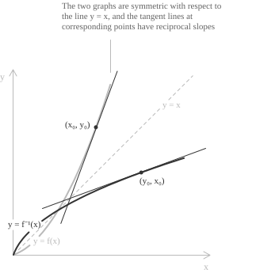

## Introduction

An invertible function $f$ and its [inverse](../inverse-function/) $f^{-1}$ are two readings of the same correspondence in opposite directions, and their graphs are reflections of each other in the line $y = x.$ The reflection exchanges the horizontal and the vertical direction, so a line of slope $m$ becomes a line of slope $1/m.$ Since the [derivative](../derivatives/) is the slope of the tangent line, the derivative of $f^{-1}$ at a point is the reciprocal of the derivative of $f$ at the reflected point.

Write $y_0 = f(x_0).$ The two points exchanged by the reflection are $(x_0, y_0)$ on the graph of $f$ and $(y_0, x_0)$ on the graph of $f^{-1},$ and the relation between the two slopes is:

$$\bigl(f^{-1}\bigr)'(y_0) = \frac{1}{f'(x_0)}$$

The same picture shows which case the formula must exclude. A horizontal tangent, of slope $0,$ reflects into a vertical line, and no differentiable function has a vertical tangent, so the inverse cannot be differentiable at the image of a point where $f'$ vanishes.

## What the chain rule gives

The [composition](../composite-functions/) of $f$ with its inverse is the identity, so for every $y$ in the domain of $f^{-1}$:

$$f\bigl(f^{-1}(y)\bigr) = y$$

Suppose $f^{-1}$ is differentiable at $y.$ The left-hand side is then differentiable at $y.$ Differentiating both sides, with the [chain rule](../chain-rule/) on the left, gives:

$$f'\bigl(f^{-1}(y)\bigr) \cdot \bigl(f^{-1}\bigr)'(y) = 1$$

Two conclusions follow from this identity. When $f'\bigl(f^{-1}(y)\bigr) \neq 0,$ we can divide by that factor to obtain the formula stated above, and no other value is possible. When $f'\bigl(f^{-1}(y)\bigr) = 0,$ the identity becomes $0 = 1,$ so the assumption made at the start is false and $f^{-1}$ is not differentiable at $y.$

The argument shows what the derivative must equal and where the inverse cannot be differentiable, but it does not establish that $f^{-1}$ is differentiable anywhere, since differentiability is what allowed the chain rule to be applied. The next section proves differentiability from the definition, under hypotheses on $f$ alone.

## Statement and proof

Let $f$ be continuous and injective on an interval $I,$ let $x_0 \in I,$ and suppose $f$ is differentiable at $x_0$ with $f'(x_0) \neq 0.$ Then $f^{-1}$ is differentiable at $y_0 = f(x_0),$ and its derivative is:

$$\bigl(f^{-1}\bigr)'(y_0) = \frac{1}{f'\bigl(f^{-1}(y_0)\bigr)} = \frac{1}{f'(x_0)}$$

The proof uses two properties of a continuous injective function on an interval, both consequences of the [intermediate value theorem](../intermediate-value-theorem/). The image $J = f(I)$ is again an interval, and the inverse $f^{-1} : J \to I$ is [continuous](../continuous-functions/) on $J.$

Take $y \in J$ with $y \neq y_0$ and put $x = f^{-1}(y).$ Injectivity gives $x \neq x_0,$ hence $f(x) \neq f(x_0).$ Since $y - y_0 = f(x) - f(x_0)$ and $f^{-1}(y) - f^{-1}(y_0) = x - x_0,$ the [difference quotient](../difference-quotient/) of $f^{-1}$ at $y_0$ is the reciprocal of the difference quotient of $f$ at $x_0$:

$$\frac{f^{-1}(y) - f^{-1}(y_0)}{y - y_0} = \frac{x - x_0}{f(x) - f(x_0)}$$

The right-hand side depends on $y$ only through $x = f^{-1}(y),$ which suggests treating it as a function of $x$ alone. For $x \in I$ with $x \neq x_0,$ define:

$$\Phi(x) = \frac{x - x_0}{f(x) - f(x_0)} = \left(\frac{f(x) - f(x_0)}{x - x_0}\right)^{-1}$$

The quantity $f(x) - f(x_0)$ never vanishes on this set, so $\Phi$ is defined at every point of $I$ other than $x_0,$ and the identity above reads:

$$\frac{f^{-1}(y) - f^{-1}(y_0)}{y - y_0} = \Phi\bigl(f^{-1}(y)\bigr)$$

The difference quotient of $f$ tends to $f'(x_0)$ as $x \to x_0,$ and this limit is not zero. The [algebra of limits](../algebra-of-limits/) applies to its reciprocal:

$$\lim_{x \to x_0} \Phi(x) = \frac{1}{f'(x_0)}$$

It remains to pass from the limit of $\Phi$ at $x_0$ to the limit of the composite function $\Phi \circ f^{-1}$ at $y_0.$ The substitution is valid for two reasons. The inverse is continuous at $y_0,$ so $f^{-1}(y) \to x_0$ as $y \to y_0,$ and the inverse is injective, so $f^{-1}(y) \neq x_0$ for every $y \neq y_0.$ By the [theorem on the limit of a composite function](../theorems-on-limits/):

$$\lim_{y \to y_0} \frac{f^{-1}(y) - f^{-1}(y_0)}{y - y_0} = \lim_{y \to y_0} \Phi\bigl(f^{-1}(y)\bigr) = \lim_{x \to x_0} \Phi(x) = \frac{1}{f'(x_0)}$$

The difference quotient of $f^{-1}$ at $y_0$ has a finite limit, which is the definition of differentiability at $y_0,$ and the limit is the stated value.

> Injectivity is used twice, and for two different reasons. It keeps $f(x) - f(x_0)$ away from zero, so that $\Phi$ is defined on a whole punctured neighbourhood of $x_0,$ and it keeps $f^{-1}(y)$ away from $x_0,$ so that the composite function takes its arguments in the set where the limit of $\Phi$ is computed. Without the second condition the limit of $\Phi \circ f^{-1}$ could not be deduced from the limit of $\Phi.$

In the applications below the argument of the inverse is written $x,$ as is customary for a function studied on its own domain, so the formula takes the form:

$$\bigl(f^{-1}\bigr)'(x) = \frac{1}{f'\bigl(f^{-1}(x)\bigr)}$$

## Where the inverse fails to be differentiable

The hypothesis $f'(x_0) \neq 0$ cannot be dropped. A function can be continuous, injective and differentiable on all of $\mathbb{R},$ and still have an inverse that is not differentiable at one point. Consider:

$$f(x) = x^3$$

Its derivative $f'(x) = 3x^2$ is positive except at the origin, where it vanishes, and $f$ is [strictly increasing](../increasing-and-decreasing-functions/) on $\mathbb{R},$ so it is a bijection of $\mathbb{R}$ onto itself with inverse $f^{-1}(x) = \sqrt[3]{x}.$ At the origin the difference quotient of the cube root diverges:

$$\lim_{h \to 0} \frac{\sqrt[3]{h} - \sqrt[3]{0}}{h} = \lim_{h \to 0} \frac{1}{h^{2/3}} = +\infty$$

The cube root is therefore not differentiable at $0,$ and its graph has a [vertical tangent](../points-of-non-differentiability/) there, the reflection of the horizontal tangent that $f$ has at the origin. Invertibility is not affected, since $f$ remains a bijection, and only the differentiability of $f^{-1}$ at that single point is lost.

## The formula in Leibniz notation

Let $y = f(x)$ and $x = f^{-1}(y).$ The derivative of $f$ is written $dy/dx$ and the derivative of $f^{-1}$ is written $dx/dy,$ so the theorem states that the two are reciprocal:

$$\frac{dx}{dy} = \frac{1}{\ \dfrac{dy}{dx}\ }$$

The notation is easy to remember, since the two fractions look like reciprocals of one another, but it does not display the two conditions under which the equality holds. The derivatives are evaluated at corresponding points, $dy/dx$ at $x_0$ and $dx/dy$ at $y_0 = f(x_0),$ and the quotient requires $dy/dx \neq 0.$

## The logarithm as the inverse of the exponential

The [exponential function](../exponential-function/) $f(t) = e^t$ is strictly increasing on $\mathbb{R},$ with derivative $f'(t) = e^t$ positive at every point, and it maps $\mathbb{R}$ onto $(0, +\infty).$ The theorem applies at every $t,$ and the inverse is the natural [logarithm](../logarithmic-function/), defined for $x > 0.$ Substituting $f^{-1}(x) = \ln(x)$ into the formula:

$$
\begin{align}
D[\ln(x)] &= \frac{1}{f'(\ln(x))} \\[6pt]
&= \frac{1}{e^{\ln(x)}} \\[6pt]
&= \frac{1}{x}
\end{align}
$$

The same computation with base $a > 0,$ $a \neq 1,$ starts from $f(t) = a^t$ and $f'(t) = a^t\ln(a),$ which is never zero. For $x > 0$ we obtain the derivative of the logarithm in base $a$:

$$D[\log_a(x)] = \frac{1}{a^{\log_a(x)}\ln(a)} = \frac{1}{x\ln(a)}$$

## Derivatives of the inverse trigonometric functions

The [sine](../sine-function/) is not injective on $\mathbb{R},$ and the [arcsine](../arcsine-function/) is by definition the inverse of its restriction to $[-\pi/2, \pi/2],$ where the sine is strictly increasing. On that interval the derivative $\cos(t)$ is positive except at the two endpoints, so the theorem applies for $x \in (-1, 1).$ Writing $t = \arcsin(x),$ the [Pythagorean identity](../pythagorean-identity/) gives $\cos(t) = \sqrt{1 - \sin^2(t)},$ where the positive root is the correct one because $t$ lies in an interval on which the cosine is positive:

$$
\begin{align}
D[\arcsin(x)] &= \frac{1}{\cos(\arcsin(x))} \\[6pt]
&= \frac{1}{\sqrt{1 - \sin^2(\arcsin(x))}} \\[6pt]
&= \frac{1}{\sqrt{1 - x^2}}
\end{align}
$$

At $x = \pm 1$ the corresponding points are $t = \pm\pi/2,$ where the derivative of the sine is zero, so the arcsine is not differentiable at the endpoints of its domain and its graph has vertical tangents there.

The arccosine is the inverse of the [cosine](../cosine-function/) restricted to $[0, \pi],$ where the derivative $-\sin(t)$ is negative on the interior. With $t = \arccos(x)$ and $\sin(t) = \sqrt{1 - \cos^2(t)} = \sqrt{1 - x^2},$ the same substitution gives:

$$D[\arccos(x)] = \frac{1}{-\sin(\arccos(x))} = -\frac{1}{\sqrt{1 - x^2}}$$

- - -

The [arctangent](../arctangent-and-arccotangent/) is the inverse of the [tangent](../tangent-function/) restricted to $(-\pi/2, \pi/2),$ an interval on which the tangent is strictly increasing and takes every real value. Its derivative is $1 + \tan^2(t),$ which is at least $1$ and therefore never zero, so the arctangent is differentiable on all of $\mathbb{R}.$ With $t = \arctan(x)$ and $\tan(t) = x,$ the result has no trigonometric functions or square roots:

$$D[\arctan(x)] = \frac{1}{1 + \tan^2(\arctan(x))} = \frac{1}{1 + x^2}$$

The [cotangent](../cotangent-function/) restricted to $(0, \pi)$ has derivative $-\bigl(1 + \cot^2(t)\bigr),$ and the same substitution gives the derivative of the arccotangent:

$$D[\mathrm{arccot}(x)] = -\frac{1}{1 + x^2}$$

> The pairs $\arcsin$ and $\arccos,$ $\arctan$ and $\mathrm{arccot},$ have derivatives that differ only in sign. The identities $\arcsin(x) + \arccos(x) = \pi/2$ and $\arctan(x) + \mathrm{arccot}(x) = \pi/2$ account for this, since two functions whose sum is constant have opposite derivatives.

## An inverse without an explicit formula

The formula requires the value of $f^{-1}$ at the point under examination, not an expression for $f^{-1}.$ The derivative of an inverse can therefore be computed even when the inverse has no closed form. Consider:

$$f(x) = x + e^x$$

Its derivative $f'(x) = 1 + e^x$ is greater than $1$ at every point, so $f$ is strictly increasing and injective on $\mathbb{R}.$ The function is continuous and unbounded above and below, so its image is all of $\mathbb{R},$ and $f^{-1}$ is defined on $\mathbb{R}.$ The equation $x + e^x = y$ has a linear term and an exponential term, and its solution for $x$ has no expression in elementary functions.

The point at which the inverse is to be evaluated must still be identified, and here inspection suffices. From $f(0) = 0 + e^0 = 1$ we read $f^{-1}(1) = 0,$ so the derivative of the inverse at $y = 1$ is:

$$\bigl(f^{-1}\bigr)'(1) = \frac{1}{f'(0)} = \frac{1}{1 + e^0} = \frac{1}{2}$$

Any point whose preimage is known can be treated in the same way. From $f(1) = 1 + e$ we obtain $f^{-1}(1 + e) = 1$ and:

$$\bigl(f^{-1}\bigr)'(1 + e) = \frac{1}{f'(1)} = \frac{1}{1 + e}$$

Both values give the slope of the tangent line to the graph of $f^{-1}$ at the corresponding point. Near $y = 1$ the inverse is [approximated by the tangent line](../differential-of-a-function/) through $(1, 0)$ of slope $1/2,$ whose equation is $x = (y - 1)/2.$
