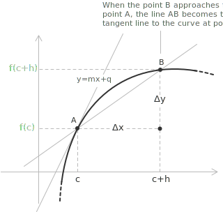

## Introduction

Consider a function $y = f(x)$ defined on an interval $[a,b]$. The derivative of $f$ at a point $c \in (a,b)$, denoted by $f'(c)$, is defined as the limit of the [difference quotient](../difference-quotient/) as $h \to 0$, provided that this limit exists and is finite:

$$f'(c) = \lim_{h \to 0} \frac{f(c+h) - f(c)}{h}$$

If this limit exists for every $x$ in an interval, then the derivative defines a new function $f'(x)$, called the derivative of $f$. The value $f'(x)$ is the slope of the tangent line to the graph of $f$ at the point $x$.

The geometric meaning of the derivative becomes clear by considering two points on the graph, $A(c, f(c))$ and $B(c+h, f(c+h))$. The difference quotient is the slope of the secant [line](../lines/) through $A$ and $B$. When $h \to 0$, the point $B$ approaches the point $A$, and the secant line through $A$ and $B$ tends to the tangent line to the curve at $A$. The slope of this tangent line is the derivative of the function at the point $c$.

Writing the tangent line at $A$ in the form $y = mx + q$, the derivative $f'(c)$ coincides with the value of the slope coefficient $m$.

- - -

A function is differentiable at a point $c$ if the derivative $f'(c)$ exists. If a function is differentiable at $c$, then:

+ The function is defined in a neighborhood of the point $c$.
+ The limit of the [difference quotient](../difference-quotient/) at $c$ exists and is finite as $h \to 0$.
+ The right-hand and left-hand limits of the difference quotient exist and are equal.

If a function $f(x)$ is differentiable at a point $c$, then it is also [continuous](../continuous-functions/) at that point. To prove this, write the increment of the function, for $h \neq 0$, as the product of the difference quotient and the increment of the variable:

$$f(c+h) - f(c) = \frac{f(c+h) - f(c)}{h} \cdot h$$

As $h \to 0$, the difference quotient tends to $f'(c)$, which exists by hypothesis, while the second factor tends to $0$. The product therefore tends to zero:

$$\lim_{h \to 0} \bigl( f(c+h) - f(c) \bigr) = f'(c) \cdot 0 = 0$$

This means $\lim_{h \to 0} f(c+h) = f(c)$, which is the definition of continuity at $c$. The converse does not hold, since a function continuous at $c$ need not be differentiable there, so the differentiable functions form a proper subset of the continuous ones. The points where continuity holds but differentiability fails are discussed in the entry on [points of non-differentiability](../points-of-non-differentiability/).

- - -

The inverse operation of differentiation is [integration](../indefinite-integrals/). The connection between derivatives and integrals is made precise by the [Fundamental Theorem of Calculus](../fundamental-theorem-of-calculus/), which states that differentiation and integration are inverse processes.

> Derivatives also appear in physics. A classic example is [velocity](../velocity/), which is the derivative of position with respect to time, and acceleration follows as the derivative of velocity.

## Example 1

Let us calculate the derivative of the function $f(x) = 2x^2-3x$ at $c = 2$ using the definition of the derivative:

$$f'(2) = \lim_{h \to 0} \frac{f(2+h) - f(2)}{h}$$

First, we calculate the value of $f(2+h)$ by expanding the square and collecting like terms:

$$
\begin{align}
f(2+h) &= 2(2+h)^2 - 3(2+h) \\[6pt]
       &= 2(4 + 4h + h^2)-3(2 + h) \\[6pt]
       &= 8 + 8h + 2h^2-6-3h \\[6pt]
       &= 2 + 5h + 2h^2
\end{align}
$$

Next, we calculate the value of $f(2)$:

$$f(2) = 2(2^2)-3(2) = 8-6 = 2$$

The difference $f(2+h)-f(2)$ is therefore:

$$f(2+h)-f(2) = (2 + 5h + 2h^2)-2 = 5h + 2h^2$$

Dividing by $h$, which is legitimate since $h \neq 0$, we obtain the difference quotient:

$$\frac{f(2+h)-f(2)}{h} = \frac{5h + 2h^2}{h} = 5 + 2h$$

Finally, we calculate the limit as $h$ approaches zero:

$$\lim_{h \to 0} (5 + 2h) = 5$$

We conclude that the derivative of $f(x) = 2x^2 - 3x$ at $c = 2$ is $f'(2) = 5$.

## Right-hand and left-hand derivatives

Since the derivative is the limit of the difference quotient, as in the case of limits, it is possible to define the right-hand and left-hand derivatives of a function $y=f(x)$.

The right-hand derivative is:

$$f_{+}'(c) = \lim_{h \to 0^+} \frac{f(c+h)-f(c)}{h}$$

The left-hand derivative is:

$$f_{-}'(c) = \lim_{h \to 0^-} \frac{f(c+h)-f(c)}{h}$$

A function is differentiable at a point $c$ if the right-hand derivative and the left-hand derivative at the point exist, are finite, and are equal to each other. More generally, a function $y = f(x)$ is differentiable on an interval $[a, b]$ if it is differentiable at all interior points of the interval and if the right-hand derivative at $a$ and the left-hand derivative at $b$ exist and are finite.

## Fundamental derivatives

Computing a derivative directly from the definition is often laborious. For this reason, the derivatives of the elementary functions are computed once and for all from the limit of the difference quotient, and are then used as basic building blocks. Combined with the differentiation rules presented in the next section, the following list allows the derivative of most functions encountered in practice to be computed without returning to the definition.

[class="table-1"]

|                                                |                                      |
| ---------------------------------------------- | ------------------------------------ |
| $f(x) = c$                                     | $f'(x) = 0$                          |
| $f(x) = x$                                     | $f'(x) = 1$                          |
| $f(x) = x^a$, with $a \in \mathbb{R}$, $x > 0$ | $f'(x) = ax^{a-1}$                   |
| $f(x) = \sqrt{x}$, with $x > 0$                | $f'(x) = \dfrac{1}{2\sqrt{x}}$       |
| $f(x) = a^x$                                   | $f'(x) = a^x \ln(a)$                 |
| $f(x) = \log_a(x)$                             | $f'(x) = \dfrac{1}{x\ln(a)}$         |
| $f(x) = \ln(x)$                                | $f'(x) = \dfrac{1}{x}$               |
| $f(x) = e^x$                                   | $f'(x) = e^x$                        |
| $f(x) = \sin(x)$                               | $f'(x) = \cos(x)$                    |
| $f(x) = \cos(x)$                               | $f'(x) = -\sin(x)$                   |
| $f(x) = \tan(x)$                               | $f'(x) = 1 + \tan^2(x)$              |
| $f(x) = \cot(x)$                               | $f'(x) = -(1 + \cot^2(x))$           |
| $f(x) = \arcsin(x)$                            | $f'(x) = \dfrac{1}{\sqrt{1 - x^2}}$  |
| $f(x) = \arccos(x)$                            | $f'(x) = \dfrac{-1}{\sqrt{1 - x^2}}$ |
| $f(x) = \arctan(x)$                            | $f'(x) = \dfrac{1}{1 + x^2}$         |
| $f(x) = \mathrm{arccot}(x)$                    | $f'(x) = \dfrac{-1}{1 + x^2}$        |
[/class]

> The first two formulas have an immediate geometric justification. The graph of the constant function $f(x) = c$ is a line parallel to the $x$-axis, so its slope is $0$ at every point. The graph of $f(x) = x$ is the bisector of the first and third quadrants, whose slope is $1$ at every point. The power rule $f(x) = x^a$, with derivative $f'(x) = ax^{a-1}$, contains as particular cases both $f(x) = x$, obtained for $a = 1$, and $f(x) = \sqrt{x}$, obtained for $a = \frac{1}{2}$.

## The power rule for real exponents

The table lists the derivative of $f(x) = x^a$ for an arbitrary real exponent $a$, a formula the geometric remarks above do not establish. For $x > 0$ the power has the equivalent form $x^a = e^{a\ln(x)}$, which writes it in terms of the exponential and the natural logarithm, two functions whose derivatives are already in the table. Applying the [chain rule](../chain-rule/) with outer function $e^t$ and inner function $a\ln(x)$, whose derivative is $a/x$, we obtain:

$$
\begin{align}
D[x^a] &= D\left[e^{a\ln(x)}\right] \\[6pt]
&= e^{a\ln(x)} \cdot \frac{a}{x} \\[6pt]
&= x^a \cdot \frac{a}{x} \\[6pt]
&= ax^{a-1}
\end{align}
$$

The argument requires $x > 0$, since the logarithm appears in the exponent. For a positive integer exponent $n$ the same result follows instead from the [product rule](../differentiation-rules/) applied to the product of $n$ equal factors, and in that case it holds for every real $x$.

## Differentiation rules

The derivative of the product of a constant $c$ and a differentiable function $f(x)$ is equal to the product of the constant and the derivative of the function:

$$D[c \cdot f(x)] = c \cdot f'(x)$$

For example, if $c = 3$ and $f(x) = x^2$, then:

$$D[3x^2] = 3 \cdot D[x^2] = 3 \cdot 2x = 6x$$

- - -

The derivative of the sum of two differentiable functions $f(x)$ and $g(x)$ is equal to the sum of their derivatives:

$$D[f(x) + g(x)] = f'(x) + g'(x)$$

For example, if $f(x) = x^2$ and $g(x) = 3x$, then:

$$D[x^2 + 3x] = D[x^2] + D[3x] = 2x + 3$$

- - -

The derivative of the product of two differentiable functions $f(x)$ and $g(x)$ is given by the product rule:

$$D[f(x) \cdot g(x)] = f'(x) \cdot g(x) + f(x) \cdot g'(x)$$

For example, if $f(x) = x^2$ and $g(x) = 3x$, then:

$$
\begin{align}
D[x^2 \cdot 3x] &= 2x \cdot 3x + x^2 \cdot 3 \\[6pt]
& = 6x^2 + 3x^2 \\[6pt]
& = 9x^2
\end{align}
$$

> The result agrees with the direct computation, since $x^2 \cdot 3x = 3x^3$ and $D[3x^3] = 9x^2$.

- - -

The derivative of the quotient of two differentiable functions $f(x)$ and $g(x)$, where $g(x) \neq 0$, is given by the quotient rule:

$$D\left[\frac{f(x)}{g(x)}\right] = \frac{f'(x) \cdot g(x)-f(x) \cdot g'(x)}{g^2(x)}$$

For example, if $f(x) = x^2$ and $g(x) = 3x + 1$, then:

$$
\begin{align}
D\left[\frac{x^2}{3x + 1}\right] &= \frac{2x \cdot (3x + 1)-x^2 \cdot 3}{(3x + 1)^2} \\[6pt]
&= \frac{6x^2 + 2x-3x^2}{(3x + 1)^2} \\[6pt]
&= \frac{3x^2 + 2x}{(3x + 1)^2}
\end{align}
$$

- - -

The derivative of the reciprocal of a differentiable function $f(x)$, where $f(x) \neq 0$, is a particular case of the quotient rule:

$$D\left[\frac{1}{f(x)}\right] = -\frac{f'(x)}{f^2(x)}$$

For example, if $f(x) = 3x + 1$, then:

$$D\left[\frac{1}{3x + 1}\right] = -\frac{3}{(3x + 1)^2}$$

- - -

When differentiating a composition of two functions, these rules are not sufficient. In that case, it is necessary to apply the [chain rule](../chain-rule/), which expresses the derivative of a composite function in terms of the derivatives of its components. A self-contained treatment of the rules introduced above, together with their proofs from the definition of the derivative, is given in the entry on [differentiation rules](../differentiation-rules/).

## Higher-order derivatives

The derivatives discussed so far are first derivatives of a function $y = f(x)$. Since the derivative $f'(x)$ is itself a function, the differentiation process can be iterated, producing the second derivative, the third derivative, and so on.

For example, let $f(x) = 3x^3 - 2x^2 + 1$. The first derivative of the function is:

$$f'(x) = 9x^2 - 4x$$

Differentiating again, the second derivative is:

$$f''(x) = 18x - 4$$

A further differentiation yields the third derivative:

$$f'''(x) = 18$$

First and second derivatives describe the local behavior of a function, in particular the location of [maximum, minimum, and inflection points](../maximum-minimum-and-inflection-points/). A systematic treatment of this topic, including notation, general formulas, and the second derivative test, is given in the entry on [higher-order derivatives](../higher-order-derivatives/).

## Theorems in differential calculus

Several important theorems in differential calculus rest on derivatives.

+ [Weierstrass's Theorem](../weierstrass-theorem/) guarantees that a continuous function on a closed and bounded interval attains both its maximum and minimum values.
+ [Fermat's Theorem](../fermat-theorem/) establishes a necessary condition for local extrema.
+ [Rolle's Theorem](../rolle-theorem/) and [Lagrange's Theorem](../lagrange-theorem/), also known as the Mean Value Theorem, describe properties of differentiable functions on a closed interval.
+ [Cauchy's Theorem](../cauchy-theorem/) generalizes these results, and [L'Hôpital's Rule](../hopital-rule/) extends the use of derivatives to the evaluation of [indeterminate forms](../indeterminate-forms/) of limits.
+ [Darboux's Theorem](../darboux-theorem/) shows that a derivative has the intermediate value property, even where it is not continuous.

## Equation of the tangent line

The slope of the tangent line to the graph of a function $f(x)$ at a point $x_0$ is given by the derivative $f'(x_0)$. This value is the instantaneous rate of change of the function at that point and coincides with the limit of the slopes of the secant lines approaching $x_0$.

More precisely, if we consider a second point $x_0 + h$, the slope of the secant line through the points $(x_0, f(x_0))$ and $(x_0 + h, f(x_0 + h))$ is:

$$\frac{f(x_0 + h) - f(x_0)}{h}$$

If the limit of this expression exists as $h \to 0$, the function is differentiable at $x_0$, and this limit equals $f'(x_0)$. The tangent line is therefore understood as the limiting position of the secant lines.

If the derivative exists and is finite, the tangent line is not vertical. In that case, its equation can be written in point-slope form. Since the line passes through the point $(x_0, f(x_0))$ and has slope $f'(x_0)$, its equation is:

$$y - f(x_0) = f'(x_0)(x - x_0)$$

This linear function is the best linear approximation of $f$ near $x_0$. In fact, for values of $x$ close to $x_0$, the increment of the function satisfies:

$$f(x) \approx f(x_0) + f'(x_0)(x - x_0)$$

This approximation expresses the idea that, at sufficiently small scales, a differentiable function behaves approximately like its tangent line, a concept made precise in the entry on the [differential of a function](../differential-of-a-function/).

## Example 2

Let us consider the [parabola](../parabola/) defined by the equation $y = 2x^2 + 3x$, and determine the tangent line at the point $P(1, 5)$.

First, we compute the derivative of the function:

$$f'(x) = 4x + 3$$

Evaluating the derivative at $x = 1$, we obtain the slope of the tangent line:

$$f'(1) = 4(1) + 3 = 7$$

Therefore, the slope of the tangent line is $m = 7$. Substituting into the point-slope form of the line, we have:

$$y - f(1) = f'(1)(x - 1) \implies y - 5 = 7(x - 1)$$

Completing the calculations, we obtain the equation of the tangent line:

$$y = 7x - 2$$

## Example 3

The tangent line is horizontal exactly at the points where the derivative vanishes. As an application, let us find the points on the graph of the following function where the tangent line is horizontal:

$$f(x) = \frac{6x}{x^2 + 9}$$

Applying the quotient rule, the derivative is:

$$
\begin{align}
f'(x) &= \frac{6(x^2 + 9) - 6x \cdot 2x}{(x^2 + 9)^2} \\[6pt]
&= \frac{54 - 6x^2}{(x^2 + 9)^2}
\end{align}
$$

Since the denominator is strictly positive for every $x \in \mathbb{R}$, the derivative vanishes exactly when the numerator vanishes:

$$54 - 6x^2 = 0 \implies x^2 = 9 \implies x = \pm 3$$

Evaluating the function at these points, we find $f(3) = \frac{18}{18} = 1$ and $f(-3) = \frac{-18}{18} = -1$. We conclude that the tangent line to the graph of $f$ is horizontal at the points $(3, 1)$ and $(-3, -1)$.

## Partial derivatives

Derivatives extend to multivariable calculus. When a function depends on several variables, the rate of change with respect to a single variable, holding the others constant, is the partial derivative:

$$\frac{\partial f}{\partial x_i}(x_0) = \lim_{h \to 0} \frac{f(x_1^0, \ldots, x_i^0 + h, \ldots, x_n^0) - f(x_0)}{h}$$

The [vector](../vectors/) of all partial derivatives forms the gradient $\nabla f$, which indicates the direction of the steepest increase of $f$. For a comprehensive discussion, including higher-order derivatives, Schwarz's theorem, the Jacobian matrix, and the chain rule for functions of several variables, refer to the entry on [partial derivatives](../partial-derivatives/).
