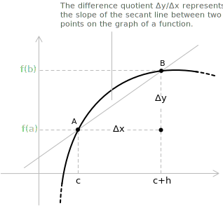

## What is the difference quotient

Consider a function $y = f(x)$ defined on the interval $[a, b]$, and two real numbers $c$ and $c + h$ with $h \neq 0$, both lying within the interval $[a, b]$. The difference quotient of $f$ at the point $c$ is defined as the ratio:

$$\frac{\Delta y}{\Delta x} = \frac{f(c+h)-f(c)}{h}$$

The geometric meaning of this ratio emerges by considering the two points on the graph of the function:

+ $A(c, f(c))$
+ $B(c+h, f(c+h))$

The difference quotient of $f$ at the point $c$ is the slope of the secant line passing through $A$ and $B$.

> The condition $h \neq 0$ is necessary. For $h = 0$ the points $A$ and $B$ coincide, the secant line is not defined, and the ratio reduces to the meaningless expression $\frac{0}{0}$.

The difference quotient is fundamental to the definition of the [derivative](../derivatives/). The derivative of a function at a point is the [limit](../limits/) of the difference quotient as $h$ approaches zero:

$$f'(c) = \lim_{h \to 0} \frac{f(c+h)-f(c)}{h}$$

This process, known as the limit of the difference quotient, provides the instantaneous rate of change of the function at that point, or equivalently, the slope of the tangent line to the graph of the function.

- - -

In general, the difference quotient measures how a function changes over a finite displacement. As the interval shrinks, it transitions from a global measure of variation to a local one.

+ The difference quotient provides an approximation of the rate of change. It is calculated over a finite interval $[x, x + \Delta x]$ and represents the average rate of change.
+ The derivative provides the exact rate of change. It is calculated by taking the limit as $\Delta x \to 0$ and represents the instantaneous rate of change.

The difference quotient and the [derivative](../derivatives/) measure the same geometric quantity at different scales.

+ The difference quotient measures the slope of a secant line over a finite interval.
+ The derivative measures the slope of the tangent line at a point.

## The difference quotient as average velocity

The physical counterpart of the difference quotient is the notion of average [velocity](../velocity/). If $s(t)$ denotes the position of a moving object at time $t$, the difference quotient of $s$ over the time interval $[t, t+h]$ is the displacement divided by the elapsed time:

$$\frac{s(t+h) - s(t)}{h}$$

This ratio is the average velocity of the object over the interval. Taking the limit as $h \to 0$ yields the instantaneous velocity, which is the derivative of position with respect to time.

For example, suppose an object moves along a straight line according to the law $s(t) = 5t^2$, where $s$ is measured in meters and $t$ in seconds. The average velocity over the interval $[2, 2+h]$ is:

$$
\begin{align}
\frac{s(2+h)-s(2)}{h}
&= \frac{5(2+h)^2-20}{h} \\[6pt]
&= \frac{20h+5h^2}{h} \\[14pt]
&= 20+5h
\end{align}
$$

Over the interval $[2, 3]$, corresponding to $h = 1$, the average velocity is $25$ meters per second, while over $[2, 2.1]$, corresponding to $h = 0.1$, it drops to $20.5$ meters per second. As $h \to 0$, the average velocity approaches $20$ meters per second, which is the instantaneous velocity of the object at $t = 2$.

## Difference quotient and monotonicity

The sign of the difference quotient characterizes the [monotonicity](../increasing-and-decreasing-functions/) of a function over an interval. Given a function $f$ defined on an interval $I$, the function is increasing on $I$ if and only if, for every pair of distinct points $x_1, x_2 \in I$, the difference quotient is non-negative:

$$\frac{f(x_2) - f(x_1)}{x_2 - x_1} \geq 0$$

The function is strictly increasing if and only if the inequality is strict, and the corresponding characterizations for decreasing functions are obtained by reversing the inequality. This criterion is global, as it involves all pairs of points of the interval rather than a single point, and it requires neither continuity nor differentiability.

As an example, consider $f(x) = x^3$ on $\mathbb{R}$. For $x_1 \neq x_2$, factoring the difference of cubes gives:

$$\frac{x_2^3 - x_1^3}{x_2 - x_1} = x_1^2 + x_1 x_2 + x_2^2 = \left( x_1 + \frac{x_2}{2} \right)^2 + \frac{3}{4}x_2^2$$

The last expression is a sum of squares, and it vanishes only when $x_1 = x_2 = 0$, which is excluded since the two points are distinct. The difference quotient is therefore strictly positive for every pair of points, and the function is strictly increasing on all of $\mathbb{R}$, even though its derivative vanishes at the origin.

> The bridge between this global criterion and the local information carried by the derivative is provided by [Lagrange's Theorem](../lagrange-theorem/), which states that every difference quotient of a differentiable function equals the value of the derivative at some interior point of the interval.

## Alternative forms

The difference quotient appears in the literature in several equivalent forms:

$$\frac{f(c+h) - f(c)}{h}$$

$$\frac{f(x_1) - f(x_0)}{x_1 - x_0}$$

$$\frac{f(x + \Delta x) - f(x)}{\Delta x}$$

> The expressions above represent the same quantity and differ only in how the two points are labeled, depending on the notation in use. In the second form, the increment is $h = x_1 - x_0$, while in the third form it is denoted by $\Delta x$.

## Example 1

Let us calculate the difference quotient of the function $y = f(x) = 3x^2-x$ at the point $c = 1$ for a generic $h$.

First, we determine $f(c+h) = f(1+h)$ by expanding the square and collecting like terms:

$$
\begin{align}
f(1+h) &= 3(1+h)^2-(1+h) \\[6pt]
       &= 3(1 + 2h + h^2)-1-h \\[6pt]
       &= 3 + 6h + 3h^2-1-h \\[6pt]
       &= 3h^2 + 5h + 2
\end{align}
$$

Next, we determine $f(c) = f(1)$:

$$f(1) = 3(1)^2 - 1 = 3 - 1 = 2$$

We can now calculate the difference quotient. Since $h \neq 0$, the factor $h$ can be simplified:

$$
\begin{align}
\frac{f(1+h)-f(1)}{h} &= \frac{(3h^2 + 5h + 2)-2}{h} \\[6pt]
   					  &= \frac{3h^2 + 5h}{h} \\[6pt]
 					  &= 3h + 5
\end{align}
$$

The expression $3h + 5$ represents, as $h$ varies, the slope of a secant line passing through the point $A$ on the graph with abscissa $1$.

## Example 2

Let us consider a function that is not polynomial, $f(x) = \sqrt{x}$, and calculate its difference quotient at the point $c = 4$. The procedure is the same as before, but the simplification of the difference quotient requires an additional step.

We determine $f(4+h)$:

$$f(4+h) = \sqrt{4+h}$$

We determine $f(4)$:

$$f(4) = \sqrt{4} = 2$$

The difference quotient takes the form:

$$\frac{f(4+h) - f(4)}{h} = \frac{\sqrt{4+h} - 2}{h}$$

As it stands, this expression cannot be simplified directly, since numerator and denominator share no obvious common factor. The standard approach is to rationalize the numerator by multiplying both numerator and denominator by the conjugate expression $\sqrt{4+h} + 2$:

$$
\begin{align}
\frac{\sqrt{4+h} - 2}{h} \cdot \frac{\sqrt{4+h} + 2}{\sqrt{4+h} + 2}
&= \frac{(4+h) - 4}{h\left(\sqrt{4+h} + 2\right)} \\[6pt]
&= \frac{h}{h\left(\sqrt{4+h} + 2\right)} \\[6pt]
&= \frac{1}{\sqrt{4+h} + 2}
\end{align}
$$

The factor $h$ cancels and the result is well-defined for every $h \neq 0$. The expression:

$$\dfrac{1}{\sqrt{4+h}+2}$$

represents the slope of the secant line through $A = (4, 2)$ and $B = (4+h, \sqrt{4+h})$ as $h$ varies. As $h \to 0$, this slope approaches $1/4$, which is precisely the derivative of $\sqrt{x}$ at $x = 4$.

## The symmetric difference quotient

A useful variant of the difference quotient is obtained by placing the two points symmetrically around $x$ instead of anchoring one of them at $x$. The symmetric difference quotient of $f$ at $x$ is defined as:

$$\frac{f(x+h) - f(x-h)}{2h}$$

Geometrically, it is the slope of the secant line through the points $(x-h, f(x-h))$ and $(x+h, f(x+h))$, whose abscissas straddle $x$ at equal distance.

If $f$ is differentiable at $x$, the limit of the symmetric difference quotient as $h \to 0$ exists and equals $f'(x)$. The converse is false, since the symmetric limit can exist at points where the function is not differentiable. Consider $f(x) = |x|$ at $x = 0$. For every $h \neq 0$ we have:

$$\frac{|0+h| - |0-h|}{2h} = \frac{|h| - |h|}{2h} = 0$$

The symmetric difference quotient is identically zero, so its limit as $h \to 0$ exists and equals $0$. The ordinary difference quotient, however, equals $1$ for $h > 0$ and $-1$ for $h < 0$, so the function has a corner at the origin and is not differentiable there, as discussed in the entry on [points of non-differentiability](../points-of-non-differentiability/).

> The symmetry causes the contributions of the two sides to compensate each other, which is why the symmetric limit cannot be taken as a definition of the derivative.

## Numerical approximation of the derivative

When the derivative of a function cannot be computed exactly, or when the function is known only through sampled values, the difference quotient with a small increment $h$ provides a numerical approximation of $f'(x)$. For functions with sufficient regularity, the error of the ordinary difference quotient is proportional to $h$, while the error of the symmetric difference quotient is proportional to $h^2$. Halving the increment therefore halves the error in the first case and reduces it by a factor of four in the second.

The difference in accuracy is visible in a simple test. Consider $f(x) = e^x$ at $x = 0$, where the exact derivative is $f'(0) = 1$. With $h = 0.1$, the two approximations give:

$$
\begin{align}
\frac{e^{0.1} - 1}{0.1} &\approx 1.05171 \\[6pt]
\frac{e^{0.1} - e^{-0.1}}{0.2} &\approx 1.00167
\end{align}
$$

With $h = 0.01$, the ordinary difference quotient gives approximately $1.00502$, with an error of about $5 \cdot 10^{-3}$, while the symmetric difference quotient gives approximately $1.0000167$, with an error of about $1.7 \cdot 10^{-5}$. The symmetric formula is the basis of the central difference schemes commonly used in numerical differentiation.

> The increment $h$ cannot be taken arbitrarily small in floating-point arithmetic, because the subtraction of nearly equal values in the numerator amplifies rounding errors. In practice, an intermediate value of $h$ balances the truncation error against the rounding error.
