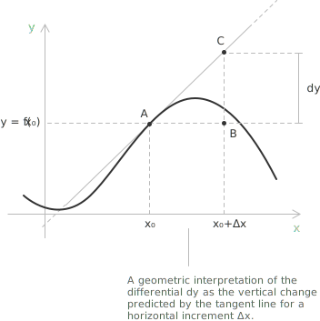

## Definition

Consider a [differentiable](../derivatives/) function $f(x)$ on the interval $[a,b]$. Since the function is differentiable, it is also [continuous](../continuous-functions/) on the given [interval](../intervals/). Let us consider two points $x$ and $x + \Delta x \in [a,b]$, separated by the same increment that appears in the [difference quotient](../difference-quotient/).

The differential of the function $f(x)$, relative to the point $x$ and the increment $\Delta x$, is defined as the product of the derivative of the function evaluated at $x$ and the increment $\Delta x$:

$$\mathrm{d}y = f'(x) \cdot \Delta x$$

The differential of the independent variable $x$ is equal to the increment of the variable itself, that is, $\mathrm{d}x = \Delta x$. By substituting this value into the definition, we obtain:

$$\mathrm{d}y = f'(x) \cdot \mathrm{d}x$$

From this formula, it follows that the first derivative of a function is the ratio between the differential of the function and that of the independent variable:

$$f'(x) = \frac{\mathrm{d}y}{\mathrm{d}x}$$

> This relation justifies the Leibniz notation $\mathrm{d}y/\mathrm{d}x$ for the derivative, which in this context acquires the precise meaning of a quotient of differentials.

## Geometric interpretation

The geometric meaning of the differential emerges by considering the tangent line to the graph of $f$ at the point $A(x, f(x))$. Let $B(x + \Delta x, f(x))$ be the point obtained by moving horizontally from $A$ by the increment $\Delta x$, and let $C$ be the point on the tangent line with abscissa $x + \Delta x$. The three points form a right triangle $ABC$, whose legs are the horizontal segment $\overline{AB}$ and the vertical segment $\overline{BC}$.

Denoting by $\alpha$ the angle that the tangent line forms with the horizontal direction, the properties of [right triangle trigonometry](../right-triangle-trigonometry/) give:

$$\overline{BC} = \overline{AB} \cdot \tan(\alpha) \tag{1}$$

In this triangle $\overline{AB} = \Delta x$, and the slope of the tangent line satisfies $\tan(\alpha) = f'(x)$. The equality $(1)$ can therefore be rewritten as:

$$
\begin{align}
\overline{BC} &= \overline{AB} \cdot \tan(\alpha) \\[6pt]
&= \Delta x \cdot f'(x) \\[6pt]
&= \mathrm{d}y
\end{align}
$$

In other words, the differential $\mathrm{d}y$ is the change in the ordinate of the tangent line to the curve when moving from the point with abscissa $x$ to the point with abscissa $x + \Delta x$. The differential thus measures the increment predicted by the linear approximation of the function, while the true increment of the function is $\Delta y = f(x + \Delta x) - f(x)$. The relation between the two quantities can be written as:

$$\Delta y = \mathrm{d}y + o(\Delta x) \tag{2}$$

The remainder is a [little-o](../little-o-notation/) term, so the difference $\Delta y - \mathrm{d}y$ tends to zero faster than $\Delta x$ as $\Delta x \to 0$. This is the precise sense in which the differential provides the best linear approximation of the function near the point.

## The differential and the actual increment

The distinction between the differential and the true increment can be made concrete by examining the function $f(x) = x^2$. Its derivative is $f'(x) = 2x$, so the differential relative to the point $x$ and the increment $\Delta x$ is given by:

$$\mathrm{d}y = f'(x) \cdot \Delta x = 2x \cdot \Delta x$$

The actual increment of the function over the same interval is the difference between the values of $f$ at the two endpoints. Expanding the square, we obtain:

$$
\begin{align}
\Delta y &= f(x + \Delta x) - f(x) \\[6pt]
&= (x + \Delta x)^2 - x^2 \\[6pt]
&= 2x \cdot \Delta x + (\Delta x)^2
\end{align}
$$

Comparing the two expressions, the actual increment exceeds the differential by the quantity $(\Delta x)^2$, which is exactly the little-o remainder anticipated by formula $(2)$. As a numerical illustration, take $x = 3$ and $\Delta x = 0.1$. The differential gives $\mathrm{d}y = 2 \cdot 3 \cdot 0.1 = 0.6$, while the actual increment is $\Delta y = 2 \cdot 3 \cdot 0.1 + (0.1)^2 = 0.61$. The two values differ by $0.01$, that is, by the square of the increment, and this discrepancy shrinks rapidly as $\Delta x$ is reduced.

## Application to approximate calculations

The fact that $\Delta y$ and $\mathrm{d}y$ differ by a negligible quantity for small increments leads to a practical method for estimating the value of a function near a point where it is easily computed. Starting from $\Delta y = f(x + \Delta x) - f(x)$ and replacing the actual increment with the differential, we obtain the approximation:

$$f(x + \Delta x) \approx f(x) + f'(x) \cdot \Delta x$$

The procedure is effective when the base point $x$ is chosen so that both $f(x)$ and $f'(x)$ are simple to evaluate, and the increment $\Delta x$ is small. As an example, consider the estimate of $\sqrt{4.05}$ obtained from the function $f(x) = \sqrt{x}$, whose derivative is:

$$f'(x) = \frac{1}{2\sqrt{x}}$$

Choosing the base point $x = 4$, for which the square root is known exactly, and the increment $\Delta x = 0.05$, the derivative at the base point equals:

$$f'(4) = \frac{1}{2 \cdot 2} = \frac{1}{4}$$

Substituting these values into the approximation, we find:

$$
\begin{align}
\sqrt{4.05} &\approx f(4) + f'(4) \cdot 0.05 \\[6pt]
&= 2 + \frac{1}{4} \cdot 0.05 \\[6pt]
&= 2.0125
\end{align}
$$

The value returned by a direct computation is $\sqrt{4.05} = 2.012461\ldots$, so the estimate produced by the differential is accurate to four decimal places. The small error reflects the [little-o](../little-o-notation/) remainder discarded when the actual increment was replaced by the differential.
