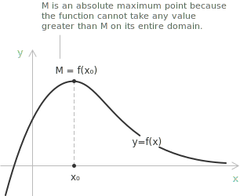
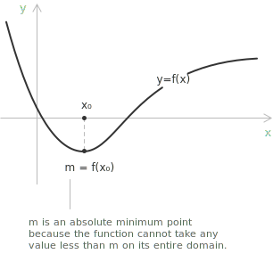
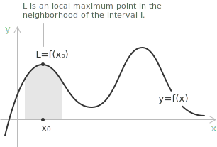
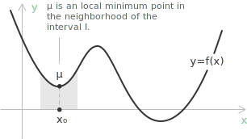
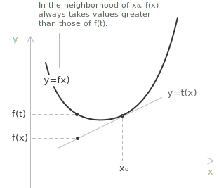
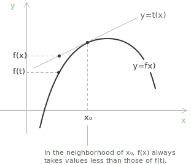
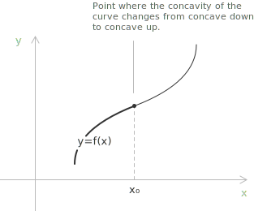
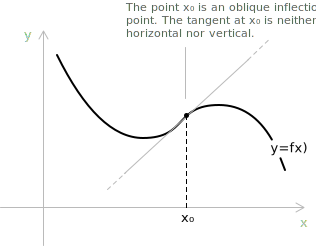

## Global maximum and minimum points

The maximum and minimum of a function $f(x)$ are, respectively, the highest and lowest values the function attains within its [domain](../determining-the-domain-of-a-function/). They are the extreme values of the [function](../functions/) over the whole domain.

Given a function $y = f(x)$ with domain $D$, a point $x_0 \in D$ is a global maximum point if $f(x_0) \geq f(x)$ for every $x \in D$. The value $f(x_0) = M$ is the global maximum of the function.

Given a function $y = f(x)$ with domain $D$, a point $x_0 \in D$ is a global minimum point if $f(x_0) \leq f(x)$ for every $x \in D$. The value $f(x_0) = m$ is the global minimum of the function.

If the global maximum and global minimum values of a function exist, they are unique, although each of them may be attained at more than one point of the domain. By [Weierstrass's Theorem](../weierstrass-theorem/), if a function is [continuous](../continuous-functions/) on a closed and bounded interval $[a, b]$, then it attains both a global maximum and a global minimum on that interval.

Outside the hypotheses of the theorem, a function may fail to attain a maximum or a minimum, as happens for instance on open intervals or for unbounded functions. In these cases the set of values of the function still has a least upper bound and a greatest lower bound, possibly infinite, which are studied in the entry on [supremum and infimum](../supremum-and-infimum/).

## Local maximum and minimum points

In some cases, a function can display more than one peak or valley within a particular interval. Such points are known as local maxima and local minima. They correspond to positions where the function reaches a relatively highest or lowest value compared to its immediate surroundings, without necessarily being the absolute extremes over the entire domain.

Given a function $y = f(x)$ defined on an interval $[a, b]$, the point $x_0 \in [a, b]$ is a local maximum point if there exists a neighbourhood $I$ of the point $x_0$ such that $f(x_0) \geq f(x)$ for every $x$ in the [interval](../intervals/) $I$.

A sufficient criterion for recognising a local maximum point is based on the sign of the first derivative. Consider a function $y = f(x)$ that is defined and continuous in a neighbourhood of the point $x_0$, and differentiable in the same neighbourhood for every $x \neq x_0$. Suppose that for every $x$ in the neighbourhood the derivative satisfies:

$$
\begin{align}
f'(x) &> 0 \quad \text{for} \quad x < x_0 \\[6pt]
f'(x) &< 0 \quad \text{for} \quad x > x_0
\end{align}
$$

Under these conditions, $x_0$ is a point of local maximum for the function $f(x)$. The behavior is summarized by the following sign chart:

[class="table-sign"]

|           |               | $x_0$         |
| :-------: | :-----------: | :-----------: |
| $f'(x)$   | $+$           | $-$           |
| $f(x)$    | $\nearrow$    | $\searrow$    |
[/class]

- - -

Given a function $y = f(x)$ defined on an interval $[a, b]$, the point $x_0 \in [a, b]$ is a local minimum point if there exists a neighborhood $I$ of the point $x_0$ such that $f(x_0) \leq f(x)$ for every $x$ in the interval $I$.

Under the same hypotheses of continuity and differentiability, suppose that for every $x$ in the neighborhood the derivative satisfies:

$$
\begin{align}
f'(x) &< 0 \quad \text{for} \quad x < x_0 \\[6pt]
f'(x) &> 0 \quad \text{for} \quad x > x_0
\end{align}
$$

In this case, $x_0$ is a point of local minimum for the function $f(x)$. The corresponding sign chart is:

[class="table-sign"]

|           |               | $x_0$         |
| :-------: | :-----------: | :-----------: |
| $f'(x)$   | $-$           | $+$           |
| $f(x)$    | $\searrow$    | $\nearrow$    |
[/class]

- - -

A function can have multiple local maxima and local minima within its domain. By [Fermat's theorem](../fermat-theorem/), the local maximum and minimum points of a differentiable function, located within the interior of the domain, are stationary points. This implies that the tangent line at a point of a local maximum or minimum is parallel to the x-axis. In this case, the [derivative](../derivatives/) of the function at $x_0$ is zero, and we have $f'(x_0) = 0$.

## Proof of the first-derivative criterion

The sign criterion stated above follows from [Lagrange's Theorem](../lagrange-theorem/), applied separately on each side of $x_0$. Consider the case of a local maximum, with $f$ continuous in a neighbourhood of $x_0$ and differentiable there for every $x \neq x_0$, and suppose $f'(x) > 0$ for $x < x_0$ and $f'(x) < 0$ for $x > x_0$.

Take a point $x < x_0$ in the neighbourhood. On the interval $[x, x_0]$ the function is continuous, and it is differentiable in the interior, so Lagrange's Theorem gives a point $\xi \in (x, x_0)$ such that:

$$f(x_0) - f(x) = f'(\xi)(x_0 - x)$$

The point $\xi$ lies to the left of $x_0$, so $f'(\xi) > 0$, and the factor $x_0 - x$ is positive. The right-hand side is positive, which gives $f(x) < f(x_0)$.

Take now a point $x > x_0$ in the neighbourhood. On the interval $[x_0, x]$ the same theorem gives a point $\xi \in (x_0, x)$ such that:

$$f(x) - f(x_0) = f'(\xi)(x - x_0)$$

This time $\xi$ lies to the right of $x_0$, so $f'(\xi) < 0$, while $x - x_0$ is positive. The right-hand side is negative, and again $f(x) < f(x_0)$.

For every $x \neq x_0$ in the neighbourhood we have found $f(x) < f(x_0)$, which is the condition for $x_0$ to be a local maximum. The criterion for a local minimum is obtained by applying the same argument to $-f$, which reverses the inequalities on the sign of the derivative.

> Continuity of $f$ at $x_0$ is what allows Lagrange's Theorem to be applied on intervals having $x_0$ as an endpoint, without assuming that the derivative exists at $x_0$ itself. For this reason the criterion recognises corners and cusps as extrema, and not only stationary points where $f'(x_0) = 0$.

## Upward and downward concavity

Let $f(x)$ be a function differentiable at $x_0$, so that the tangent line to its graph at $x_0$ is defined. We say that the function $f(x)$ is concave upward at $x_0$ if there exists a neighborhood $I$ of $x_0$ such that, for every $x \in I$ with $x \neq x_0$, the function $f(x)$ takes values greater than those of the line $y = t(x)$, which is the tangent line to the graph of $f(x)$ at $x_0$:

$$f(x) > t(x) \quad \forall x \in I - \{\ x_0 \ \}$$

Similarly, we say that the function $f(x)$ is concave downward at $x_0$ if there exists a neighborhood $I$ of $x_0$ such that, for every $x \in I$ with $x \neq x_0$, the function $f(x)$ takes values less than those of the line $y = t(x)$:

$$f(x) < t(x) \quad \forall x \in I - \{\ x_0 \ \}$$

The concepts of concavity and convexity are discussed in detail and in their analytical formulation in the entry on [convexity and concavity of functions](../convexity-and-concavity-of-functions/).

## Inflection points and change in concavity

An inflection point is a point where the concavity of a function changes.

Let us consider the case where a function $y = f(x)$ is defined on an interval $(a, b)$, and let $x_0 \in (a, b)$ be either a point where $f(x)$ is differentiable, or a point where:

$$\lim_{x \to x_0} f'(x) = +\infty \quad \text{or} \quad \lim_{x \to x_0} f'(x) = -\infty$$

The point $x_0$ is an inflection point if the function changes concavity at $x_0$.

An inflection point is called horizontal if the tangent at the inflection point is parallel to the x-axis. When the tangent is parallel to the y-axis, the inflection point is called vertical. In all other cases it is called oblique.

The point $x_0$ is a horizontal inflection point for a function $f(x)$ if $f'(x_0) = 0$ and there exists a neighborhood of $x_0$ in which the sign of $f'(x)$ is the same for every $x \neq x_0$:

[class="table-sign"]

|           |               | $x_0$         |
| :-------: | :-----------: | :-----------: |
| $f'(x)$   | $+$           | $+$           |
| $f(x)$    | $\nearrow$    | $\nearrow$    |
[/class]

> The signs in the neighborhood of $x_0$ can be both positive (as in the scheme above) or both negative.

## How to calculate the points of local maximum and minimum

Given a continuous function, to find the local maximum and minimum points, we analyze the sign of the first derivative. The procedure involves the following steps:

+ Compute the derivative $f'(x)$ and determine its domain to identify points where the function is not differentiable, such as cusps and corners, which are discussed in the entry on [points of non-differentiability](../points-of-non-differentiability/).
+ Study the sign of the derivative by analyzing where $f'(x)$ is positive, negative, or zero.
+ Identify local maxima and minima. A point $x_0$ is a local maximum point if $f'(x)$ changes from positive to negative around $x_0$, while it is a local minimum point if $f'(x)$ changes from negative to positive around $x_0$.

The criterion based on the sign change of $f'$ applies to interior points of the domain. If the function is defined on a closed interval, the endpoints must be examined separately, since only one-sided behavior of the derivative is available there.

When the function is twice differentiable, the sign of the second derivative classifies a stationary point, without studying the sign of $f'$ on each side of it. If $f'(x_0) = 0$ and $f''(x_0) \neq 0$, then $x_0$ is a local maximum when $f''(x_0) < 0$ and a local minimum when $f''(x_0) > 0$, according to whether the graph is concave downward or concave upward at $x_0$. This criterion is known as the second derivative test.

When $f''(x_0) = 0$ the test is inconclusive, and the nature of $x_0$ follows from the sign of $f'$ or from the higher-order derivatives treated in the entry on [higher-order derivatives](../higher-order-derivatives/).

## Example 1

Let us calculate the local maximum and minimum points of the following function:

$$y = f(x) = x^3 - \frac{1}{2}x^2$$

Being a [polynomial function](../polynomial-function/), it is continuous and differentiable for all $x \in \mathbb{R}$. Therefore, it does not have any points of discontinuity within its domain. The first derivative of the function is:

$$f'(x) = 3x^2 - x$$

Now, we study the sign of the derivative by imposing:

$$3x^2 - x > 0$$

Passing to the associated equation and factoring out $x$, we obtain:

$$3x^2 - x = 0 \implies x(3x -1) = 0$$

The equation is satisfied for $x = 0$ and $x = \dfrac{1}{3}$. Returning to the inequality, since the parabola associated with $3x^2 - x$ opens upward, we obtain that $f'(x) > 0$ for $x < 0$ and for $x > \dfrac{1}{3}$.

The sign chart shows that the function is increasing for $x < 0$, decreasing for $0 < x < \dfrac{1}{3}$, and increasing again for $x > \dfrac{1}{3}$:

[class="table-sign"]

|           |               | $0$           |               | $\dfrac{1}{3}$ |               |
| :-------: | :-----------: | :-----------: | :-----------: | :-----------: | :-----------: |
| $f'(x)$   | $+$           |               | $-$           |               | $+$           |
| $f(x)$    | $\nearrow$    |               | $\searrow$    |               | $\nearrow$    |
[/class]

For $x = 0$ the function takes the value $f(0) = 0^3 - \dfrac{1}{2} \cdot 0^2 = 0$. The point $(0,0)$ is therefore a local maximum. For $x = \dfrac{1}{3}$, the function takes the value:

$$
\begin{align}
f\left( \dfrac{1}{3} \right) &= \left( \dfrac{1}{3} \right)^3 - \dfrac{1}{2} \left( \dfrac{1}{3} \right)^2 \\[6pt]
&= \dfrac{1}{27} - \dfrac{1}{18} \\[6pt]
&= -\dfrac{1}{54}
\end{align}
$$

The point $\left( \dfrac{1}{3}, -\dfrac{1}{54} \right)$ is therefore a local minimum. In this way, we have found the local maximum and minimum points of the function $f(x)$.

## How to determine the concavity of a function

Let $y = f(x)$ be a function that is continuous and twice differentiable in a neighborhood of the point $x_0$.

If at $x_0$ we have $f''(x_0) \neq 0$, then:

+ The function is concave upward if $f''(x_0) > 0$.
+ The function is concave downward if $f''(x_0) < 0$.

- - -

Let us consider the function from Example 1 and determine its [convexity and concavity](../convexity-and-concavity-of-functions/):

$$y = f(x) = x^3 - \frac{1}{2}x^2$$

The second derivative of the function is:

$$f''(x) = 6x - 1$$

We study the sign by imposing:

$$6x - 1 > 0 \implies x > \frac{1}{6}$$

The sign chart gives the intervals in which the function is concave upward or concave downward:

[class="table-sign"]

|           |           |   $1/6$   |
| :-------: | :-------: | :-------: |
| $f''(x)$  |    $-$    |    $+$    |
|  $f(x)$   | $\bigcap$ | $\bigcup$ |
| Concavity | Downward  |  Upward   |
[/class]

- - - 

The function is therefore concave downward for $x < 1/6$ and concave upward for $x > 1/6$. Since the second derivative changes sign at $x = 1/6$, the function has an inflection point there. The corresponding ordinate is:

$$f\left( \dfrac{1}{6} \right) = \dfrac{1}{216} - \dfrac{1}{2} \cdot \dfrac{1}{36} = \dfrac{1}{216} - \dfrac{3}{216} = -\dfrac{1}{108}$$

Since $f'\left( \dfrac{1}{6} \right) = \dfrac{3}{36} - \dfrac{1}{6} = -\dfrac{1}{12} \neq 0$, the tangent line at the inflection point is neither horizontal nor vertical, and the point $\left( \dfrac{1}{6}, -\dfrac{1}{108} \right)$ is an oblique inflection point.

## Identifying inflection points

An inflection point occurs when the concavity of a function changes sign. This change indicates a transition from a concave upward shape to a concave downward shape, or vice versa. To determine if a point is truly an inflection point, we need to verify if the second derivative $f''(x)$ changes sign as we pass through that point.

+ A point $x_0$ is a horizontal inflection point if $f'(x_0) = 0$ and $f''(x_0) = 0$, and the concavity changes sign in the neighborhood of $x_0$. In this case, the tangent line at $x_0$ is horizontal.
+ A point $x_0$ is a vertical inflection point if the limit of $f'(x)$ as $x \to x_0$ is $+\infty$ or $-\infty$ with the same sign on both sides, and the concavity changes sign around $x_0$. In this case, the function is continuous but not differentiable at $x_0$, and the tangent line is vertical, as discussed in the entry on [points of non-differentiability](../points-of-non-differentiability/).
+ A point $x_0$ is an oblique inflection point if $f'(x_0) \neq 0$ and $f''(x_0) = 0$, and the concavity changes sign around $x_0$. In this case, the tangent line is neither horizontal nor vertical but has a non-zero slope.
