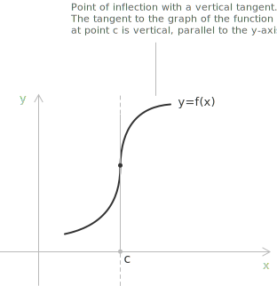
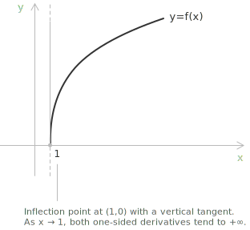
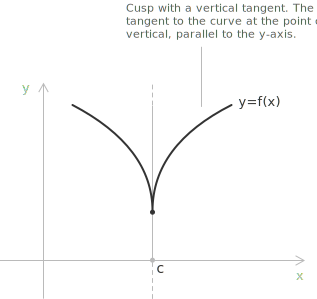
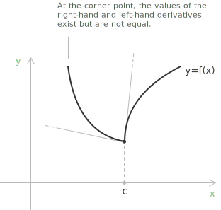
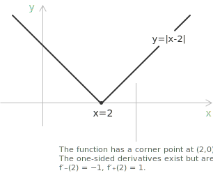

## What are non-differentiable points

In the entry on [derivatives](../derivatives/), we saw that if a function $f(x)$ is differentiable at a point $c$, then the function is [continuous](../continuous-functions/) at that point. However, there are cases where a function is continuous at $c$ but not differentiable. For a function continuous at $c$, non-differentiability occurs when:

+ The right-hand and left-hand [limits](../limits/) of the [difference quotient](../difference-quotient/) exist and are finite but are not equal, that is, $f_{-}'(c) \neq f_{+}'(c)$.
+ At least one of the two one-sided limits of the difference quotient is infinite.
+ At least one of the two one-sided limits of the difference quotient does not exist, neither as a finite value nor as an infinite one.

The first two situations give rise to the three classical types of non-differentiable points, which we discuss below. The third situation, in which the difference quotient oscillates without approaching any value, is examined in a separate section.

## Inflection points with vertical tangent

An [inflection point](../maximum-minimum-and-inflection-points/) is a point where the concavity of a function changes. When at such a point the one-sided limits of the difference quotient are both infinite with the same sign, the tangent line to the graph is parallel to the $y$-axis, and we obtain an inflection point with vertical tangent. If the function is increasing through the point, both one-sided derivatives equal $+\infty$:

$$f_{-}'(c) = f_{+}'(c) = +\infty$$

If the function is decreasing through the point instead, the common value is $-\infty$:

$$f_{-}'(c) = f_{+}'(c) = -\infty$$

In both cases the slopes of the secant lines grow without bound in absolute value as the second point approaches $c$, while the change of concavity forces the graph to cross its vertical tangent at the point.

As an example, consider the function $f(x) = \sqrt[3]{x-1}$ at the point $c = 1$. The function is continuous on all of $\mathbb{R}$, and for $x \neq 1$ its derivative is:

$$f'(x) = \frac{1}{3\sqrt[3]{(x-1)^2}}$$

Since the quantity $\sqrt[3]{(x-1)^2}$ is positive and tends to zero as $x \to 1$ from either side, both one-sided limits of the derivative are $+\infty$:

$$\lim_{x \to 1^-} f'(x) = \lim_{x \to 1^+} f'(x) = +\infty$$

For $x<1$, the function is concave upward, while for $x>1$ it is concave downward, so the point $(1, 0)$ is an inflection point with vertical tangent. 

The function $g(x) = \sqrt[3]{1-x}$ exhibits the opposite behavior at the same point, since it is decreasing on all of $\mathbb{R}$ and both one-sided derivatives at $c = 1$ equal $-\infty$.

## Cusps

In the case of cusps, the right-hand and left-hand limits of the difference quotient are infinite and have opposite signs. For a downward-pointing cusp we have:

$$f_{-}'(c) = -\infty \quad \text{and} \quad f_{+}'(c) = +\infty$$

If the cusp faces upward instead, the signs are reversed:

$$f_{-}'(c) = +\infty \quad \text{and} \quad f_{+}'(c) = -\infty$$

A typical example is the function $f(x) = x^{2/3} = \sqrt[3]{x^2}$ at the point $c = 0$. The function is continuous on all of $\mathbb{R}$, and for $x \neq 0$ its derivative is:

$$f'(x) = \frac{2}{3\sqrt[3]{x}}$$

The cube root $\sqrt[3]{x}$ is negative for $x < 0$ and positive for $x > 0$, so the one-sided limits of the derivative are:

$$\lim_{x \to 0^-} f'(x) = -\infty \quad \text{and} \quad \lim_{x \to 0^+} f'(x) = +\infty$$

The graph descends with increasingly steep slope to the left of the origin and rises with increasingly steep slope to the right, forming a downward-pointing cusp at $(0, 0)$, which is also a global minimum point of the function.

## Corners

A corner occurs when the left-hand derivative and the right-hand derivative are different and at least one of the two is finite. At a corner point, the graph admits two distinct one-sided tangent lines at the same point:

$$f_{-}'(c) \neq f_{+}'(c)$$

The simplest example is provided by the [absolute value](../absolute-value/). Consider the function $f(x) = |x - 2|$ at the point $c = 2$. For $x > 2$ the function coincides with $x - 2$, whose derivative is $1$, while for $x < 2$ it coincides with $2 - x$, whose derivative is $-1$. The one-sided derivatives at $c = 2$ are therefore:

$$f_{-}'(2) = -1 \quad \text{and} \quad f_{+}'(2) = 1$$

Both one-sided derivatives exist and are finite, but they are different, so the function is continuous at $x = 2$ without being differentiable there. The point $(2, 0)$ is a corner, and it is also a global minimum point of the function.

A corner can also combine a finite one-sided derivative with an infinite one. Consider the function defined by:

$$
f(x) =
\begin{cases}
x & x \leq 0 \\[6pt]
\sqrt{x} & x > 0
\end{cases}
$$

The function is continuous at $c = 0$, since both pieces vanish at the origin. For $x < 0$ the function coincides with $x$, so $f_{-}'(0) = 1$. For $x > 0$ the difference quotient at the origin is:

$$\frac{\sqrt{x} - 0}{x - 0} = \frac{1}{\sqrt{x}}$$

This quantity tends to $+\infty$ as $x \to 0^+$, so $f_{+}'(0) = +\infty$. The graph approaches the origin with slope $1$ from the left and with a vertical one-sided tangent from the right, and the point $(0, 0)$ is still classified as a corner because the two one-sided tangent lines are distinct and one of the one-sided derivatives is finite.

## Oscillating difference quotients

The limit of the difference quotient may also fail to exist altogether, without being infinite. In this case the point of non-differentiability belongs to none of the three types described above. Consider the function defined by:

$$
f(x) =
\begin{cases}
x \sin\left(\dfrac{1}{x}\right) & x \neq 0 \\[6pt]
0 & x = 0
\end{cases}
$$

The bound $|f(x)| \leq |x|$ holds for every $x$, so by the [squeeze theorem](../squeeze-theorem/) the function is continuous at $c = 0$. The difference quotient at the origin is:

$$\frac{f(x) - f(0)}{x - 0} = \sin\left(\frac{1}{x}\right)$$

As $x \to 0$, this expression oscillates between $-1$ and $1$ infinitely many times, so neither one-sided limit exists, not even as an infinite value. The function is therefore continuous but not differentiable at the origin, and the point is neither a corner, nor a cusp, nor an inflection point with vertical tangent.

## A criterion based on the limit of the derivative

How can we verify the differentiability of a function without relying on the limit of its difference quotient?

In general, let $f(x)$ be a function continuous on an interval $[a,b]$ and differentiable on that interval, except possibly at the point $x_0 \in [a,b]$. If the limits $\lim_{x \to x_0^-} f'(x)$ and $\lim_{x \to x_0^+} f'(x)$ exist, finite or infinite, then:

$$f_{-}'(x_0) = \lim_{x \to x_0^-} f'(x) \quad \text{and} \quad f_{+}'(x_0) = \lim_{x \to x_0^+} f'(x)$$

If the two limits are equal to the same finite value $\ell \in \mathbb{R}$, that is:

$$\lim_{x \to x_0^-} f'(x) = \lim_{x \to x_0^+} f'(x) = \ell$$

then the function is differentiable at $x_0$, and it follows that $f'(x_0) = \ell$. This criterion is a consequence of [Lagrange's Theorem](../lagrange-theorem/), which allows each one-sided limit of the derivative to be transferred to the corresponding one-sided limit of the difference quotient.

> The hypothesis of continuity at $x_0$ is essential. If the function has a jump at $x_0$, the one-sided limits of $f'(x)$ may exist and coincide even though the function is not differentiable, and not even continuous, at the point.

The criterion provides a sufficient condition only. A function can be differentiable at $x_0$ even when the limit of $f'(x)$ as $x \to x_0$ does not exist. The function defined by $f(x) = x^2 \sin(1/x)$ for $x \neq 0$ and $f(0) = 0$ is differentiable at the origin, since its difference quotient $x\sin(1/x)$ tends to $0$, so that $f'(0) = 0$. For $x \neq 0$, however, the derivative is:

$$f'(x) = 2x \sin\left(\frac{1}{x}\right) - \cos\left(\frac{1}{x}\right)$$

The first term tends to $0$, while the second oscillates between $-1$ and $1$, so $f'(x)$ has no limit as $x \to 0$. The failure of the criterion in this direction does not allow any conclusion about non-differentiability.