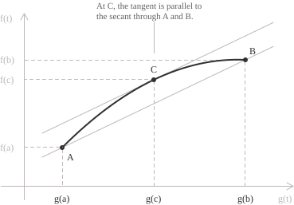

## Statement

Cauchy's theorem is one of the fundamental theorems of differential calculus and generalises [Lagrange's theorem](../lagrange-theorem/) to a pair of functions. As you may recall, Lagrange's theorem gives the following identity:

$$
f'(c) = \frac{f(b)-f(a)}{b-a} \tag{1}
$$

Equation $(1)$ relates the change in a function $f$ over an [interval](../intervals/) $[a, b]$ to its [derivative](../derivatives/) at an interior point $c.$ Cauchy's theorem considers the ratio of the increments of two functions and states that this ratio equals the ratio of their derivatives evaluated at the same interior point. To state the theorem formally, let $f$ and $g$ be two [real-valued functions](../functions/) defined on an interval $[a, b],$ with $a < b.$ Assume that the following conditions hold:

+ The functions $f$ and $g$ are [continuous](../continuous-functions/) on the closed interval $[a, b].$
+ The functions $f$ and $g$ are differentiable on the open interval $(a, b).$
+ The derivative $g'(x)$ is non-zero for every $x \in (a, b).$

If these assumptions hold, then at least one point $c \in (a, b)$ satisfies the following identity:

$$\frac{f'(c)}{g'(c)} = \frac{f(b) - f(a)}{g(b) - g(a)} \tag{2}$$

In other words, the ratio of the changes in the two functions from $a$ to $b$ equals the ratio of the derivatives of $f$ and $g$ at some interior point of the interval. As you can see, the third condition, $g'(x) \neq 0,$ ensures that both denominators in $(2)$ are non-zero.

This result underlies the proof of [L'Hôpital's rule](../hopital-rule/), since it allows us to express the ratio of the increments of two functions as the ratio of their derivatives at an intermediate point.

> The theorem guarantees the existence of at least one point $c,$ but not its uniqueness. Several points, or even every interior point of the interval, may satisfy $(2).$ For example, take $f(x) = 2x$ and $g(x) = x.$ Both sides of the identity equal $2,$ so every $c \in (a, b)$ satisfies the conclusion of the theorem.

## Proof

The proof of Cauchy's theorem uses [Rolle's theorem](../rolle-theorem/) to establish the existence of a point $c$ satisfying $(2).$ We first need to check that the denominator $g(b) - g(a)$ is non-zero. Suppose, for a contradiction, that $g(a)$ equals $g(b).$ By the first two assumptions, $g$ is continuous on $[a, b]$ and differentiable on $(a, b),$ so Rolle's theorem would give a point $\xi \in (a, b)$ at which $g'(\xi) = 0.$ This contradicts the third assumption, so we must have $g(b) \neq g(a).$

We next define an auxiliary function that depends on a real constant $\lambda:$

$$\varphi(x) = f(x) - \lambda g(x) \tag{3}$$

We want to choose $\lambda$ so that $\varphi$ takes the same value at both endpoints. The condition $\varphi(a) = \varphi(b)$ can be written as:

$$f(a) - \lambda g(a) = f(b) - \lambda g(b)$$

Collecting the terms involving $\lambda$ gives:

$$\lambda[g(b) - g(a)] = f(b) - f(a) \tag{4}$$

We have just shown that the coefficient of $\lambda,$ namely $g(b) - g(a),$ is non-zero, so we can rewrite $(4)$ as:

$$\lambda = \frac{f(b) - f(a)}{g(b) - g(a)}$$

We can now check the hypotheses of Rolle's theorem. Multiplying $g$ by the constant $\lambda$ and subtracting the result from $f$ gives a function $\varphi$ that is a [linear combination](../linear-combinations/) of $f$ and $g.$ It is therefore continuous on $[a, b]$ and differentiable on $(a, b),$ so the first two hypotheses of Rolle's theorem are satisfied. Our choice of $\lambda$ also ensures that $\varphi(a) = \varphi(b),$ which verifies the third hypothesis. Hence there is a point $c \in (a, b)$ such that $\varphi'(c) = 0.$ [Differentiating](../differentiation-rules/) $(3)$ gives:

$$\varphi'(x) = f'(x) - \lambda g'(x)$$

We know that this derivative vanishes at $c,$ which gives:

$$f'(c) = \lambda g'(c)$$

Since $g'(c) \neq 0,$ we can divide both sides by $g'(c)$ and substitute the value of $\lambda.$ This gives the following identity, which is precisely $(2)$ in Cauchy's theorem:

$$\frac{f'(c)}{g'(c)} = \lambda = \frac{f(b) - f(a)}{g(b) - g(a)}$$

## Geometric interpretation and connection with Lagrange's and Rolle's theorems

To interpret $(2)$ geometrically, imagine a point moving in the plane whose coordinates depend on a parameter $t.$ We use $g(t)$ as the horizontal coordinate and $f(t)$ as the vertical coordinate. As $t$ ranges over $[a, b],$ the pair $(g(t), f(t))$ traces a curve joining the points $(g(a), f(a))$ and $(g(b), f(b)).$ The line through these points has a [slope](../lines/) equal to the ratio of the change in the vertical coordinate to the change in the horizontal coordinate:

$$\frac{f(b) - f(a)}{g(b) - g(a)}$$

At the point corresponding to $t = c,$ the [vector](../vectors/) $(g'(c), f'(c))$ gives the direction of the tangent to the curve. Since $g'(c) \neq 0,$ the slope of the tangent is:

$$\frac{f'(c)}{g'(c)}$$

As the following figure illustrates, $(2)$ states that at some interior point of the parameter interval, the tangent is parallel to the secant line through the endpoints of the curve.

As we have seen, choosing $g(x) = x$ recovers Lagrange's theorem. In this case $g'(x) = 1$ and $g(b) - g(a) = b - a,$ so $(2)$ becomes:

$$f'(c) = \frac{f(b) - f(a)}{b - a} \tag{5}$$

If we make the additional assumption that $f(a) = f(b),$ the numerator on the right vanishes and we obtain $f'(c) = 0,$ which is the conclusion of Rolle's theorem. Thus Lagrange's theorem is a special case of Cauchy's theorem, while Rolle's theorem is a special case of Lagrange's theorem.

## Example

Let us apply the theorem to a concrete example by checking the hypotheses and finding the point $c.$ Consider the functions $f$ and $g$ on the interval $[1, 3]:$

$$f(x) = 2x^2 - 4x + 2$$

$$g(x) = x^2$$

Both functions are [polynomials](../polynomials/), so they are continuous and differentiable throughout $\mathbb{R},$ which verifies the first two hypotheses. Recall that we want to apply $(2),$ so we must also check that the derivative of $g$ in the denominator is non-zero. Here $g'(x) = 2x,$ which is positive on the chosen interval, so the third hypothesis is satisfied as well. All the hypotheses now hold, and we can look for a point $c \in (1, 3)$ such that:

$$\frac{f'(c)}{g'(c)} = \frac{f(3) - f(1)}{g(3) - g(1)}$$

Evaluating the functions at the endpoints of the interval gives:

$$
\begin{align}
f(1) &= 2 - 4 + 2 = 0 \\[6pt]
f(3) &= 18 - 12 + 2 = 8 \\[6pt]
g(1) &= 1 \\[6pt]
g(3) &= 9
\end{align}
$$

The ratio of the increments is therefore:

$$\frac{f(3) - f(1)}{g(3) - g(1)} = \frac{8 - 0}{9 - 1} = 1$$

The derivatives of $f$ and $g$ are $f'(x) = 4x - 4$ and $g'(x) = 2x,$ respectively. The point we seek must therefore satisfy the following equation:

$$\frac{4c - 4}{2c} = 1$$

Solving for $c$ gives:

$$
\begin{align}
4c - 4 &= 2c \\[6pt]
2c &= 4 \\[6pt]
c &= 2
\end{align}
$$

The value $c = 2$ belongs to $(1, 3)$ and satisfies the required identity. In this example, the equation reduces to a [linear equation](../linear-equations/) with a unique solution, so only one point $c$ satisfies the conclusion of the theorem. As noted earlier, other examples may have more than one such point $c$ in the interval. This can happen, for instance, if the resulting equation is [quadratic](../quadratic-equations/) and has two distinct real solutions, both lying in the open interval under consideration.

## A more general formulation

Cauchy's theorem also has a more general formulation without quotients, which does not require the third assumption that $g'$ be non-zero. To state this version, we again consider two functions $f$ and $g$ that are continuous on $[a, b]$ and differentiable on $(a, b),$ with $a < b.$ Then at least one point $c \in (a, b)$ satisfies the following identity:

$$[g(b) - g(a)]f'(c) = [f(b) - f(a)]g'(c) \tag{6}$$

Unlike $(2),$ equation $(6)$ involves no division by $g(b) - g(a)$ or by $g'(c),$ so the identity is meaningful even when either of these factors vanishes. When both factors are non-zero, the two formulations are equivalent.

To prove $(6),$ we introduce a new auxiliary function, continuous on $[a, b]$ and differentiable on $(a, b),$ defined by:

$$H(x) = [g(b) - g(a)][f(x) - f(a)] - [f(b) - f(a)][g(x) - g(a)] \tag{7}$$

At $x = a,$ both differences involving $x$ vanish, so $H(a) = 0.$ At $x = b,$ we obtain:

$$H(b) = [g(b) - g(a)][f(b) - f(a)] - [f(b) - f(a)][g(b) - g(a)] = 0$$

Since $H(a) = H(b),$ Rolle's theorem gives a point $c \in (a, b)$ such that $H'(c) = 0.$ Differentiating $(7)$ gives:

$$H'(x) = [g(b) - g(a)]f'(x) - [f(b) - f(a)]g'(x)$$

Evaluating this expression at $c$ and setting it equal to zero gives $(6),$ which completes the proof. Recall that to pass from $(6)$ to $(2),$ we need $g(b) - g(a) \neq 0$ and a non-zero value of $g'(c)$ at the specific point provided by the theorem. The assumption $g'(x) \neq 0$ throughout $(a, b)$ guarantees this condition before we know $c,$ and also ensures that $g(b) - g(a) \neq 0.$

- - -

This formulation without quotients helps explain why the assumption $g'(x) \neq 0$ appears in the original statement of the theorem. If $g(a)$ were equal to $g(b),$ the ratio of the increments would be undefined, and we could not choose $\lambda$ using the formula from the first proof. If $g(a) \neq g(b),$ that ratio is defined, but we still need to check that we can also divide by $g'(c).$

To see why the condition $g(a) \neq g(b)$ alone is not enough, consider the following functions on the interval $[-1, 1]:$

$$f(x) = x^2$$
$$g(x) = x^3$$

Both functions are continuous and differentiable throughout $\mathbb{R},$ and their increments between the endpoints are:

$$
\begin{align}
f(1) - f(-1) &= 0 \\[6pt]
g(1) - g(-1) &= 2
\end{align}
$$

The ratio of the increments is therefore zero:

$$\frac{f(1) - f(-1)}{g(1) - g(-1)} = 0$$

The derivatives of $f$ and $g$ are $f'(x) = 2x$ and $g'(x) = 3x^2.$ For every non-zero $c \in (-1, 1),$ their ratio is:

$$\frac{f'(c)}{g'(c)} = \frac{2c}{3c^2} = \frac{2}{3c}$$

This ratio is never zero. At $c = 0,$ however, both derivatives vanish and their ratio is undefined. Thus no interior point satisfies $(2),$ even though the ratio of the increments is defined. The formulation without quotients still holds. Substituting the increments and derivatives into $(6)$ gives:

$$2 \cdot 2c = 0 \cdot 3c^2$$

This equation reduces to $4c = 0,$ so the point provided by the general formulation is precisely $c = 0.$ The identity holds at this point, but we cannot turn it into an equality of quotients because $g'(0) = 0.$
