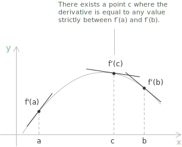

## Statement

Let $f : [a, b] \to \mathbb{R}$ be [differentiable](../derivatives/) at every point of the closed interval, with one-sided derivatives at the endpoints. If $\lambda$ is any number strictly between $f'(a)$ and $f'(b)$, then there exists a point $c \in (a, b)$ such that:

$$f'(c) = \lambda$$

The theorem says that a derivative takes every value between any two of the values it attains. In equivalent terms, if $f$ is differentiable on an [interval](../intervals/) $I$, then the image $f'(I)$ is again an interval.

> The single hypothesis is that $f$ is differentiable on the whole interval. Nothing is assumed about the continuity of $f'$, and this is what makes the statement worth proving.

## The intermediate value property without continuity

A [continuous](../continuous-functions/) function on an interval has the intermediate value property, so between two of its values it attains every intermediate value. Darboux's theorem grants the same property to every derivative, and the point of the statement is that it does so without requiring $f'$ to be continuous. A differentiable function can have a derivative that fails to be continuous, as the function $f(x) = x^2\sin(1/x)$ with $f(0) = 0$ shows, its derivative oscillating near the origin without a limit. Even for such a function the derivative omits no intermediate value, so the discontinuities of a derivative are restricted in a way that arbitrary functions are not. The failure of continuity is examined in the entry on [points of non-differentiability](../points-of-non-differentiability/).

## Proof

Assume that $f'(a) < \lambda < f'(b)$, and define $g : [a, b] \to \mathbb{R}$ by:

$$g(x) = f(x) - \lambda x$$

The function $g$ is differentiable on $[a, b]$, hence [continuous](../continuous-functions/) there, with derivative $g'(x) = f'(x) - \lambda$. At the endpoints $g'(a) = f'(a) - \lambda < 0$ and $g'(b) = f'(b) - \lambda > 0$. By [Weierstrass's Theorem](../weierstrass-theorem/), $g$ attains an absolute minimum at some $c \in [a, b]$, and we show that $c$ lies in the interior.

Since $g'(a) < 0$ is the limit of the difference quotient of $g$ at $a$, there is a point $x > a$ close to $a$ for which:

$$\frac{g(x) - g(a)}{x - a} < 0$$

The denominator is positive, so $g(x) < g(a)$, and the minimum is not attained at $a$. Since $g'(b) > 0$ is the limit of the difference quotient at $b$, there is a point $x < b$ close to $b$ for which:

$$\frac{g(x) - g(b)}{x - b} > 0$$

This time the denominator is negative, so again $g(x) < g(b)$, and the minimum is not attained at $b$. The minimum of $g$ is therefore attained at an interior point $c \in (a, b)$. By [Fermat's Theorem](../fermat-theorem/), an interior extremum of a differentiable function is a stationary point, so $g'(c) = 0$, which gives:

$$f'(c) = \lambda$$

The case $f'(a) > \lambda > f'(b)$ reduces to the one just treated by applying it to $-f$ and the value $-\lambda$, since $(-f)'(a) < -\lambda < (-f)'(b)$.

## Derivatives have no jump discontinuities

A function with the intermediate value property cannot have a jump discontinuity, because across a jump it would skip every value strictly between the two one-sided limits, and those values would go unattained near the point. Every derivative has this property, so a derivative cannot jump.

Stated at a single point, if $f$ is differentiable on an interval and $c$ is an interior point at which the one-sided limits $\lim_{x \to c^-} f'(x)$ and $\lim_{x \to c^+} f'(x)$ both exist and are finite, then the two limits are equal, and they equal $f'(c)$. The derivative is then continuous at $c$. A derivative can therefore have no removable and no jump discontinuity; wherever it fails to be continuous, at least one of its one-sided limits does not exist, and the discontinuity is of the essential type.

This is the reason behind the criterion based on the limit of the derivative discussed in the entry on [points of non-differentiability](../points-of-non-differentiability/). When the two one-sided limits of $f'$ exist and agree, the function is differentiable with that common value; when they exist and differ, no differentiable extension is possible, and the graph has a corner. For a function differentiable on the whole interval the second case is ruled out, so $f'$ passes from one value to another only by taking every value in between.

## Constant sign of a non-vanishing derivative

If $f$ is differentiable on an interval $I$ and $f'(x) \neq 0$ for every $x \in I$, then $f'$ keeps a constant sign on $I$. Were $f'$ positive at one point and negative at another, Darboux's theorem would produce a point between them where $f'$ vanishes, against the hypothesis. A derivative that never vanishes is therefore either everywhere positive or everywhere negative, and by [Lagrange's Theorem](../lagrange-theorem/) the function is [strictly monotone](../increasing-and-decreasing-functions/), hence injective.

This is the step that lets the [inverse function](../inverse-function/) be differentiated. A continuously differentiable function with $f'(x_0) \neq 0$ keeps its derivative away from zero on a neighbourhood of $x_0$, so it is strictly monotone there and admits a differentiable inverse.

## Darboux functions

A function that has the intermediate value property on every subinterval of its domain is called a Darboux function. Darboux's theorem says that every derivative is a Darboux function. Having the intermediate value property is weaker than being continuous, so a Darboux function need not be continuous. The function $g(x) = \sin(1/x)$ for $x \neq 0$, with $g(0) = 0$, takes every value in $[-1, 1]$ in each neighbourhood of the origin, so it has the intermediate value property, yet it is discontinuous at $0$. A derivative can display this property while being discontinuous, which is the situation Darboux's theorem describes.

## Example

The standard illustration is the function:

$$
f(x) =
\begin{cases}
x^2\sin\left(\dfrac{1}{x}\right) & x \neq 0 \\[8pt]
0 & x = 0
\end{cases}
$$

It is differentiable on all of $\mathbb{R}$. For $x \neq 0$ the [differentiation rules](../differentiation-rules/) give:

$$f'(x) = 2x\sin\left(\frac{1}{x}\right) - \cos\left(\frac{1}{x}\right)$$

and at the origin the difference quotient $x\sin(1/x)$ tends to $0$, so $f'(0) = 0$. Near the origin the term $2x\sin(1/x)$ is small, while $-\cos(1/x)$ runs through the whole of $[-1, 1]$, so $f'$ takes values close to every number in $[-1, 1]$ in each neighbourhood of $0$ and has no limit there. The derivative is discontinuous at $0$, yet on every interval $[a, b]$ it still assumes each value between $f'(a)$ and $f'(b)$, in agreement with Darboux's theorem. The discontinuity is essential, and, as the corollary above requires, neither one-sided limit of $f'$ exists at $0$.

Darboux's theorem rests on the same interior-extremum principle as [Rolle's Theorem](../rolle-theorem/). Both locate a point where the derivative meets a prescribed value by turning the question into the search for a maximum or a minimum inside the interval, where [Fermat's Theorem](../fermat-theorem/) forces the derivative to vanish.
