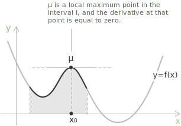
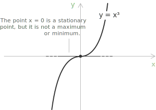
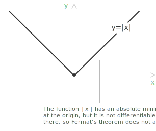

## Introduction

Fermat's Theorem states that any relative [maximum or minimum](../maximum-minimum-and-inflection-points/) of a differentiable function within its [domain](../determining-the-domain-of-a-function/) must occur at a stationary point, that is, a point where the first [derivative](../derivatives/) is equal to zero, and the tangent line is horizontal (parallel to the $x$-axis).

The condition is necessary but not sufficient. If a function has a local maximum or minimum at an interior point and is differentiable there, its derivative at that point is zero. The converse does not hold, since a zero derivative does not necessarily imply an extremum.

> Fermat's Theorem is used in the proof of [Rolle's Theorem](../rolle-theorem/), which in turn underlies the proof of [Lagrange's Theorem](../lagrange-theorem/) and, ultimately, [Cauchy's Theorem](../cauchy-theorem/) and [L'Hopital's rule](../hopital-rule/). The existence of the extremum required by Fermat's statement is guaranteed, on a closed and bounded interval, by [Weierstrass' Theorem](../weierstrass-theorem/).

## Statement

Given a [function](../functions/) $y = f(x)$ defined on a closed and bounded interval $[a, b],$ and differentiable on the open interval $(a, b),$ if the function attains a local maximum or minimum at a point $x_0 \in (a, b),$ then the derivative at that point must be zero:

$$
f'(x_0) = 0
$$

The graph below shows a local maximum at a point $\mu$ inside the interval $I,$ where the derivative is zero.

> In certain cases, the derivative of a function becomes zero at a point that is neither a maximum nor a minimum. Such points are called stationary points without an extremum, including stationary [inflection points](../maximum-minimum-and-inflection-points/), where the derivative is zero but the function does not change direction.

## Proof

To prove the theorem, let us assume that $x_0$ is a point of local maximum. Then, in a neighborhood $I$ around $x_0,$ the following inequality must hold:

$$
f(x) \leq f(x_0) \quad \forall x \in I
$$

From this, it follows that the [difference quotient](../difference-quotient/) satisfies the following:

For $h > 0$:
$$
\frac{f(x_0 + h) - f(x_0)}{h} \leq 0
$$

For $h < 0$:
$$
\frac{f(x_0 + h) - f(x_0)}{h} \geq 0
$$

From these inequalities, and by the definition of the derivative as the limit of the difference quotient, it follows that the respective limits satisfy:

$$
\lim_{h \to 0^+} \frac{f(x_0 + h) - f(x_0)}{h} \leq 0
$$
$$
\lim_{h \to 0^-} \frac{f(x_0 + h) - f(x_0)}{h} \geq 0
$$

If the function is differentiable at $x_0,$ then both the left-hand and right-hand limits exist and are equal to the derivative. The only way these two inequalities can be true simultaneously is if:

$$
f'(x_0) = 0
$$

> The theorem is thus proven, since we have shown that if a differentiable function attains a local extremum at an interior point, the derivative at that point is zero.

## Example 1

Consider the real-valued function:

$$
f(x) = x^{3} - 3x^{2} + 2
$$

defined for every real number. Being a [polynomial](../polynomials/), the function is [continuous](../continuous-functions/) and [differentiable](../derivatives/) on the entire real line. If it attains a local maximum or minimum at an interior point of its domain, Fermat's Theorem guarantees that the derivative there is zero. To find where the function might have extrema, we compute its derivative:

$$
f'(x) = 3x^{2} - 6x = 3x(x - 2)
$$

The derivative vanishes precisely when $3x(x - 2) = 0$ which occurs at:

$$
x = 0 \quad \text{and} \quad x = 2
$$

These two values are therefore the only candidates for interior extrema, because Fermat's Theorem states that any differentiable function reaching a local extremum must have a horizontal tangent line at that point.

- - -
To determine the nature of these points, we examine how the derivative behaves around them. For $x < 0,$ the derivative is positive and the function increases. Between $0$ and $2,$ the derivative becomes negative, so the function decreases. For $x > 2,$ the derivative returns to positive, meaning the function increases again. This change in [monotonicity](../increasing-and-decreasing-functions/) shows that:

+ for $x = 0,$ the function transitions from increasing to decreasing, indicating a local maximum;
+ for $x = 2,$ the function transitions from decreasing to increasing, indicating a local minimum.

[class="table-sign"]

The sign chart below summarizes the behavior of the derivative and the corresponding monotonicity of the function.

|         |                         |           $0$           |           $2$           |
| :-----: | :---------------------: | :---------------------: | :---------------------: |
| $f'(x)$ |    $\boldsymbol{+}$     |    $\boldsymbol{-}$     |    $\boldsymbol{+}$     |
| $f(x)$  | $\boldsymbol{\nearrow}$ | $\boldsymbol{\searrow}$ | $\boldsymbol{\nearrow}$ |

[/class]

Evaluating the function confirms the classification, with $f(0) = 2$ a local maximum and $f(2)= -2$ a local minimum.

> Fermat's Theorem states a necessary condition, not a sufficient one. A point with a zero derivative need not be an extremum, while every interior extremum of a differentiable function occurs at such a point. The condition narrows the search for maxima and minima to the stationary points.

## Not all stationary points are extrema

The function $f(x) = x^3$ shows that a zero derivative does not necessarily imply a local extremum.

The derivative is:

$$
f'(x) = 3x^2
$$

At $x = 0,$ we have $f'(0) = 0.$ Thus, $x = 0$ is a stationary point. Although the derivative at $x = 0$ is zero, the point is neither a local maximum nor a local minimum. Instead, $x = 0$ is a stationary inflection point, where the derivative is zero, while the function increases on both sides without changing direction.

## The second-derivative test

Fermat's theorem identifies the candidates for an interior extremum but does not determine their nature. The classification follows from the second [derivative](../derivatives/) of $f$ at the stationary point. Let $f$ be twice differentiable in a neighborhood of an interior point $x_0$ with $f'(x_0) = 0.$ The sign of $f''(x_0)$ determines the local behavior of the function as follows:

+ If $f''(x_0) > 0,$ then $x_0$ is a local minimum of $f.$
+ If $f''(x_0) < 0,$ then $x_0$ is a local maximum of $f.$
+ If $f''(x_0) = 0,$ the test is inconclusive and additional information is required.

The first two cases follow from the second-order Taylor expansion of $f$ around $x_0.$ Since $f'(x_0) = 0,$ the expansion reduces to:

$$
f(x_0 + h) = f(x_0) + \tfrac{1}{2} f''(x_0) h^2 + o(h^2)
$$

For sufficiently small $h,$ the term $\tfrac{1}{2} f''(x_0) h^2$ dominates the remainder, and its sign coincides with the sign of $f''(x_0).$ When $f''(x_0) > 0,$ the increment $f(x_0 + h) - f(x_0)$ is positive for every small $h \neq 0,$ hence $x_0$ is a local minimum. The case $f''(x_0) < 0$ is symmetric and yields a local maximum.

- - -
The third case, $f''(x_0) = 0,$ leaves the second-order term inert and requires examining the higher-order derivatives. The nature of the stationary point is governed by the first non-vanishing derivative of $f$ at $x_0.$ If $f^{(k)}(x_0)$ is the first such derivative with $k \geq 2,$ then:

+ When $k$ is even, $x_0$ is a local minimum if $f^{(k)}(x_0) > 0$ and a local maximum if $f^{(k)}(x_0) < 0.$
+ When $k$ is odd, $x_0$ is a stationary [inflection point](../maximum-minimum-and-inflection-points/) and not an extremum.

The function $f(x) = x^3$ illustrates the odd case with $k = 3$: at $x = 0$ we have $f'(0) = f''(0) = 0$ and $f'''(0) = 6 \neq 0,$ so the point is an inflection. The function $f(x) = x^4$ illustrates the even case with $k = 4$: at $x = 0$ the first non-vanishing derivative is $f^{(4)}(0) = 24 > 0,$ and the point is a local minimum even though $f''(0) = 0.$

> The second-derivative test is a local sufficient condition. It complements Fermat's theorem, which states only the necessary condition $f'(x_0) = 0,$ by adding a decision rule that classifies most stationary points found in practice.

## Stationary points and boundary behavior

A stationary point, a point at which the derivative vanishes, does not by itself determine whether the function has a local maximum or minimum there. The classification requires a more refined analysis of the function near the candidate point and of the structure of the domain. Consider, for instance, the [absolute value function](../absolute-value-function/)

$$
y = f(x) = |x| =
\begin{cases}
+x & \text{if } x \ge 0\\[4pt]
-x & \text{if } x < 0
\end{cases}
$$

which attains a global minimum at $x = 0$ even though the derivative does not exist at that point.

This example shows that extrema may occur where the derivative is zero, where differentiability fails, or at boundary points of the domain. On a closed interval, a function may reach its extrema at the endpoints regardless of the behavior of the derivative in the interior.

Conversely, on open intervals or unbounded [domains](../determining-the-domain-of-a-function/), extrema may be absent even if stationary points exist. A complete understanding of [maxima and minima](../maximum-minimum-and-inflection-points/) therefore requires the combined use of Fermat's condition, the study of differentiability, and the careful analysis of the domain on which the function is defined.
