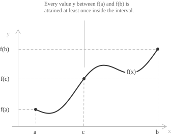
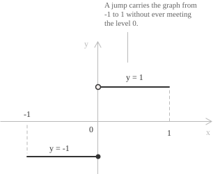

## Statement

Let $f : [a,b] \to \mathbb{R}$ be [continuous](../continuous-functions/) on the closed [interval](../intervals/) $[a,b],$ and let $y$ lie between the endpoint values, so that $f(a) \le y \le f(b)$ or $f(b) \le y \le f(a)$. Then at least one point $c \in [a,b]$ satisfies:

$$f(c) = y$$

Every horizontal line whose height is between $f(a)$ and $f(b)$ meets the graph of $f$ above the interval $[a,b]$.

The theorem is an existence result. It neither locates $c$ nor guarantees that $c$ is unique. An intermediate value can be attained once or several times. The function $f(x) = x^3 - 4x$ on $[-3,3]$ has $f(-3) = -15$ and $f(3) = 15,$ while the value $0$ is attained at the three points $x = -2,$ $x = 0$ and $x = 2.$

## The zero theorem of Bolzano

For $y = 0,$ the intermediate value theorem has the following form. Suppose that $f$ is continuous on $[a,b]$ and that its endpoint values have opposite signs, so that:

$$f(a)f(b) < 0$$

Then $f$ has a zero at some point $c$ of the open interval $(a,b)$. This result is known as the zero theorem or Bolzano's theorem. Bolzano published an analytic proof in 1817 without appealing to a graph.

The hypotheses impose no bound on the number of zeros, and a continuous function can have infinitely many zeros.

## Proof by successive bisection

Assume $f(a) < 0 < f(b)$. If the signs are reversed, replace $f$ with $-f,$ which has the same zeros.

Put $a_0 = a$ and $b_0 = b$. Suppose that the interval $[a_n,b_n]$ has been constructed with $f(a_n) < 0 < f(b_n)$. Its midpoint is:

$$m_n = \frac{a_n + b_n}{2}$$

If $f(m_n) = 0,$ then $m_n$ is a zero and the construction stops. If $f(m_n) > 0,$ keep the left half by setting $a_{n+1} = a_n$ and $b_{n+1} = m_n$. If $f(m_n) < 0,$ keep the right half by setting $a_{n+1} = m_n$ and $b_{n+1} = b_n$. In either case the new endpoints have opposite signs:

$$f(a_{n+1}) < 0 < f(b_{n+1})$$

Each new interval has half the length of the preceding interval. After $n$ steps its length is:

$$b_n - a_n = \frac{b-a}{2^n}$$

If the construction never stops, $(a_n)$ is increasing and $(b_n)$ is decreasing, and both sequences are contained in $[a,b]$. Every bounded [monotone sequence](../monotone-sequences/) [converges](../convergent-and-divergent-sequences/), so both sequences have a limit. Their limits are equal because $b_n - a_n \to 0$. Denote their common limit by $c$. Since $[a,b]$ is closed, $c \in [a,b]$.

> The convergence step uses the completeness of the [real numbers](../real-numbers/). Over $\mathbb{Q},$ the intervals can converge in $\mathbb{R}$ to an irrational number that is absent from the domain. For example, the restriction of $f(x) = x^2 - 2$ to $[1,2] \cap \mathbb{Q}$ is continuous and changes sign, but it has no rational zero.

Since $f$ is continuous at $c,$ we have $f(a_n) \to f(c)$ and $f(b_n) \to f(c)$. Every term of $(f(a_n))$ is negative, so $f(c) \le 0$. Every term of $(f(b_n))$ is positive, so $f(c) \ge 0$. Hence:

$$f(c) = 0$$

> The strict inequalities become weak inequalities in the limit. From $f(a_n) < 0$ we may conclude only that $f(c) \le 0,$ so neither sequence settles the matter alone.

Another proof uses the set $S = \{\ x \in [a,b] \mid f(x) < 0\ \}$. This set is nonempty because $a \in S$ and is bounded above by $b,$ so it has a [supremum](../supremum-and-infimum/) $c$. Continuity near $b$ shows that $c < b$. If $f(c) < 0,$ continuity gives a point of $S$ greater than $c,$ contradicting the definition of $c$. If $f(c) > 0,$ continuity gives an interval to the left of $c$ that contains no point of $S$. A number smaller than $c$ would then be an upper bound for $S,$ again a contradiction. Hence $f(c) = 0$. In the bisection proof, $c$ is also the limit of nested intervals that can be computed.

## From zeros to arbitrary values

The zero theorem implies the general statement. If $y = f(a),$ take $c = a$; if $y = f(b),$ take $c = b$. It remains to consider strict inequalities. First suppose $f(a) < y < f(b)$ and define:

$$g(x) = f(x) - y$$

The constant function with value $y$ is continuous, so $g$ is continuous on $[a,b]$. Its endpoint values satisfy $g(a) = f(a) - y < 0$ and $g(b) = f(b) - y > 0$. Bolzano's theorem gives a point $c \in (a,b)$ with $g(c) = 0,$ or equivalently $f(c) = y$. The same argument applies when $f(b) < y < f(a),$ with the endpoint signs reversed.

Conversely, the zero theorem is the case $y = 0$ of the intermediate value theorem. The two statements are therefore equivalent.

## Where the hypotheses enter

The function must be continuous on its whole [domain](../determining-the-domain-of-a-function/), and the domain must be an interval. If either condition is removed, the conclusion can fail.

A counterexample on $[-1,1]$ is the step function:

$$
f(x) =
\begin{cases}
-1 & x \le 0 \\[6pt]
1 & x > 0
\end{cases}
$$

The endpoint values are $f(-1) = -1$ and $f(1) = 1,$ yet the function takes no value strictly between them. It differs from the [sign function](../sign-function/) only at the origin, where it has a jump [discontinuity](../discontinuities-of-real-functions/). Its [one-sided limits](../limits/) at the origin exist and are different.

Continuity alone is not enough when the domain is disconnected. The function $f(x) = 1/x$ is continuous at every point of $[-1,0) \cup (0,1]$ and satisfies $f(-1) = -1$ and $f(1) = 1,$ but it never vanishes. Its domain is the union of two disjoint intervals. On each interval the function has a constant sign, so applying the theorem separately to the two intervals gives no contradiction.

The converse is false. A function can have the intermediate value property on every interval and still be discontinuous. For example, $g(x) = \sin(1/x)$ for $x \neq 0,$ with $g(0) = 0,$ has this property but is discontinuous at the origin. [Darboux's theorem](../darboux-theorem/) states that every [derivative](../derivatives/) has the intermediate value property, even when the derivative is discontinuous.

## The image of an interval

If $f$ is continuous on an interval $I,$ then the [image](../functions/) $f(I)$ is again an interval.

Let $u,v \in f(I)$ with $u < v$. Choose $p,q \in I$ such that $u = f(p)$ and $v = f(q),$ and suppose $u < y < v$. The closed interval with endpoints $p$ and $q$ is contained in $I$ because $I$ contains every point between any two of its points. The restriction of $f$ to this closed interval satisfies the hypotheses of the theorem. Hence $f(c) = y$ for some point $c$ between $p$ and $q,$ so $y \in f(I)$. Thus $f(I)$ contains every number between any two of its elements and is an interval.

If $f$ is continuous on the closed and bounded interval $[a,b],$ then [Weierstrass' theorem](../weierstrass-theorem/) shows that $f$ has a minimum $m$ and a maximum $M$. Thus $f([a,b])$ is an interval contained in $[m,M]$ and containing both $m$ and $M$. Therefore:

$$f([a,b]) = [m,M]$$

> The image need not be an interval of the same type as the domain. The map $f(x) = x^2$ sends the open interval $(-1,1)$ to $[0,1),$ which is neither open nor closed. If the domain is compact, its continuous image is compact and hence is a closed and bounded interval.

## Example 1

Consider the polynomial function $f : [1,2] \to \mathbb{R}$ defined by:

$$f(x) = x^3 - x - 1$$

A [polynomial function](../polynomial-function/) is continuous on the whole real line, so $f$ is continuous on $[1,2]$. Its endpoint values are:

$$
\begin{align}
f(1) &= 1 - 1 - 1 = -1 \\[6pt]
f(2) &= 8 - 2 - 1 = 5
\end{align}
$$

The endpoint values have opposite signs, so the equation $x^3 - x - 1 = 0$ has at least one solution in $(1,2)$. Bisection narrows its location by retaining the half whose endpoints have opposite signs:

$$
\begin{align}
f(1.5) &= 0.875 > 0 \quad \rightarrow \quad c \in (1,1.5) \\[6pt]
f(1.25) &= -0.296875 < 0 \quad \rightarrow \quad c \in (1.25,1.5) \\[6pt]
f(1.375) &= 0.224609375 > 0 \quad \rightarrow \quad c \in (1.25,1.375)
\end{align}
$$

After three steps the root belongs to an interval of length $0.125$. After $n$ steps the interval that contains the root has length $1/2^n,$ so its width can be prescribed in advance. Since $f'(x) = 3x^2 - 1 > 0$ on $[1,2],$ the function is [strictly increasing](../increasing-and-decreasing-functions/) there and the root is unique. This root is the plastic number, whose value to five decimal places is $1.32472$.

## Real roots of polynomials of odd degree

A polynomial with real coefficients and odd degree has at least one [real root](../roots-of-a-polynomial/).

Let $p(x) = a_nx^n + \dots + a_0,$ where $n$ is odd and $a_n \neq 0$. If $a_n < 0,$ replace $p$ with $-p,$ which has the same roots. We may therefore assume $a_n > 0$. The following [limit](../limits/) compares $p$ with its leading term:

$$\lim_{|x| \to \infty} \frac{p(x)}{a_nx^n} = 1$$

The limit shows that the leading term determines the sign of $p(x)$ when $|x|$ is large. Since $n$ is odd, $p(x) \to +\infty$ as $x \to +\infty$ and $p(x) \to -\infty$ as $x \to -\infty$. Hence some points $u < v$ satisfy $p(u) < 0 < p(v)$. Bolzano's theorem applied to $p$ on $[u,v]$ gives a real root.

If the degree is even and the leading coefficient is positive, both limits are $+\infty,$ so no sign change follows. For example, $p(x) = x^2 + 1$ has no real root. The number and location of roots are studied further in [polynomial equations](../polynomial-equations/).

## Fixed points of a continuous self-map

Let $f : [a,b] \to [a,b]$ be continuous. Then $f$ has a fixed point, meaning a point $x_0$ with $f(x_0) = x_0$.

Since $f$ has values in $[a,b],$ define the continuous function $g(x) = f(x) - x$ on $[a,b]$. The inclusion $f(a) \in [a,b]$ gives $f(a) \ge a$ and hence $g(a) \ge 0$. Similarly, $f(b) \in [a,b]$ gives $f(b) \le b$ and hence $g(b) \le 0$. If either endpoint value of $g$ is zero, the corresponding endpoint is a fixed point. Otherwise $g(a) > 0 > g(b),$ and the zero theorem gives a point $x_0 \in (a,b)$ with $g(x_0) = 0$. Therefore $f(x_0) = x_0$.

The graph of $f$ lies in the square $[a,b]^2,$ joins its left and right edges, and intersects the diagonal. This result is the one-dimensional case of Brouwer's fixed point theorem for continuous maps from a closed ball of $\mathbb{R}^n$ into itself.

## Where this theorem is used

+ In [sign analysis for inequalities](../sign-analysis-in-inequalities/), a continuous function has a constant sign on every subinterval of its domain that contains no zeros.
+ Together with [Weierstrass' theorem](../weierstrass-theorem/), the theorem implies that $f([a,b]) = [m,M]$ for a continuous function on a closed and bounded interval.
+ The [mean value theorem for integrals](../definite-integrals/) follows because the average value of a continuous function lies between its minimum and maximum and is therefore attained.
+ A continuous and [strictly monotone](../increasing-and-decreasing-functions/) function has an [inverse function](../inverse-function/) whose domain is an interval.
+ [Darboux's theorem](../darboux-theorem/) states that every derivative has the intermediate value property, including derivatives that are not continuous.
