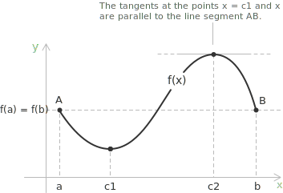

## Statement

Given a function $f(x)$ defined on a closed and bounded [interval](../intervals/) $[a, b]$, such that the following conditions are satisfied:

+ $f(x)$ is [continuous](../continuous-functions/) on the closed interval $[a, b]$.  
+ $f(x)$ is [differentiable](../derivatives/) on the open interval $(a, b)$.  
+ $f(a) = f(b)$.  

Then, there exists at least one point $c \in (a, b)$ such that $f'(c) = 0$

> Rolle's Theorem is a special case of the [Mean Value Theorem](../lagrange-theorem/) (Lagrange). Under the same hypotheses of continuity on $[a,b]$ and differentiability on $(a,b)$, if $f(a) = f(b)$, then the secant slope is zero and there exists $c \in (a,b)$ such that $f'(c) = 0$.

## A geometric view of Rolle's theorem

From a geometric point of view, Rolle's theorem states that there always exists at least one point $c$ where the tangent to the graph is parallel to the line $AB$ passing through the points $A$ and $B$, and thus parallel to the $x$-axis.

> Rolle's Theorem helps illustrate the idea that a function reaching the same value at two points must have a flat tangent somewhere in between. This concept underlies many real-world applications, such as finding the peak of a parabolic trajectory.

## Proof

By [Weierstrass' Theorem](../weierstrass-theorem/), since $f(x)$ is continuous on $[a, b]$, it attains a maximum and a minimum on $[a, b]$. Let:

$$M = f(x_M), \quad m = f(x_m)$$

where $x_M, x_m \in [a, b]$ are points where $f(x)$ reaches its maximum $M$ and minimum $m$, respectively. If $M = m$, the function $f(x)$ is constant, and hence for all $x \in (a, b)$ $f'(x) = 0$. In this case, the theorem is trivially true.
 
- - -
Now assume $M > m$. Since $f(a) = f(b)$, if both the maximum and the minimum were attained only at the endpoints, we would have $f(a) = f(b) = M = m$, contradicting $M > m$. Therefore, at least one of $M$ or $m$ is attained at some interior point $c \in (a, b)$.  

+ $f(x)$ reaches a local maximum at $c \in (a, b)$: since $f$ is differentiable at $c$ and $c$ is an interior extremum, by [Fermat's Theorem](../fermat-theorem/) the derivative satisfies $f'(c) = 0.$  
+ $f(x)$ reaches a local minimum at $c \in (a, b)$: similarly, by [Fermat's Theorem](../fermat-theorem/), the derivative satisfies: $f'(c) = 0.$

Thus, in both cases, there exists at least one $c \in (a, b)$ such that $f'(c) = 0.$

## A corollary on the zeros of the derivative

Iterating Rolle's theorem yields a quantitative statement that relates the number of zeros of a function to the number of zeros of its derivative. Let $f$ be continuous on $[a, b]$ and differentiable on $(a, b)$, and suppose that $f$ vanishes at $n \geq 2$ distinct points of $[a, b]$. Then $f'$ vanishes at least $n - 1$ times in $(a, b)$.

The argument is immediate. Order the zeros as $x_1 < x_2 < \cdots < x_n$. On each consecutive pair $[x_i, x_{i+1}]$ the function $f$ satisfies the hypotheses of Rolle's theorem, since $f(x_i) = f(x_{i+1}) = 0$ and continuity and differentiability are inherited on every subinterval. Each application of the theorem produces a point $c_i \in (x_i, x_{i+1})$ with $f'(c_i) = 0$. The $n - 1$ intervals are pairwise disjoint, so the corresponding $c_i$ are distinct, and $f'$ vanishes at least $n - 1$ times in $(a, b)$.

- - -
The corollary admits a natural generalisation by repeated application. If $f$ is $n$ times differentiable and possesses $n + 1$ distinct zeros on $[a, b]$, then $f^{(n)}$ vanishes at least once in $(a, b)$. Each derivative loses at least one zero with respect to the previous one, and the argument terminates after $n$ steps.

The result has direct consequences for [polynomials](../polynomials/): a non-zero polynomial of degree $n$ admits at most $n$ real zeros, since otherwise its $n$-th derivative, which is a non-zero constant, would vanish somewhere by the corollary above. Conversely, the [roots](../roots-of-a-polynomial/) of $P$ and $P'$ interlace in a precise sense whenever $P$ has only simple real roots, a property that lies at the basis of several techniques in real algebraic geometry and numerical analysis.

> The same iterated argument is used to prove the differential characterisation of root multiplicity for polynomials: $x_0$ is a root of $P$ of multiplicity exactly $m$ if and only if $P(x_0) = P'(x_0) = \cdots = P^{(m-1)}(x_0) = 0$ and $P^{(m)}(x_0) \neq 0$.

## Failure of the hypotheses in Rolle's Theorem

Rolle's Theorem is a conditional statement, and its conclusion is valid only if all three hypotheses are satisfied simultaneously. To demonstrate the necessity of each condition, it is instructive to analyse cases where one hypothesis is omitted.

- - -
The first hypothesis requires continuity on the closed interval $[a, b]$, so consider the following function:

$$ f(x) = \begin{cases} x & \text{if } x \in [0, 1) \\[0.5em] 0 & \text{if } x = 1 \end{cases} $$

This function satisfies $f(0) = f(1) = 0$ and is differentiable on $(0, 1)$ with derivative $f'(x) = 1$ throughout the open interval. However, there is no point $c \in (0, 1)$ where $f'(c) = 0$. The failure arises from a jump discontinuity at $x = 1$, violating the continuity hypothesis. The derivative remains nonzero because the function increases strictly until the discontinuity.

- - -
The second hypothesis requires differentiability on the open interval $(a, b)$. The absolute value function $f(x) = |x|$ on $[-1, 1]$ is continuous on the closed interval and satisfies $f(-1) = f(1) = 1$, so the first and third hypotheses are met. However, at $x = 0$, the function has a corner and the derivative does not exist. 

The left and right derivatives at this point are $-1$ and $1$, respectively, indicating non-differentiability on all of $(-1, 1)$. Consequently, there is no horizontal tangent in the interior, demonstrating that differentiability is essential.

- - -
The third hypothesis requires that the function values at the endpoints are equal. A strictly monotonic function can be continuous and differentiable everywhere, yet may lack an interior stationary point. For example, $f(x) = x$ on $[0, 1]$ satisfies $f(0) \neq f(1)$. 

Since $f'(x) = 1$ for all $x \in (0, 1)$, the derivative never vanishes. This demonstrates that equal endpoint values are necessary to guarantee an interior stationary point, regardless of other properties.

## Example 1

Let's consider the function:

$$
f(x) = x^2 - 4x + 3
$$

on the closed interval $[1, 3]$. We want to verify whether Rolle's Theorem applies, and if so, find the value of $c$ such that $f'(c) = 0$.

First, we check the three conditions required by Rolle's Theorem:

+ Continuity: the function is a [polynomial](../polynomials/), so it is continuous on the entire real [line](../lines/), including the interval $[1, 3]$.

+ Differentiability: since $f(x)$ is a polynomial, it is differentiable on $(1, 3)$.

+ Let's now verify that the value of the function at the endpoints is the same:

$$
f(1) = 1^2 - 4(1) + 3 = 0 \\[0.5em]
f(3) = 3^2 - 4(3) + 3 = 0
$$

Since all three conditions are satisfied, Rolle's Theorem guarantees that there is at least one value $c \in (1, 3)$ such that $f'(c) = 0$. Let's find it.

- - -
We compute the derivative:
$$
f'(x) = 2x - 4
$$

Now solve:
$$
f'(c) = 0 \rightarrow 2c - 4 = 0 \rightarrow c = 2
$$

So, the point $c = 2$ lies within the interval $(1, 3)$, and at that point, the derivative is zero. This means the function has a horizontal tangent line at $x = 2$, as predicted by Rolle's Theorem.

## Example 2

Let's consider the following function on the closed interval $[-2, 2]$:

$$
f(x) = \sqrt{4 - x^2}
$$

This is not a polynomial, but we can still check whether Rolle's Theorem applies. The function is a square [root](../radicals/) of a [quadratic expression](../quadratic-equations/), and it is defined and continuous for all $x$ such that $4 - x^2 \geq 0$. This [inequality](../linear-inequalities/) holds exactly on the interval $[-2, 2]$, so the function is continuous on the entire interval.

- - -
The function is differentiable on the open interval $(-2, 2)$ because there are no corners or cusps, and the square root is smooth where defined. The derivative of the function is given by:

$$f'(x) = \frac{-x}{\sqrt{4 - x^2}}$$ 

The derivative diverges as $x \to \pm 2$, indicating that the function is not differentiable at the endpoints. However, this does not violate Rolle's Theorem, which requires differentiability only on the open interval $(-2, 2)$.

- - -
Let's check the values of the function at $x = -2$ and $x = 2$:

$$
\begin{aligned}
&f(-2) = \sqrt{4 - (-2)^2} = \sqrt{0} = 0 \\[0.5em]
&f(2) = \sqrt{4 - 2^2} = \sqrt{0} = 0
\end{aligned}
$$

Since the function values at the endpoints are equal, all the conditions of Rolle's Theorem are satisfied.

- - -
Now we apply the theorem. It tells us that there must be at least one value $c \in (-2, 2)$ such that the $f'(c) = 0$. We first compute the derivative:

$$
f'(x) = \frac{-x}{\sqrt{4 - x^2}}
$$

Now we solve:

$$
f'(c) = 0 \Rightarrow \frac{-c}{\sqrt{4 - c^2}} = 0 \rightarrow c = 0
$$

The function satisfies all the conditions of Rolle's Theorem, and the point $c = 0$ is the value where the derivative is zero. So, the function has a horizontal tangent line at $x = 0.$

## Example 3

Now let's consider the following function on the closed interval $[0, 2]$:

$$
f(x) = |x - 1|
$$

The function $f(x) = |x - 1|$ is an [absolute value function](../absolute-value-function/). It is continuous on the entire real line, including the interval $[0, 2]$.

To analyze $f(x) = |x - 1|$, observe the following:

$$
f(x) =
\begin{cases}
1 - x & \text{if } x < 1 \\[0.5em]
x - 1 & \text{if } x \geq 1
\end{cases}
$$

The left and right derivatives at $x = 1$ are computed as follows. The left derivative is:

$$
\lim_{h \to 0^-} \frac{f(1+h) - f(1)}{h} = \lim_{h \to 0^-} \frac{|h|}{h} = -1
$$

The right derivative is:
$$
\lim_{h \to 0^+} \frac{f(1+h) - f(1)}{h} = \lim_{h \to 0^+} \frac{|h|}{h} = 1
$$

Because the left and right derivatives are not equal, the derivative does not exist at $x = 1$.

To apply Rolle's Theorem, the function must be differentiable on the open interval $(0, 2)$. But here's the problem: at $x = 1$, the function has a [corner](../points-of-non-differentiability/), which means the derivative does not exist at that point. So the second condition of Rolle's Theorem fails.

Rolle's Theorem is the building block on which the mean value theorems rest: dropping the assumption $f(a) = f(b)$ yields [Lagrange's Theorem](../lagrange-theorem/), and replacing the difference with a ratio of two functions yields [Cauchy's Theorem](../cauchy-theorem/). The existence of the interior extremum used in the proof is guaranteed, in turn, by [Weierstrass' Theorem](../weierstrass-theorem/).
