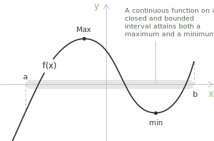
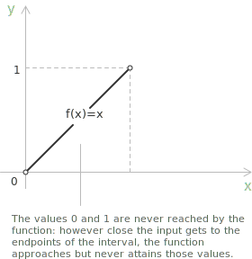

## Statement

**Theorem 1.** Let $f : [a,b] \to \mathbb{R}$ be a continuous [function](../functions/) on a closed and bounded interval $[a,b]$. Then there exist points $x_{\min}, x_{\max} \in [a,b]$ such that:

$$
f(x_{\min}) \le f(x) \le f(x_{\max}) \quad \forall x \in [a,b]
$$

In other words, a [continuous function](../continuous-functions/) on a closed interval attains both its minimum and its maximum. This result is often referred to as the Extreme Value Theorem. The following graph illustrates the theorem: the function reaches a maximum and a minimum at two interior points of the interval $[a, b]$.

It is helpful to relate the notation to the figure. The quantity $f(x_{\max})$ denotes the value of the function at the point marked Max in the graph, that is, the highest point reached on the interval. Likewise, $f(x_{\min})$ represents the value of the function at the point marked min, where the graph attains its lowest value.

+ The interval must be closed and bounded. Closed means that the endpoints are included. Bounded means that it has finite length. Together, these conditions express compactness on the real line.

+ Continuity is equally essential. The theorem does not require differentiability. It only requires that the function have no jumps or breaks on the interval.

+ If either condition is removed, the conclusion may fail.

On a closed and bounded interval, a continuous function cannot diverge or skip values. Because the interval includes its endpoints and continuity prevents jumps, the function does not merely approach its largest and smallest values; it actually attains them. The next section turns this intuition into a rigorous argument.

## Outline of the proof

The complete argument unfolds in two steps: first one shows that the image of $f$ is bounded, then that the [supremum and infimum](../supremum-and-infimum/) of the image are actually attained. 

Both steps rely on the Bolzano-Weierstrass property of closed and bounded intervals, according to which every sequence in $[a, b]$ admits a subsequence converging to a point of $[a, b]$.

Suppose first, by contradiction, that $f$ is unbounded above on $[a, b]$. Then for each natural number $n$ there exists $x_n \in [a, b]$ such that $f(x_n) > n$. The sequence $(x_n)$ lies in $[a, b]$, so by the Bolzano-Weierstrass property a subsequence $(x_{n_k})$ converges to some $x^* \in [a, b]$. By continuity of $f$ at $x^*$:

$$
\lim_{k \to \infty} f(x_{n_k}) = f(x^*)
$$

The [limit](../limits/) on the left-hand side is a finite number, while the construction guarantees $f(x_{n_k}) > n_k \to +\infty$. The contradiction shows that $f$ is bounded above. The same argument applied to $-f$ shows that $f$ is bounded below.

Once boundedness is established, the image $f([a, b])$ is a non-empty bounded subset of $\mathbb{R}$ and admits a supremum $M$ and an infimum $m$. By the characterisation of the supremum, for each $n$ there exists $y_n \in [a, b]$ such that:

$$
M - \tfrac{1}{n} < f(y_n) \leq M
$$

The [sequence](../sequences/) $(y_n)$ lies in $[a, b]$, so by the Bolzano-Weierstrass property a subsequence $(y_{n_k})$ converges to some $x_{\max} \in [a, b]$. Continuity of $f$ at $x_{\max}$ gives:

$$
f(x_{\max}) = \lim_{k \to \infty} f(y_{n_k}) = M
$$

since $f(y_{n_k}) \to M$ by the squeeze property. The supremum $M$ is therefore attained at the point $x_{\max}$, which proves the existence of the maximum. The same argument with the infimum produces a point $x_{\min} \in [a, b]$ with $f(x_{\min}) = m$.

> The two elements of the proof, compactness of the [domain](../determining-the-domain-of-a-function/) and continuity of the function, enter at distinct points: compactness produces the convergent subsequence, continuity transports the limit through $f$. If either property is removed, the construction breaks down, and the examples in the next section illustrate the resulting failure modes.

## Why closed and bounded matters

Consider the function $f(x) = x$ on the open interval $(0,1)$.

The function is continuous, yet it has no maximum and no minimum on that interval. The infimum is $0$ and the supremum is $1$, but neither value is attained because the endpoints are not included.

Now consider $f(x) = 1/x$ on $(0,1]$. The interval is bounded but not closed. The function is continuous on its [domain](../determining-the-domain-of-a-function/), yet it does not attain a maximum. As $x \to 0^+$, the function grows without bound.

> These examples show that compactness of the domain is not a technical detail but the structural reason the theorem holds.

## Example 1

Let us now see a concrete application of the theorem. Consider the function:

$$ f(x) = x^3 - 3x $$

on the interval $[-2,2]$. This is a [polynomial](../polynomials/), therefore continuous on the whole real line. In particular, it is continuous on the closed and bounded interval $[-2,2]$. By Weierstrass' theorem, we already know that the function must attain both a maximum and a minimum somewhere in this interval. To determine where these extreme values occur, we proceed using differential calculus. First compute the [derivative](../derivatives/):

$$ f'(x) = 3x^2 - 3 = 3(x^2 - 1) $$

The critical points are obtained by solving $f'(x)=0$:

$$ 3(x^2 - 1)=0 \quad \rightarrow \quad x^2=1 $$

so we have:

$$ x=-1 \quad x=1 $$

These are the only interior points where the slope of the tangent line vanishes. However, the absolute extrema on a closed interval may also occur at the endpoints. For this reason, we evaluate the function at all candidates: the critical points and the endpoints.

$$
\begin{array}{ll}
f(-2) = -2 & f(-1) = 2 \\[6pt]
f(1) = -2 & f(2) = 2
\end{array}
$$

Comparing these values, we observe that the maximum value is $2$, attained at $x=-1$ and $x=2$, while the minimum value is $-2$, attained at $x=-2$ and $x=1$.

> To summarize, one important point of this example is that Weierstrass' theorem does not tell us where the extreme values are located, nor how many there are. It simply guarantees that they exist. It is the derivative that allows us to find them explicitly.

## The range of a continuous function

Let $f$ be continuous on a closed and bounded interval $[a,b]$. By the Weierstrass theorem, $f$ attains a minimum value $m$ and a maximum value $M$ on $[a,b]$. This means there exist points $x_{\min}, x_{\max} \in [a,b]$ such that

$$
f(x_{\min}) = m \qquad f(x_{\max}) = M
$$

By the Intermediate Value Theorem, the function takes every value between $m$ and $M$. In other words, if $y$ satisfies:

$$
m \le y \le M
$$

then there exists some $x \in [a,b]$ such that $f(x) = y$. Putting these two facts together, we conclude that the image of $f$ is exactly $f([a,b]) = [m, M].$ So a continuous function on a closed interval does not leave gaps in its values, and its range is itself a closed interval.

## Where this theorem is used

The Weierstrass theorem plays a direct role in the proofs of several fundamental theorems of differential calculus.

+ [Fermat's theorem](../fermat-theorem/) relies on it to guarantee that a maximum or minimum actually exists on the interval before concluding that the derivative must vanish at that point.
+ [Rolle's theorem](../rolle-theorem/) uses it to establish that the function attains its maximum and minimum on the closed interval, which is the first step of its proof.
+ [Lagrange's theorem](../lagrange-theorem/) depends on Rolle's theorem and therefore, indirectly, on Weierstrass as well.
