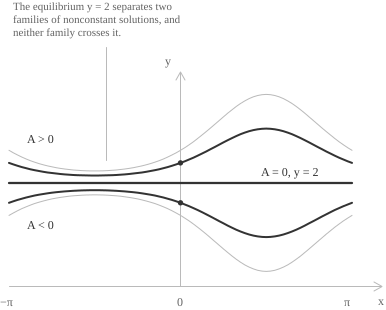

## Separable equations

A [first-order differential equation](../first-order-differential-equations/) is separable when the right-hand side of its normal form is the product of a function of the independent variable and a function of the unknown function:

$$y' = g(x)h(y)$$

The factorization is a property of the equation. Where $h(y) \neq 0,$ the separated equation has the $y$-dependent terms on the left and the $x$-dependent terms on the right. Each equation below has the required form.

+ $y' = x^2y^3$ with $g(x) = x^2$ and $h(y) = y^3$
+ $y' = e^{x+y}$ with $g(x) = e^x$ and $h(y) = e^y$
+ $y' = \frac{\cos(x)}{y}$ with $g(x) = \cos(x)$ and $h(y) = \frac{1}{y}$ on any region where $y \neq 0$
+ $y' = f(y)$ with $g(x) = 1,$ the [autonomous](../autonomous-differential-equations/) case

Recognizing the form sometimes requires [factoring](../multiplying-polynomials/) first. The equation $y' = xy + x$ is separable, since its right-hand side is $x(y+1).$

Some equations have no such factorization. Suppose that $x + y = g(x)h(y)$ held for every real $x$ and $y.$ Setting $y = 0$ gives $x = g(x)h(0),$ so $h(0) \neq 0,$ because $h(0) = 0$ would force $x = 0$ for every $x.$ Hence $g(x) = x/h(0).$ Setting $y = 1$ then gives:

$$x + 1 = \frac{h(1)}{h(0)}x$$

At $x = 0$ this reads $1 = 0.$ No factorization exists, and the equation $y' = x + y$ can instead be solved as a linear equation.

## Separation of the variables

Suppose that $g$ is [continuous](../continuous-functions/) on an [interval](../intervals/) of the independent variable and that $h$ is continuous on an interval containing the range of a solution $y(x).$ Assume that $h(y) \neq 0$ throughout this range. Dividing the equation by $h(y)$ gives:

$$\frac{y'(x)}{h(y(x))} = g(x)$$

Let $H$ be an antiderivative of $1/h$ and let $G$ be an antiderivative of $g.$ By the [chain rule](../chain-rule/), the left-hand side is the derivative of the composite function $H(y(x))$:

$$\frac{d}{dx}H(y(x)) = H'(y(x))y'(x) = \frac{y'(x)}{h(y(x))}$$

The functions $H(y(x))$ and $G(x)$ have the same derivative on the interval, so they differ by a constant:

$$H(y(x)) = G(x) + C$$

This relation is the general solution in implicit form. The same computation has the shorthand form:

$$\int \frac{dy}{h(y)} = \int g(x) \ dx$$

The two [indefinite integrals](../indefinite-integrals/) have different variables of integration. [Integration by substitution](../integration-by-substitution/) justifies the left-hand side as an integral in $y.$ The differentials indicate this change of variable. They are not quantities moved across the equality.

Where $h$ has a constant sign, $H' = 1/h$ has the same sign, so $H$ is strictly [monotone](../increasing-and-decreasing-functions/) and has an [inverse function](../inverse-function/) on its image. Solving the implicit relation for $y$ gives:

$$y(x) = H^{-1}(G(x) + C)$$

The inverse need not have an elementary expression, so the implicit relation is often the final form of the answer. In the next equation, $H^{-1}$ has an expression in radicals, but the domain can be determined without writing it:

$$y' = \frac{2x}{1+y^2}$$

Here $h(y) = 1/(1+y^2)$ has no zero, so the division is valid for every value of $y.$ Integration gives:

$$
\begin{align}
\int \left(1+y^2\right) \ dy &= \int 2x \ dx \\[6pt]
y + \frac{y^3}{3} &= x^2 + C
\end{align}
$$

The function $H(y) = y + y^3/3$ is strictly increasing on $\mathbb{R},$ and its limits at $\pm\infty$ are $\pm\infty,$ so it maps $\mathbb{R}$ onto $\mathbb{R}.$ Each value of $C$ therefore determines one solution on the whole line. The formula in radicals is not needed to establish this domain.

## Equilibrium solutions

Division by $h(y)$ requires $h(y) \neq 0$ and excludes its zeros. If $h(y_*) = 0,$ the constant function $y(x) = y_*$ has $y' = 0$ and $g(x)h(y_*) = 0,$ so it solves the equation on every interval. These constant solutions are the equilibrium solutions.

Whether they reappear in the family obtained by integration depends on the equation. Consider the equation:

$$y' = (y-2)\cos(x)$$

Here $h(y) = y-2$ has the single zero $y = 2.$ On a region where $y \neq 2,$ separation and integration give $\ln|y-2| = \sin(x) + C_0.$ Exponentiation gives $|y-2| = e^{C_0}e^{\sin(x)}.$ The sign of $y-2$ is constant on the solution interval, so the nonconstant solutions have the form:

$$y(x) = 2 + Ae^{\sin(x)}$$

The derivation assumes $A \neq 0.$ With $A = 0,$ the same formula gives the equilibrium $y = 2,$ so allowing zero includes every solution.

The equation $y' = y^3$ is different. On a region where $y \neq 0,$ integration gives $y = \pm 1/\sqrt{C-2x}$ on an interval where $C-2x > 0.$ No value of $C$ gives the constant solution $y = 0.$

> Equilibrium solutions must be recorded before division and then compared with the family obtained by integration. If the family does not include them, they must be stated separately.

- - -

When $g$ is continuous and $h$ has a continuous derivative, the right-hand side $g(x)h(y)$ is locally Lipschitz in $y,$ so two distinct solutions cannot meet. A nonconstant solution cannot reach an equilibrium value at a finite point of its interval, because uniqueness would make it equal to the constant solution through that point. The complement of the equilibrium values is a union of intervals, and each nonconstant solution remains in one of them.

## Initial values and maximal intervals

An [initial-value problem](../initial-value-problems/) determines the constant of integration. The problem below is separable:

$$y' = -\frac{x}{y} \qquad y(0) = 3$$

The right-hand side is defined only where $y \neq 0.$ Multiplication by $y$ separates the variables, and integration gives:

$$
\begin{align}
\int y \ dy &= -\int x \ dx \\[6pt]
\frac{y^2}{2} &= -\frac{x^2}{2} + C \\[6pt]
y^2 &= C_1 - x^2
\end{align}
$$

The implicit solutions are circles centred at the origin. The initial value gives $C_1 = 9,$ and it selects the branch through $(0,3)$:

$$y(x) = \sqrt{9-x^2}$$

The [square root](../radicals/) is positive on $(-3,3)$ and vanishes at the endpoints, where the right-hand side of the differential equation is undefined. Its derivative is given by:

$$y'(x) = -\frac{x}{\sqrt{9-x^2}}$$

It is unbounded as $x$ approaches either endpoint, so the solution has no differentiable extension and $(-3,3)$ is its maximal interval. The right-hand side $-x/y$ is defined at every point off the axis $y = 0,$ and the initial value is an ordinary point. The maximal interval is determined from the solution.

For comparison, consider $y' = x/(1+y)$ with the initial value $y(0) = 1.$ Separation gives $(y+1)^2-x^2 = 4,$ whose implicit curve is a [hyperbola](../hyperbola/). The initial value selects $y(x) = -1+\sqrt{x^2+4}.$ Since $1+y(x) = \sqrt{x^2+4}$ is never zero, the [domain](../determining-the-domain-of-a-function/) of the solution is the whole [real line](../real-numbers/).

## Equations reducible to separable form

The following substitutions convert some nonseparable equations into separable equations.

A [homogeneous equation](../homogeneous-differential-equations/) has a right-hand side of the form $R(y/x),$ which need not be a product of the required kind. On an interval where $x \neq 0,$ the quotient $v = y/x$ is defined. We then have $y = vx$ and $y' = v + xv',$ so the equation is $xv' = R(v)-v.$ Its separated form is:

$$\frac{dv}{R(v)-v} = \frac{dx}{x}$$

The zeros of $R(v)-v$ are the equilibria of the equation in $v.$ The corresponding solutions in the original variables are the lines $y = cx.$

Consider an equation whose right-hand side depends on the variables through one linear expression:

$$y' = f(ax+by+c) \qquad b \neq 0$$

Under the substitution $z = ax+by+c,$ we have $z' = a + by'$ and therefore:

$$z' = a + bf(z)$$

The right-hand side depends on $z$ alone, so the new equation is autonomous. For $y' = (x+y)^2,$ the substitution $z = x+y$ gives $z' = 1+z^2.$ Integration gives $\arctan(z) = x + C,$ and substitution of $z = x+y$ gives:

$$y(x) = \tan(x+C) - x$$

For each value of $C$ and each integer $k,$ the formula is a solution on the interval:

$$\left(-C-\frac{\pi}{2}+k\pi, -C+\frac{\pi}{2}+k\pi\right)$$

This interval is maximal because the [tangent](../tangent-function/) has poles at its endpoints.
