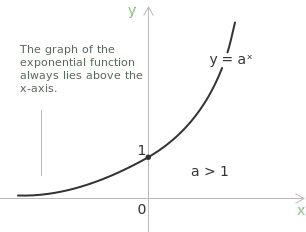

## Introduction

Exponential equations are [equations](../equations/) in which the unknown appears in the exponent of a [power](../powers/). They take the general form:

$$a^{f(x)} = b^{g(x)}$$

or, in the simpler cases, the form:

$$a^x = b$$

We assume that $a$ and $b$ are positive [real numbers](../types-of-numbers/) and that $a \neq 1$. Since $a^x > 0$ for every $x \in \mathbb{R}$ when $a > 0$, an exponential equation is impossible when $b \leq 0$, while it has a unique solution when $b > 0$.

- - -

The behavior of these equations follows directly from the [exponential function](../exponential-function/). When $a > 1$, the graph of $y = a^x$ lies entirely above the $x$-axis, never touches it, always passes through the point $(0, 1)$, and increases from left to right. This monotonic behavior is what guarantees a unique solution whenever $b > 0$.

The base $a = 1$ is excluded for a related reason. The equation $1^x = 1$ holds for every real number $x$, because $1^x$ equals $1$ regardless of the exponent. In this situation the equation is satisfied by infinitely many values and is therefore undetermined, which is precisely why the standard definition requires $a \neq 1$.

## How to solve exponential equations of the form $a^{f(x)} = b$

Equations of the form $a^{f(x)} = b$ can be solved by rewriting $b$ as a power of $a$. This brings both sides to a common base:

$$a^{f(x)} = a^k$$

Since the base is the same on both sides, the equation is equivalent to the equality of the exponents:

$$f(x) = k$$

## Example 1

We solve the exponential equation:

$$3^{x^2 - 2x} - 27 = 0$$

- - -

The first step is to bring the equation to the form $a^{f(x)} = b$ and then express the right-hand side as a power of $3$:

$$
\begin{align}
&3^{x^2 - 2x} - 27 = 0 \\[6pt]
&3^{x^2 - 2x} = 27 \\[6pt]
&3^{x^2 - 2x} = 3^3
\end{align}
$$

- - -

Both sides now share the same base, so we equate the exponents:

$$
\begin{align}
&x^2 - 2x = 3 \\[6pt]
&x^2 - 2x - 3 = 0
\end{align}
$$

The result is a [quadratic equation](../quadratic-equations/), which can be solved at once by [factoring](../factoring-quadratic-equations/) the trinomial:

$$(x + 1)(x - 3) = 0$$

The values that satisfy the equation are:

$$x_1 = -1 \quad \text{and} \quad x_2 = 3$$

## When bases differ: solving with logarithms

The previous example reduced to an equality between powers with the same base. This is not always possible. When the two sides cannot be written with a common base, we apply a [logarithm](../logarithms/) to both sides in order to bring the unknown out of the exponent. Consider the equation:

$$3^{x^2} = 4$$

Taking the base-$3$ logarithm of both sides gives:

$$\log_3 3^{x^2} = \log_3 4$$

By the power rule for logarithms, the left-hand side simplifies and the unknown can be isolated:

$$
\begin{align}
&x^2 \log_3 3 = \log_3 4 \\[6pt]
&x^2 = \log_3 4 \\[6pt]
&x = \pm \sqrt{\log_3 4}
\end{align}
$$

> The same idea underlies the solution of [logarithmic equations](../logarithmic-equations/), where the logarithm and the exponential are again used as inverse operations to isolate the unknown.

- - -

There is also an intermediate situation. In equations of the form $a^{f(x)} = b^{f(x)}$, when $f(x) \neq 0$, the bases can sometimes be reconciled by writing $b$ as a power of $a$, so that the exponents can be compared directly as in Example 1. Consider the equation:

$$3^{x + 3} = 9^{\frac{1 - x}{2}}$$

Using the properties of [powers](../powers/), the right-hand side is rewritten with base $3$:

$$
\begin{align}
&3^{x + 3} = (3^2)^{\frac{1 - x}{2}} \\[6pt]
&3^{x + 3} = 3^{1 - x}
\end{align}
$$

Both sides are now powers with the same base, so we equate the exponents and solve the resulting [linear equation](../linear-equations/):

$$
\begin{align}
&x + 3 = 1 - x \\[6pt]
&2x = 1 - 3 \\[6pt]
&x = -1
\end{align}
$$

- - -

## Equations reducible to a polynomial by substitution

A frequent class of exponential equations contains the same exponential expression more than once, often with one term squared. These equations are solved by introducing a new variable equal to the exponential, which transforms the problem into an algebraic equation. Consider the equation:

$$4^{x} - 5 \cdot 2^{x} + 4 = 0$$

The two exponential terms can be expressed through the single base $2$. Since $4^{x} = (2^2)^{x} = (2^{x})^2$, the substitution $t = 2^{x}$ turns the equation into a [quadratic equation](../quadratic-equations/):

$$t^2 - 5t + 4 = 0$$

Applying the [quadratic formula](../quadratic-formula/) gives:

$$t = \frac{5 \pm \sqrt{25 - 16}}{2} = \frac{5 \pm 3}{2}$$

so $t_1 = 4$ and $t_2 = 1$.

- - -

Reversing the substitution $t = 2^{x}$ produces two elementary exponential equations. The first is:

$$2^{x} = 4$$

which gives $x = 2$, since $4 = 2^2$. The second is:

$$2^{x} = 1$$

which gives $x = 0$, since $1 = 2^0$. Both values are admissible, because the substitution $t = 2^{x}$ produces only positive values and both roots $t_1 = 4$ and $t_2 = 1$ are positive. The equation therefore has the two solutions:

$$x_1 = 0 \qquad x_2 = 2$$

> The condition $t > 0$ must always be checked when reversing the substitution. A zero or negative value of $t$ has to be discarded, since $a^{x} > 0$ for every real $x$ when $a > 0$, and no real exponent can produce it.

## Equations with terms of opposite sign in the exponent

A related case arises when the unknown appears with exponents of opposite sign, so that an exponential and its reciprocal occur together. Consider the equation:

$$e^{x} - e^{-x} = \frac{3}{2}$$

The two terms are reciprocals, since $e^{-x} = \frac{1}{e^{x}}$. Setting $t = e^{x}$, with $t > 0$, the equation becomes:

$$t - \frac{1}{t} = \frac{3}{2}$$

Multiplying both sides by $t$, which is nonzero, clears the denominator and produces a [quadratic equation](../quadratic-equations/):

$$t^2 - \frac{3}{2}t - 1 = 0$$

Multiplying through by $2$ to remove the fraction gives:

$$2t^2 - 3t - 2 = 0$$

- - -

Applying the [quadratic formula](../quadratic-formula/) gives:

$$t = \frac{3 \pm \sqrt{9 + 16}}{4} = \frac{3 \pm 5}{4}$$

so $t_1 = 2$ and $t_2 = -\frac{1}{2}$. The value $t_2 = -\frac{1}{2}$ is negative and must be discarded, since $e^{x}$ is always positive. Only $t_1 = 2$ is admissible, and reversing the substitution gives:

$$e^{x} = 2 \quad \rightarrow \quad x = \ln 2$$

The equation therefore has the single solution $x = \ln 2$.

## Existence and number of solutions

The number of solutions of an exponential equation reflects the behaviour of the [exponential function](../exponential-function/). For a base $a > 1$ the function $a^{x}$ is strictly increasing, while for $0 < a < 1$ it is strictly decreasing; in both cases it is injective, so an elementary equation $a^{x} = b$ has at most one solution. A solution exists precisely when $b > 0$, since the range of the exponential is the set of positive reals.

When an exponential equation is reduced to an algebraic equation by substitution, the number of real solutions depends on how many of the algebraic roots are positive. Each positive root of the auxiliary variable yields exactly one value of the unknown through a logarithm, whereas a zero or negative root corresponds to no real solution. Counting the admissible roots therefore determines the number of solutions of the original equation, a principle that also governs the parametric case discussed in the entry on [equations with parameters](../equations-with-parameters/).
