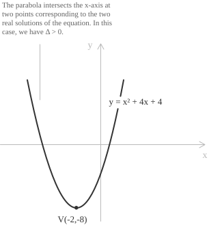

## Definition

In the entry on [quadratic equations](../quadratic-equations/), we showed that an equation of this type, written in standard form $ax^2 + bx + c = 0,$ involves a polynomial of degree two and always has exactly two roots in $\mathbb{C},$ counted with multiplicity, by the [fundamental theorem of algebra](../roots-of-a-polynomial/). As we will recall later in this entry, the nature of the roots is determined by the sign of the discriminant $\Delta = b^2 - 4ac.$ The roots are most often found using the quadratic formula:

$$x_{1,2} = \frac{-b \pm \sqrt{b^2 - 4ac}}{2a} \tag{1}$$

Formula $(1)$ provides a straightforward procedure for solving any quadratic equation. It applies to equations with real or complex coefficients, provided that $a \neq 0,$ since $a$ appears in the denominator. The following points describe the terms in $(1):$

+ $a,$ $b$ and $c$ are the coefficients of the quadratic equation in standard form, and, as stated above, $a \neq 0.$
+ The plus-minus sign gives the values corresponding to the two roots of the polynomial.

Formula $(1)$ also allows us to study how the roots vary when the coefficients depend on a parameter, as shown in the entry on [quadratic equations with parameters](../quadratic-equations-with-parameters/).

- - -

For the following classification and its [geometric interpretation](../geometrical-meaning-quadratic-equations/), we assume that the coefficients $a,$ $b$ and $c$ are real.

As noted at the beginning, the expression under the square root, $b^2 - 4ac,$ is called the discriminant. Its sign uniquely determines the number and nature of the solutions.

When $\Delta > 0,$ the equation has two distinct real solutions. We write the solution set as $S = \{\ x_1, x_2 \ \}$ with $x_1, x_2 \in \mathbb{R}$ and $x_1 \neq x_2.$ The solutions are obtained by applying $(1)$ directly.

When $\Delta = 0,$ the two real roots coincide, so the equation has a single root of multiplicity two. We write the solution set as $S = \{\ x \ \}$ with $x \in \mathbb{R}$ and $x = x_1 = x_2.$ Since the discriminant is zero, $(1)$ reduces to the following formula for the solution.

$$x = -\frac{b}{2a} \tag{2}$$

Finally, when $\Delta < 0,$ the equation has no real solutions but always has two [complex conjugate solutions](../quadratic-equations-with-complex-solutions/) with nonzero imaginary parts, which we express as $\nexists\ x \in \mathbb{R}.$ The complex solutions are obtained from $(1)$ by writing the square root as a multiple of the [imaginary unit](../complex-numbers/) $i:$

$$x_{1,2} = \frac{-b \pm i\sqrt{4ac - b^2}}{2a}\tag{3}$$

The discriminant also determines the position of the graph of the quadratic function $f(x) = ax^2 + bx + c$ relative to the $x$-axis. Geometrically, a quadratic equation is associated with a [parabola](../parabola/) whose intersections with the axis depend on the sign of the discriminant:

More precisely:

+ If $\Delta > 0,$ the parabola intersects the $x$-axis at two distinct points, so the equation has two solutions.
+ If $\Delta = 0,$ the parabola is tangent to the $x$-axis at a single point, its vertex, so the equation has one solution of multiplicity two.
+ If $\Delta < 0,$ the parabola does not intersect the $x$-axis, so the equation has no real solutions.

## Proof

We derive $(1)$ from the standard form of a quadratic equation by [completing the square](../completing-the-square/). We first rewrite $ax^2 + bx + c = 0$ with the constant term on its own on the right-hand side:

$$ax^2 + bx = -c$$

To complete the square, we divide both sides by $a,$ which is nonzero by assumption, and obtain:

$$x^2 + \frac{b}{a}x = -\frac{c}{a} \tag{4}$$

We now turn the left-hand side into a perfect square. The [square of a binomial](../notable-products/), $(a+b)^2,$ is equal to $a^2 + 2ab + b^2.$ To make the left-hand side of $(4)$ a perfect square, we therefore need to add the term corresponding to $b^2$ in this identity. We rewrite $(4)$ as follows:

$$x^2 + \frac{b}{a}x + \left(\frac{b}{2a}\right)^2 = -\frac{c}{a} + \left(\frac{b}{2a}\right)^2$$

The left-hand side is now the square of a binomial. Writing it in factored form and simplifying the right-hand side gives:

$$\left(x + \frac{b}{2a}\right)^2 = \frac{b^2 - 4ac}{4a^2} \tag{5}$$

We take square roots, including both signs because a square root and its negative have the same square. We can therefore rewrite $(5)$ as follows:

$$x + \frac{b}{2a} = \pm\frac{\sqrt{b^2 - 4ac}}{2a}$$

Isolating $x$ gives $(1):$

$$x_{1,2} = \frac{-b \pm \sqrt{b^2 - 4ac}}{2a}$$

- - -

After applying the quadratic formula, we can also check the solutions by comparing their sum and product with the coefficients of the equation. [Vieta's formulas](../vieta-formulas/) provide this check. They state that, for a quadratic equation $ax^2 + bx + c = 0$ with roots $x_1$ and $x_2,$ the following relations hold:

$$
\begin{align}
x_1 + x_2 &= -\frac{b}{a} \\[6pt]
x_1x_2 &= \frac{c}{a}
\end{align}
$$

These relations hold in $\mathbb{C}$ for any value of the discriminant. They follow by expanding the [factored form](../factoring-quadratic-equations/) $a(x - x_1)(x - x_2)$ and comparing coefficients.

## Examples

We begin by applying $(1)$ to the first equation, $x^2 - 4x + 2 = 0.$ The equation is already in standard form, with $a = 1,$ $b = -4$ and $c = 2,$ so substituting these coefficients into the formula gives:

$$
\begin{align*}
x_{1,2} &= \frac{-(-4) \pm \sqrt{(-4)^2 - 4(1)(2)}}{2(1)} \\[6pt]
&= \frac{4 \pm \sqrt{16 - 8}}{2} \\[6pt]
&= \frac{4 \pm \sqrt{8}}{2} \\[6pt]
&=\frac{4 \pm 2\sqrt{2}}{2}
\end{align*}
$$

Since $\Delta = 8 > 0,$ the equation has two distinct real solutions, namely $x_1 = 2 - \sqrt{2}$ and $x_2 = 2 + \sqrt{2}.$

- - -

The second equation requires a few steps to put it into standard form:

$$\frac{(x-1)^2}{2} - \frac{(x+1)(x-2)}{3} = \frac{x-1}{3}$$

We first clear the denominators and expand the square and the products, obtaining:

$$
\begin{align}
3(x^2 - 2x + 1) - 2(x^2 - x - 2) &= 2x - 2 \\[6pt]
3x^2 - 6x + 3 - 2x^2 + 2x + 4 &= 2x - 2 \\[6pt]
x^2 - 4x + 7 &= 2x - 2\\[6pt]
x^2 - 4x + 7 - 2x + 2 &= 0 \\[6pt]
x^2 - 6x + 9 &= 0
\end{align}
$$

The original equation is now in standard form. Its coefficients are $a = 1,$ $b = -6$ and $c = 9,$ and the discriminant is:

$$\Delta = (-6)^2 - 4(1)(9) = 36 - 36 = 0$$

Since $\Delta = 0,$ the two roots coincide. Substituting the coefficients into $(2),$ which, as noted earlier, is obtained from $(1)$ when the discriminant is zero, gives:

$$x = -\frac{b}{2a} = -\frac{-6}{2(1)} = 3$$

The equation therefore has a single real root $x = 3,$ of multiplicity two.

- - -

Finally, we solve $x^2 + 2x + 5 = 0.$ The coefficients are $a = 1,$ $b = 2$ and $c = 5,$ and this time the discriminant is negative:

$$\Delta = 2^2 - 4(1)(5) = 4 - 20 = -16$$

The equation therefore has no real solutions. We express the square root using the imaginary unit $i,$ so that $\sqrt{-16} = 4i,$ and obtain from $(3):$

$$x_{1,2} = \frac{-2 \pm 4i}{2} = -1 \pm 2i$$

The two solutions are the complex conjugates $x_1 = -1 - 2i$ and $x_2 = -1 + 2i.$
