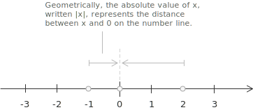
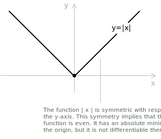
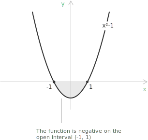
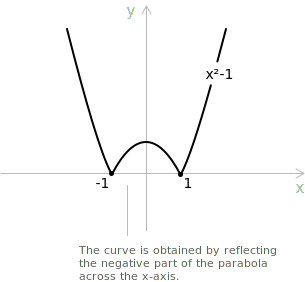

## Introduction to absolute value

This handout covers [absolute value](../absolute-value/), starting with its definition:

$$
|x| =
\begin{cases}
+x & \text{if } x \geq 0 \\[6pt]
-x & \text{if } x < 0
\end{cases}
\quad \forall \ x \in \mathbb{R}
$$

The absolute value function assigns to each real number its distance from zero on the number line. Since distance is never negative, negative numbers map to their positive counterparts and positive numbers remain unchanged.

More generally, $|x - a|$ is the distance between the points $x$ and $a$ on the number line:

$$|x-a| = |a-x|$$

Since $a - x = -(x - a)$ the two expressions inside the bars are opposites. Therefore $|a - x| = |-(x - a)| = |x - a|,$ so the two expressions are equal even though the terms inside the bars appear in reverse order.

## Graph and symmetry of the absolute value function

The absolute value function is defined as:

$$
y = |x| =
\begin{cases}
+x & \text{if } x \geq 0 \\[6pt]
-x & \text{if } x < 0
\end{cases}
$$

Its graph consists of two half-lines that meet at the origin, forming a V shape. The graph is symmetric with respect to the $y$-axis, so the function is [even](../even-and-odd-functions/) and satisfies:

$$|{-x}| = |x| \quad \text{for all } x \in \mathbb{R}$$

## Properties

+ [Domain](../determining-the-domain-of-a-function/): $\mathbb{R}$
+ Range: $\mathbb{R}^+_0$
+ Regarding monotonicity, the function is [decreasing](../increasing-and-decreasing-functions/) on $(-\infty, 0]$ and increasing on $[0, +\infty).$
+ The function is [even](../even-and-odd-functions/), since $|{-x}| = |x|.$
+ The function is [continuous](../continuous-functions/) on the whole real line $\mathbb{R}.$
+ The function is differentiable everywhere except at $x = 0,$ where it has a [corner point](../points-of-non-differentiability/).
+ The function has an [absolute minimum](../maximum-minimum-and-inflection-points/) at $x = 0,$ where $|x| = 0,$ and it has no maximum.
+ The limits at the endpoints of the domain are:

$$
\begin{align}
\lim_{x \to -\infty} |x| &= +\infty \\[6pt]
\lim_{x \to +\infty} |x| &= +\infty
\end{align}
$$

## Graphing the absolute value of a function by flipping the negative part

Consider the [parabola](../parabola/) defined by the equation:

$$y = x^2 - 1$$

Part of this curve lies below the $x$-axis, in the interval where the function is negative. To find this interval, we solve the inequality:

$$x^2 - 1 < 0 \quad \Longrightarrow \quad -1 < x < 1$$

So $y = x^2 - 1$ is negative on the open interval $(-1, 1),$ where the graph lies below the $x$-axis.

To graph $f(x) = |x^2 - 1|,$ we start from the graph of $y = x^2 - 1.$ We keep the parts of the graph that lie on or above the $x$-axis and reflect across the $x$-axis the parts that originally lay below it.

The reflected graph has all values non-negative, as the absolute value requires.

## Limits, derivatives, and integrals of the absolute value function

A basic [limit](../limits/) for the absolute value function is:

$$\lim_{x \to 0} \frac{|x|}{x}$$

This limit does not exist, because the left-hand and right-hand limits are different:

$$\lim_{x \to 0^-} \frac{|x|}{x} = -1 \quad \text{and} \quad \lim_{x \to 0^+} \frac{|x|}{x} = 1$$

Because the two one-sided limits differ, $|x|$ is not differentiable at $x = 0.$

The [derivative](../derivatives/) of the absolute value function is defined piecewise as:

$$
\frac{d}{dx} |x| =
\begin{cases}
1 & \text{if } x > 0 \\[6pt]
-1 & \text{if } x < 0
\end{cases}
$$

The derivative does not exist at $x = 0,$ because the function has a [corner point](../points-of-non-differentiability/) there.

The [indefinite integral](../indefinite-integrals/) of the absolute value function is:

$$\int |x| \ dx = \frac{x^2 \cdot \mathrm{sgn}(x)}{2} + c$$

$\mathrm{sgn}(x)$ is the [sign function](../sign-function/), defined as:

$$
\mathrm{sgn}(x) =
\begin{cases}
-1 & \text{if } x < 0 \\[6pt]
0 & \text{if } x = 0 \\[6pt]
1 & \text{if } x > 0
\end{cases}
$$
