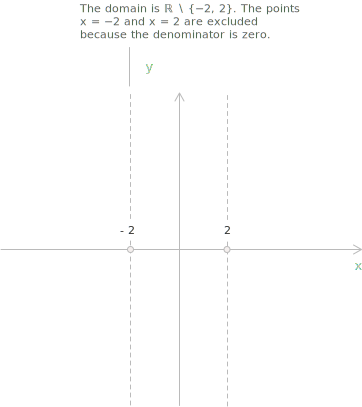
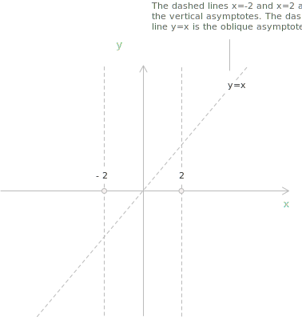
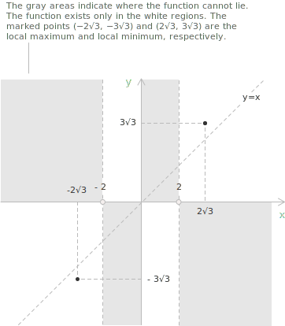
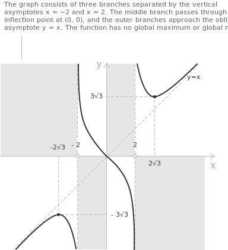

## Introduction

Studying the graph of a function $y=f(x)$ means recovering its qualitative shape through an ordered sequence of steps, each of which fixes one feature of the curve. The procedure consists of the following stages.

+ Determine the [domain](../determining-the-domain-of-a-function/), the set of real numbers on which $f$ is defined.
+ Test the function for [symmetry](../even-and-odd-functions/) about the $y$-axis or the origin.
+ Find the intercepts with the coordinate axes.
+ Study the sign of $f$ to locate the regions where the graph lies above and below the $x$-axis.
+ Identify the [asymptotes](../asymptotes/), vertical, horizontal, or oblique.
+ Use the first derivative to find the intervals of [monotonicity](../increasing-and-decreasing-functions/) and the local extrema.
+ Use the second derivative to find the [concavity](../convexity-and-concavity-of-functions/) and the [inflection points](../maximum-minimum-and-inflection-points/).
+ Assemble the information into a qualitative graph.

We apply the procedure to the [rational function](../rational-functions/):

$$f(x)=\frac{x^3}{x^2-4}$$

The numerator has degree three and the denominator degree two, a gap of one that produces an oblique asymptote.

## Domain

A rational function is defined wherever its denominator is different from zero, so the only restriction comes from the values that make $x^2-4$ vanish. We impose the condition:

$$x^2-4\neq0$$

The [incomplete quadratic equation](../incomplete-quadratic-equations/) $x^2-4=0$ has solutions $x=-2$ and $x=2,$ which we remove from the real line. The domain is the set:

$$D=\mathbb{R}\setminus\{-2,2\}$$

The two excluded values are equidistant from zero, so the domain is symmetric about the origin. A symmetric domain is necessary for evenness or oddness, so $f$ may have one of these symmetries.

## Symmetry

A function is even when $f(-x)=f(x)$ holds for every $x$ in its domain, in which case the graph is symmetric about the $y$-axis. It is odd when $f(-x)=-f(x)$ holds for every such $x,$ in which case the graph is symmetric about the origin. To decide which case applies, we replace $x$ with $-x$ and simplify:

$$
\begin{align}
f(-x) &= \frac{(-x)^3}{(-x)^2-4} \\[6pt]
      &= \frac{-x^3}{x^2-4} \\[6pt]
      &= -f(x)
\end{align}
$$

The cube changes sign while the square does not, so the whole quotient changes sign. Since $f(-x)=-f(x)$ on the entire domain, the function is odd and its graph is symmetric about the origin. We could therefore study only the half-line $x>0$ and reflect the result through the origin, but the calculations below treat the full domain so that the method stays general.

## Intersections with the coordinate axes

The graph meets the $y$-axis at the point with $x=0$ and the $x$-axis at the points where $f(x)=0$. Setting $x=0$ we obtain:

$$f(0)=\frac{0^3}{0^2-4}=0$$

The graph crosses the $y$-axis at the origin $(0,0).$ To find the intersections with the $x$-axis we set the function equal to zero:

$$\frac{x^3}{x^2-4}=0$$

A fraction vanishes only where its numerator is zero and its denominator is not, so the equation reduces to $x^3=0,$ which gives $x=0.$ The single solution belongs to the domain, so the graph touches the $x$-axis only at the origin. Both conditions return the same point, and the graph meets the axes exclusively at:

$$(0,0)$$

## Sign of the function

We locate the regions where the graph lies above the $x$-axis by solving the inequality:

$$\frac{x^3}{x^2-4}>0$$

A quotient is positive when its numerator and denominator have the same sign, so we examine the two factors separately. The numerator satisfies $x^3>0$ for $x>0.$ The denominator satisfies $x^2-4>0$ for $x<-2$ and for $x>2.$ The points $-2,$ $0$ and $2$ split the real line into four intervals, and on each one the sign of $f$ is the product of the two factor signs:

[class="table-sign"]

|             |      | $-2$      | $0$  | $2$ |
|:-----------:|:----:|:-----------:|:------:|:-----:|
| $x^3>0$ | $-$ | $-$ | $+$ | $+$ |
| $x^2-4>0$ | $+$ | $-$ | $-$ | $+$ |
| $\dfrac{x^3}{x^2-4}>0$ | $-$ | $+$ | $-$ | $+$ |

[/class]

The function is positive on $(-2,0)\cup(2,+\infty),$ negative on $(-\infty,-2)\cup(0,2),$ and zero only at $x=0.$

> The sign of a quotient is obtained in the same way as the sign of a product. On each interval we multiply the signs of the individual factors and read off the result. For a review of this technique, see the page on [sign analysis](../sign-analysis-in-inequalities/).

## Asymptotes

The behavior of $f$ near the excluded points and toward infinity is read from [limits](../limits/), which reveal the asymptotes. A vertical asymptote $x=x_0$ occurs when a one-sided limit of $f$ at $x_0$ is infinite. A horizontal asymptote $y=L$ occurs when $\lim_{x\to\pm\infty}f(x)$ equals a finite number $L.$ An oblique asymptote $y=mx+q$ occurs when $f$ grows like a line at infinity. The slope is the limit:

$$m=\lim_{x\to\pm\infty}\frac{f(x)}{x}$$

This limit must be finite and different from zero. The intercept is then the limit:

$$q=\lim_{x\to\pm\infty}\left[f(x)-mx\right]$$

This limit must be finite as well.

The excluded points $x=-2$ and $x=2$ are [points of discontinuity](../discontinuities-of-real-functions/), and the function is unbounded near each of them, so both are candidates for vertical asymptotes. We compute the one-sided limits at $x=-2.$ For the left limit:

$$\lim_{x\to-2^-}\frac{x^3}{x^2-4}=-\infty$$

As $x\to-2^-$ the variable stays below $-2,$ so its absolute value exceeds $2$ and the denominator $x^2-4$ approaches zero through positive values. The numerator approaches $(-2)^3=-8,$ a negative number, so the quotient diverges to $-\infty.$ For the right limit:

$$\lim_{x\to-2^+}\frac{x^3}{x^2-4}=+\infty$$

Now $x$ lies between $-2$ and $2,$ its absolute value is smaller than $2,$ and the denominator approaches zero through negative values. The numerator still approaches $-8,$ so the quotient diverges to $+\infty.$ The two infinite limits confirm that $x=-2$ is a vertical asymptote.

- - -

We repeat the computation at $x=2.$ For the left limit:

$$\lim_{x\to2^-}\frac{x^3}{x^2-4}=-\infty$$

Here $x$ lies between $-2$ and $2,$ the denominator approaches zero through negative values, and the numerator approaches $2^3=8,$ a positive number, so the quotient diverges to $-\infty.$ For the right limit:

$$\lim_{x\to2^+}\frac{x^3}{x^2-4}=+\infty$$

For $x>2$ the denominator approaches zero through positive values while the numerator approaches $8,$ so the quotient diverges to $+\infty.$ The line $x=2$ is therefore a vertical asymptote as well.

- - -

The domain extends without bound in both directions, so we examine the behavior at infinity. We compute:

$$\lim_{x\to-\infty}\frac{x^3}{x^2-4}=-\infty \qquad \lim_{x\to+\infty}\frac{x^3}{x^2-4}=+\infty$$

The function diverges in both directions, so it has no horizontal asymptote. The infinite limits leave open the possibility of an oblique asymptote, which we test by computing $m$ and $q.$ For the slope:

$$
\begin{align}
m &= \lim_{x\to\pm\infty}\frac{f(x)}{x} \\[6pt]
  &= \lim_{x\to\pm\infty}\frac{x^3}{x(x^2-4)} \\[6pt]
  &= \lim_{x\to\pm\infty}\frac{x^3}{x^3-4x} \\[6pt]
  &= 1
\end{align}
$$

The ratio tends to $1$ because the numerator and denominator have the same leading term $x^3.$ With $m=1$ we compute the intercept:

$$
\begin{align}
q &= \lim_{x\to\pm\infty}\left[\frac{x^3}{x^2-4}-x\right] \\[6pt]
  &= \lim_{x\to\pm\infty}\frac{x^3-x(x^2-4)}{x^2-4} \\[6pt]
  &= \lim_{x\to\pm\infty}\frac{4x}{x^2-4} \\[6pt]
  &= 0
\end{align}
$$

Both limits return the same finite values for every direction, so the line:

$$y=x$$

is an oblique asymptote for $x\to-\infty$ and for $x\to+\infty.$

- - -

The same result follows from a shorter route available to this type of function. [Polynomial division](../polynomial-division/) of the numerator by the denominator gives quotient $x$ and remainder $4x,$ so that $x^3=(x^2-4)x+4x.$ Dividing both sides by $x^2-4$ rewrites the function as:

$$f(x)=x+\frac{4x}{x^2-4}$$

The remainder term has numerator of degree one and denominator of degree two, so it tends to zero as $x\to\pm\infty.$ At infinity the function reduces to the line $y=x,$ which recovers the oblique asymptote and shows that the quotient of the division is its equation. This shortcut applies whenever the numerator degree exceeds the denominator degree by exactly one.

## Monotonicity and local extrema

The [first derivative](../derivatives/) records where the function rises and falls. We differentiate the quotient with the [quotient rule](../differentiation-rules/):

$$
\begin{align}
f'(x) &= \frac{3x^2(x^2-4)-x^3\cdot2x}{(x^2-4)^2} \\[6pt]
      &= \frac{3x^4-12x^2-2x^4}{(x^2-4)^2} \\[6pt]
      &= \frac{x^4-12x^2}{(x^2-4)^2} \\[6pt]
      &= \frac{x^2(x^2-12)}{(x^2-4)^2}
\end{align}
$$

The critical points solve $f'(x)=0.$ On the domain the denominator never vanishes, so the equation reduces to the numerator:

$$x^2(x^2-12)=0$$

The factor $x^2$ gives $x=0,$ and the factor $x^2-12$ gives $x=\pm\sqrt{12}=\pm2\sqrt{3}.$ To classify these points we study the sign of $f'.$ The denominator $(x^2-4)^2$ is positive on the whole domain, and $x^2$ is positive away from the origin, so the sign of $f'$ matches the sign of $x^2-12,$ except at $x=0$ where the derivative vanishes. The factor satisfies $x^2-12>0$ for $x<-2\sqrt{3}$ and for $x>2\sqrt{3}.$ The critical values $\pm2\sqrt{3},$ the origin, and the excluded points $\pm2$ split the real line into six intervals, and on each one the sign of $f'$ is the product of the factor signs:

[class="table-sign"]

|                                    |     | $-2\sqrt{3}$ | $-2$ | $0$ | $2$ | $2\sqrt{3}$ |
| :--------------------------------: | :-: | :----------: | :--: | :-: | :-: | :---------: |
|              $x^2>0$               | $+$ |     $+$      | $+$  | $+$ | $+$ |     $+$     |
|             $x^2-12>0$             | $+$ |     $-$      | $-$  | $-$ | $-$ |     $+$     |
|           $(x^2-4)^2>0$            | $+$ |     $+$      | $+$  | $+$ | $+$ |     $+$     |
| $\dfrac{x^2(x^2-12)}{(x^2-4)^2}>0$ | $+$ |     $-$      | $-$  | $-$ | $-$ |     $+$     |

[/class]

It follows that $f$ is increasing on:

$$(-\infty,-2\sqrt{3}) \quad \text{and} \quad (2\sqrt{3},+\infty)$$

and decreasing on the intervening interval, where the vertical asymptotes at $x=\pm2$ interrupt the graph. At $x=0$ the derivative vanishes without changing sign, so the origin is not an extremum but a point with a horizontal tangent, examined with the second derivative. The derivative changes from positive to negative at $x=-2\sqrt{3},$ which gives a local maximum, and from negative to positive at $x=2\sqrt{3},$ which gives a local minimum. We evaluate the function at the minimum:

$$
\begin{align}
f(2\sqrt{3}) &= \frac{(2\sqrt{3})^3}{(2\sqrt{3})^2-4} \\[6pt]
             &= \frac{24\sqrt{3}}{12-4} \\[6pt]
             &= \frac{24\sqrt{3}}{8} \\[6pt]
             &= 3\sqrt{3}
\end{align}
$$

Since the function is odd, the value at the maximum is the opposite, $f(-2\sqrt{3})=-3\sqrt{3}.$ The function has a local maximum at $(-2\sqrt{3},-3\sqrt{3})$ and a local minimum at $(2\sqrt{3},3\sqrt{3}).$

> The local maximum value $-3\sqrt{3}$ lies below the local minimum value $3\sqrt{3},$ because the two extrema sit on separate branches divided by the vertical asymptotes. Neither value is a global extremum.

## Concavity and inflection points

The [second derivative](../higher-order-derivatives/) records how the graph bends. We differentiate $f'$ in its unfactored form $\frac{x^4-12x^2}{(x^2-4)^2},$ which keeps the algebra shorter:

$$
\begin{align}
f''(x) &= \frac{(4x^3-24x)(x^2-4)^2-(x^4-12x^2)\cdot2(x^2-4)(2x)}{(x^2-4)^4} \\[6pt]
       &= \frac{(4x^3-24x)(x^2-4)-4x(x^4-12x^2)}{(x^2-4)^3} \\[6pt]
       &= \frac{4x^5-40x^3+96x-4x^5+48x^3}{(x^2-4)^3} \\[6pt]
       &= \frac{8x^3+96x}{(x^2-4)^3} \\[6pt]
       &= \frac{8x(x^2+12)}{(x^2-4)^3}
\end{align}
$$

A factor $(x^2-4)$ cancels between numerator and denominator at the second step, which lowers the power in the denominator from four to three. We set $f''(x)=0$ to find candidate inflection points. The factor $x^2+12$ is positive for every real $x,$ so the numerator vanishes only at $x=0.$ To study the concavity we read the signs of the surviving factors. The numerator $8x(x^2+12)$ has the sign of $x,$ and the denominator $(x^2-4)^3$ has the sign of $x^2-4,$ since the cube preserves sign. The point $x=0$ and the excluded values $\pm2$ split the real line into four intervals, and on each one the sign of $f''$ fixes the concavity of the graph:

[class="table-sign"]

|             |      | $-2$ | $0$ | $2$ |
|:-----------:|:----:|:----:|:----:|:----:|
| $8x>0$ | $-$ | $-$ | $+$ | $+$ |
| $x^2+12>0$ | $+$ | $+$ | $+$ | $+$ |
| $(x^2-4)^3>0$ | $+$ | $-$ | $-$ | $+$ |
| $\dfrac{8x(x^2+12)}{(x^2-4)^3}>0$ | $-$ | $+$ | $-$ | $+$ |
| $f(x)$ | $\bigcap$ | $\bigcup$ | $\bigcap$ | $\bigcup$ |
| Concavity | Downward | Upward | Downward | Upward |

[/class]

The concavity changes at $x=0,$ and the origin belongs to the domain, so $(0,0)$ is an inflection point. The first derivative also vanishes there, so the tangent at the inflection is horizontal, and since the function decreases on both sides the inflection is descending. The concavity changes at $x=-2$ and $x=2$ as well, but those points lie outside the domain and have vertical asymptotes, so they are not inflection points. A change of concavity therefore signals an inflection only where the function is defined.

## The final graph

The collected data fix the shape of the curve on each of its three branches. On $(-\infty,-2)$ the graph approaches the asymptote $y=x$ from below as $x\to-\infty,$ rises to the local maximum $(-2\sqrt{3},-3\sqrt{3}),$ then falls to $-\infty$ as $x\to-2^-,$ remaining concave down throughout. On $(-2,2)$ the graph descends from $+\infty$ at $x\to-2^+$ to $-\infty$ at $x\to2^-,$ crossing the origin at the descending horizontal inflection, concave up to the left of the origin and concave down to its right. 

On $(2,+\infty)$ the graph falls from $+\infty$ at $x\to2^+$ to the local minimum $(2\sqrt{3},3\sqrt{3}),$ then rises toward the asymptote $y=x$ from above, remaining concave up throughout. The odd symmetry maps the left branch onto the right branch through the origin, so the two outer branches are reflections of each other. The function has no global maximum and no global minimum, since it diverges to $+\infty$ and to $-\infty.$

> This is only one example of how a function is analyzed. As discussed at the beginning of this page, the shape of the graph depends on the type of function and its mathematical properties. For example, polynomial, rational, exponential, logarithmic, and trigonometric functions each have their own characteristic behavior. What remains the same is the overall process: identify the function’s main properties and use them to reconstruct its graph.