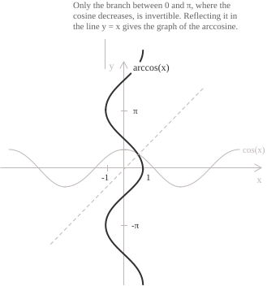
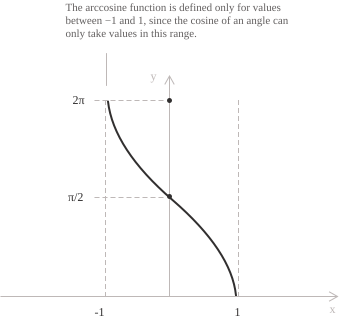

## Introduction

The entry [arcsine and arccosine](../arcsine-and-arccosine/) defines the arccosine as the angle whose cosine is a given value. Here the arccosine is a real [function](../functions/) of a real variable.

The [cosine](../cosine-function/) is periodic, so it takes every value of $[-1, 1]$ infinitely many times and has no inverse on the whole of $\mathbb{R}.$ Restricted to the interval $[0, \pi],$ it is continuous and strictly decreasing, and it maps that interval onto $[-1, 1].$ The restricted cosine is a bijection, and its [inverse function](../inverse-function/) is the arccosine:

$$\arccos : [-1, 1] \to [0, \pi]$$

The function $f(x) = \arccos(x)$ assigns to each $x \in [-1, 1]$ the unique angle in $[0, \pi],$ measured in [radians](../angles-and-angular-measure/), whose cosine equals $x.$ Its graph is the reflection of the restricted cosine branch in the line $y = x.$

The two compositions agree with the identity function on different sets. Applying the cosine after the arccosine returns $x$ for every $x \in [-1, 1],$ whereas applying the arccosine after the cosine returns $\theta$ only when $\theta$ lies in the restricted interval:

$$
\begin{align}
\cos(\arccos(x)) &= x \quad \forall x \in [-1, 1] \\[6pt]
\arccos(\cos(\theta)) &= \theta \quad \iff \quad \theta \in [0, \pi]
\end{align}
$$

> Outside that interval the arccosine returns the angle in $[0, \pi]$ having the same cosine as $\theta.$ For $\theta = -\frac{\pi}{3}$ the cosine equals $\frac{1}{2},$ so $\arccos(\cos(-\pi/3)) = \frac{\pi}{3}.$

## Properties

As the inverse of the restricted cosine, the arccosine has the following properties.

+ [Domain](../determining-the-domain-of-a-function/): $x \in [-1, 1]$
+ Range: $0 \leq y \leq \pi$
+ Periodicity: the arccosine is not periodic.
+ Parity: neither [even nor odd](../even-and-odd-functions/), with $\arccos(-x) = \pi - \arccos(x)$
+ Monotonicity: strictly [decreasing](../increasing-and-decreasing-functions/) on the whole domain
+ Root: $x = 1,$ the only point of the domain at which the function vanishes
+ [Maximum and minimum points](../maximum-minimum-and-inflection-points/): the maximum value $\pi$ is attained at $x = -1$ and the minimum value $0$ at $x = 1.$

The arccosine is bounded, and its minimum and maximum are attained at the endpoints of the domain. The relation $\arccos(-x) = \pi - \arccos(x)$ makes the graph symmetric about the point $\left(0, \frac{\pi}{2}\right).$ For every $x \in [-1, 1],$ the arccosine and the [arcsine](../arcsine-function/) satisfy the identity:

$$\arcsin(x) + \arccos(x) = \frac{\pi}{2}$$

Since the sine is non-negative on $[0, \pi],$ the [Pythagorean identity](../pythagorean-identity/) gives algebraic expressions for the sine and tangent of the angle $\arccos(x):$

$$
\begin{align}
\sin(\arccos(x)) &= \sqrt{1 - x^2} \\[6pt]
\tan(\arccos(x)) &= \frac{\sqrt{1 - x^2}}{x}
\end{align}
$$

The first identity holds for every $x \in [-1, 1],$ whereas the second holds for $x \in [-1, 1]$ with $x \neq 0,$ since $\tan(\arccos(0)) = \tan\left(\frac{\pi}{2}\right)$ is undefined.

The arccosine also has a representation in terms of the [complex logarithm](../complex-logarithm/). For $x \in [-1, 1],$ set $w = \arccos(x)$ and $u = e^{iw}.$ [Euler's formula](../eulers-formula/) turns $\cos(w) = x$ into the quadratic equation $u^2 - 2xu + 1 = 0.$ Since $\sin(w) \geq 0,$ the corresponding root is $u = x + i\sqrt{1 - x^2} = e^{i\arccos(x)}.$ Taking the principal value of the complex logarithm gives:

$$\arccos(x) = -i\mathrm{Log}\left(x + i\sqrt{1 - x^2}\right)$$

Here $\mathrm{Log}$ is the principal value of the complex logarithm, defined by $\mathrm{Log}(z) = \ln|z| + i\mathrm{Arg}(z),$ where $\mathrm{Arg}(z) \in (-\pi, \pi].$ For $w \in [0, \pi],$ the principal argument of $e^{iw}$ is $w,$ including at $w = \pi.$ Thus the formula also holds for $x = -1,$ where $\mathrm{Log}(-1) = i\pi.$

## Limits, derivatives, and integrals of the arccosine function

The arccosine is [continuous](../continuous-functions/) on $[-1, 1]$ because it is the inverse of the continuous, strictly monotone restriction of the cosine. To determine its behavior near the origin, set $y = \frac{\pi}{2} - \arccos(x).$ Then $y \to 0$ as $x \to 0,$ and $x = \sin(y).$ The quotient below is therefore equal to $-y/\sin(y),$ so the standard limit $\sin(y)/y \to 1$ gives:

$$\lim_{x \to 0} \frac{\arccos(x) - \frac{\pi}{2}}{x} = -1$$

Thus the line $y = \frac{\pi}{2} - x$ is the first-order approximation to the graph of the arccosine near the origin.

The function is differentiable on the open interval $(-1, 1).$ Its [derivative](../derivatives/) follows from the rule for the [derivative of an inverse function](../derivative-of-the-inverse-function/). For $x \in (-1, 1),$ set $y = \arccos(x).$ Then $y \in (0, \pi)$ and $\cos(y) = x.$ Differentiating this identity with respect to $x$ gives $-\sin(y)y' = 1.$ Since the sine is positive on this interval, $\sin(y) = \sqrt{1 - \cos^2(y)} = \sqrt{1 - x^2},$ and the derivative is:

$$\frac{d}{dx}\arccos(x) = -\frac{1}{\sqrt{1 - x^2}}$$

The derivative is an algebraic function, although the arccosine is not. It is the negative of the derivative of the arcsine, as the identity $\arcsin(x) + \arccos(x) = \frac{\pi}{2}$ requires. As $x$ approaches either endpoint from within the domain, the derivative tends to $-\infty:$

$$\lim_{x \to 1^-} -\frac{1}{\sqrt{1 - x^2}} = -\infty \qquad \lim_{x \to -1^+} -\frac{1}{\sqrt{1 - x^2}} = -\infty$$

The graph therefore has one-sided vertical tangents at the points $(1, 0)$ and $(-1, \pi).$ The cosine has horizontal tangents at $x = 0$ and $x = \pi,$ and reflection in the line $y = x$ turns them into vertical tangents.

The [indefinite integral](../indefinite-integrals/) is computed [by parts](../integration-by-parts/), differentiating the arccosine and integrating the constant factor $1:$

$$\int \arccos(x) \ dx = x\arccos(x) + \int \frac{x}{\sqrt{1 - x^2}} \ dx$$

Since the numerator equals $-\dfrac{1}{2}$ times the derivative of $1 - x^2,$ the substitution $u = 1 - x^2$ reduces the remaining integral to the integral of a power. The antiderivative is:

$$\int \arccos(x) \ dx = x\arccos(x) - \sqrt{1 - x^2} + c$$

The arccosine is not odd, but its point symmetry determines the [definite integral](../definite-integrals/) over the whole domain. The values at $x$ and $-x$ have sum $\pi$ and average $\dfrac{\pi}{2},$ so the area is equal to that of the rectangle with base $2$ and height $\dfrac{\pi}{2}.$ On the positive half of the domain, evaluating the antiderivative gives the value $1:$

$$\int_{-1}^{1} \arccos(x) \ dx = \pi \qquad \int_0^1 \arccos(x) \ dx = 1$$

## Monotonicity and convexity

The derivative $-\dfrac{1}{\sqrt{1 - x^2}}$ is negative at every point of $(-1, 1),$ so the arccosine is strictly decreasing on its whole domain and has no stationary points. Its maximum is $\pi$ and its minimum is $0.$ Both are attained at the endpoints, where the function is continuous but not differentiable.

[Convexity and concavity](../convexity-and-concavity-of-functions/) are determined by the second derivative:

$$\frac{d^2}{dx^2}\arccos(x) = -\frac{x}{\left(1 - x^2\right)^{3/2}}$$

The denominator is positive on $(-1, 1),$ so the second derivative has the sign of $-x.$ The graph is convex on $(-1, 0)$ and concave on $(0, 1).$ The point $\left(0, \frac{\pi}{2}\right)$ is an [inflection point](../maximum-minimum-and-inflection-points/) because the second derivative vanishes at $x = 0$ and changes sign there. The tangent to the graph at this point is the line $y = \frac{\pi}{2} - x.$

## Maclaurin series

The Maclaurin series of the arccosine is obtained from its derivative. For $|t| < 1,$ the derivative has the binomial expansion:

$$-\frac{1}{\sqrt{1 - t^2}} = -\sum_{n=0}^{\infty} \frac{1}{4^n}\binom{2n}{n}t^{2n}$$

Here $\binom{2n}{n}$ is the central [binomial coefficient](../binomial-coefficient/) of order $n.$

A [power series](../power-series/) can be integrated term by term inside its interval of convergence. Integrating from $0$ to $x$ and using $\arccos(0) = \dfrac{\pi}{2}$ gives the following power series, whose radius of convergence is $1:$

$$\arccos(x) = \frac{\pi}{2} - \sum_{n=0}^{\infty} \frac{1}{4^n}\binom{2n}{n}\frac{x^{2n+1}}{2n+1} = \frac{\pi}{2} - x - \frac{x^3}{6} - \frac{3x^5}{40} - \frac{5x^7}{112} - \cdots$$

Apart from the constant term only odd powers appear, because $\arccos(x) - \dfrac{\pi}{2}$ is odd. Every coefficient after the constant is negative, in agreement with the strict decrease of the function. Retaining the first two terms gives the approximation $\arccos(x) \approx \dfrac{\pi}{2} - x$ for small $x.$

At $x = 1$ the general term is asymptotic to $\dfrac{1}{2\sqrt{\pi}n^{3/2}},$ so the series converges absolutely. Abel's theorem allows us to take the limit as $x \to 1^-$ in the power series identity. Since $\arccos(1) = 0,$ the positive series subtracted from the constant term has sum $\dfrac{\pi}{2}:$

$$\sum_{n=0}^{\infty} \frac{1}{4^n}\binom{2n}{n}\frac{1}{2n+1} = \frac{\pi}{2}$$

The asymptotic estimate also shows that the series converges slowly at $x = 1.$ When $|x|$ is well below $1,$ the powers of $x$ decay quickly, and a few terms give an accurate value of $\arccos(x).$
