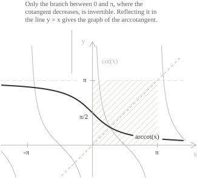

## Introduction

The entry [arctangent and arccotangent](../arctangent-and-arccotangent/) defines the arccotangent on the unit circle and lists its reference values.

The [cotangent](../cotangent-function/) has period $\pi,$ so it is not one-to-one on its domain and has no inverse there. On the open interval $(0, \pi),$ it is continuous, strictly decreasing, and surjective onto $\mathbb{R},$ so it is bijective. Its [inverse function](../inverse-function/) on that interval is the arccotangent:

$$\mathrm{arccot} : \mathbb{R} \to (0, \pi)$$

The [function](../functions/) $f(x) = \mathrm{arccot}(x)$ sends a real number $x$ to the unique angle in $(0, \pi)$ whose cotangent is $x,$ with angles measured in [radians](../angles-and-angular-measure/). The graph of the arccotangent is the reflection of the restricted cotangent branch in the line $y = x.$

The first identity below holds for every real $x.$ For $\theta \in \mathbb{R} \setminus \pi\mathbb{Z},$ the second holds exactly when $\theta$ lies in the principal interval:

$$
\begin{align}
\cot(\mathrm{arccot}(x)) &= x \quad \forall x \in \mathbb{R} \\[6pt]
\mathrm{arccot}(\cot(\theta)) &= \theta \quad \iff \quad \theta \in (0, \pi)
\end{align}
$$

When $\theta$ lies outside the principal interval and the cotangent is defined at $\theta,$ we have $\mathrm{arccot}(\cot(\theta)) = \theta - k\pi,$ where $k$ is the unique integer such that $\theta - k\pi \in (0, \pi).$ For $\theta = -\pi/4,$ the integer is $k = -1$ and $\mathrm{arccot}(\cot(-\pi/4)) = 3\pi/4.$

> An alternative convention defines $\mathrm{arccot}(x) = \arctan(1/x)$ for $x \neq 0$ and sets $\mathrm{arccot}(0) = \pi/2.$ The resulting function is odd on $\mathbb{R} \setminus \{0\}$ but has a jump discontinuity at $0.$ The branch used here has range $(0, \pi)$ and is continuous on $\mathbb{R}.$

## Properties

As the inverse of the restricted cotangent, the arccotangent has the following properties.

+ [Domain](../determining-the-domain-of-a-function/): $x \in \mathbb{R}$
+ Range: $0 < y < \pi$
+ Periodicity: the arccotangent is not periodic.
+ Parity: neither [even nor odd](../even-and-odd-functions/), with $\mathrm{arccot}(-x) = \pi - \mathrm{arccot}(x)$
+ Monotonicity: strictly [decreasing](../increasing-and-decreasing-functions/) on its domain
+ Roots: none, since the function is positive at every point of the domain
+ [Maximum and minimum points](../maximum-minimum-and-inflection-points/): none, because the two bounds are not attained

The relation $\mathrm{arccot}(-x) = \pi - \mathrm{arccot}(x)$ shows that the graph has a centre of symmetry at $\left(0, \pi/2\right).$ Setting $x = 0$ gives $\mathrm{arccot}(0) = \pi/2.$

The arccotangent has a closed form in terms of the [complex logarithm](../complex-logarithm/). Set $w = \mathrm{arccot}(x)$ and $u = e^{2i\left(w - \pi/2\right)}.$ Using [Euler's formula](../eulers-formula/), the equation $\cot(w) = x$ becomes:

$$i\frac{u - 1}{u + 1} = x$$

Solving for $u$ gives $u = (1 - ix)/(1 + ix).$ The number $u$ has modulus $1.$ Since $2w - \pi$ lies in $(-\pi, \pi),$ it is the principal argument of $u,$ and $\mathrm{Log}(u) = 2i\left(w - \pi/2\right).$ Isolating $w$ gives:

$$\mathrm{arccot}(x) = \frac{\pi}{2} - \frac{i}{2}\mathrm{Log}\left(\frac{1 - ix}{1 + ix}\right)$$

Here $\mathrm{Log}$ is the principal logarithm on $\mathbb{C} \setminus (-\infty, 0],$ defined by $\mathrm{Log}(z) = \ln|z| + i\mathrm{Arg}(z)$ with $\mathrm{Arg}(z) \in (-\pi, \pi).$ For real $x$ the quotient never lies on the branch cut.

## Limits and horizontal asymptotes

The cotangent tends to $+\infty$ as its argument approaches $0$ from the right and to $-\infty$ as its argument approaches $\pi$ from the left. The inverse relation gives the corresponding limits at infinity:

$$\lim_{x \to +\infty} \mathrm{arccot}(x) = 0 \qquad \lim_{x \to -\infty} \mathrm{arccot}(x) = \pi$$

The $x$-axis and the line $y = \pi$ are [horizontal asymptotes](../asymptotes/). They are the reflections in the line $y = x$ of the vertical asymptotes $x = 0$ and $x = \pi$ of the restricted cotangent branch. Since the arccotangent is decreasing and bounded, its [infimum and supremum](../supremum-and-infimum/) are $0$ and $\pi,$ respectively.

Near the origin the graph is approximated by the line $y = \pi/2 - x.$ Set $y = \pi/2 - \mathrm{arccot}(x),$ so that $x = \tan(y)$ and $y \to 0$ as $x \to 0.$ Since $\left(\mathrm{arccot}(x) - \pi/2\right)/x = -y/\tan(y),$ the [standard limit](../remarkable-limits/) $\tan(y)/y \to 1$ gives:

$$\lim_{x \to 0} \frac{\mathrm{arccot}(x) - \frac{\pi}{2}}{x} = -1$$

For $x > 0,$ set $t = 1/x.$ Since $\mathrm{arccot}(x) = \arctan(t),$ we have $x\mathrm{arccot}(x) = \arctan(t)/t,$ and $t \to 0^+$ as $x \to +\infty:$

$$\lim_{x \to +\infty} x\mathrm{arccot}(x) = 1$$

Thus $\mathrm{arccot}(x) \sim 1/x$ as $x \to +\infty.$ The symmetry relation gives $\pi - \mathrm{arccot}(x) \sim -1/x$ as $x \to -\infty.$

## Derivative and integrals of the arccotangent function

The arccotangent is [continuous](../continuous-functions/) on $\mathbb{R}.$ Since the restricted cotangent is differentiable with nowhere vanishing derivative, the arccotangent is differentiable at every point by the formula for the [derivative of an inverse function](../derivative-of-the-inverse-function/). Fix a real number $x$ and set $y = \mathrm{arccot}(x),$ so that $\cot(y) = x.$ Differentiating this identity gives $-\left(1 + \cot^2(y)\right)y' = 1,$ and substituting $\cot(y) = x$ gives:

$$\frac{d}{dx}\mathrm{arccot}(x) = -\frac{1}{1 + x^2}$$

The angle $\pi/2 - \mathrm{arccot}(x)$ lies in $(-\pi/2, \pi/2)$ and has tangent $x.$ By the definition of the [arctangent](../arctangent-function/), $\arctan(x) + \mathrm{arccot}(x) = \pi/2.$ Since $\left|\mathrm{arccot}'(x)\right| = 1/(1 + x^2) \leq 1,$ with equality only at the origin, [Lagrange's theorem](../lagrange-theorem/) shows that the arccotangent is Lipschitz with constant $1:$

$$\left|\mathrm{arccot}(a) - \mathrm{arccot}(b)\right| \leq |a - b| \quad \forall a, b \in \mathbb{R}$$

A Lipschitz function is [uniformly continuous](../uniform-continuity/), so the arccotangent is uniformly continuous on $\mathbb{R}.$

Define $F(x) := \int_x^{+\infty} 1/(1 + t^2) \ dt.$ The [improper integral](../improper-integrals/) converges. By the [Fundamental Theorem of Calculus](../fundamental-theorem-of-calculus/), $F'(x) = -1/(1 + x^2) = \mathrm{arccot}'(x),$ so $F(x) - \mathrm{arccot}(x)$ is constant. Both functions tend to $0$ as $x \to +\infty,$ hence the constant is zero:

$$\mathrm{arccot}(x) = \int_x^{+\infty} \frac{dt}{1 + t^2}$$

The area under $1/(1 + t^2)$ to the right of $x$ is the angle $\mathrm{arccot}(x).$ Taking the limit as $x \to -\infty$ gives the total area $\pi.$

To compute the [indefinite integral](../indefinite-integrals/), set $u = \mathrm{arccot}(x)$ and $dv = dx$ in the [integration-by-parts](../integration-by-parts/) formula:

$$\int \mathrm{arccot}(x) \ dx = x\mathrm{arccot}(x) + \int \frac{x}{1 + x^2} \ dx$$

In the remaining integral, the numerator is half the derivative of $1 + x^2.$ With the [substitution](../integration-by-substitution/) $s = 1 + x^2,$ the integral becomes $(1/2)\int 1/s \ ds,$ so the antiderivative is:

$$\int \mathrm{arccot}(x) \ dx = x\mathrm{arccot}(x) + \frac{1}{2}\ln\left(1 + x^2\right) + C$$

Since $\mathrm{arccot}(-x) + \mathrm{arccot}(x) = \pi,$ the average value on every interval $[-a, a],$ with $a > 0,$ is $\pi/2.$ The antiderivative gives the following [definite integrals](../definite-integrals/):

$$\int_{-1}^{1} \mathrm{arccot}(x) \ dx = \pi \qquad \int_0^1 \mathrm{arccot}(x) \ dx = \frac{\pi}{4} + \frac{\ln 2}{2}$$

## Monotonicity and convexity

The derivative $-1/(1 + x^2)$ is negative everywhere, so the arccotangent is strictly decreasing on $\mathbb{R}$ and has no stationary points. The function is bounded but does not attain its bounds, so it has no extrema.

The sign of the second derivative determines [convexity and concavity](../convexity-and-concavity-of-functions/):

$$\frac{d^2}{dx^2}\mathrm{arccot}(x) = \frac{2x}{\left(1 + x^2\right)^2}$$

Since the denominator is positive, the second derivative has the sign of $x.$ The graph is concave on $(-\infty, 0)$ and convex on $(0, +\infty).$ The second derivative vanishes at $x = 0$ and changes sign there, so $\left(0, \pi/2\right)$ is an [inflection point](../maximum-minimum-and-inflection-points/). At $x = 0,$ the tangent is $y = \pi/2 - x,$ and $\left|\mathrm{arccot}'(0)\right| = 1$ is the maximum of $\left|\mathrm{arccot}'\right|$ on $\mathbb{R}.$

## Maclaurin series

For $|t| < 1,$ the derivative has a [geometric series](../geometric-series/) expansion with ratio $-t^2:$

$$-\frac{1}{1 + t^2} = -\sum_{n=0}^{\infty} (-1)^n t^{2n}$$

Inside its interval of convergence a [power series](../power-series/) may be integrated term by term. For $|x| < 1,$ integrating from $0$ to $x$ and using $\mathrm{arccot}(0) = \pi/2$ gives the [Maclaurin series](../taylor-series/), whose radius of convergence is $1:$

$$\mathrm{arccot}(x) = \frac{\pi}{2} - \sum_{n=0}^{\infty} (-1)^n \frac{x^{2n+1}}{2n+1} = \frac{\pi}{2} - x + \frac{x^3}{3} - \frac{x^5}{5} + \cdots$$

Beyond the constant term the series contains only odd powers, since $\mathrm{arccot}(x) - \pi/2$ is odd. At $x = 1$ the series converges by the [Leibniz criterion](../leibniz-criterion/). By Abel's theorem, its sum is $\lim_{x \to 1^-} \mathrm{arccot}(x) = \pi/4.$

For $x \geq 1,$ the identity $\mathrm{arccot}(x) = \arctan(1/x)$ gives a series in powers of $1/x:$

$$\mathrm{arccot}(x) = \frac{1}{x} - \frac{1}{3x^3} + \frac{1}{5x^5} - \frac{1}{7x^7} + \cdots$$

For $x \geq 1,$ this series converges, and the alternating-series error bound for a fixed truncation decreases as $x$ increases. For $x \leq -1,$ the relation $\mathrm{arccot}(-x) = \pi - \mathrm{arccot}(x)$ gives the corresponding expansion:

$$\mathrm{arccot}(x) = \pi + \frac{1}{x} - \frac{1}{3x^3} + \frac{1}{5x^5} - \frac{1}{7x^7} + \cdots \quad (x \leq -1)$$
