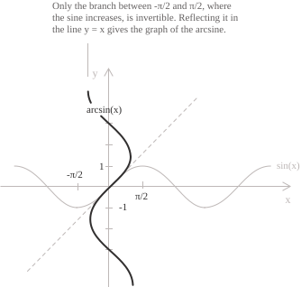
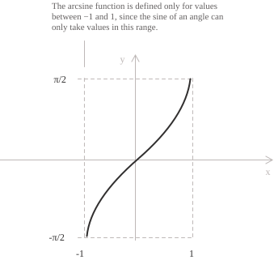

## Introduction

The entry [arcsine and arccosine](../arcsine-and-arccosine/) defines the arcsine as the angle associated with a given sine value. Here the arcsine is a real [function](../functions/) of a real variable.

The [sine](../sine-function/) is periodic, so it takes every value of $[-1, 1]$ infinitely many times and has no inverse on the whole of $\mathbb{R}.$ Restricted to the interval $\left[-\frac{\pi}{2}, \frac{\pi}{2}\right],$ it is continuous and strictly increasing, and it maps that interval onto $[-1, 1].$ The restricted sine is a bijection, and its [inverse function](../inverse-function/) is the arcsine:

$$\arcsin : [-1, 1] \to \left[-\frac{\pi}{2}, \frac{\pi}{2}\right]$$

The function $f(x) = \arcsin(x)$ assigns to each $x \in [-1, 1]$ the unique angle in $\left[-\frac{\pi}{2}, \frac{\pi}{2}\right],$ measured in [radians](../angles-and-angular-measure/), whose sine equals $x.$ Its graph is the reflection of the restricted sine branch in the line $y = x.$

The two compositions have different domains on which they return the argument. Applying the sine after the arcsine returns every $x \in [-1, 1],$ whereas applying the arcsine after the sine returns $\theta$ only when $\theta$ lies in the restricted interval:

$$
\begin{align}
\sin(\arcsin(x)) &= x \quad \forall x \in [-1, 1] \\[6pt]
\arcsin(\sin(\theta)) &= \theta \quad \iff \quad \theta \in \left[-\frac{\pi}{2}, \frac{\pi}{2}\right]
\end{align}
$$

> Outside that interval the arcsine returns the angle in $\left[-\frac{\pi}{2}, \frac{\pi}{2}\right]$ having the same sine as $\theta.$ For $\theta = \frac{3\pi}{4}$ the sine equals $\frac{\sqrt{2}}{2},$ so $\arcsin(\sin(3\pi/4)) = \frac{\pi}{4}.$

## Properties

As the inverse of the restricted sine, the arcsine has the following properties.

+ [Domain](../determining-the-domain-of-a-function/): $x \in [-1, 1]$
+ Range: $-\dfrac{\pi}{2} \leq y \leq \dfrac{\pi}{2}$
+ Periodicity: the arcsine is not periodic.
+ Parity: [odd](../even-and-odd-functions/), with $\arcsin(-x) = -\arcsin(x)$
+ Monotonicity: strictly [increasing](../increasing-and-decreasing-functions/) on the whole domain
+ Roots: $x = 0,$ the only point of the domain at which the function vanishes
+ [Maximum and minimum points](../maximum-minimum-and-inflection-points/): the maximum value $\dfrac{\pi}{2}$ is attained at $x = 1$ and the minimum value $-\dfrac{\pi}{2}$ at $x = -1.$

The arcsine is bounded, and its minimum and maximum are attained at the endpoints of the domain rather than at interior stationary points. For every $x \in [-1, 1],$ the arcsine and the [arccosine](../arcsine-and-arccosine/) satisfy the identity:

$$\arcsin(x) + \arccos(x) = \frac{\pi}{2}$$

Since the cosine is non-negative on $\left[-\frac{\pi}{2}, \frac{\pi}{2}\right],$ the [Pythagorean identity](../pythagorean-identity/) expresses the trigonometric functions of the angle $\arcsin(x)$ in algebraic form:

$$
\begin{align}
\cos(\arcsin(x)) &= \sqrt{1 - x^2} \\[6pt]
\tan(\arcsin(x)) &= \frac{x}{\sqrt{1 - x^2}}
\end{align}
$$

The first identity holds for every $x \in [-1, 1],$ whereas the second holds for $x \in (-1, 1),$ where the denominator does not vanish.

The arcsine also has a representation in terms of the complex [logarithm](../logarithmic-function/). For $x \in [-1, 1],$ set $w = \arcsin(x)$ and $u = e^{iw}.$ [Euler's formula](../eulers-formula/) turns $\sin(w) = x$ into the quadratic equation $u^2 - 2ixu - 1 = 0.$ Since $\cos(w) \geq 0,$ the corresponding root is $u = \sqrt{1 - x^2} + ix = e^{i\arcsin(x)}.$ Taking the principal complex logarithm gives:

$$\arcsin(x) = -i\ln\left(ix + \sqrt{1 - x^2}\right)$$

Here $\ln$ denotes the principal branch.

## Limits, derivatives, and integrals of the arcsine function

Near the origin both the arcsine and sine curves have the line $y = x$ as their first-order approximation. For the arcsine, set $y = \arcsin(x).$ Then $x = \sin(y)$ and $y \to 0$ as $x \to 0,$ so the standard limit $\sin(y)/y \to 1$ gives:

$$\lim_{x \to 0} \frac{\arcsin(x)}{x} = 1$$

The function is [continuous](../continuous-functions/) on $[-1, 1]$ and differentiable on the open interval $(-1, 1).$ Its [derivative](../derivatives/) follows from the rule for the [derivative of an inverse function](../derivative-of-the-inverse-function/). For $x \in (-1, 1),$ set $y = \arcsin(x).$ Then $y \in \left(-\frac{\pi}{2}, \frac{\pi}{2}\right)$ and $\sin(y) = x.$ Differentiating this identity with respect to $x$ gives $\cos(y)y' = 1.$ Since the cosine is positive on this interval, $\cos(y) = \sqrt{1 - \sin^2(y)} = \sqrt{1 - x^2},$ and the derivative is:

$$\frac{d}{dx}\arcsin(x) = \frac{1}{\sqrt{1 - x^2}}$$

The derivative is an algebraic function, although the arcsine is not. As $x$ approaches either endpoint from within the domain, the derivative tends to $+\infty:$

$$\lim_{x \to 1^-} \frac{1}{\sqrt{1 - x^2}} = +\infty \qquad \lim_{x \to -1^+} \frac{1}{\sqrt{1 - x^2}} = +\infty$$

The graph therefore reaches the points $\left(1, \frac{\pi}{2}\right)$ and $\left(-1, -\frac{\pi}{2}\right)$ with a vertical tangent. The sine has horizontal tangents at $x = \pm\frac{\pi}{2},$ and the reflection in the line $y = x$ turns them into vertical ones.

The [indefinite integral](../indefinite-integrals/) is computed [by parts](../integration-by-parts/), differentiating the arcsine and integrating the constant factor $1:$

$$\int \arcsin(x) \ dx = x\arcsin(x) - \int \frac{x}{\sqrt{1 - x^2}} \ dx$$

The remaining integral is elementary. Since the numerator equals $-\dfrac{1}{2}$ times the derivative of $1 - x^2,$ the substitution $u = 1 - x^2$ reduces it to the integral of a power. The result is:

$$\int \arcsin(x) \ dx = x\arcsin(x) + \sqrt{1 - x^2} + c$$

Over a symmetric interval the [definite integral](../definite-integrals/) vanishes, since the arcsine is odd. Over the positive half of the domain the primitive gives:

$$\int_0^1 \arcsin(x) \ dx = \frac{\pi}{2} - 1$$

## Monotonicity and convexity

The derivative $\dfrac{1}{\sqrt{1 - x^2}}$ is positive at every point of $(-1, 1),$ so the arcsine is strictly increasing on its whole domain and has no stationary points. Its minimum is $-\dfrac{\pi}{2}$ and its maximum is $\dfrac{\pi}{2}.$ Both are attained at the endpoints, where the function is continuous but not differentiable.

[Convexity and concavity](../convexity-and-concavity-of-functions/) are determined by the second derivative:

$$\frac{d^2}{dx^2}\arcsin(x) = \frac{x}{\left(1 - x^2\right)^{3/2}}$$

The denominator is positive on $(-1, 1),$ so the second derivative has the sign of $x.$ The graph is concave on $(-1, 0)$ and convex on $(0, 1).$ The origin is an [inflection point](../maximum-minimum-and-inflection-points/) because the second derivative vanishes at $x = 0$ and changes sign there. Its tangent is the line $y = x.$

## Maclaurin series

The Maclaurin series of the arcsine is obtained from its derivative. For $|t| < 1,$ the derivative has the binomial expansion:

$$\frac{1}{\sqrt{1 - t^2}} = \sum_{n=0}^{\infty} \frac{1}{4^n}\binom{2n}{n}t^{2n}$$

Here $\binom{2n}{n}$ is the central [binomial coefficient](../binomial-coefficient/) of order $n.$

A [power series](../power-series/) can be integrated term by term inside its interval of convergence. Integrating from $0$ to $x$ and using $\arcsin(0) = 0$ gives a power series of radius $1:$

$$\arcsin(x) = \sum_{n=0}^{\infty} \frac{1}{4^n}\binom{2n}{n}\frac{x^{2n+1}}{2n+1} = x + \frac{x^3}{6} + \frac{3x^5}{40} + \frac{5x^7}{112} + \cdots$$

Only odd powers appear because the arcsine is odd. The coefficients are all positive, in contrast with the alternating coefficients of the [sine series](../sine-function/). Retaining the first term gives the approximation $\arcsin(x) \approx x$ for small $x.$ Dividing the series by $x$ and taking $x \to 0$ yields $\dfrac{\arcsin(x)}{x} \to 1.$

At $x = 1$ the series still converges, and its sum is the value of the function at that point:

$$\sum_{n=0}^{\infty} \frac{1}{4^n}\binom{2n}{n}\frac{1}{2n+1} = \frac{\pi}{2}$$

The general term behaves like $\dfrac{1}{2\sqrt{\pi}n^{3/2}}$ as $n$ grows, so the series converges slowly at $x = 1$ and is inefficient for computing $\pi.$ When $|x|$ is well below $1,$ the powers of $x$ decay quickly, and a few terms give an accurate value of $\arcsin(x).$
