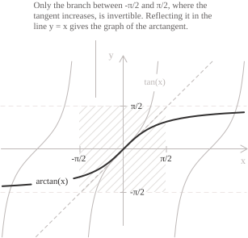

## Introduction

The entry [arctangent and arccotangent](../arctangent-and-arccotangent/) defines the arctangent on the [unit circle](../unit-circle/) and lists its reference values. Here the arctangent is a real [function](../functions/) of a real variable, with emphasis on its analytic properties and its links with [inverse functions](../inverse-function/).

The [tangent](../tangent-function/) has period $\pi,$ so it is not one-to-one on its whole domain and has no inverse there. On the open interval $\left(-\pi/2, \pi/2\right)$ it is continuous, strictly increasing, and has range $\mathbb{R},$ hence it is bijective. Its [inverse function](../inverse-function/) on that interval is the arctangent:

$$\arctan : \mathbb{R} \to \left(-\frac{\pi}{2}, \frac{\pi}{2}\right)$$

The function $f(x) = \arctan(x)$ sends a real number $x$ to the unique angle in $\left(-\pi/2, \pi/2\right)$ whose tangent is $x,$ with angles measured in [radians](../angles-and-angular-measure/). Reflecting the principal branch of the tangent in the line $y = x$ produces the graph of the arctangent.

The tangent and the arctangent are inverse functions between the principal interval and $\mathbb{R}.$ Thus the first composition below is the identity for every real $x.$ When $\tan(\theta)$ is defined, the second composition returns $\theta$ exactly when $\theta$ belongs to the principal interval:

$$
\begin{align}
\tan(\arctan(x)) &= x \\[6pt]
\arctan(\tan(\theta)) &= \theta \iff \theta \in \left(-\frac{\pi}{2}, \frac{\pi}{2}\right)
\end{align}
$$

> When $\theta$ lies outside the principal interval and $\tan(\theta)$ is defined, the arctangent returns $\theta - k\pi,$ where $k$ is the unique integer such that $\theta - k\pi \in \left(-\pi/2, \pi/2\right).$ For $\theta = \frac{5\pi}{6}$ we have $k = 1,$ so $\arctan(\tan(5\pi/6)) = -\frac{\pi}{6}.$

## Properties

As the inverse of the restricted tangent, the arctangent has the following properties.

+ [Domain](../determining-the-domain-of-a-function/): $x \in \mathbb{R}$
+ Range: $-\pi/2 < y < \pi/2$
+ Periodicity: the arctangent is not periodic.
+ Parity: [odd](../even-and-odd-functions/), with $\arctan(-x) = -\arctan(x)$
+ Monotonicity: strictly [increasing](../increasing-and-decreasing-functions/) on the whole domain
+ Root: $x = 0,$ the only point of the domain at which the function vanishes
+ [Maximum and minimum points](../maximum-minimum-and-inflection-points/): none, because the two bounds are not attained

The arctangent is odd because the tangent is odd and the principal interval is symmetric about the origin, so its graph is symmetric with respect to the origin. The function is bounded and satisfies the [absolute-value](../absolute-value/) inequality $\left|\arctan(x)\right| < \pi/2$ for every real $x.$ Its supremum $\pi/2$ and its infimum $-\pi/2$ lie outside the range, so the arctangent has neither a maximum nor a minimum.

The arctangent has a closed form in terms of the [complex logarithm](../complex-logarithm/). Set $w = \arctan(x)$ and $u = e^{2iw}.$ [Euler's formula](../eulers-formula/) rewrites $\tan(w) = x$ as the equation:

$$-i\frac{u - 1}{u + 1} = x$$

Solving for $u$ gives $u = \dfrac{1 + ix}{1 - ix}.$ The number $u$ has modulus $1.$ Since $2w$ lies in $(-\pi, \pi),$ it is the principal argument of $u,$ and $\mathrm{Log}(u) = 2iw.$ Substituting the expression for $u$ gives the formula:

$$\arctan(x) = -\frac{i}{2}\mathrm{Log}\left(\frac{1 + ix}{1 - ix}\right)$$

Here $\mathrm{Log}$ is the principal logarithm on $\mathbb{C} \setminus (-\infty, 0],$ defined by $\mathrm{Log}(z) = \ln|z| + i\mathrm{Arg}(z)$ with $\mathrm{Arg}(z) \in (-\pi, \pi).$ For real $x$ the quotient never lies on the branch cut.

## Limits and horizontal asymptotes

The tangent tends to $+\infty$ as its argument approaches $\pi/2$ from the left and to $-\infty$ as its argument approaches $-\pi/2$ from the right. The inverse relation gives the corresponding limits at infinity:

$$
\begin{align}
\lim_{x \to +\infty} \arctan(x) &= \frac{\pi}{2} \\[6pt]
\lim_{x \to -\infty} \arctan(x) &= -\frac{\pi}{2}
\end{align}
$$

The lines $y = \pi/2$ and $y = -\pi/2$ are [horizontal asymptotes](../asymptotes/) of the graph. They are the images of the vertical asymptotes of the tangent under reflection in the line $y = x.$ Near the origin the graph is approximated by the line $y = x.$ With $y = \arctan(x),$ we have $x = \tan(y)$ and $y \to 0$ as $x \to 0.$ The [standard limit](../remarkable-limits/) $\tan(y)/y \to 1$ then gives the limit:

$$\lim_{x \to 0} \frac{\arctan(x)}{x} = 1$$

The same limit describes the approach to the upper asymptote. For $x > 0,$ the [arccotangent function](../arccotangent-function/) satisfies $\mathrm{arccot}(x) = \arctan\left(\frac{1}{x}\right) = \pi/2 - \arctan(x).$ The substitution $t = 1/x$ gives the limit:

$$\lim_{x \to +\infty} x\left(\frac{\pi}{2} - \arctan(x)\right) = 1$$

The vertical gap $\pi/2 - \arctan(x)$ is therefore asymptotic to $1/x$ as $x \to +\infty.$

## Derivative and integrals of the arctangent function

The arctangent is [continuous](../continuous-functions/) on $\mathbb{R}.$ The restricted tangent has derivative $1 + \tan^2(t) > 0$ on the principal interval, so the rule for the [derivative of an inverse function](../derivative-of-the-inverse-function/) applies at every point. Fix a real number $x$ and set $y = \arctan(x),$ so that $\tan(y) = x.$ Differentiating this identity with respect to $x$ gives $\left(1 + \tan^2(y)\right)y' = 1.$ Since $\tan(y) = x,$ the [derivative](../derivatives/) is:

$$\frac{d}{dx}\arctan(x) = \frac{1}{1 + x^2}$$

The derivative of the arctangent is positive and at most $1,$ with equality only at the origin. [Lagrange's theorem](../lagrange-theorem/) shows that the arctangent is Lipschitz with constant $1.$ For every $a, b \in \mathbb{R},$ it satisfies the inequality:

$$\left|\arctan(a) - \arctan(b)\right| \leq |a - b|$$

A Lipschitz function is [uniformly continuous](../uniform-continuity/), so the arctangent is uniformly continuous on the whole real line. Since the derivative of the arctangent is $\dfrac{1}{1 + x^2}$ and $\arctan(0) = 0,$ the function has the integral representation:

$$\arctan(x) = \int_0^x \frac{dt}{1 + t^2}$$

The integral representation and the limits at $\pm\infty$ give the [improper integral](../improper-integrals/). The corresponding elementary antiderivative is also listed among the [common indefinite integrals](../indefinite-integrals/):

$$\int_{-\infty}^{+\infty} \frac{dx}{1 + x^2} = \pi$$

In the [integration-by-parts](../integration-by-parts/) formula for this [indefinite integral](../indefinite-integrals/), we differentiate the arctangent and integrate the factor $1:$

$$\int \arctan(x) \ dx = x\arctan(x) - \int \frac{x}{1 + x^2} \ dx$$

The numerator of the remaining integrand is half the derivative of $1 + x^2.$ With $u = 1 + x^2,$ the remaining integral becomes:

$$\frac{1}{2}\int \frac{1}{u} \ du$$ 
The antiderivative is:

$$\int \arctan(x) \ dx = x\arctan(x) - \frac{1}{2}\ln\left(1 + x^2\right) + C$$

Over an interval symmetric about the origin the [definite integral](../definite-integrals/) vanishes, since the arctangent is odd. On the unit interval the antiderivative gives the value:

$$\int_0^1 \arctan(x) \ dx = \frac{\pi}{4} - \frac{\ln 2}{2}$$

## Monotonicity and convexity

The derivative $\dfrac{1}{1 + x^2}$ is positive everywhere, so the arctangent is strictly increasing on the whole real line and has no stationary points or local extrema. Its bounds are not attained, so it has neither a maximum nor a minimum. The sign of the second derivative determines [convexity and concavity](../convexity-and-concavity-of-functions/):

$$\frac{d^2}{dx^2}\arctan(x) = -\frac{2x}{\left(1 + x^2\right)^2}$$

Since the denominator is positive, the sign of the second derivative is that of $-x.$ The graph is convex on $(-\infty, 0)$ and concave on $(0, +\infty).$ At the origin the second derivative vanishes and changes sign, so $(0, 0)$ is an [inflection point](../maximum-minimum-and-inflection-points/).

## Maclaurin series

For $|t| < 1,$ the derivative of the arctangent has a [geometric series](../geometric-series/) expansion with ratio $-t^2:$

$$\frac{1}{1 + t^2} = \sum_{n=0}^{\infty} (-1)^n t^{2n}$$

Inside its interval of convergence a [power series](../power-series/) may be integrated term by term. Integrating over $[0, x]$ and using $\arctan(0) = 0$ gives the following series for $|x| < 1:$

$$\arctan(x) = \sum_{n=0}^{\infty} (-1)^n \frac{x^{2n+1}}{2n+1} = x - \frac{x^3}{3} + \frac{x^5}{5} - \frac{x^7}{7} + \cdots$$

Only odd powers occur, and the coefficients alternate in sign. Truncating after the first term gives $\arctan(x) \approx x$ for small $x.$ At $x = 1$ the series for the derivative diverges, but the series for the arctangent converges by the [Leibniz criterion](../leibniz-criterion/), since the absolute values of its terms decrease to zero and their signs alternate. Abel's theorem identifies its sum with the limit of $\arctan(x)$ as $x \to 1^-:$

$$\sum_{n=0}^{\infty} \frac{(-1)^n}{2n+1} = 1 - \frac{1}{3} + \frac{1}{5} - \frac{1}{7} + \cdots = \frac{\pi}{4}$$

By oddness, the series also converges at $x = -1,$ where its sum is $-\pi/4.$ Its interval of convergence is therefore $[-1, 1].$ By the alternating-series estimate, the error after the term of index $N$ is smaller in absolute value than the first term omitted:

$$\dfrac{1}{2N+3}$$If
$$\pi_N = 4\sum_{n=0}^{N}\dfrac{(-1)^n}{2n+1}$$ 

then

$$|\pi - \pi_N| < \dfrac{4}{2N+3}$$ 
This estimate guarantees an absolute error below $10^{-6}$ when the sum contains at least two million terms. The addition formula for the arctangent gives an identity in which both arctangent arguments have absolute value less than $1:$

$$\frac{\pi}{4} = 4\arctan\left(\frac{1}{5}\right) - \arctan\left(\frac{1}{239}\right)$$

The successive powers in the two series have ratios $1/25$ and $1/239^2,$ so truncating each series after ten terms gives an approximation to $\pi$ with error less than $1.6 \cdot 10^{-15}.$
