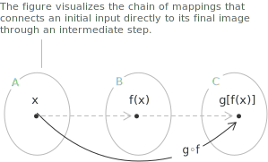

## Definition and properties of composite functions

A composite function applies one [function](../functions/) to the result of another. Given two functions $f(x)$ and $g(x),$ the composition evaluates $g$ at the output of $f,$ denoted by:

$$
g \circ f = g(f(x))
$$

We first apply $f$ to the input $x,$ then apply $g$ to the result.

> The diagram illustrates a composite function. The input $x$ from set $A$ is first mapped to $f(x)$ in set $B,$ then $f(x)$ is mapped to $g(f(x))$ in set $C,$ producing the composition $g \circ f.$

- - -

More formally, let two functions $f(x)$ and $g(x)$ be given such that:

$$
\begin{align}
f \colon A \rightarrow B \\[6pt]
g \colon B \rightarrow C \\[6pt]
f(A) \subseteq B
\end{align}
$$

The composite function is defined as follows:

$$
g \circ f \colon x \in A \rightarrow g(f(x)) \in C
$$

The function $g \circ f$ maps each element $x$ in the [domain](../determining-the-domain-of-a-function/) $A$ to the value $g(f(x)),$ provided that the image of $f$ is contained in the domain of $g.$ This containment condition $f(A) \subseteq B$ guarantees that $g$ can be evaluated at every output of $f.$ The containment is not required in general. Any two functions $f$ and $g$ can be composed, and the domain of $g \circ f$ is the set of inputs in the domain of $f$ whose image under $f$ lies in the domain of $g,$

$$
\{\ x \in \mathrm{dom}(f) \mid f(x) \in \mathrm{dom}(g)\ \}
$$

Composition is associative. For three functions $f,$ $g,$ and $h,$ the two ways of grouping the operations give the same result,

$$
(h \circ g) \circ f = h \circ (g \circ f)
$$

so the composite function can be written $h \circ g \circ f$ without ambiguity.

## Example 1

Consider the following functions:

$$
\begin{align}
f(x) &= 2x + 3 \\[6pt]
g(x) &= x^2
\end{align}
$$

We want to define the composite function $g \circ f = g(f(x)).$ We start by evaluating $f(x)$:

$$
f(x) = 2x + 3
$$

We now substitute this expression into $g(x),$ which squares its argument:

$$
g(f(x)) = g(2x + 3) = (2x + 3)^2
$$

Therefore, the composite function is:

$$
g \circ f = (2x + 3)^2
$$

## Composition with the inverse function

If a function $f$ is composed with its [inverse](../inverse-function/) $f^{-1},$ the result is the identity function, which maps each element of a set to itself:

$$
f(f^{-1}(x)) = f^{-1}(f(x)) = x
$$

> This operation is valid only if the function $f$ is invertible, meaning that it is both injective (one-to-one) and surjective (onto) over its domain.

When the composition between two functions is well-defined, that is, when the output of the first function lies within the domain of the second, we can write:

$$
g(f(x)) \equiv g \circ f \quad \text{and} \quad f(g(x)) \equiv f \circ g
$$

Function composition is not commutative. In general the order of composition affects the result, and the following holds:

$$
g \circ f \neq f \circ g
$$

## Example 2

We show with a simple example that function composition is not commutative, that is, in general $g \circ f \neq f \circ g.$ Consider the two functions:

$$
\begin{align}
f(x) &= e^x \\[6pt]
g(x) &= x + 1
\end{align}
$$

We compute $f \circ g,$ applying $f$ to the output of $g$:

$$
f \circ g = f(g(x)) = f(x + 1) = e^{x + 1}
$$

We then compute $g \circ f,$ applying $g$ to the output of $f$:

$$
g \circ f = g(f(x)) = g(e^x) = e^x + 1
$$

Comparing the two results, we have:

+ $(f \circ g)(x) = e^{x + 1} = e \cdot e^x$
+ $(g \circ f)(x) = e^x + 1$

These expressions are not equal, which proves that function composition is not commutative.
