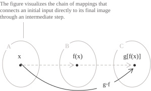

f## Definition of the composition

Given two [functions](../functions/) $f$ and $g,$ their composition is the function obtained by applying $f$ first and $g$ second. It is written $g \circ f$ and is defined by:

$$
(g \circ f)(x) = g(f(x))
$$

The symbol $\circ$ is read "after", so in $g \circ f$ the function written on the right acts first. This order comes from the nesting in $g(f(x))$ and is a source of errors.

The diagram shows the composition. An input $x$ in $A$ is mapped by $f$ to $f(x)$ in $B,$ then by $g$ to $g(f(x))$ in $C.$ The outer arc corresponds to $g \circ f.$

In the situation shown in the diagram, the two functions are:

$$
\begin{align}
f &\colon A \rightarrow B \\[6pt]
g &\colon B \rightarrow C
\end{align}
$$

Since $f(x) \in B$ for every $x \in A$ and $B$ is the domain of $g,$ the value $g(f(x))$ is defined for every $x \in A.$ Hence $g \circ f$ is a function from $A$ to $C:$

$$
g \circ f \colon A \rightarrow C, \qquad x \mapsto g(f(x))
$$

The inclusion $f(A) \subseteq B$ makes the composite well-defined on all of $A.$ When functions are specified only by formulas, the domain of $g$ need not contain every value of $f.$ The composite is defined only for inputs whose image under $f$ belongs to $\mathrm{dom}(g).$

## Domain of a composite function

For $g(f(x))$ to be defined, two conditions must hold. The point $x$ must belong to the domain of $f,$ and the value $f(x)$ must belong to the domain of $g.$ The [domain](../determining-the-domain-of-a-function/) of the composite is the set of points that satisfy both:

$$
\mathrm{dom}(g \circ f) = \{\ x \in \mathrm{dom}(f) \mid f(x) \in \mathrm{dom}(g)\ \}
$$

The second condition distinguishes composition from the other operations between functions. A sum or product is defined on the intersection of the two domains, while a quotient is defined on that intersection after the zeros of the denominator are removed. In a composition, each condition on the input of $g$ becomes a condition on $f(x).$ The computation follows three steps:

+ Determine $\mathrm{dom}(f)$ from the expression of the inner function.
+ Write the conditions that define $\mathrm{dom}(g)$ and replace the variable of $g$ with the expression $f(x)$ in each of them.
+ Solve these conditions and intersect their solutions with $\mathrm{dom}(f).$

The second step is where the substitution takes place, because the conditions of the outer function are imposed on $f(x)$ and not on $x.$ A logarithm placed outside requires its argument $f(x)$ to be positive, a square root placed outside requires $f(x) \ge 0,$ and a denominator placed outside requires $f(x) \neq 0.$

> Simplifying the expression of $g(f(x))$ before determining the domain can give the wrong answer. With $f(x) = \sqrt{x}$ and $g(t) = t^2,$ the composite has the formula $(g \circ f)(x) = x,$ yet the inner square root requires $x \ge 0.$ Its domain is therefore $[0, +\infty)$ and not $\mathbb{R}.$ Algebraic simplification does not alter the domain of the composite.

## Example 1

We compose these two functions in both orders:

$$
\begin{align}
f(x) &= x - 3 \\[6pt]
g(x) &= \sqrt{x}
\end{align}
$$

The first is a polynomial, defined on all of $\mathbb{R},$ while the second is an [even root](../irrational-functions/), defined for non-negative arguments:

$$
\begin{align}
\mathrm{dom}(f) &= \mathbb{R} \\[6pt]
\mathrm{dom}(g) &= [0, +\infty)
\end{align}
$$

For $g \circ f,$ the inner function is $f,$ so we substitute $x - 3$ into $g:$

$$
(g \circ f)(x) = g(x - 3) = \sqrt{x - 3}
$$

Every real number belongs to $\mathrm{dom}(f),$ so the first condition excludes nothing, and the restriction comes from requiring $f(x) \in \mathrm{dom}(g):$

$$
x - 3 \ge 0 \quad \rightarrow \quad x \ge 3
$$

The domain of $g \circ f$ is the [interval](../intervals/) $[3, +\infty),$ a proper subset of the domain of the inner function. Composing in the opposite order gives:

$$
(f \circ g)(x) = f(\sqrt{x}) = \sqrt{x} - 3
$$

The square root is the inner function, so the first condition imposes $x \ge 0,$ while the outer function is defined on all of $\mathbb{R}$ and imposes no restriction. The domain of $f \circ g$ is $[0, +\infty).$

The two composites differ in their formulas and in their domains. Reversing the order changes the composite, so composition is not commutative.

## Example 2

Both functions have restricted domains:

$$
\begin{align}
f(x) &= \frac{x + 1}{x - 2} \\[6pt]
g(x) &= \ln x
\end{align}
$$

The [rational function](../rational-functions/) $f$ is defined for $x \neq 2,$ and the [logarithm](../logarithmic-function/) is defined for strictly positive arguments. Composing $f$ first and $g$ second gives:

$$
(g \circ f)(x) = \ln \frac{x + 1}{x - 2}
$$

The domain condition for the outer function applies to the quotient, which must be strictly positive:

$$
\frac{x + 1}{x - 2} > 0
$$

The numerator vanishes at $x = -1$ and the denominator at $x = 2.$ A [sign analysis](../sign-analysis-in-inequalities/) shows that the quotient is positive where numerator and denominator agree in sign, that is for $x < -1$ and for $x > 2.$ The point $x = 2$ is absent from this set, so the domain is:

$$
\mathrm{dom}(g \circ f) = (-\infty, -1) \cup (2, +\infty)
$$

Composing in the other order, we substitute $\ln x$ into the quotient:

$$
(f \circ g)(x) = \frac{\ln x + 1}{\ln x - 2}
$$

The inner logarithm requires $x > 0,$ and the outer function requires its argument to be different from $2,$ which reads $\ln x \neq 2,$ that is $x \neq e^2.$ The domain is:

$$
\mathrm{dom}(f \circ g) = (0, e^2) \cup (e^2, +\infty)
$$

The restriction $t \neq 2$ in the domain of $f$ becomes $\ln x \neq 2$ when $f$ is the outer function. In general, the domain conditions of the outer function apply to the value of the inner function.

## Associativity and order of composition

Three functions can be composed in two ways, and both give the same result. Applying the definition twice to the left grouping gives:

$$
((h \circ g) \circ f)(x) = (h \circ g)(f(x)) = h(g(f(x)))
$$

Applying the definition twice to the right grouping gives:

$$
(h \circ (g \circ f))(x) = h((g \circ f)(x)) = h(g(f(x)))
$$

Both expressions are defined when $x \in \mathrm{dom}(f),$ $f(x) \in \mathrm{dom}(g),$ and $g(f(x)) \in \mathrm{dom}(h).$ On this common domain they have the same value, so the functions are equal:

$$
(h \circ g) \circ f = h \circ (g \circ f)
$$

This function is written $h \circ g \circ f$ without parentheses.

- - -

Associativity concerns the grouping, not the order. Composition is not commutative, as the two composites in Example 1 have different formulas:

$$
\sqrt{x - 3} \neq \sqrt{x} - 3
$$

The equality $g \circ f = f \circ g$ does not hold in general, although some pairs of functions commute. Two translations $f(x) = x + a$ and $g(x) = x + b$ satisfy $f(g(x)) = g(f(x)) = x + a + b,$ and every self-map commutes with each of its iterates. Commutativity must therefore be checked for each pair of functions.

## Decomposing a function into simpler functions

The chain rule and integration by substitution often require writing a function as a composition of simpler functions. To find such a decomposition, list the operations in their evaluation order. The first operation gives the innermost function, and the last gives the outermost. Consider the function:

$$
F(x) = \sqrt{\ln(x^2 + 1)}
$$

Evaluating $F$ at a number means squaring it and adding one, taking the logarithm of the result, then extracting the square root. The three steps define three functions:

$$
\begin{align}
h(x) &= x^2 + 1 \\[6pt]
g(t) &= \ln t \\[6pt]
f(u) &= \sqrt{u}
\end{align}
$$

Composing these functions gives $f(g(h(x))) = \sqrt{\ln(x^2 + 1)},$ so $F = f \circ g \circ h.$ The argument $x^2 + 1$ of the logarithm is positive for every real $x.$ Since $x^2 + 1 \ge 1,$ we have $\ln(x^2 + 1) \ge 0,$ so the square root is defined. Hence $\mathrm{dom}(F) = \mathbb{R}.$

The decomposition is not unique. Grouping the last two steps into the single function $\tilde{g}(t) = \sqrt{\ln t}$ gives $F = \tilde{g} \circ h,$ with two component functions instead of three, and composing with the identity function produces variants. For differentiation or integration, we choose component functions with known derivatives or antiderivatives, as required by the [chain rule](../chain-rule/) and [integration by substitution](../integration-by-substitution/).

## Monotonicity and parity of a composite

The monotonicity of a composite depends on whether its component functions preserve or reverse order. Let $f$ be strictly monotone on an interval $I,$ and let $g$ be strictly monotone on a set containing $f(I).$ For $x_1 < x_2$ in $I,$ the function $f$ either preserves or reverses the order, and $g$ does the same to the resulting values. The composite is strictly increasing if $f$ and $g$ are both increasing or both decreasing, and strictly decreasing if one is increasing and the other is decreasing. For example, on $I = (0, +\infty)$ the function $f(x) = x^3$ is [strictly increasing](../increasing-and-decreasing-functions/) and has image $(0, +\infty).$ The function $g(t) = 1/t$ is strictly decreasing on that image. Therefore $g(f(x)) = 1/x^3$ is strictly decreasing on $(0, +\infty).$

- - -

Assume that the domain of the composite is symmetric about the origin. If the inner function $f$ is [even](../even-and-odd-functions/), $g \circ f$ is even because $f(-x) = f(x)$ implies $g(f(-x)) = g(f(x)).$ This conclusion does not require $g$ to be even or odd, and $e^{-x^2}$ is even although the exponential is neither even nor odd. If $f$ is odd, an even outer function gives an even composite, while an odd outer function gives an odd composite. Thus $\sin^2 x$ is even because the square function is even, and $\arctan(\sin x)$ is odd because the arctangent is odd.

## Injectivity, surjectivity and boundedness

Assume that $f \colon A \rightarrow B$ and $g \colon B \rightarrow C.$ If $f$ and $g$ are both injective, then $g(f(x_1)) = g(f(x_2))$ implies $f(x_1) = f(x_2)$ and then $x_1 = x_2,$ so $g \circ f$ is injective. If both functions are surjective, then for every $c \in C$ there is a point $b \in B$ such that $g(b) = c,$ and there is a point $a \in A$ such that $f(a) = b.$ Hence $g \circ f$ is surjective. Conversely, if $g \circ f$ is injective, then $f$ is injective, but $g$ need not be. If $g \circ f$ is surjective, then $g$ is surjective, but $f$ need not be.

The missing converses fail. Let $f \colon [0, +\infty) \rightarrow \mathbb{R}$ be given by $f(x) = x,$ and let $g \colon \mathbb{R} \rightarrow [0, +\infty)$ be given by $g(t) = t^2.$ The composite $g \circ f$ is $x \mapsto x^2,$ which is injective on $[0, +\infty),$ while $g$ is not injective on $\mathbb{R}.$ For surjectivity, let $f \colon \mathbb{R} \rightarrow \mathbb{R}$ be given by $f(x) = x^2$ and use the same function $g.$ The composite $(g \circ f)(x) = x^4$ is surjective onto $[0, +\infty),$ although $f$ is not surjective onto $\mathbb{R}.$

A composite of bijections is therefore a bijection. The bijections of a set onto itself form a group under composition, the [symmetric group](../symmetric-group/) of that set. The three properties themselves are treated in [injective, surjective and bijective functions](../injective-surjective-and-bijective-functions/).

- - -

If the outer function $g$ is bounded, then $g \circ f$ is bounded for every inner function $f,$ because every value of the composite is a value of $g.$ For example, $\sin(e^x)$ stays between $-1$ and $1.$ By contrast, boundedness of $f$ does not imply boundedness of $g \circ f.$ The function $f(x) = \frac{1}{1 + x^2}$ has image $(0, 1],$ and composing it with $g(t) = 1/t$ gives $g(f(x)) = 1 + x^2,$ which is unbounded.

## Continuity and differentiability of a composite

The composite of two [continuous functions](../continuous-functions/) is continuous. If $f$ is continuous at $x_0$ and $g$ is continuous at $f(x_0),$ then $g \circ f$ is continuous at $x_0.$ [Uniform continuity](../uniform-continuity/) is preserved by composition. Given $\varepsilon > 0,$ uniform continuity of $g$ gives $\eta > 0$ such that $|u - v| < \eta$ implies $|g(u) - g(v)| < \varepsilon.$ Uniform continuity of $f$ then gives $\delta > 0$ such that $|x - y| < \delta$ implies $|f(x) - f(y)| < \eta.$ Hence the same $\delta$ works for $g \circ f$ on its domain.

> If $\lim_{x \to x_0} f(x)$ exists and the outer function is continuous at that limit, the [limit](../limits/) identity $\lim_{x \to x_0} g(f(x)) = g\left(\lim_{x \to x_0} f(x)\right)$ holds. Without continuity, this identity need not hold. For example, let $f(x) = x$ and define $g(t) = 1$ for $t \neq 0$ and $g(0) = 0.$ We have $\lim_{x \to 0} g(f(x)) = 1,$ while $g\left(\lim_{x \to 0} f(x)\right) = g(0) = 0.$ Here $g$ is [discontinuous](../discontinuities-of-real-functions/) at $0.$

If $f$ is [differentiable](../derivatives/) at $x$ and $g$ is differentiable at $f(x),$ the [chain rule](../chain-rule/) gives:

$$
D[g(f(x))] = g'(f(x))f'(x)
$$

> For the function $F(x) = \sqrt{\ln(x^2 + 1)},$ the outer square root is not differentiable at $0,$ and $\ln(x^2 + 1) = 0$ at $x = 0.$ The chain rule therefore does not determine whether $F$ is differentiable at the origin. Since $F(0) = 0$ and $\lim_{x \to 0} \frac{\ln(1 + x^2)}{x^2} = 1,$ we have $\lim_{x \to 0} \frac{F(x)}{|x|} = 1.$ The difference quotient of $F$ at the origin tends to $1$ from the right and to $-1$ from the left. Hence $F$ is [not differentiable](../points-of-non-differentiability/) at the origin, and its graph has a corner there.

## Composition with the inverse function

When $f$ has an [inverse](../inverse-function/), the composites $f^{-1} \circ f$ and $f \circ f^{-1}$ are identity functions on different sets:

$$
\begin{align}
(f^{-1} \circ f)(x) &= x \\[6pt]
(f \circ f^{-1})(y) &= y
\end{align}
$$

The first identity holds for every $x$ in the domain of $f,$ the second for every $y$ in its image. Invertibility requires $f$ to be injective and surjective onto its chosen codomain. A non-injective function may have an invertible restriction, and the two identities then hold on the restricted sets.

The inverse of a composite has the component functions in reverse order:

$$
(g \circ f)^{-1} = f^{-1} \circ g^{-1}
$$

The square function $f \colon [0, +\infty) \rightarrow [0, +\infty)$ is bijective and has the square root as its inverse. The composition $f^{-1} \circ f$ satisfies:

$$
\sqrt{x^2} = |x| = x \quad \text{for } x \ge 0
$$

If the square function is defined on all of $\mathbb{R},$ applying the square function first and the square root second gives $\sqrt{x^2} = |x|,$ which is not the identity. The other order, $(\sqrt{x})^2 = x,$ has domain $[0, +\infty)$ because the square root is the inner function.

## Composing with a piecewise function

If the outer function is defined [piecewise](../piecewise-functions/), the branch of $g(f(x))$ is determined by the value of $f(x).$ Thus each branch condition for $g$ must be imposed on $f(x).$ Consider the outer function:

$$
g(t) =
\begin{cases}
1 - t & t < 0 \\[6pt]
1 + t^2 & t \ge 0
\end{cases}
$$

Let $f(x) = x^2 - 1$ be the inner function. The branch is determined by the sign of $f(x),$ so the condition $t < 0$ becomes $x^2 - 1 < 0,$ satisfied for $-1 < x < 1,$ and the condition $t \ge 0$ becomes $x \le -1$ or $x \ge 1.$ On the middle interval the outer function uses its first branch:

$$
(g \circ f)(x) = 1 - (x^2 - 1) = 2 - x^2
$$

On the two remaining intervals it uses the second branch:

$$
(g \circ f)(x) = 1 + (x^2 - 1)^2
$$

Collecting the three pieces, the composite is:

$$
(g \circ f)(x) =
\begin{cases}
1 + (x^2 - 1)^2 & x \le -1 \\[6pt]
2 - x^2 & -1 < x < 1 \\[6pt]
1 + (x^2 - 1)^2 & x \ge 1
\end{cases}
$$

The junction point $t = 0$ of $g$ has the preimages $-1$ and $1$ under $f,$ so the composite has two junction points. The number of branches of $g \circ f$ depends on the preimages under $f$ of the junction points of $g,$ and may exceed the number of branches of $g.$

> At $x = \pm 1$ both branch formulas are continuous and have the value $1,$ so the composite is continuous there. If $g$ had a jump at $0,$ then in this example $g \circ f$ would have jumps at $x = -1$ and $x = 1,$ because $f$ is continuous and approaches $0$ through opposite signs on the two sides of each point. By contrast, when a continuous inner function touches a junction value without crossing it, the same branch applies on both sides, so a jump of the outer function need not produce a jump in the composite.
