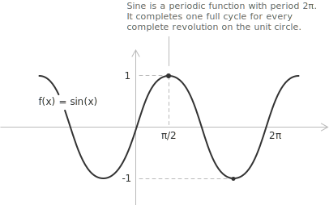
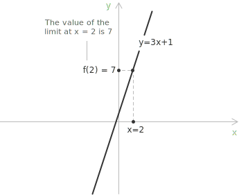
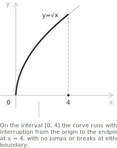

## Continuous function at a point

We use the continuity of a [function](../functions/) to determine whether it behaves predictably near a point, without jumps, holes, or abrupt changes. Formally, a function $y = f(x)$ is continuous at a point $x_0$ if the following [limit](../limits/) holds:

$$
\lim_{x \to x_0} f(x) = f(x_0)
$$

This means the limit of the function as $x$ approaches $x_0$ exists and is finite, and equals the value of the function at $x_0.$ For example, the function $f(x) = \sin(x)$ is continuous on all of $\mathbb{R}.$ At every point $x_0 \in \mathbb{R},$ the limit of $\sin(x)$ as $x \to x_0$ exists, is finite, and satisfies $\lim_{x \to x_0} \sin(x) = \sin(x_0).$

Consider $x_0 = \frac{\pi}{2}$ as a specific example. We have:

$$\lim_{x \to \frac{\pi}{2}} \sin(x) = \sin\!\left(\frac{\pi}{2}\right) = 1$$

The continuity condition for the [sine function](../sine-function/) is satisfied at $x_0,$ and the same reasoning extends to all other points in the domain.

- - -

Continuity at a point can also be expressed through one-sided limits. The right-hand and left-hand limits at the point must exist, be finite, and coincide with the function's value. Referring to a generic point $x_0,$ this can be written as:

$$
\lim_{x \to x_0^+} f(x) = \lim_{x \to x_0^-} f(x) = f(x_0)
$$

This condition guarantees that the graph of the function has no breaks or discontinuities at the point $x_0.$

> This property is evident in the graph of $f(x) = \sin(x).$ At each point $x_0,$ the curve approaches the same value from both the left and the right, and this value matches $f(x_0).$ The graph forms a continuous, uninterrupted path across the entire real line, where the one-sided limits and the value of the function coincide.

## Example 1

Let us consider the [polynomial function](../polynomial-function/):

$$
f(x) = 3x + 1
$$

We verify whether this function is continuous at the point $x_0 = 2.$ We first compute the limit of the function as $x$ approaches $2$:

$$
\lim_{x \to 2} f(x) = \lim_{x \to 2} (3x + 1) = 3 \cdot 2 + 1 = 7
$$

Next, we evaluate the function directly at the point:

$$
f(2) = 3 \cdot 2 + 1 = 7
$$

Since the function is a first-degree [polynomial](../polynomials/), its graph is a straight line.

The limit exists, is finite, and coincides with the value of the function at that point. Therefore, we conclude that

$$
\lim_{x \to 2} f(x) = f(2) = 7
$$

This confirms that the function $f(x) = 3x + 1$ is continuous at $x = 2.$

> This reasoning extends to higher-degree polynomial functions. For example, the quadratic function $f(x) = x^2$ has a [parabolic](../parabola/) graph, and for every point $x_0 \in \mathbb{R},$ the limit exists, is finite, and satisfies $\lim_{x \to x_0} x^2 = x_0^2 = f(x_0).$

## Continuous function on an interval

When we consider an interval instead of a single point, we say that a function $y = f(x)$ is continuous on a closed and bounded interval $[a, b]$ if the following condition holds:

$$
\lim_{x \to x_0} f(x) = f(x_0) \quad \forall \ x_0 \in (a, b)
$$

Just as with continuity at a point, continuity over a closed interval can be expressed in terms of one-sided limits at the endpoints of the interval. Specifically, the function must satisfy:

$$
\begin{align}
\lim_{x \to a^+} f(x) &= f(a) \\[6pt]
\lim_{x \to b^-} f(x) &= f(b)
\end{align}
$$

For example, the function $f(x) = \sqrt{x}$ defined on the interval $[0, 4]$ is continuous at every interior point, as the square root function is continuous on $(0, +\infty).$

At the left and right endpoints, the one-sided continuity conditions are respectively satisfied:
$$
\begin{align}
\lim_{x \to 0^+} \sqrt{x} &= 0 = f(0) \\[6pt]
\lim_{x \to 4^-} \sqrt{x} &= 2 = f(4)
\end{align}
$$

Therefore, all three conditions for continuity are met, and $f(x) = \sqrt{x}$ is continuous on $[0, 4].$

## Functions continuous on their domain

The following functions are continuous on their respective [domains](../determining-the-domain-of-a-function/):

+ [Polynomial functions](../polynomial-function/) of the form $P(x) = a_0 + a_1 x + \cdots + a_n x^n.$
+ [Rational functions](../rational-functions/), wherever the denominator does not vanish.
+ The [exponential function](../exponential-function/) $a^x.$
+ The [logarithmic function](../logarithmic-function/) $\log_a x.$
+ The [absolute value function](../absolute-value-function/) $|x|.$
+ The trigonometric functions [sine and cosine](../sine-and-cosine/), $\sin x$ and $\cos x,$ and the [tangent](../tangent-and-cotangent/) $\tan x,$ together with their inverse functions.

## Discontinuity

A function that is not continuous at a given point has a [discontinuity](../discontinuities-of-real-functions/) at that point. A discontinuity occurs when one of the conditions for continuity fails. This may happen if the function is undefined at the point, if the limit does not exist, or if the limit exists but differs from the function's value. Discontinuities are categorised into three mutually exclusive types:

+ A removable discontinuity occurs when the limit of the function exists and is finite, but the function is either undefined at the point or its value does not equal the limit.
+ A jump discontinuity occurs when both the left-hand and right-hand limits exist and are finite, but these limits are not equal.
+ An infinite discontinuity is present when at least one of the one-sided limits is infinite, so the function diverges near the point instead of approaching a finite value.

> A single point cannot simultaneously exhibit more than one type of discontinuity.

- - -

Consider a simple function that is not continuous, the [sign function](../sign-function/), denoted by $\mathrm{sign}(x).$ This function is defined as:

$$
\mathrm{sign}(x) =
\begin{cases}
-1 & \text{if } x < 0 \\[6pt]
\phantom{-}0 & \text{if } x = 0 \\[6pt]
\phantom{-}1 & \text{if } x > 0
\end{cases}
$$

This function is not continuous at $x = 0.$ To be continuous at a point, the limit from the left and the limit from the right must exist and be equal to the function's value at that point. We examine the limits:

+ As $x \to 0^-,$ the function approaches $-1.$
+ As $x \to 0^+,$ the function approaches $1.$

The two one-sided limits are:

$$
\begin{align}
\lim_{x \to 0^-} \mathrm{sign}(x) &= -1 \\[6pt]
\lim_{x \to 0^+} \mathrm{sign}(x) &= 1
\end{align}
$$

Since the two one-sided limits are not equal, the overall limit as $x \to 0$ does not exist. Although the function is defined at $x = 0,$ its value does not coincide with a limit. Therefore, the function is discontinuous at $x = 0,$ even though it is continuous everywhere else on $\mathbb{R} \setminus \{0\}.$

## Properties

The sum or difference of two continuous functions is also continuous. Suppose $f$ and $g$ are functions from $\mathbb{R}$ to $\mathbb{R},$ and let $x_0$ be a point belonging to both $\mathrm{Dom}(f)$ and $\mathrm{Dom}(g),$ where both functions are continuous. Then the function $f + g,$ as well as $f - g,$ is continuous at the point $x_0.$ Formally, if both $f$ and $g$ are continuous at $x_0$:

$$
\begin{align}
\lim_{x \to x_0} f(x) &= f(x_0) \\[6pt]
\lim_{x \to x_0} g(x) &= g(x_0)
\end{align}
$$

then the sum $f + g$ is also continuous at $x_0,$ meaning:

$$
\lim_{x \to x_0} [f(x) + g(x)] = f(x_0) + g(x_0)
$$

- - -

The product of two continuous functions is a continuous function. Let $f, g : \mathbb{R} \to \mathbb{R},$ and let $x_0 \in \mathrm{Dom}(f) \cap \mathrm{Dom}(g)$ be a point where both functions are continuous. Then the product function $f \cdot g$ is continuous at $x_0.$ Formally, if:

$$
\begin{align}
\lim_{x \to x_0} f(x) &= f(x_0) \\[6pt]
\lim_{x \to x_0} g(x) &= g(x_0)
\end{align}
$$

then:

$$
\lim_{x \to x_0} [f(x) \cdot g(x)] = f(x_0) \cdot g(x_0)
$$

- - -

The quotient of two continuous functions remains continuous, provided that the denominator does not vanish. Let $f, g : \mathbb{R} \to \mathbb{R},$ and let $x_0 \in \mathrm{Dom}(f) \cap \mathrm{Dom}(g)$ be a point where both functions are continuous, and such that $g(x_0) \ne 0.$ Then the quotient function $f/g$ is continuous at $x_0.$ Formally, if:

$$
\begin{align}
\lim_{x \to x_0} f(x) &= f(x_0) \\[6pt]
\lim_{x \to x_0} g(x) &= g(x_0) \\[6pt]
g(x_0) &\ne 0
\end{align}
$$

then:

$$
\lim_{x \to x_0} \left[ \frac{f(x)}{g(x)} \right] = \frac{f(x_0)}{g(x_0)}
$$

- - -

The [composition](../composite-functions/) of continuous functions is also a continuous function. Let $f, g : \mathbb{R} \to \mathbb{R},$ and let $x_0 \in \mathrm{Dom}(f)$ be a point where $f$ is continuous. Suppose that $g$ is continuous at $y_0 = f(x_0).$ Then the composite function $g \circ f$ is continuous at $x_0,$ meaning:

$$
\lim_{x \to x_0} [g(f(x))] = g\left( \lim_{x \to x_0} f(x) \right) = g(f(x_0))
$$

- - -

If a function $f$ is continuous and [strictly monotonic](../increasing-and-decreasing-functions/) on an interval $I \subset \mathbb{R},$ then it is invertible on $I,$ and its [inverse function](../inverse-function/) $f^{-1}$ remains continuous on $f(I).$ Equivalently, for any $y_0 = f(x_0),$ the following holds:

$$
\lim_{y \to y_0} f^{-1}(y) = x_0
$$

Strict monotonicity guarantees that the function does not change direction, so distinct nearby inputs cannot map to the same output. In the absence of monotonicity, continuity alone is insufficient to ensure the continuity of the inverse function.

## From continuity to uniform continuity

Continuity is a local property. At each point $x_0$ and for every $\varepsilon > 0,$ there exists a $\delta > 0,$ which may depend on $x_0,$ such that

$$|x - x_0| < \delta \to |f(x) - f(x_0)| < \varepsilon$$

The value of $\delta$ may vary from point to point. In regions where the function grows rapidly, smaller values of $\delta$ are often necessary.

[Uniform continuity](../uniform-continuity/) extends this concept by imposing a single global constraint. A function $f : A \to \mathbb{R}$ is uniformly continuous on $A$ if, for every $\varepsilon > 0,$ there exists a $\delta > 0$ such that

$$|x - y| < \delta \;\Rightarrow\; |f(x) - f(y)| < \varepsilon \quad \forall \ x, y \in A$$

In this context, $\delta$ depends solely on $\varepsilon$ and is independent of the specific points in the domain. In general:

+ Continuity does not imply uniform continuity.
+ Uniform continuity does imply continuity.

For example, the function $f(x) = x^2$ is continuous on $\mathbb{R},$ but it is not uniformly continuous on $\mathbb{R}$ because no single $\delta$ can regulate its growth across the entire real line.