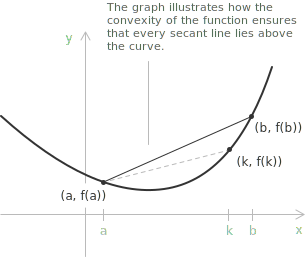
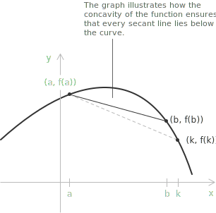

## Curvature and the shape of a graph

The study of a [function's behaviour](../analyzing-the-graphs-of-functions/) determines where it [increases or decreases](../increasing-and-decreasing-functions/) and how its graph bends within an interval. A [function](../functions/) may increase or decrease throughout a region while its curve still arches upward or downward, so two functions with the same monotonic behaviour can take distinct geometric shapes.

These qualitative features are described by the notions of convexity and concavity. Geometrically, they fix the position of the graph relative to its chords and to its tangent lines. These two viewpoints give a chord criterion and a tangent criterion.

Analytically, convexity and concavity are determined by the sign of the second [derivative](../derivatives/), which measures the curvature of the function. The second derivative then gives a precise criterion for how a function bends across its [domain](../determining-the-domain-of-a-function/).

## Convexity

A function $f$ is convex on an interval when, for any two points $a$ and $b$ within that interval, the straight line connecting $(a, f(a))$ and $(b, f(b))$ lies on or above the graph of $f$ at every point between $a$ and $b.$ In other words, the chord linking these two points does not dip below the curve.

The equation of the secant line passing through the points $(a, f(a))$ and $(b, f(b))$ is:

$$
h(x) = \frac{f(b)-f(a)}{b-a}(x-a) + f(a)
$$

For the function $f$ to be convex, this line must lie on or above the graph of $f$ for every $x$ between $a$ and $b.$ This requirement is expressed by the inequality $h(x) \ge f(x),$ which explicitly becomes:

$$
\frac{f(b)-f(a)}{b-a}(x-a) + f(a) \ge f(x)
$$

Rearranging the terms yields:

$$
\frac{f(b)-f(a)}{b-a}(x-a) \ge f(x) - f(a)
$$

Dividing by $x - a > 0$ gives:

$$
\frac{f(b)-f(a)}{b-a} \ge \frac{f(x)-f(a)}{x-a}
$$

> The inequality shows how convexity forces the secant slope over the whole interval $[a,b]$ to be at least the slope over any shorter subinterval starting at $a,$ for example the line connecting $(a, f(a))$ and $(k, f(k))$ with $a < k < b.$

## Concavity

A function $f$ is concave on an interval when, for any two points $a$ and $b$ in that interval, the line segment joining $(a, f(a))$ and $(b, f(b))$ lies on or below the graph of $f$ at every point between $a$ and $b.$ Equivalently, the chord connecting the two points never rises above the curve.

In analogy with the convex case, the equation of the secant line passing through the points $(a, f(a))$ and $(b, f(b))$ is:

$$
h(x) = \frac{f(b)-f(a)}{b-a}(x-a) + f(a)
$$

For the function $f$ to be concave, this line must lie on or below the graph of $f$ for every $x$ between $a$ and $b.$ This condition is expressed by the inequality $h(x) \le f(x),$ which explicitly becomes:

$$
\frac{f(b)-f(a)}{b-a}(x-a) + f(a) \le f(x)
$$

Rearranging the terms yields:

$$
\frac{f(b)-f(a)}{b-a}(x-a) \le f(x) - f(a)
$$

Dividing by $x - a > 0$ gives:

$$
\frac{f(b)-f(a)}{b-a} \le \frac{f(x)-f(a)}{x-a}
$$

> The inequality shows how concavity forces the secant slope over the whole interval $[a,b]$ to be at most the slope over any shorter subinterval starting at $a,$ such as the line connecting $(a, f(a))$ and $(k, f(k))$ with $a < k < b.$

## Convexity through convex combinations

The chord conditions can be rewritten in an algebraic form that no longer mentions the secant line explicitly. Every point $x$ between $a$ and $b$ admits the representation $x = (1-\lambda)a + \lambda b$ with $\lambda \in [0,1],$ where $\lambda = 0$ returns $a$ and $\lambda = 1$ returns $b.$ Since the secant is linear, its height at that point is the same combination of the endpoint values:

$$h\big((1-\lambda)a + \lambda b\big) = (1-\lambda)f(a) + \lambda f(b)$$

For a convex function the graph stays below the chord, so the requirement $f(x) \le h(x)$ becomes:

$$f\big((1-\lambda)a + \lambda b\big) \le (1-\lambda)f(a) + \lambda f(b)$$

For a concave function the inequality reverses:

$$f\big((1-\lambda)a + \lambda b\big) \ge (1-\lambda)f(a) + \lambda f(b)$$

These inequalities hold for all $a$ and $b$ in the interval and all $\lambda \in [0,1],$ and they define convexity and concavity even when $f$ is not differentiable.

The same construction extends from two points to any finite collection. For weights $\lambda_1, \dots, \lambda_n \ge 0$ with $\sum_{i=1}^{n}\lambda_i = 1,$ a convex function satisfies:

$$f\left(\sum_{i=1}^{n}\lambda_i x_i\right) \le \sum_{i=1}^{n}\lambda_i f(x_i)$$

with the reverse inequality for a concave function. This statement is Jensen's inequality, and the two-point case is recovered by setting $n = 2.$

> A function is both convex and concave on an interval only when equality holds throughout, which forces it to be affine, of the form $f(x) = \alpha + \beta x.$

## Characterisation through tangent lines

When $f$ is differentiable, convexity can be read from its tangents rather than its chords. The tangent at a point $x_0$ has equation $y = f(x_0) + f'(x_0)(x - x_0).$ For a convex function the graph never falls below this line:

$$f(x) \ge f(x_0) + f'(x_0)(x - x_0)$$

for all $x$ and $x_0$ in the interval. For a concave function the graph never rises above its tangents, so the inequality reverses:

$$f(x) \le f(x_0) + f'(x_0)(x - x_0)$$

The tangent description has a direct consequence for optimisation. If $f$ is convex and $f'(x_0) = 0,$ the right-hand side reduces to $f(x_0),$ so $f(x) \ge f(x_0)$ for every $x,$ and $x_0$ is a global minimum. For a concave function the same condition locates a global maximum.

## Second derivative criteria for convexity and concavity

A direct way to determine the curvature of a function is to examine its second derivative. The criterion follows from the slope behaviour established above. Where $f$ is convex, the secant slopes increase as their endpoints move to the right, so the first derivative $f'(x)$ is itself increasing; where $f$ is concave, the secant slopes decrease and $f'(x)$ is decreasing. Since $f''(x)$ measures the rate of change of $f'(x),$ a positive second derivative corresponds to convexity and a negative one to concavity.

If a function $f(x)$ is twice differentiable, the sign of $f''(x)$ identifies the intervals where the function is concave or convex:

+ If $f''(x) > 0$ on an interval, the function $f(x)$ is convex there.
+ If $f''(x) < 0$ on an interval, the function $f(x)$ is concave there.
+ Points where $f''(x) = 0$ are candidates for a change in curvature, where the function may switch between concavity and convexity.

- - -

As an example, consider the [polynomial function](../polynomial-function/):

$$f(x) = x^{3} - 3x^{2} + 2x$$

We examine its convexity and concavity through the behaviour of the second derivative. We first compute the first derivative:

$$f'(x) = 3x^2 - 6x + 2$$

We then compute the second derivative and set it equal to zero:

$$f''(x) = 6x - 6 = 0$$

The equation is satisfied at $x = 1.$ For $x < 1$ the second derivative is negative, so the function is concave; for $x > 1$ it is positive, so the function is convex.

[class="table-sign"]

|           |           |    $1$    |
| :-------: | :-------: | :-------: |
| $f''(x)$  |    $-$    |    $+$    |
| $f(x)$    | $\bigcap$ | $\bigcup$ |
| Concavity | Downward  |  Upward   |
[/class]

At $x = 1$ the second derivative vanishes and the curvature changes sign, so the function has an [inflection point](../maximum-minimum-and-inflection-points/) at $(1, 0).$ Evaluating $f$ confirms the ordinate:

$$f(1) = 1^{3} - 3 \cdot 1^{2} + 2 \cdot 1 = 1 - 3 + 2 = 0$$

## Strict convexity and concavity

The inequalities defining convexity and concavity are not strict, so a convex function may contain straight segments. When the chord lies strictly above the graph at every interior point, that is when

$$f\big((1-\lambda)a + \lambda b\big) < (1-\lambda)f(a) + \lambda f(b)$$

holds for all $a \neq b$ and all $\lambda \in (0,1),$ the function is strictly convex; the reverse strict inequality defines a strictly concave function. A strictly convex function has no linear parts.

The second derivative provides a sufficient condition for strict behaviour, not a necessary one. If $f''(x) > 0$ throughout an interval, then $f$ is strictly convex there, yet a strictly convex function may still have isolated points where the second derivative vanishes. The function $f(x) = x^4$ is strictly convex on the whole real line, while $f''(0) = 0.$ The condition $f''(x) > 0$ therefore guarantees strict convexity without being required by it.
