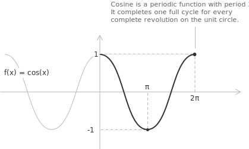

## Introduction

The geometric construction of the cosine from the [unit circle](../unit-circle/) is developed in [sine and cosine](../sine-and-cosine/). Here the cosine is treated as a real [function](../functions/) of a real variable.

The cosine function $f(x) = \cos(x)$ assigns to each angle $x,$ measured in [radians](../angles-and-angular-measure/), its corresponding [cosine](../sine-and-cosine/) value. Its graph is a periodic wave with period $2\pi$ and amplitude $1,$ oscillating between $-1$ and $1.$ The function has all real numbers in its [domain](../determining-the-domain-of-a-function/), and its range is the [interval](../intervals/) $[-1, 1].$

Together with the [sine function](../sine-function/), the cosine models periodic phenomena. In simple [harmonic motion](../simple-harmonic-motion/) the displacement of a mass on a spring or of a pendulum is a cosine of time, and the [acceleration](../acceleration/), as its second derivative, is again a cosine with opposite sign.

## Properties

The following properties of the cosine function follow from its definition on the unit circle.

+ [Domain](../determining-the-domain-of-a-function/): $x \in \mathbb{R}$
+ Range: $-1 \leq y \leq 1$
+ Periodicity: periodic in $x$ with period $2\pi$
+ Parity: [even](../even-and-odd-functions/), with $\cos(-x) = \cos(x)$
+ Monotonicity: decreasing where $\sin(x) > 0$ and increasing where $\sin(x) < 0,$ on alternating intervals of length $\pi.$
+ Roots: $x = \dfrac{\pi}{2} + n\pi$ with $n \in \mathbb{Z}$
+ None of the roots is an [integer](../integers/), since $\dfrac{\pi}{2} + n\pi$ is [irrational](../irrational-numbers/) for every $n \in \mathbb{Z}.$
+ [Maximum and minimum points](../maximum-minimum-and-inflection-points/): the maximum value $1$ is reached at $x = 2k\pi$ and the minimum value $-1$ at $x = \pi + 2k\pi,$ with $k \in \mathbb{Z}.$

## Limits, derivatives, and integrals of the cosine function

A [remarkable limit](../remarkable-limits/) of the cosine function is:

$$\lim_{x \to 0} \frac{1 - \cos(x)}{x} = 0$$

Near the origin the difference $1 - \cos(x)$ vanishes faster than $x,$ so the ratio tends to zero.

The function $\cos(x)$ is [continuous](../continuous-functions/) and differentiable for every real value of $x.$ Its [derivative](../derivatives/) is:

$$\frac{d}{dx}\cos(x) = -\sin(x)$$

Differentiating repeatedly, the function returns to itself after four steps:

$$
\begin{align}
\frac{d^2}{dx^2}\cos(x) &= -\cos(x) \\[6pt]
\frac{d^3}{dx^3}\cos(x) &= \sin(x) \\[6pt]
\frac{d^4}{dx^4}\cos(x) &= \cos(x)
\end{align}
$$

The derivatives repeat with period four, so the $n$-th derivative has the closed form:

$$\frac{d^n}{dx^n}\cos(x) = \cos\left(x + \frac{n\pi}{2}\right)$$

Since the derivative of $\sin(x)$ is $\cos(x),$ the [indefinite integral](../indefinite-integrals/) of the cosine function is:

$$\int \cos(x) \ dx = \sin(x) + c$$

> A broader treatment of trigonometric integrals, with the transformation and substitution techniques for the more complex cases, is given in [trigonometric function integrals](../integral-of-trigonometric-functions/).

The cosine function can also be written using [imaginary](../complex-numbers/) numbers. With $e^{ix}$ the [exponential function](../exponential-function/) of base $e$ and $i$ the imaginary unit, [Euler's formula](../eulers-formula/) gives:

$$\cos(x) = \frac{e^{ix} + e^{-ix}}{2}$$
