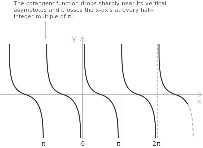

## Introduction

> The geometric construction of the cotangent from the [unit circle](../unit-circle/) is developed in [tangent and cotangent](../tangent-and-cotangent/). Here, the cotangent is treated as a real [function](../functions/) of a real variable.

The cotangent function $f(x) = \cot(x)$ assigns to each angle $x,$ measured in [radians](../angles-and-angular-measure/), its corresponding [cotangent](../tangent-and-cotangent/) value. Its graph is a periodic curve with period $\pi$ and has vertical [asymptotes](../asymptotes/) where the sine of $x$ vanishes, at $x = k\pi$ with $k \in \mathbb{Z}.$ The [domain](../determining-the-domain-of-a-function/) is the set of all real numbers except these points, and the range is all of $\mathbb{R}.$

The cotangent is the ratio of [cosine and sine](../sine-and-cosine/) so it diverges where the sine approaches zero and crosses the horizontal axis where the cosine vanishes:

$$\cot(x) = \frac{\cos(x)}{\sin(x)}$$

On the interval $(0, \pi)$ the curve descends from $+\infty$ near $x = 0$ to $-\infty$ near $x = \pi,$ crossing zero at $x = \pi/2.$

## Properties

The following properties of the cotangent function follow from its definition as the ratio of cosine to sine.

+ [Domain](../determining-the-domain-of-a-function/): $\{\ x \in \mathbb{R} \mid x \neq k\pi \ \text{ for all } k \in \mathbb{Z} \ \}$
+ Range: $y \in \mathbb{R}$
+ Periodicity: periodic in $x$ with period $\pi$
+ Parity: [odd](../even-and-odd-functions/), with $\cot(-x) = -\cot(x)$
+ Monotonicity: decreasing on each interval $\left(k\pi, \pi + k\pi\right)$ with $k \in \mathbb{Z}$
+ Roots: $x = \frac{\pi}{2} + n\pi$ with $n \in \mathbb{Z}$
+ No root is an [integer](../integers/), since $\frac{\pi}{2} + n\pi$ is [irrational](../irrational-numbers/) for every $n \in \mathbb{Z}.$

## Limits, derivatives, and integrals of the cotangent function

A [remarkable limit](../remarkable-limits/) describes the cotangent in a neighbourhood of the origin:

$$\lim_{x \to 0} x\cot(x) = 1$$

The behaviour near the asymptote at the origin is described by one-sided limits. As $x$ approaches $0$ from the right the sine is positive and tends to zero while the cosine tends to $1,$ so the function grows without bound,

$$\lim_{x \to 0^+} \cot(x) = +\infty$$

while from the left the sine is negative and the values diverge to negative infinity,

$$\lim_{x \to 0^-} \cot(x) = -\infty$$

The function is [continuous](../continuous-functions/) and differentiable on its domain. Its [derivative](../derivatives/) is:

$$\frac{d}{dx}\cot(x) = -\csc^2(x)$$

The [indefinite integral](../indefinite-integrals/) is:

$$\int \cot(x) \ dx = \ln|\sin(x)| + c$$

> A broader treatment of trigonometric integrals, with the transformation and substitution techniques for the more complex cases, is given in [trigonometric function integrals](../integral-of-trigonometric-functions/).

The cotangent function can also be written using [imaginary](../complex-numbers/) numbers. With $e^{ix}$ the [exponential function](../exponential-function/) of base $e$ and $i$ the imaginary unit, [Euler's formula](../eulers-formula/) gives:

$$\cot(x) = \frac{i\left(e^{ix} + e^{-ix}\right)}{e^{ix} - e^{-ix}}$$

## Inverse function

On its whole domain the cotangent is not injective, because the period $\pi$ makes it repeat every value in each branch. Restricted to the open interval $\left(0, \pi\right),$ where it is continuous and strictly decreasing, the cotangent is a bijection onto $\mathbb{R}$ and admits an [inverse function](../inverse-function/), the [arccotangent](../arctangent-and-arccotangent/):

$$\mathrm{arccot} : \mathbb{R} \to \left(0, \pi\right)$$

On this restricted domain $\mathrm{arccot}(\cot(x)) = x,$ and $\cot(\mathrm{arccot}(y)) = y$ for every real $y.$
