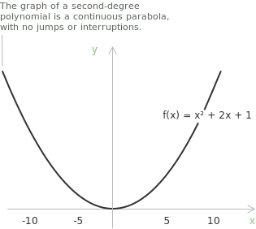
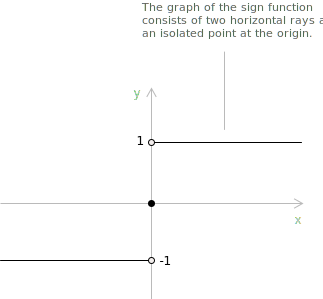
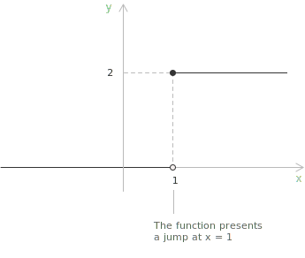
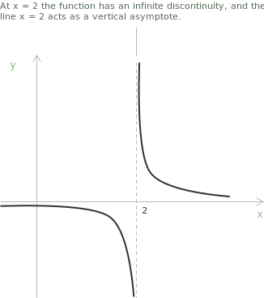

## Introduction

Continuity is a property of a [function](../functions/) under which small variations in the input produce correspondingly small variations in the output within the neighbourhood of a given point. When this local stability fails, the function is discontinuous. Discontinuities are classified into three types:

+ A removable discontinuity occurs when the limit exists and is finite, but the function is either undefined at the point or its value does not equal the limit.
+ A jump discontinuity occurs when both the left-hand and right-hand limits exist and are finite, but these limits are not equal.
+ An infinite discontinuity occurs when at least one of the one-sided limits is infinite, so the function diverges near the point instead of approaching a finite value.

A discontinuity at $x_0$ occurs in exactly one of these three mutually exclusive ways. A point cannot exhibit more than one type at once.

> In this discussion $f$ denotes a real-valued function, and $x_0$ denotes a point in its [domain](../determining-the-domain-of-a-function/) or a point at which the function may fail to be defined.

## Recall of continuity

A function $f$ is [continuous](../continuous-functions/) at $x_0$ if the limit as $x$ approaches $x_0$ exists, is finite, and coincides with the value of the function at that point. This condition is expressed by the following [limit](../limits/):

$$\lim_{x \to x_0} f(x) = f(x_0)$$

[Polynomials](../polynomials/) are a class of elementary continuous functions. Their graphs are smooth curves in the plane with no points of discontinuity. The quadratic function $x^2 + 2x + 1$, for instance, is a [parabola](../parabola/) that is continuous everywhere.

A discontinuity at $x_0$ arises whenever the equality above fails, and the way in which it fails determines the type of discontinuity.

> A function is continuous if its graph can be drawn in the plane without interruptions, breaks, or sudden jumps.

## Removable discontinuity

A removable discontinuity arises when a function has a finite limit at $x_0$, yet the value of the function at that point is either undefined or different from the limit. Formally, $f$ has a removable discontinuity at $x_0$ if the following limit exists and is finite:

$$\lim_{x \to x_0} f(x) = \ell \in \mathbb{R}$$

In addition, at least one of the following conditions holds:

+ $f(x_0)$ is undefined.
+ $f(x_0) \neq \ell$.

In this case the discontinuity is removed by redefining the function at the single point $x_0$:

$$
g(x) =
\begin{cases}
\ell & \text{if } x = x_0 \\[6pt]
f(x) & \text{if } x \ne x_0
\end{cases}
$$

With this definition $g$ is continuous at $x_0$. The term "removable" records the fact that the discontinuity can be resolved in this way.

> Removable discontinuities occur in rational functions with cancellable factors, where they produce a hole in the graph. They also occur in piecewise-defined functions, or in functions whose value at a single point has been modified, provided the limit at that point exists and is finite.

## Example 1

Consider the function defined by the following [rational](../rational-functions/) expression, which is undefined at $x = 1$:

$$f(x) = \frac{x^2 - 1}{x - 1}$$

[Factoring](../factoring-ac-method/) the numerator shows that the expression simplifies for every value of $x$ except $1$, since $x = 1$ cancels the denominator and leaves the function undefined:

$$x^2 - 1 = (x - 1)(x + 1)$$

For all $x \neq 1$ the function is equal to a linear function:

$$f(x) = x + 1$$

Although the function is undefined at $x = 1$, the limit as $x$ approaches $1$ exists and is finite:

$$\lim_{x \to 1} \frac{x^2 - 1}{x - 1} = 2$$

This shows that $x = 1$ is a removable discontinuity, since the graph is the straight line $y = x + 1$ with a single missing point at $(1, 2)$.

Redefining the function at that point with the value of the limit eliminates the discontinuity:

$$
g(x) =
\begin{cases}
2 & \text{if } x = 1 \\[6pt]
f(x) & \text{if } x \ne 1
\end{cases}
$$

> With this modification the function is continuous at $x = 1$.

## Jump discontinuity

A jump discontinuity arises when both the left-hand and right-hand limits at $x_0$ exist and are finite, yet these limits are not equal. Formally, $f$ has a jump discontinuity at $x_0$ if:

$$
\begin{align}
\lim_{x \to x_0^-} f(x) &= \ell_1 \in \mathbb{R} \\[6pt]
\lim_{x \to x_0^+} f(x) &= \ell_2 \in \mathbb{R} \\[6pt]
\ell_1 &\neq \ell_2
\end{align}
$$

Here the limit $\lim_{x \to x_0} f(x)$ does not exist, since the function approaches two distinct finite values depending on the direction of approach. Unlike a removable discontinuity, this type cannot be resolved by redefining the function at a single point, because the discrepancy is inherent to the local behaviour.

A typical example is the [sign function](../sign-function/) $\mathrm{sgn}(x)$, which equals $-1$ for $x < 0$ and $1$ for $x > 0$. 

Its left-hand limit at the origin is $-1$ and its right-hand limit is $1$, so the two one-sided limits are finite and different, and the function jumps at $x = 0$.

## Example 2

To analyse a jump discontinuity, consider the following function, which has a discontinuity at $x = 1$:

$$
f(x) =
\begin{cases}
0 & \text{if } x < 1 \\[6pt]
2 & \text{if } x \ge 1
\end{cases}
$$

For values of $x$ approaching $1$ from the left, the function stays equal to $0$, so:

$$\lim_{x \to 1^-} f(x) = 0$$

For values of $x$ approaching $1$ from the right, the function stays equal to $2$, so:

$$\lim_{x \to 1^+} f(x) = 2$$

Both one-sided limits exist and are finite, but they are not equal. Since $0 \neq 2$, the limit $\lim_{x \to 1} f(x)$ does not exist. The graph shows a vertical jump at $x = 1$, passing from $0$ to $2$.

This discontinuity cannot be removed by redefining the function at $x = 1$, because the gap between the two limiting values marks a break in the local behaviour of the function.

## Infinite discontinuity

An infinite discontinuity occurs when a function diverges as $x$ approaches $x_0$, with at least one one-sided limit infinite. Formally, $f$ has an infinite discontinuity at $x_0$ if at least one of the following conditions holds:

$$
\begin{align}
\lim_{x \to x_0^-} f(x) &= \pm \infty \\[6pt]
\lim_{x \to x_0^+} f(x) &= \pm \infty
\end{align}
$$

In this case the function approaches no finite value as $x$ nears $x_0$, and the graph has a vertical [asymptote](../asymptotes/). The discontinuity reflects unbounded growth rather than a finite gap.

## Example 3

Consider the following function:

$$f(x) = \frac{1}{x - 2}$$

We analyse its behaviour near $x_0 = 2$. As $x \to 2^-$, the denominator $x - 2$ is negative and approaches zero, so the function decreases without bound:

$$\lim_{x \to 2^-} f(x) = -\infty$$

As $x \to 2^+$, the denominator is positive and approaches zero, so the function increases without bound:

$$\lim_{x \to 2^+} f(x) = +\infty$$

At least one one-sided limit is infinite, and the two diverge with opposite signs. The function therefore has an infinite discontinuity at $x = 2$. The graph has a [vertical asymptote](../asymptotes/) along the line $x = 2$, and the divergence indicates unbounded growth rather than a finite jump or a removable discontinuity.

## Discontinuity, continuity and differentiability

A precise link connects discontinuity and [differentiability](../derivatives/). If a function $f$ is differentiable at a point $x_0$, then it is also [continuous](../continuous-functions/) there, since the existence of the derivative forces the continuity condition:

$$f'(x_0) = \lim_{x \to x_0} \frac{f(x) - f(x_0)}{x - x_0}$$

$$\lim_{x \to x_0} f(x) = f(x_0)$$

Therefore, if $f$ has a discontinuity at $x_0$, meaning the limit does not exist or does not equal the value of the function, the derivative at that point does not exist.

The converse fails. A function can be continuous at $x_0$ yet not differentiable there. This happens when the one-sided derivatives exist but differ, or when at least one of them is infinite:

$$
\lim_{x \to x_0^-} \frac{f(x) - f(x_0)}{x - x_0}
\neq
\lim_{x \to x_0^+} \frac{f(x) - f(x_0)}{x - x_0}
$$

A standard example is the [absolute value function](../absolute-value-function/), which is continuous at $x = 0$ but not differentiable there, producing a corner in its graph. Every discontinuity implies non-differentiability, while not every point of non-differentiability comes from a discontinuity.

## A particular case: essential discontinuity

A further category, the essential discontinuity, is sometimes recognised, though not universally adopted as a formal class. It arises when the limit does not exist and is not infinite. Unlike a jump discontinuity, where both one-sided limits exist but differ, and unlike an infinite discontinuity, where the function diverges in a given direction, an essential discontinuity reflects irregular behaviour that does not reduce to either simpler form.

A standard example is the following function, which has an essential discontinuity at $x = 0$:

$$f(x) = \sin\left(\frac{1}{x}\right)$$

As $x$ approaches $0$, the argument $1/x$ grows without bound, so the function oscillates between $-1$ and $1$ with increasing frequency. Neither one-sided limit exists, and no value assigned to $f(0)$ restores any form of continuity.
