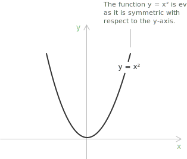
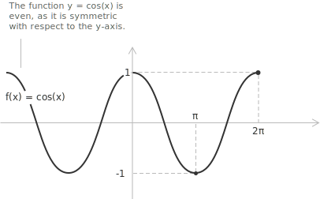
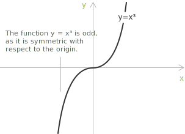
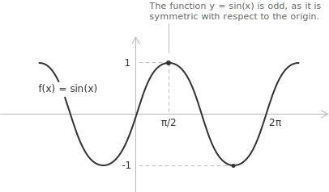

## Even function

A [function](../functions/) can be symmetric with respect to the coordinate axes. When it is symmetric about the $y$-axis it is even, when it is symmetric about the origin it is odd, and otherwise it is neither even nor odd. Suppose we have a function $f(x): \mathbb{R} \rightarrow \mathbb{R},$ and let $D \subseteq \mathbb{R}$ be its [domain](../determining-the-domain-of-a-function/), assumed symmetric about the origin. The function $f$ is even if the following condition holds:

$$
f(-x) = f(x) \quad \forall \ x \in D
$$

As shown in the figure, the function $f(x) = x^2$ is a [parabola](../parabola/) symmetric with respect to the $y$-axis. More generally, functions of the form $f(x) = x^4,$ $x^6,$ or $x^{2n},$ where the exponent is even, are examples of even functions. Another even function is the [cosine function](../cosine-function/). 

It is periodic with period $2\pi,$ and its graph is symmetric with respect to the $y$-axis. We can verify directly that:

$$\cos(\pi) = \cos(-\pi) = -1$$

A further example is the [absolute value function](../absolute-value-function/), since $|-x| = |x|$ for every real $x.$

Considering the family of functions $f(x) = x^{n}$ with $n \in \mathbb{N},$ the parity is entirely determined by the exponent: the function is even whenever $n$ is an even [integer](../integers/), and odd whenever $n$ is odd.

## Definite integral of even function

Evenness simplifies the evaluation of [definite integrals](../definite-integrals/) over symmetric intervals. Let $f(x)$ be [continuous](../continuous-functions/) and even, so its graph is symmetric with respect to the $y$-axis.

Over an interval of the form $[-a, a],$ this symmetry gives the identity:

$$
\int_{-a}^{a} f(x) \ dx = 2\int_0^a f(x) \ dx
$$

The total area under the curve from $-a$ to $a$ is twice the area from $0$ to $a,$ because the portion of the graph on the negative side of the $x$-axis is a mirror image of the positive side and contributes the same value to the integral.

## Odd function

Suppose we have a function $f(x): \mathbb{R} \rightarrow \mathbb{R},$ and let $D \subseteq \mathbb{R}$ be its domain, again symmetric about the origin. The function $f$ is odd if the following condition holds:

$$
f(-x) = -f(x) \quad \forall \ x \in D
$$

As shown in the figure, the function $f(x) = x^3$ is symmetric with respect to the origin. Functions of the form $f(x) = x^3,$ $x^5,$ or $x^{2n+1},$ where the exponent is odd, are examples of odd functions.

Another odd function is the [sine function](../sine-function/). It is periodic with period $2\pi,$ and its graph is symmetric with respect to the origin. We can verify directly that:

$$
\sin(-\pi) = -\sin(\pi) = 0
$$

## Definite integral of odd function

For an odd function, the area over $[-a, 0]$ is equal in magnitude but opposite in sign to the area over $[0, a].$ The definite integral over the symmetric interval therefore vanishes:

$$
\int_{-a}^{a} f(x) \ dx = 0
$$

If instead we measure the geometric area enclosed between the graph of $f(x)$ and the $x$-axis over $[-a, a],$ we integrate the absolute value, and the two halves add rather than cancel:

$$
S = \int_{0}^{a} |f(x)| \ dx
$$

## The only function that is both even and odd

Only the zero function $f(x) = 0$ is simultaneously even and odd. If a function were both even and odd, it would satisfy:

+ $f(-x) = f(x),$ because it is even.
+ $f(-x) = -f(x),$ because it is odd.

Combining the two identities gives $f(x) = -f(x),$ hence $2f(x) = 0$ and $f(x) = 0$ for all $x.$

## Properties

The parity of a function interacts predictably with the algebraic operations. Throughout, $f$ and $g$ denote functions defined on a domain symmetric about the origin.

The sum of two even functions is even, and the sum of two odd functions is odd. This follows directly from the defining identities: if $f$ and $g$ are even, then $(f+g)(-x) = f(-x) + g(-x) = f(x) + g(x) = (f+g)(x),$ and the same computation with a sign change handles the odd case. For example, $x^2 + \cos x$ is even, while $x^3 + \sin x$ is odd.

Multiplying a function by a constant preserves its parity, since the constant factor passes through the reflection $x \mapsto -x$ unchanged. Thus $3x^2$ remains even and $5x^3$ remains odd.

The product of two functions of the same parity is even, because the two sign changes cancel. If $f$ and $g$ are both odd, then $(fg)(-x) = \bigl(-f(x)\bigr)\bigl(-g(x)\bigr) = f(x)g(x).$ For this reason $x^2 \cos x$ (even times even) and $x^3 \sin x$ (odd times odd) are both even. When the two factors have opposite parity, a single sign change survives and the product is odd; for example $x^2 \sin x$ is odd.

Differentiation reverses parity: the [derivative](../derivatives/) of an even function is odd, and the derivative of an odd function is even. Differentiating the identity $f(-x) = f(x)$ with the [chain rule](../chain-rule/) gives $-f'(-x) = f'(x),$ so $f'$ is odd; the analogous computation starting from $f(-x) = -f(x)$ yields an even derivative. This is visible in the elementary cases $\frac{d}{dx}x^2 = 2x,$ which sends an even function to an odd one, and $\frac{d}{dx}x^3 = 3x^2,$ which sends an odd function to an even one.

[Composition](../composite-functions/) follows a rule that depends mostly on the inner function. When the inner function is even, the composite is even whatever the outer function does, because $f(g(-x)) = f(g(x))$ as soon as $g(-x) = g(x).$ When the inner function is odd, the composite inherits the parity of the outer function: if $g$ is odd, then $f(g(-x)) = f(-g(x)),$ which equals $f(g(x))$ when $f$ is even and equals $-f(g(x))$ when $f$ is odd. For instance $\cos(x^3)$ is even, $\sin(x^3)$ is odd, and $\cos(\sin x)$ is even.

## Decomposition into even and odd parts

Most functions are neither even nor odd, yet any function defined on a domain symmetric about the origin splits into an even contribution and an odd contribution. Given such a function $f,$ define:

$$
\begin{align}
f_{\mathrm{e}}(x) &= \frac{f(x) + f(-x)}{2} \\[6pt]
f_{\mathrm{o}}(x) &= \frac{f(x) - f(-x)}{2}
\end{align}
$$

A direct substitution of $-x$ shows that $f_{\mathrm{e}}$ is even and $f_{\mathrm{o}}$ is odd, while adding the two expressions returns $f$:

$$
f(x) = f_{\mathrm{e}}(x) + f_{\mathrm{o}}(x)
$$

This decomposition is the only one possible. Suppose $f = g + h$ with $g$ even and $h$ odd. Evaluating at $-x$ gives $f(-x) = g(x) - h(x),$ and solving the two equations for $g$ and $h$ reproduces exactly the formulas above. The even and odd parts of a function are therefore uniquely determined.

The exponential function is the standard example. Its even and odd parts are the [hyperbolic cosine and sine](../hyperbolic-sine-and-cosine/):

$$
e^x = \underbrace{\frac{e^x + e^{-x}}{2}}_{\cosh x} + \underbrace{\frac{e^x - e^{-x}}{2}}_{\sinh x}
$$

Here $\cosh x$ is even and $\sinh x$ is odd, and their sum recovers $e^x.$
