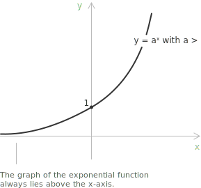
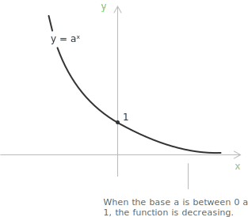
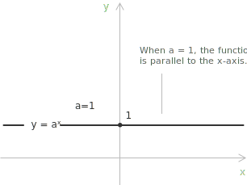

## Introduction

The exponential function is a [function](../functions/) of the form:

$$f(x) = a^x, \quad a \in \mathbb{R}^+, \quad a \neq 1$$

For any base $a > 0,$ the graph of the exponential function $y = a^x$ always intersects the y-axis at the point $(0, 1),$ because $a^0 = 1.$ It lies entirely above the x-axis, since $a^x > 0$ for all $x \in \mathbb{R},$ and never intersects the x-axis, so $a^x \neq 0$ for any real $x.$ The behavior of the function depends on the value of the base $a,$ and three cases are distinguished.

## Laws of exponents

The rules that hold for [integer](../integers/) [powers](../powers/) extend to every real exponent, provided the base is positive. For all [real numbers](../real-numbers/) $x$ and $y$ and bases $a, b > 0$:

$$
\begin{align}
a^{x+y} &= a^x a^y \\[6pt]
(a^x)^y &= a^{xy} \\[6pt]
(ab)^x &= a^x b^x
\end{align}
$$

The first identity is the functional equation of the exponential function, since it turns a sum in the exponent into a product of values. Together with $a^0 = 1,$ it fixes the value of a negative exponent. Setting $y = -x$ gives $a^x a^{-x} = a^0 = 1,$ so:

$$a^{-x} = \frac{1}{a^x}$$

A negative exponent inverts the corresponding positive power, which agrees with the fact that $a^x$ stays positive for every real $x.$

## Properties for $a$ greater than one

When $a > 1,$ the exponential function $y = a^x$ is [strictly increasing](../increasing-and-decreasing-functions/) over $\mathbb{R}.$

+ [Domain](../determining-the-domain-of-a-function/): $\mathbb{R}$
+ Range: $\mathbb{R}^+$
+ Monotonicity: the function is strictly increasing over $\mathbb{R}$
+ The function is bijective from $\mathbb{R}$ to $\mathbb{R}^+$
+ The function is [continuous](../continuous-functions/) and differentiable over $\mathbb{R}$
+ The function has no [maximum or minimum points](../maximum-minimum-and-inflection-points/)

The limits as $x$ approaches the extremes of the domain are:

$$
\begin{align}
\lim_{x \to -\infty} a^x &= 0^+ \\[6pt]
\lim_{x \to +\infty} a^x &= +\infty
\end{align}
$$

> When $a > 1,$ the exponential function grows without bound as $x \to +\infty$ and approaches zero from above as $x \to -\infty.$ Each unit increase in $x$ multiplies the value of the function by the constant factor $a.$

## Properties for $a$ between zero and one

When $0 < a < 1,$ the exponential function $y = a^x$ is strictly decreasing over $\mathbb{R}.$

+ Domain: $\mathbb{R}$
+ Range: $\mathbb{R}^+$
+ Monotonicity: the function is strictly decreasing over $\mathbb{R}$
+ The function is bijective from $\mathbb{R}$ to $\mathbb{R}^+$
+ The function is continuous and differentiable over $\mathbb{R}$
+ The function has no maximum or minimum points

The limits as $x$ approaches the extremes of the domain are:

$$
\begin{align}
\lim_{x \to -\infty} a^x &= +\infty \\[6pt]
\lim_{x \to +\infty} a^x &= 0^+
\end{align}
$$

> When $0 < a < 1,$ the exponential function decreases without bound as $x \to -\infty$ and approaches zero from above as $x \to +\infty.$ Each unit increase in $x$ multiplies the value of the function by the constant factor $a,$ which is less than one.

## Properties for $a$ equal to one

When $a = 1,$ the exponential function reduces to the constant function $y = 1^x = 1,$ which is excluded from the standard definition. Its graph is a horizontal line at height $y = 1.$

+ Domain: $\mathbb{R}$
+ Range: $\{1\}$
+ Monotonicity: the function is constant over $\mathbb{R}$
+ The function is continuous and differentiable over $\mathbb{R}$

## Connection with the logarithmic function

The exponential function $y = a^x$ is the [inverse](../inverse-function/) of the [logarithmic function](../logarithmic-function/) $y = \log_a(x),$ provided $a > 0$ and $a \neq 1.$ This inverse relationship means:

$$a^{\log_a(x)} = x, \qquad \log_a(a^x) = x$$

When the base $a$ equals [Euler's number](../euler-number-limit-sequence/) $e \approx 2.71828,$ the function is the natural exponential function:

$$f(x) = e^x$$

## Exponential growth and decay

The natural exponential function is characterized by a differential equation together with an initial condition. It is the unique function whose rate of change equals its value at every point and whose value at the origin is one:

$$f'(x) = f(x), \qquad f(0) = 1$$

More generally, a quantity that changes at a rate proportional to its current size satisfies $f'(t) = k f(t),$ and the solutions of this equation are exactly the functions:

$$f(t) = C e^{kt}$$

Here $k$ is the proportional rate of change, and $C = f(0)$ is the value at the initial time $t = 0.$ The sign of $k$ sets the behavior. When $k > 0$ the quantity grows, multiplying by a fixed factor over each fixed time span; when $k < 0$ it decays toward zero. A population that doubles over equal intervals and a radioactive sample whose mass drops by a fixed proportion in equal times both obey this law.

For a decaying quantity the half-life is the time $t_{1/2}$ that reduces it to half its value. It follows from $C e^{k t_{1/2}} = \tfrac{1}{2} C$ by taking the [natural logarithm](../logarithms/) of both sides:

$$t_{1/2} = -\frac{\ln 2}{k}$$

The constant $C$ cancels, so the half-life does not depend on the initial amount. For a growing quantity the same computation gives the doubling time $\ln 2 / k.$

The same $e^{-\lambda t}$ decay describes the [exponential distribution](../exponential-distribution/), which models the waiting time between events that occur independently at a constant rate $\lambda > 0.$

## Generalized exponential functions

Three cases arise when the base or the exponent is replaced by a function of $x.$

+ If the function has the form $y = [f(x)]^{g(x)},$ it is defined at those points where $f(x) > 0$ and $g(x)$ is defined.
+ If the function has the form $y = a^{f(x)}$ with $a > 0$ and $a \neq 1,$ it is defined wherever $f(x)$ is defined.
+ If the function has the form $y = [f(x)]^a,$ the domain condition depends on the sign of the exponent: the function is defined for $f(x) \geq 0$ when $a \in \mathbb{R}^+,$ and for $f(x) > 0$ when $a \in \mathbb{R}^-.$

## Limit, derivative and integral

The [remarkable limit](../remarkable-limits/) associated with the natural exponential function is:

$$\lim_{x \to 0} \frac{e^x - 1}{x} = 1$$

This limit shows that the derivative of $e^x$ at the origin equals one, consistently with $\frac{d}{dx} e^x = e^x.$ For a general base $a > 0,$ $a \neq 1,$ the corresponding limit is:

$$\lim_{x \to 0} \frac{a^x - 1}{x} = \ln(a)$$

The [derivative](../derivatives/) of the exponential function follows directly from the limit above. Differentiating $a^x$ with respect to $x$ gives:

$$\frac{d}{dx} a^x = a^x \ln(a)$$

$$\frac{d}{dx} e^x = e^x$$

Differentiating once more shows that the exponential function is [convex](../convexity-and-concavity-of-functions/) for every admissible base. The second derivative is:

$$\frac{d^2}{dx^2} a^x = a^x (\ln a)^2$$

Since $a^x > 0$ and $(\ln a)^2 > 0$ whenever $a \neq 1,$ the second derivative stays positive for every $x \in \mathbb{R},$ so the graph always bends upward, both when the function increases and when it decreases.

The [integral of the exponential function](../integral-of-the-exponential-function/) is obtained by reversing the differentiation formulas above:

$$\int a^x \ dx = \frac{a^x}{\ln(a)} + c$$

$$\int e^x \ dx = e^x + c$$

## Asymptotic growth

The exponential function grows faster than any [polynomial](../polynomial-function/) or power function, and slower than the [factorial](../factorial/). For any $a > 1$ and any $k > 0$:

$$\lim_{x \to +\infty} \frac{x^k}{a^x} = 0 \qquad \lim_{x \to +\infty} \frac{a^x}{x!} = 0$$

This establishes the following hierarchy of growth rates as $x \to +\infty$:

$$\log x \ll x^k \ll a^x \ll x!$$

The table below illustrates this hierarchy for $a = 2.$

| $x$ | $\log_2 x$ | $x^2$ | $2^x$ | $x!$ |
|:---------:|:----------------:|:-----------:|:-----------:|:----------:|
| 1  | 0   | 1    | 2       | 1           |
| 2  | 1   | 4    | 4       | 2           |
| 4  | 2   | 16   | 16      | 24          |
| 8  | 3   | 64   | 256     | 40,320       |
| 16 | 4   | 256  | 65,536   | 2.09 × 10¹³ |
| 32 | 5   | 1024 | 4.29 × 10⁹ | 2.63 × 10³⁵ |

> The hierarchy $\log x \ll x^k \ll a^x \ll x!$ appears in [asymptotic](../asymptotes/) analysis and in the classification of [algorithm complexity](../big-o-notation/) in computer science, where time and space requirements are measured against these growth rates.

## Hyperbolic functions derived from the exponential function

Combining $e^x$ and $e^{-x}$ yields the hyperbolic functions, which appear in analysis and geometry. The three main ones are the [hyperbolic sine and cosine](../hyperbolic-sine-and-cosine/) and the [hyperbolic tangent](../hyperbolic-tangent-and-cotangent/), defined as follows:

$$\cosh(x) = \frac{e^{x} + e^{-x}}{2} \quad x \in \mathbb{R}$$

$$\sinh(x) = \frac{e^{x} - e^{-x}}{2} \quad x \in \mathbb{R}$$

$$\tanh(x) = \frac{\sinh(x)}{\cosh(x)} \quad x \in \mathbb{R} \quad \tanh(x) \in (-1, 1)$$

Because they are defined through the exponential function, hyperbolic functions are smooth and differentiable over $\mathbb{R}.$ The function $\tanh(x)$ is bounded, unlike $\sinh(x)$ and $\cosh(x),$ which grow without bound as $x \to \pm\infty.$

> Their definitions mirror those of the [trigonometric functions](../sine-and-cosine/), with the difference that $\cosh$ and $\sinh$ parametrize the unit [hyperbola](../hyperbola/) $x^2 - y^2 = 1$ rather than the [unit circle](../unit-circle/) $x^2 + y^2 = 1.$
