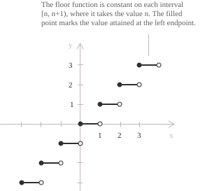
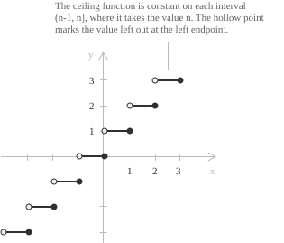
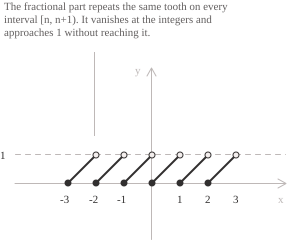

## Rounding down and rounding up

For every real number $x,$ the floor of $x$ is the greatest integer not exceeding $x,$ and the ceiling of $x$ is the smallest integer not less than $x.$ These choices define two [functions](../functions/) from $\mathbb{R}$ to $\mathbb{Z}:$

$$
\lfloor x \rfloor = \max\{\ n \in \mathbb{Z} \mid n \le x \ \} \qquad \lceil x \rceil = \min\{\ n \in \mathbb{Z} \mid x \le n \ \}
$$

Both extrema exist. The [Archimedean property](../real-numbers/) of $\mathbb{R}$ gives an integer above $x$ and an integer below $x,$ so both sets are non-empty. The first set is bounded above and the second below. A non-empty set of integers bounded above has a greatest element, and one bounded below has a smallest element.

The following inequalities characterise the integer returned by each function. For an integer $n$ we have:

$$
\lfloor x \rfloor = n \iff n \le x < n + 1
$$

$$
\lceil x \rceil = n \iff n - 1 < x \le n
$$

By the first equivalence, $\lfloor x \rfloor$ is the left endpoint of the unique [interval](../intervals/) $[n, n+1)$ containing $x.$ By the second, $\lceil x \rceil$ is the right endpoint of the unique interval $(n-1, n]$ containing $x.$ Applying them to a few numbers gives:

$$
\lfloor 3.7 \rfloor = 3 \qquad \lfloor 4 \rfloor = 4 \qquad \lfloor \pi \rfloor = 3 \qquad \lfloor -3.7 \rfloor = -4
$$

$$
\lceil 3.7 \rceil = 4 \qquad \lceil 4 \rceil = 4 \qquad \lceil \pi \rceil = 4 \qquad \lceil -3.7 \rceil = -3
$$

For negative arguments, rounding down means moving left along the real line and therefore away from the origin. Since $-4 \le -3.7 < -3,$ the greatest integer not exceeding $-3.7$ is $-4.$ Deleting the digits after the decimal point gives $-3$ instead, which is the ceiling of $-3.7.$

On the [integers](../integers/) the two functions are the identity, since $n \le n < n+1$ and $n - 1 < n \le n$ hold for every $n \in \mathbb{Z}.$ Their common range is therefore all of $\mathbb{Z},$ and neither function is injective, because an interval of length $1$ is sent to a single integer.

- - -

The graph of $y = \lfloor x \rfloor$ is a staircase with steps of unit width and unit height. The floor is a [piecewise function](../piecewise-functions/), constant with value $n$ on each interval $[n, n+1).$ Its graph consists of countably many horizontal segments, each containing its left endpoint and missing its right endpoint.

The graph of $y = \lceil x \rceil$ has the same staircase shape, with the endpoint convention reversed. On $(n-1, n]$ the ceiling is constant with value $n,$ and each segment includes its right endpoint and excludes its left endpoint.

## The fractional part and rounding to the nearest integer

The fractional part of $x$ is the difference between $x$ and its floor:

$$
\{x\} = x - \lfloor x \rfloor
$$

Subtracting $\lfloor x \rfloor$ from the three terms of $\lfloor x \rfloor \le x < \lfloor x \rfloor + 1$ gives the range of the fractional part:

$$
0 \le \{x\} < 1
$$

Every real number therefore has the decomposition $x=\lfloor x\rfloor+\{x\}$ into an integer and a number in $[0, 1).$ The decomposition is unique. If $x = m + s = m' + s'$ with $m, m' \in \mathbb{Z}$ and $s, s' \in [0, 1),$ then $m - m' = s' - s$ is an integer lying strictly between $-1$ and $1,$ hence $m = m'$ and $s = s'.$

> The notation $\{x\}$ is also used for the one-element set containing $x.$ Here $x \bmod 1$ denotes the same quantity as the fractional part, as shown in the section on division with remainder.

- - -

The fractional part is zero exactly at the integers and has period $1,$ since $\{x+1\}=\{x\}$ for every real $x.$ Its graph is a sawtooth obtained by subtracting the floor staircase from the identity function.

Deleting the digits after the decimal point defines truncation toward zero, which is distinct from both floor and ceiling on $\mathbb{R}.$ It equals the floor for $x \ge 0$ and the ceiling for $x < 0,$ so it can be written with the [sign function](../sign-function/) as $\mathrm{sgn}(x)\lfloor|x|\rfloor.$ A real-to-integer conversion that discards the fractional part uses this operation.

- - -

Applying a single floor to a shifted argument gives nearest-integer rounding. For a real number $x$ and an integer $n$ we have:

$$
\left\lfloor x + \frac{1}{2} \right\rfloor = n \iff n \le x + \frac{1}{2} < n + 1 \iff n - \frac{1}{2} \le x < n + \frac{1}{2}
$$

The value $n$ is returned exactly when $x$ lies in the interval of radius $1/2$ centred at $n,$ closed on the left and open on the right. Hence $\lfloor x+1/2\rfloor$ is the nearest integer to $x,$ and a number halfway between two integers is sent to the larger of them. The companion expression $\lceil x-1/2\rceil$ obeys $n - 1/2 < x \le n + 1/2$ and resolves ties in favour of the smaller integer. The two conventions differ at $x = 5/2:$

$$
\left\lfloor \frac{5}{2} + \frac{1}{2} \right\rfloor = 3 \qquad \left\lceil \frac{5}{2} - \frac{1}{2} \right\rceil = 2
$$

Both integers lie at distance $1/2$ from $5/2,$ so the tie is settled by the choice of formula and not by proximity.

## Reflection and translation

Changing the sign of the argument interchanges the two functions. For every real number $x$ we have:

$$
\lfloor -x \rfloor = -\lceil x \rceil \qquad \lceil -x \rceil = -\lfloor x \rfloor
$$

To prove the first identity, set $n=\lceil x\rceil,$ so that $n - 1 < x \le n.$ Multiplying by $-1$ reverses both inequalities and gives $-n \le -x < -n + 1,$ which is the inequality characterising the floor of $-x.$ Hence $\lfloor -x\rfloor=-n=-\lceil x\rceil.$ Replacing $x$ by $-x$ in the identity just proved yields the second one. Geometrically, the half turn about the origin carries the staircase of the floor onto the staircase of the ceiling.

The floor and ceiling are equal when $x$ is an integer and differ by $1$ otherwise:

$$
\lceil x \rceil - \lfloor x \rfloor =
\begin{cases}
0 & \text{if } x \in \mathbb{Z} \\[6pt]
1 & \text{if } x \notin \mathbb{Z}
\end{cases}
$$

For $x \in \mathbb{Z}$ both functions return $x.$ For $x \notin \mathbb{Z}$ the inequality $\lfloor x \rfloor \le x$ is strict, so $\lfloor x\rfloor<x<\lfloor x\rfloor+1.$ The integer $\lfloor x \rfloor + 1$ is then above $x,$ and every smaller integer is at most $\lfloor x \rfloor,$ hence below $x.$ The smallest integer above $x$ is therefore $\lfloor x \rfloor + 1.$

- - -

Adding an integer to the argument adds the same integer to the value of either function. For every real $x$ and every integer $k$ we have:

$$
\lfloor x + k \rfloor = \lfloor x \rfloor + k \qquad \lceil x + k \rceil = \lceil x \rceil + k
$$

Adding $k$ to the three terms of $\lfloor x \rfloor \le x < \lfloor x \rfloor + 1$ gives $\lfloor x\rfloor+k\le x+k<\lfloor x\rfloor+k+1,$ and the integer $\lfloor x \rfloor + k$ satisfies the inequality that characterises $\lfloor x + k \rfloor.$ The argument for the ceiling is identical. This extends the periodicity noted above to every integer shift, since $\{x+k\}=\{x\}.$

The condition $k \in \mathbb{Z}$ is necessary. For arbitrary real numbers $x$ and $y,$ the floor of the sum need not equal the sum of the floors. For $x = y = 1/2$ the sum $\lfloor x \rfloor + \lfloor y \rfloor$ equals $0$ while $\lfloor x+y\rfloor=1.$ Writing $x=\lfloor x\rfloor+\{x\}$ and $y=\lfloor y\rfloor+\{y\}$ and using the translation rule gives:

$$
\lfloor x + y \rfloor = \lfloor x \rfloor + \lfloor y \rfloor + \lfloor \{x\} + \{y\} \rfloor
$$

The two fractional parts lie in $[0, 1),$ so their sum lies in $[0, 2)$ and its floor is $0$ or $1.$ The floor of a sum thus exceeds the sum of the floors by at most one unit:

$$
\lfloor x \rfloor + \lfloor y \rfloor \le \lfloor x + y \rfloor \le \lfloor x \rfloor + \lfloor y \rfloor + 1
$$

## Comparing a floor or a ceiling with an integer

When a floor or a ceiling is compared with an integer, the rounding can sometimes be discarded without changing the truth value of the inequality. Four such rules hold for every real $x$ and every integer $n:$

$$
\begin{align}
\lfloor x \rfloor < n &\iff x < n \\[6pt]
n \le \lfloor x \rfloor &\iff n \le x \\[6pt]
n < \lceil x \rceil &\iff n < x \\[6pt]
\lceil x \rceil \le n &\iff x \le n
\end{align}
$$

The second rule follows from the definition of the floor as a greatest element. If $n \le \lfloor x \rfloor,$ then $n\le\lfloor x\rfloor\le x.$ Conversely, if $n \le x,$ then the integer $n$ belongs to the set of integers not exceeding $x,$ whose greatest element is $\lfloor x \rfloor,$ so $n \le \lfloor x \rfloor.$ The first rule is the contrapositive of the second, since the negation of $n \le t$ is $t < n.$ For the third rule, use $\lceil x\rceil=-\lfloor-x\rfloor$ and apply the first rule to $-x$ and $-n:$

$$
n < \lceil x \rceil \iff n < -\lfloor -x \rfloor \iff \lfloor -x \rfloor < -n \iff -x < -n \iff n < x
$$

The fourth rule is the contrapositive of the third.

- - -

The four remaining combinations are false. The value $x = 3/2$ refutes all of them:

+ $\lfloor 3/2\rfloor\le1$ holds, while $3/2 \le 1$ fails.
+ $1 < 3/2$ holds, while $1<\lfloor3/2\rfloor$ fails.
+ $2\le\lceil3/2\rceil$ holds, while $2 \le 3/2$ fails.
+ $3/2 < 2$ holds, while $\lceil3/2\rceil<2$ fails.

The valid rules are those in which the floor is bounded strictly from above or weakly from below, and the ceiling strictly from below or weakly from above. Every failure comes from a value of $x$ lying strictly between two integers, where the floor and the ceiling differ. The direction must therefore be checked before a floor or ceiling is removed from an inequality.

## Monotonicity, jumps, differentiation and integration

Neither function is strictly increasing, since each is constant on an interval of length $1,$ but both are [non-decreasing](../increasing-and-decreasing-functions/). If $x \le y,$ then $\lfloor x\rfloor\le x\le y,$ and the second comparison rule applied to the integer $\lfloor x \rfloor$ gives $\lfloor x \rfloor \le \lfloor y \rfloor.$ Similarly, $x\le y\le\lceil y\rceil,$ and the fourth rule applied to the integer $\lceil y\rceil$ gives $\lceil x\rceil\le\lceil y\rceil.$

The behaviour at an integer $n$ follows from the constancy on the adjacent intervals. To the left of $n$ the floor takes the value $n-1,$ to the right it takes the value $n,$ and the value at $n$ is $n$ itself:

$$
\begin{align}
\lim_{x \to n^-} \lfloor x \rfloor &= n - 1 \\[6pt]
\lim_{x \to n^+} \lfloor x \rfloor &= n = \lfloor n \rfloor
\end{align}
$$

The one-sided limits are different, so every integer is a [jump discontinuity](../discontinuities-of-real-functions/) of the floor function. Each jump has size $1.$ The value at an integer agrees with the limit from the right, so the floor is right-[continuous](../continuous-functions/) there. The ceiling has a jump of size $1$ at every integer, with one-sided limits $n$ and $n+1,$ and its value agrees with the limit from the left. At a non-integer point both functions are locally constant and hence continuous.

The set of discontinuities is $\mathbb{Z},$ which is [countably infinite](../cardinality-and-countable-sets/). A monotone function on an interval can have at most countably many discontinuities, and the floor function shows that this bound is reached. The [sign function](../sign-function/) is discontinuous at one point, the floor function at countably many points, and the [Dirichlet function](../dirichlet-function/) at every point.

- - -

On each open interval $(n, n+1)$ the floor function is constant, so it is differentiable there with zero [derivative](../derivatives/). At an integer it has no derivative, since differentiability at a point requires continuity there.

On every closed bounded interval, the floor function is bounded and has finitely many discontinuities, so it is [Riemann integrable](../riemann-integrability-criteria/). Over $[0, m]$ with $m$ a positive integer, the contribution of the step on $[k, k+1)$ is $k,$ and summing the arithmetic progression gives:

$$
\int_0^m \lfloor x \rfloor \ dx = \sum_{k=0}^{m-1} k = \frac{m(m-1)}{2}
$$

## Division with remainder

Let $a$ be an integer and $d$ a positive integer. The quotient $q$ and the remainder $r$ of the Euclidean division of $a$ by $d$ are:

$$
q = \left\lfloor \frac{a}{d} \right\rfloor \qquad r = a - d \left\lfloor \frac{a}{d} \right\rfloor
$$

The equality $a = qd + r$ holds by construction. The bounds on $r$ follow from $q \le a/d < q+1.$ Multiplication by the positive number $d$ preserves the inequalities and gives $qd \le a < qd + d.$ Subtracting $qd$ yields $0 \le r < d,$ so $q$ and $r$ are the quotient and the remainder given by the [division algorithm](../integers/). The [modulo operator](../modulo-operator/) is then:

$$
a \bmod d = a - d \left\lfloor \frac{a}{d} \right\rfloor
$$

The right-hand side is defined for a real dividend and a positive real divisor. For $d = 1$ it is the fractional part, which explains the alternative notation $x \bmod 1$ for $\{x\}.$ If the quotient is truncated toward zero, the remainder is zero or has the sign of the dividend. Thus dividing $-7$ by $5$ leaves remainder $3$ under the floor convention and $-2$ under truncation.

- - -

Floor and ceiling also split an integer into two nearly equal halves. For every integer $n$ we have:

$$
n = \left\lfloor \frac{n}{2} \right\rfloor + \left\lceil \frac{n}{2} \right\rceil
$$

The reflection identity gives $\lceil n/2\rceil=-\lfloor-n/2\rfloor,$ and $-n/2 = n/2 - n.$ Since $n$ is an integer, the translation rule gives:

$$
\left\lceil \frac{n}{2} \right\rceil = -\left\lfloor \frac{n}{2} - n \right\rfloor = -\left( \left\lfloor \frac{n}{2} \right\rfloor - n \right) = n - \left\lfloor \frac{n}{2} \right\rfloor
$$

The two halves differ by $1$ when $n$ is odd and coincide when $n$ is even. For $n \ge 0,$ the ordered pair $(\lfloor n/2\rfloor, \lceil n/2\rceil)$ is the unique pair $(a, b)$ of non-negative integers with $a + b = n$ and $0 \le b - a \le 1.$

The ceiling of a quotient of integers also has an expression in terms of the floor. For an integer $n$ and a positive integer $m$ we have:

$$
\left\lceil \frac{n}{m} \right\rceil = \left\lfloor \frac{n + m - 1}{m} \right\rfloor
$$

Write $n = qm + r$ with $0 \le r < m$ and use the translation rule on both sides, which removes the integer $q.$ The left side becomes $q + \lceil r/m\rceil$ and the right side becomes $q+\lfloor(r+m-1)/m\rfloor.$ For $r = 0$ the two added terms are $\lceil 0 \rceil = 0$ and $\lfloor (m-1)/m \rfloor = 0.$ For $1 \le r < m$ the quotient $r/m$ lies strictly between $0$ and $1,$ so its ceiling is $1,$ and the number $(r+m-1)/m$ lies in $[1, 2),$ so its floor is $1$ as well.

## Counting multiples and recognising divisors

Let $x$ be a non-negative real number and $k$ a positive integer. The number of positive multiples of $k$ that do not exceed $x$ is:

$$
\left\lfloor \frac{x}{k} \right\rfloor
$$

A positive integer $m$ satisfies $mk \le x$ if and only if $m \le x/k,$ and the second comparison rule gives $m \le \lfloor x/k \rfloor.$ Thus the positive multiples in question are the numbers $mk$ with $1 \le m \le \lfloor x/k\rfloor,$ so their number is $\lfloor x/k \rfloor.$ For example, $7 \cdot 12 = 84 \le 95 < 96 = 8 \cdot 12,$ so exactly seven positive multiples of $12$ do not exceed $95.$

The difference between the count up to $n$ and the count up to $n-1$ indicates whether $n$ is a multiple of $k.$ For positive integers $k$ and $n,$ consider the difference:

$$
\left\lfloor \frac{n}{k} \right\rfloor - \left\lfloor \frac{n-1}{k} \right\rfloor
$$

It equals $1$ when $k$ divides $n$ and $0$ otherwise, since the two ranges $1, \dots, n$ and $1, \dots, n-1$ differ by the single integer $n.$ Summing the difference over $k$ counts the divisors of $n$ in the range considered:

$$
D(n) = \sum_{k=2}^{\lfloor \sqrt{n} \rfloor} \left( \left\lfloor \frac{n}{k} \right\rfloor - \left\lfloor \frac{n-1}{k} \right\rfloor \right)
$$

A composite $n \ge 2$ has a factorisation $n = k\ell$ with $1 < k \le \ell.$ The smaller factor satisfies $k^2 \le n$ and therefore lies in the range $2 \le k \le \sqrt{n}.$ A prime has no divisor in that range, so for $n \ge 2$ the integer $n$ is prime if and only if $D(n) = 0.$ This formula is trial division written as a sum and still requires about $\sqrt{n}$ divisions.

## Counting the digits of an integer written in base b

A positive integer $n$ written in base $b,$ with $b$ an integer greater than $1,$ has an expansion of the form:

$$
n = \sum_{k=0}^{d-1} a_k b^k
$$

The digits $a_k$ are integers in the range $0 \le a_k < b,$ and the leading digit $a_{d-1}$ is non-zero. The condition on the leading digit says that $n$ has exactly $d$ digits, and it is equivalent to a pair of bounds. The smallest $d$-digit number is $b^{d-1},$ with leading digit $1$ and all other digits equal to zero. The largest is $b^d - 1,$ with every digit equal to $b-1.$ Hence:

$$
b^{d-1} \le n < b^d
$$

The [logarithm](../logarithms/) in base $b$ is increasing, so applying it preserves the inequalities and gives $d-1\le\log_b n<d.$ Since $d-1$ is an integer, it is the floor of $\log_b n.$ Therefore:

$$
d = \lfloor \log_b n \rfloor + 1
$$

Since $b^{d-1},$ $n,$ and $b^d$ are integers, the bounds are equivalent to $b^{d-1}<n+1\le b^d.$ Passing to logarithms gives $d-1<\log_b(n+1)\le d,$ so the digit count also has the form:

$$
d = \lceil \log_b (n+1) \rceil
$$

The shift by one unit inside the logarithm cannot be removed. For $n = 100$ and $b = 10$ the expression $\lceil\log_{10}100\rceil$ returns $2,$ while the correct count is $3.$ This discrepancy occurs exactly at the powers of the base.

> For $n = 45$ and $b = 2,$ we have $\log_2 45 = 5.4918\ldots,$ hence $d = 6.$ The binary representation $101101_2$ confirms the count, since $32 + 8 + 4 + 1 = 45.$

## Rounding inside and outside a function

A rounding of the argument can sometimes be removed when the function value is rounded as well. An interval $I \subseteq \mathbb{R}$ is closed under the floor if $x \in I$ implies $\lfloor x \rfloor \in I.$

Let $f: I \to \mathbb{R}$ be continuous and strictly increasing, and suppose that $f(x) \in \mathbb{Z}$ implies $x \in \mathbb{Z}$ for every $x \in I.$ Then for every $x \in I:$

$$
\lfloor f(x) \rfloor = \lfloor f(\lfloor x \rfloor) \rfloor
$$

Set $m = \lfloor x \rfloor.$ If $x = m$ the identity is immediate, so assume $m < x < m + 1.$ Strict increase gives $f(m) < f(x),$ and the hypothesis implies that $f(x)$ is not an integer. No integer can lie strictly between $f(m)$ and $f(x).$ Indeed, if $q \in \mathbb{Z}$ satisfied $f(m) < q < f(x),$ the [intermediate value theorem](../intermediate-value-theorem/) would give a point $y \in (m, x)$ with $f(y) = q.$ The hypothesis would then make $y$ an integer, although $(m, x) \subset (m, m + 1)$ contains none.

Let $r = \lfloor f(x)\rfloor.$ Since $f(x)$ is not an integer, $r < f(x).$ If $f(m) < r,$ then $r$ would be an integer strictly between $f(m)$ and $f(x),$ which is impossible. Hence $r \le f(m),$ and therefore $r \le \lfloor f(m)\rfloor.$ On the other hand, $f(m) < f(x)$ and monotonicity of the floor give $\lfloor f(m)\rfloor \le r.$ The two inequalities yield $\lfloor f(m)\rfloor = r = \lfloor f(x)\rfloor.$

If $I$ is closed under the ceiling, the same argument gives $\lceil f(x)\rceil=\lceil f(\lceil x\rceil)\rceil.$ Under the continuity and integer-value hypotheses above, a strictly decreasing $f$ satisfies $\lceil f(x)\rceil=\lceil f(\lfloor x\rfloor)\rceil$ when $I$ is closed under the floor, and $\lfloor f(x)\rfloor=\lfloor f(\lceil x\rceil)\rfloor$ when $I$ is closed under the ceiling.

- - -

The functions in the following applications are continuous and strictly increasing, and each domain is closed under the floor. It remains to verify that $f$ takes integer values only at integer arguments. Let $m$ and $n$ be positive integers and let $b>1$ be an integer. The three identities hold for $x \in \mathbb{R},$ $x \ge 0,$ and $x \ge 1,$ respectively:

$$
\begin{align}
\left\lfloor \frac{\lfloor x \rfloor}{n} \right\rfloor &= \left\lfloor \frac{x}{n} \right\rfloor \\[6pt]
\left\lfloor \sqrt[m]{\lfloor x \rfloor} \right\rfloor &= \left\lfloor \sqrt[m]{x} \right\rfloor \\[6pt]
\lfloor \log_b \lfloor x \rfloor \rfloor &= \lfloor \log_b x \rfloor
\end{align}
$$

For the first identity, $f(x) = x/n$ on $\mathbb{R}.$ If $x/n$ is an integer, then $x$ is a multiple of $n$ and hence an integer. For the second, $f(x) = x^{1/m}$ on $[0, +\infty).$ If $\sqrt[m]{x}=k$ for an integer $k,$ then $x = k^m.$ For the third, $f(x) = \log_b x$ on $[1, +\infty).$ If $\log_b x = k$ for an integer $k,$ then $k \ge 0$ and $x = b^k.$ Thus each function takes integer values only at integer arguments.

For a non-negative integer $x,$ deleting two decimal digits one at a time or both at once gives the same result:

$$
\left\lfloor \frac{\lfloor x/10 \rfloor}{10} \right\rfloor = \left\lfloor \frac{x}{100} \right\rfloor
$$

- - -

For every positive integer $n$ and every real $x,$ the floor of $nx$ is a sum of shifted floors:

$$
\lfloor nx \rfloor = \sum_{k=0}^{n-1} \left\lfloor x + \frac{k}{n} \right\rfloor
$$

Let $g(x)$ be the difference between the right-hand side and the left-hand side. Replacing $x$ by $x + 1/n$ shifts the indices in the sum. The term $\lfloor x \rfloor$ is removed and $\lfloor x+1\rfloor=\lfloor x\rfloor+1$ is added, so the right-hand side increases by $1.$ The left-hand side becomes $\lfloor nx+1\rfloor=\lfloor nx\rfloor+1$ and also increases by $1.$ Hence $g$ has period $1/n.$ For $0 \le x < 1/n$ every argument $x + k/n$ with $0 \le k \le n-1$ lies in $[0, 1)$ and $nx$ lies in $[0, 1),$ so all the floors vanish and $g(x) = 0.$ Periodicity extends the conclusion to every real number.

The case $n = 2$ reads $\lfloor 2x\rfloor=\lfloor x\rfloor+\lfloor x+1/2\rfloor.$ Monotonicity and the translation rule bound the second term by $\lfloor x\rfloor\le\lfloor x+1/2\rfloor\le\lfloor x+1\rfloor=\lfloor x\rfloor+1,$ so the floor of a doubled argument satisfies:

$$
2 \lfloor x \rfloor \le \lfloor 2x \rfloor \le 2 \lfloor x \rfloor + 1
$$

## The exponent of a prime in a factorial

For a prime $p$ and a positive integer $m,$ let $v_p(m)$ denote the exponent of $p$ in the factorisation of $m,$ so that $p^{v_p(m)}$ divides $m$ while $p^{v_p(m)+1}$ does not. For every positive integer $n,$ the exponent of $p$ in the [factorial](../factorial/) $n!$ is a sum of floors:

$$
v_p(n!) = \sum_{k \ge 1} \left\lfloor \frac{n}{p^k} \right\rfloor
$$

The terms are zero once $p^k > n,$ so the sum is finite; its non-zero terms are those with $1 \le k \le \lfloor \log_p n \rfloor.$ To prove the formula, observe that $p^k$ divides $m$ exactly for $k=1,\dots,v_p(m).$ Thus $v_p(m)$ is the number of positive integers $k$ such that $p^k$ divides $m.$ The exponent of $p$ in $n!$ is the sum of the exponents of its factors. Counting the pairs $(m, k)$ with $1 \le m \le n$ and $p^k \mid m$ first by $m$ and then by $k$ gives the same total. For a finite set $S,$ let $\#S$ denote its number of elements. The double count is:

$$
\begin{align}
v_p(n!) &= \sum_{m=1}^{n} v_p(m) \\[6pt]
&= \sum_{k \ge 1} \#\{\ 1 \le m \le n \mid p^k \mid m \ \} \\[6pt]
&= \sum_{k \ge 1} \left\lfloor \frac{n}{p^k} \right\rfloor
\end{align}
$$

The last equality is the count of multiples established above, applied with divisor $p^k.$

- - -

The number of zeros at the end of the decimal expansion of $n!$ is the exponent of $10$ in $n!,$ which equals the smaller of the exponents of $2$ and of $5.$ For every $k \ge 1,$ the inequality $2^k \le 5^k$ gives $\lfloor n/2^k\rfloor\ge\lfloor n/5^k\rfloor,$ so $v_2(n!)\ge v_5(n!).$ Thus the exponent of $5$ determines the number of trailing zeros. For $n = 750:$

$$
\begin{align}
v_5(750!)
&= \left\lfloor \frac{750}{5} \right\rfloor + \left\lfloor \frac{750}{25} \right\rfloor + \left\lfloor \frac{750}{125} \right\rfloor + \left\lfloor \frac{750}{625} \right\rfloor \\[6pt]
&= 150 + 30 + 6 + 1 \\[6pt]
&= 187
\end{align}
$$

The corresponding sum for $p = 2$ is $743>187,$ so $750!$ ends with exactly $187$ zeros. The valuation $v_p(n!)$ also has a closed form in terms of the base $p$ representation. Write $n = \sum_{i=0}^r a_i p^i,$ where $0 \le a_i < p,$ and let $s_p(n) = \sum_{i=0}^r a_i$ be the sum of the digits. Reversing the order of summation in the floor formula gives:

$$
\begin{align}
v_p(n!) &= \sum_{i=1}^r a_i (1 + p + \cdots + p^{i-1}) \\[6pt]
&= \sum_{i=1}^r a_i \frac{p^i - 1}{p - 1} \\[6pt]
&= \frac{n - s_p(n)}{p - 1}
\end{align}
$$

For $n = 750$ and $p = 5$ the representation is $11000_5,$ whose digit sum is $2,$ and the formula returns $(750-2)/4 = 187,$ the same value as the sum of floors above.

> The book, Discrete Structures by Andreas Klappenecker and Hyunyoung Lee is recommended for a detailed treatment of floor and ceiling functions. The book is listed in the [bibliography](../bibliography/).
