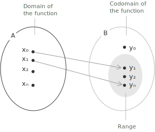
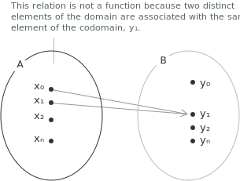
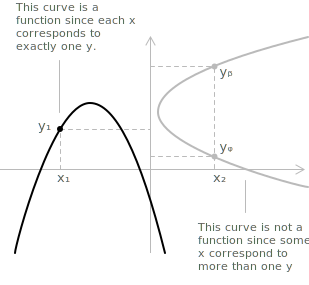

## Definition

A function is a rule that connects two non-empty [subsets](../sets/) of the [real numbers](../real-numbers/), typically denoted $A \subseteq \mathbb{R}$ and $B \subseteq \mathbb{R}$. A function $f$ from $A$ to $B$ assigns exactly one real number in $B$ to each real number in $A$. This relationship is written as:

$$
f \colon A \to B
$$

+ The set $A$ is called the [domain](../determining-the-domain-of-a-function/) of the function.
+ The set $B$ is the codomain.
+ For every $x \in A$, the function produces a unique value $f(x) \in B$.
+ The variable $x$ is the independent variable, while $y$ is the dependent variable.

> If such a rule holds, the function is well-defined. Otherwise the relation is not a function, since it either assigns no value or more than one value to an element of the domain.

- - -

The graph of $f$ is the set of pairs that match each input with its output,

$$
G_f = \{\ (x, f(x)) \mid x \in A \ \}
$$

so $G_f$ is a subset of $A \times B$. Each $x \in A$ belongs to exactly one pair, which is the geometric form of the rule that assigns a single output to every input.

- - -

A function $f : A \to B$ can be classified as:

+ Injective if every element of $B$ is the image of at most one element of $A$, that is, if for any $x_1, x_2 \in A$ with $x_1 \neq x_2$ we have $f(x_1) \neq f(x_2)$. Equivalently, for every $y \in B$ there is at most one $x \in A$ such that $f(x) = y$.
+ Surjective if every element of $B$ is the image of at least one element of $A$, that is, if for every $y \in B$ there exists at least one $x \in A$ such that $f(x) = y$.
+ Bijective if it is both injective and surjective, that is, if for every $y \in B$ there exists a unique $x \in A$ such that $f(x) = y$.

- - -

The identity function and the constant function are the two simplest cases. The identity function on a set $A$ sends every element to itself,

$$
\mathrm{id}_A \colon A \to A, \quad \mathrm{id}_A(x) = x
$$

and it is bijective, since distinct inputs give distinct outputs and every element of $A$ is attained. A constant function sends every element of its domain to one fixed value $c$,

$$
f \colon A \to B, \quad f(x) = c
$$

A constant function is not injective when $A$ has more than one element, and it is surjective only when $B$ reduces to the single value $c$.

- - -

An alternative definition states that a function $f : A \to B$ is bijective if and only if there exists a function $g : B \to A$ such that:

$$(g \circ f)(x) = x, \quad \forall \ x \in A$$
$$(f \circ g)(y) = y, \quad \forall \ y \in B$$

The right-hand sides are the identity functions on $A$ and on $B$, so the two conditions read $g \circ f = \mathrm{id}_A$ and $f \circ g = \mathrm{id}_B$. Whenever such a function $g$ exists, it is uniquely determined. In this case $g$ is the [inverse](../inverse-function/) of $f$ and is denoted by $f^{-1}$.

> An example is the [logarithmic function](../logarithms/), which is the inverse of the [exponential function](../exponential-function/), and conversely.

A function that is not injective on all of $A$ can still be inverted on a smaller domain. Given $E \subseteq A$, the restriction $f|_E$ is the function that agrees with $f$ at every point of $E$,

$$
f|_E \colon E \to B, \quad f|_E(x) = f(x)
$$

If $f$ is injective on $E$, then $f|_E$ is invertible there. The sine function shows this behavior, since it is not injective on $\mathbb{R}$, but its restriction to $\left[ -\frac{\pi}{2}, \frac{\pi}{2} \right]$ is injective and has inverse $\arcsin$.

## What is not a function

A relation fails to be a function when there exist at least two distinct points $(x, y_1)$ and $(x, y_2)$ with $y_1 \ne y_2$. A single value of $x$ is then associated with more than one value of $y$, which contradicts the definition.

In the image, a single element of the domain, denoted $x_0$, corresponds to two distinct values in the codomain. This is not admissible by the definition of a function. Formally, a relation $R \subseteq A \times B$ is a function if and only if:

$$\forall \ x \in A, \ \exists! \ y \in B \; : \; (x, y) \in R$$

In our case there exist $y_1, y_2 \in B$ with $y_1 \ne y_2$ such that $(x_0, y_1) \in R$ and $(x_0, y_2) \in R$, which violates the uniqueness required for $R$ to be a function. In simpler terms, consider values of $x$ associated with values of $y$ as in the following table:

| X  | -3 |  1 | -3 |  5 |  2 |
|----|----|----|----|----|----|
| Y  |  7 |  4 | 10 | -2 |  8 |

The relation does not represent a function because the same value $x = -3$ has two different corresponding values of $y$, namely $y = 7$ and $y = 10$. This violates the requirement that each element of the domain be associated with one and only one element of the codomain.

- - -

A practical graphical criterion for deciding whether a curve in the plane represents a function is the vertical line test. Draw any vertical line and count how many times it intersects the curve. If every vertical line meets the curve in at most one point, then the curve represents a function.

+ For each value of $x$ there is at most one corresponding value of $y$.
+ If some vertical line crosses the curve in two or more points, the curve does not represent a function, because that value of $x$ would be associated with multiple outputs.

The figure shows that the curve on the left, a [parabola](../parabola/), is a function, since each $x$ corresponds to exactly one $y$, whereas the curve on the right is not, since for $x_2$ there are several possible values of $y$.

## Difference between codomain and range

The codomain is the set we declare as the potential target of the outputs of a function. It is stated explicitly in the definition, since in a function written $f: A \to B$ the set $B$ is the codomain.

The range (or image) is the actual set of outputs that the function attains over its domain. It collects all values $f(x)$ for $x \in A$, and it is always a subset of the codomain.

More generally, the image of a subset $E \subseteq A$ is the set of outputs produced by the points of $E$,

$$
f(E) = \{\ f(x) \mid x \in E \ \}
$$

so the range is the image of the whole domain, $f(A)$. In the opposite direction, the preimage of a subset $F \subseteq B$ collects the inputs whose output lands in $F$,

$$
f^{-1}(F) = \{\ x \in A \mid f(x) \in F \ \}
$$

The notation $f^{-1}(F)$ refers to a set and does not require $f$ to be invertible. Restricting the codomain to the range turns any function into a surjective one, since every element of $f(A)$ is attained by construction.

## Function equality and zeros

Two functions $y = f(x)$ and $y = g(x)$ are equal if they share the same domain $D$ and satisfy:

$$
f(x) = g(x) \quad \forall \ x \in D
$$

A real number $a \in \mathbb{R}$ is a zero of the function $y = f(x)$ if the function vanishes at that point:

$$
f(a) = 0
$$

The graph of the function then intersects the $x$-axis at the point $(a, 0)$. The zeros of a function are used to analyze its behavior, to solve [equations](../equations/), and to determine where the function changes [sign](../sign-analysis-in-inequalities/).

## Symmetric functions

[Even and odd functions](../even-and-odd-functions/) describe the behavior of a function under reflection about the origin. Let $A \subseteq \mathbb{R}$ be a domain symmetric with respect to the origin, meaning $x \in A \Rightarrow -x \in A$. A function $f : A \to \mathbb{R}$ is said to be:

+ Even if $f(-x) = f(x)$ for all $x \in A$.
+ Odd if $f(-x) = -f(x)$ for all $x \in A$.

More generally, for the power function $f(x) = x^{n}$ with $n \in \mathbb{N}$, the function is even exactly when the exponent $n$ is even and odd exactly when $n$ is odd.

## Bounded functions

A function can stay within fixed limits across its domain, never rising above a threshold or dropping below one. Formally, $f : A \subseteq \mathbb{R} \to \mathbb{R}$ is said to be:

+ Upper bounded if there exists $M \in \mathbb{R}$ such that $f(x) \leq M$ for all $x \in A$.
+ Lower bounded if there exists $m \in \mathbb{R}$ such that $m \leq f(x)$ for all $x \in A$.
+ Bounded if it satisfies both conditions, so that $m \leq f(x) \leq M$ for all $x \in A$.

A bounded function differs from one that attains a [maximum or minimum](../maximum-minimum-and-inflection-points/). Boundedness does not imply that the function actually reaches a maximal or minimal value, globally or locally; it only means that the values remain confined within a finite interval $[m, M]$.

If a function has a global maximum, then it is bounded from above, and a global minimum ensures that it is bounded from below. The converse fails, since a function may be bounded without attaining any maxima or minima. An example is:

$$
f(x) = \arctan x
$$

This function satisfies $-\frac{\pi}{2} < \arctan x < \frac{\pi}{2}$ for every real $x$, so it is bounded. It has neither a global maximum nor a global minimum, because the values $\pm\frac{\pi}{2}$ are approached as $x \to \pm\infty$ but never reached.

## Monotone functions

[Increasing, decreasing, and monotone functions](../increasing-and-decreasing-functions/) describe how the output of a function changes as the input grows. Let $A \subseteq \mathbb{R}$ and let $x_1, x_2 \in A$ with $x_1 < x_2$. A function $f : A \to \mathbb{R}$ is said to be:

+ Increasing if $f(x_1) \leq f(x_2)$.
+ Strictly increasing if $f(x_1) < f(x_2)$.
+ Decreasing if $f(x_1) \geq f(x_2)$.
+ Strictly decreasing if $f(x_1) > f(x_2)$.
+ Monotone if it satisfies one of the conditions above throughout its domain.

## Periodic functions

A function is periodic when its values repeat after a fixed horizontal shift. Let $X \subseteq \mathbb{R}$ be a set with $x + T \in X$ whenever $x \in X$, for some $T > 0$. A function $f : X \to \mathbb{R}$ is periodic with period $T$ when its values repeat after a shift by $T$:

$$
f(x + T) = f(x)
$$

The period $T$ is the smallest positive number for which this identity holds for all $x$ in the domain. The [sine](../sine-and-cosine/) and [cosine](../sine-and-cosine/) functions are periodic, both repeating their entire pattern after an interval of length $2\pi$.

## Classification of functions

Functions are classified as algebraic or transcendental. A function is algebraic if its expression $y = f(x)$ involves only finitely many operations such as addition, subtraction, multiplication, division, exponentiation to a rational [power](../powers/), and [root extraction](../radicals/). Algebraic functions are further categorized by the structure of their expressions:

+ [Polynomial functions](../polynomial-function/) are defined by a [polynomial](../polynomials/) expression involving powers of $x$ with constant coefficients.
+ Rational functions are expressed as the [ratio of two polynomials](../rational-functions/).
+ Irrational functions contain the variable $x$ under a [root symbol](../radicals/), such as $\sqrt{x}$.

Transcendental functions go beyond algebraic operations and include expressions that cannot be written through finitely many additions, subtractions, multiplications, divisions, and root extractions. Common examples are [exponential functions](../exponential-function/), [logarithmic functions](../logarithms/), and [trigonometric functions](../sine-and-cosine/).

## Domain of the main functions

The most common elementary functions have domains that follow directly from their expressions. Many functions encountered in practice are more complex, and their domains cannot be read off at a glance. For those situations we refer to the [systematic method](../determining-the-domain-of-a-function/) for determining the domain of more complex functions.

- - -

[Polynomial functions](../polynomial-function/) have the form:

$$
y = a_0 x^n + a_1 x^{n-1} + \dots + a_n
$$

In this expression $a_0, a_1, \dots, a_n$ are real coefficients and $n \in \mathbb{N}$. The domain of a polynomial function is the entire set of real numbers $\mathbb{R}$, since it involves no operation that could restrict its definition. An example is:

$$
y = 2x^3 - 5x^2 + 3x - 1
$$

This expression is a linear combination of powers of $x$, where each term $a_i x^i$ has a real coefficient $a_i$. It is defined for every real number $x$, since no operation imposes a restriction on the domain.

- - -

[Rational functions](../rational-functions/) have the form:

$$
y = \frac{N(x)}{D(x)}
$$

In this expression $N(x)$ and $D(x)$ are polynomials. These functions are defined for all real numbers $x$ such that $D(x) \neq 0$, so the domain is $\mathbb{R}$ excluding the values that make the denominator zero. An example is:

$$
y = \frac{x^2 - 4}{x - 2}
$$

This is the ratio of two polynomials. The function is defined for all real $x$ except those that make the denominator vanish, here $x = 2$.

- - -

Irrational functions have the form:

$$
y = \sqrt[n]{f(x)}
$$

The domain depends on the parity of the index $n$. If $n$ is even, the function is defined only when $f(x) \geq 0$, so the domain is:

$$
\{ x \in \mathbb{R} \mid f(x) \geq 0 \}
$$

An example with an even index is:

$$
y = \sqrt{x - 2}
$$

The radicand must be non-negative, so the domain is $x \ge 2$. If $n$ is odd, the function is defined for every value in the domain of $f(x)$. An example with an odd index is:

$$
y = \sqrt[3]{x - 2}
$$

The cube root is defined for every real $x$, since odd roots accept negative arguments. The domain is therefore the entire set $\mathbb{R}$.

- - -

[Logarithmic functions](../logarithms/) have the form:

$$
y = \log_a{f(x)} \quad \text{with} \quad a > 0,\; a \ne 1
$$

They are defined only when the argument of the [logarithm](../logarithms/) is strictly positive, so the domain is:

$$
\{x \in \mathbb{R} \mid f(x) > 0 \}
$$

An example is:

$$
y = \log_2(x - 1)
$$

This function is defined only when $x - 1 > 0$, so the domain is $x > 1$. For any $x \le 1$ the expression is undefined, because the logarithm of a non-positive number does not exist in the reals. Another example is:

$$
y = \ln(3x + 6)
$$

Here the argument $3x + 6$ must be positive, so the domain is $x > -2$. The same principle applies to every logarithmic function: the argument must be strictly greater than zero.

- - -

[Exponential functions](../exponential-function/) have the form:

$$
y = a^{f(x)} \quad \text{with} \quad a > 0,\; a \ne 1
$$

They are defined for all values in the domain of $f(x)$. An example is:

$$
y = 2^x
$$

This function is defined for every real $x$, since the base $a = 2$ is positive and different from $1$. Its domain is $\mathbb{R}$, while its range is strictly positive, $y > 0$.

- - -

Exponential functions with a variable base have the form:

$$
y = [f(x)]^{g(x)}
$$

They are defined only when the base $f(x) > 0$, since real-valued exponentiation requires a positive base. The domain is the intersection:

$$
\{ x \in \mathbb{R} \mid f(x) > 0 \} \ \cap \ \text{domain of } g(x)
$$

- - -

A power with an irrational exponent $\alpha \in \mathbb{R} \setminus \mathbb{Q}$ has the form:

$$
f(x)^{\alpha}
$$

It is defined under the following conditions:

$$
\{ x \in \mathbb{R} \mid f(x) \geq 0 \}, \quad \text{if } \alpha > 0
$$
$$
\{ x \in \mathbb{R} \mid f(x) > 0 \}, \quad \text{if } \alpha < 0
$$

The strict inequality for $\alpha < 0$ excludes the base $0$, which would require division by zero. These conditions keep the result within the real numbers.

- - -

For the trigonometric functions, the following domains apply:

+ $y = \sin x$ and $y = \cos x$ have domain $\mathbb{R}$.
+ $y = \tan x$ has domain $\mathbb{R} \setminus \left\{ \dfrac{\pi}{2} + k\pi \right\}$ with $k \in \mathbb{Z}$.
+ $y = \cot x$ has domain $\mathbb{R} \setminus \left\{ k\pi \right\}$ with $k \in \mathbb{Z}$.
+ $y = \arcsin x$ and $y = \arccos x$ have domain $[-1, 1]$.
+ $y = \arctan x$ and $y = \mathrm{arccot}\ x$ have domain $\mathbb{R}$.

> The domain is the first step in solving [equations](../equations/), [inequalities](../inequalities/), and [analyzing the graph of a function](../analyzing-the-graphs-of-functions/). For expressions that combine several elementary functions, the [systematic method](../determining-the-domain-of-a-function/) shows how to handle the restrictions one layer at a time.

## Operations between functions

When two real functions are defined on the same domain, we can combine them through the usual algebraic operations to obtain new functions. This extends the arithmetic of real numbers to functions, where each operation is applied pointwise for every $x$ in the domain. Consider two functions

$$
f : X_1 \subseteq \mathbb{R} \to \mathbb{R} \quad \text{and} \quad g : X_2 \subseteq \mathbb{R} \to \mathbb{R}
$$

On the common domain $X = X_1 \cap X_2$ the following operations can be performed.

- - -

The sum of two functions $f$ and $g$ is defined by:

$$
(f + g)(x) = f(x) + g(x)
$$

The resulting function assigns to each $x \in X$ the sum of the corresponding values of $f$ and $g$.

- - -

The difference of two functions is:

$$
(f - g)(x) = f(x) - g(x)
$$

- - -

The product of two functions is:

$$
(f \cdot g)(x) = f(x)g(x)
$$

The resulting function is the pointwise product of the two values.

- - -

The quotient of two functions is:

$$
\left(\frac{f}{g}\right)(x) = \frac{f(x)}{g(x)}
$$

It is defined only for those $x \in X$ where $g(x) \neq 0$. Its domain is obtained by excluding from $X$ all points that make the denominator vanish.

- - -

The composition of two functions, written $(g \circ f)(x) = g(f(x))$, is another fundamental operation, treated in detail on the dedicated page on [composite functions](../composite-functions/).