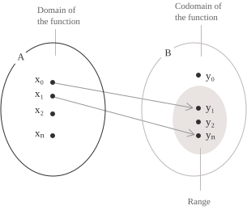
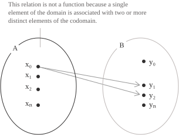
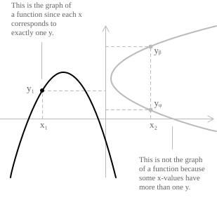

## Definition

This entry considers functions with a non-empty domain $A \subseteq \mathbb{R}$ and a non-empty codomain $B \subseteq \mathbb{R},$ both [subsets](../sets/) of the [real numbers](../real-numbers/). A function $f$ from $A$ to $B$ assigns to each $x \in A$ exactly one value $f(x) \in B.$ This assignment is written as:

$$
f \colon A \to B
$$

+ The set $A$ is called the [domain](../determining-the-domain-of-a-function/) of the function.
+ The set $B$ is the codomain.
+ For every $x \in A,$ the function assigns a unique value $f(x) \in B.$
+ When the output is denoted by $y = f(x),$ the variable $x$ is the independent variable and $y$ is the dependent variable.

For example, let $f \colon \mathbb{R} \to \mathbb{R}$ be defined by $f(x) = 2x - 1.$ The notation $x \mapsto 2x - 1$ describes the same assignment. Substituting $3$ for $x$ gives $f(3) = 2 \cdot 3 - 1 = 5.$ The symbol $f$ denotes the whole function, while $f(3)$ denotes one value of that function.

The assignment may be specified by a formula, a table, a diagram, or a rule defined by cases.

> A rule that satisfies this existence and uniqueness condition defines a well-defined function. A relation that assigns no value or more than one value to some element of $A$ is not a function.

- - -

The graph of $f$ is the set of ordered pairs formed by each input and its assigned output:

$$
G_f = \{\ (x, f(x)) \mid x \in A \ \}
$$

Thus $G_f \subseteq A \times B,$ and each $x \in A$ occurs as the first coordinate of exactly one pair.

- - -

A function $f \colon A \to B$ may have the following properties:

+ The function is injective if every element of $B$ is the image of at most one element of $A,$ that is, if for any $x_1, x_2 \in A$ with $x_1 \neq x_2$ we have $f(x_1) \neq f(x_2).$ Equivalently, for every $y \in B$ there is at most one $x \in A$ such that $f(x) = y.$
+ The function is surjective if every element of $B$ is the image of at least one element of $A,$ that is, if for every $y \in B$ there exists at least one $x \in A$ such that $f(x) = y.$ Equivalently, $f(A) = B.$
+ The function is bijective if it is both injective and surjective, that is, if for every $y \in B$ there exists a unique $x \in A$ such that $f(x) = y.$

A bijection $A \to B$ proves $|A| = |B|,$ while an injection $A \to B$ proves $|A| \leq |B|.$ The discussion in [cardinality and countable sets](../cardinality-and-countable-sets/) uses these maps to compare infinite sets and establish countability criteria.

- - -

The identity function and the constant function are the two simplest cases. The identity function on a set $A$ sends every element to itself and is defined by:

$$
\mathrm{id}_A \colon A \to A, \quad \mathrm{id}_A(x) = x
$$

It is bijective, since distinct inputs give distinct outputs and every element of $A$ is attained. For a fixed value $c \in B,$ the constant function from $A$ to $B$ is defined by:

$$
f \colon A \to B, \quad f(x) = c
$$

A constant function is not injective when $A$ has more than one element, and it is surjective exactly when $B = \{\ c \ \}.$

- - -

A function $f \colon A \to B$ is bijective if and only if it has a two-sided inverse, that is, if there exists a function $g \colon B \to A$ such that:

$$(g \circ f)(x) = x, \quad \forall \ x \in A$$
$$(f \circ g)(y) = y, \quad \forall \ y \in B$$

Here $(g \circ f)(x) = g(f(x)).$ The right-hand sides are the identity functions on $A$ and $B,$ so the two conditions read $g \circ f = \mathrm{id}_A$ and $f \circ g = \mathrm{id}_B.$ Whenever such a function $g$ exists, it is unique. It is the [inverse](../inverse-function/) of $f$ and is denoted by $f^{-1}.$

> For any base $a > 0$ with $a \neq 1,$ the [exponential function](../exponential-function/) $x \mapsto a^x$ from $\mathbb{R}$ to $(0,+\infty)$ and the [logarithmic function](../logarithmic-function/) $\log_a$ from $(0,+\infty)$ to $\mathbb{R}$ are inverses.

A function that is not injective on all of $A$ can still be inverted on a smaller domain. Given $E \subseteq A,$ the restriction $f|_E$ agrees with $f$ at every point of $E$ and is defined by:

$$
f|_E \colon E \to B, \quad f|_E(x) = f(x)
$$

If $f$ is injective on $E,$ the same assignment, now with codomain $f(E),$ defines a bijection from $E$ to $f(E),$ and this bijection has an inverse. The sine function is not injective on $\mathbb{R}.$ Its restriction to $[-\pi/2, \pi/2],$ with codomain $[-1, 1],$ is the function:

$$
\sin|_{[-\pi/2, \pi/2]} \colon [-\pi/2, \pi/2] \to [-1, 1]
$$

This restriction is bijective, and its inverse is the [arcsine function](../arcsine-and-arccosine/) $\arcsin \colon [-1, 1] \to [-\pi/2, \pi/2].$

## What is not a function

A relation $R \subseteq A \times B$ defines a function from $A$ to $B$ only when every $x \in A$ has exactly one associated value $y \in B.$ It fails this condition if some $x$ has no associated value or has more than one.

The image illustrates the second failure. A single element $x_0$ corresponds to two distinct values in the codomain, so the relation is not a function. Formally, the required existence and uniqueness condition is:

$$
\forall x \in A,\ \exists! y \in B\ \text{such that}\ (x, y) \in R
$$

In the relation shown, both $(x_0, y_1)$ and $(x_0, y_2)$ belong to $R,$ with $y_1 \neq y_2,$ which violates uniqueness. The following table gives a numerical example:

| X  | -3 |  1 | -3 |  5 |  2 |
|----|----|----|----|----|----|
| Y  |  7 |  4 | 10 | -2 |  8 |

The relation is not a function because $x = -3$ is associated with both $7$ and $10,$ rather than with exactly one value.

- - -

A curve in the plane is the graph of a function on its projection onto the $x$-axis exactly when every vertical line meets it in at most one point. This criterion is the vertical line test.

The curve on the left, a [parabola](../parabola/), is the graph of a function, since each $x$ corresponds to exactly one $y.$ The curve on the right is not the graph of a function, since $x_2$ corresponds to more than one value of $y.$

## Difference between codomain and range

For a function $f \colon A \to B,$ the codomain is the declared target set $B.$

The range (or image) is the set of values attained by the function. It is $f(A)$ and is always a subset of $B.$

Consider the function $f \colon \mathbb{R} \to \mathbb{R}$ defined by $f(x) = x^2.$ Its codomain is $\mathbb{R},$ while its range is $[0, +\infty),$ so it is not surjective. The same assignment with codomain $[0, +\infty)$ defines a surjective function, but it is not injective because $f(-1) = f(1) = 1.$ With both domain and codomain equal to $[0, +\infty),$ the same formula defines a bijection.

For a subset $E \subseteq A,$ its image is defined by:

$$
f(E) = \{\ f(x) \mid x \in E \ \}
$$

The range is therefore the image of the whole domain. For a subset $F \subseteq B,$ its preimage is defined by:

$$
f^{-1}(F) = \{\ x \in A \mid f(x) \in F \ \}
$$

The notation $f^{-1}(F)$ denotes a set and does not require $f$ to be invertible. The function $f \colon A \to f(A)$ is surjective because every element of $f(A)$ is attained by construction.

## Function equality and zeros

Under the convention used here, the domain and codomain are part of the data of a function. Two functions are equal when these sets agree and the functions have the same value at every point. For $f,g \colon D \to B,$ the pointwise condition is:

$$
f(x) = g(x) \quad \forall \ x \in D
$$

A point $a \in D$ is a zero of $f$ if the function vanishes at that point:

$$
f(a) = 0
$$

The graph of the function then meets the $x$-axis at $(a, 0).$ Finding the zeros is equivalent to solving the [equation](../equations/) $f(x) = 0.$ In [sign analysis](../sign-analysis-in-inequalities/), every zero must be examined as a possible boundary between positive and negative values, although the sign need not change there.

## Symmetric functions

[Even and odd functions](../even-and-odd-functions/) describe the behavior of a function under the change $x \mapsto -x.$ Let $A \subseteq \mathbb{R}$ be symmetric with respect to the origin, meaning $x \in A \Rightarrow -x \in A.$ For a function $f \colon A \to \mathbb{R},$ the two cases are:

+ The function is even if $f(-x) = f(x)$ for all $x \in A.$
+ The function is odd if $f(-x) = -f(x)$ for all $x \in A.$

The graph of an even function is symmetric with respect to the $y$-axis, while the graph of an odd function is symmetric with respect to the origin. For the [power function](../powers/) $f(x) = x^n,$ where $n$ is a positive integer, the identity $f(-x) = (-1)^nx^n$ shows that $f$ is even exactly when $n$ is even and odd exactly when $n$ is odd.

## Bounded functions

For a function $f \colon A \to \mathbb{R}$ with $A \subseteq \mathbb{R},$ boundedness is defined as follows:

+ The function is bounded above if there exists $M \in \mathbb{R}$ such that $f(x) \leq M$ for all $x \in A.$
+ The function is bounded below if there exists $m \in \mathbb{R}$ such that $m \leq f(x)$ for all $x \in A.$
+ The function is bounded if it satisfies both conditions, so that $m \leq f(x) \leq M$ for all $x \in A.$

Boundedness means that the range lies in some [bounded interval](../intervals/) $[m, M].$ It does not imply the existence of a global [maximum or minimum](../maximum-minimum-and-inflection-points/).

A global maximum is an [upper bound](../supremum-and-infimum/) attained by the function, and a global minimum is a lower bound attained by the function. A bounded function need not have either one. The [arctangent function](../arctangent-and-arccotangent/) is an example:

$$
f(x) = \arctan x
$$

It satisfies $-\frac{\pi}{2} < \arctan x < \frac{\pi}{2}$ for every real $x,$ so it is bounded. It has neither a global maximum nor a global minimum, because $\arctan x \to \frac{\pi}{2}$ as $x \to +\infty$ and $\arctan x \to -\frac{\pi}{2}$ as $x \to -\infty,$ but neither limiting value is attained.

## Monotone functions

[Increasing, decreasing, and monotone functions](../increasing-and-decreasing-functions/) compare function values at ordered points. For a function $f \colon A \to \mathbb{R},$ the inequality in each of the first four definitions below must hold for every pair $x_1, x_2 \in A$ with $x_1 < x_2:$

+ The function is increasing if $f(x_1) \leq f(x_2).$
+ The function is strictly increasing if $f(x_1) < f(x_2).$
+ The function is decreasing if $f(x_1) \geq f(x_2).$
+ The function is strictly decreasing if $f(x_1) > f(x_2).$
+ The function is monotone if it is increasing or decreasing throughout its domain.
+ The function is strictly monotone if it is strictly increasing or strictly decreasing throughout its domain.

## Periodic functions

A function $f \colon X \to \mathbb{R}$ is periodic if there exists $T > 0$ for which the translation $x \mapsto x + T$ maps $X$ onto itself and the following identity holds for every $x \in X:$

$$
f(x + T) = f(x)
$$

Every positive $T$ satisfying these conditions is a period of $f.$ If the set of positive periods has a least element, that element is the fundamental period. The [sine and cosine functions](../sine-and-cosine/) both have fundamental period $2\pi.$

## Classification of functions

The algebraic-transcendental distinction below concerns elementary real functions on non-degenerate intervals. A real-valued function $f$ is algebraic on such an interval if there is a nonzero polynomial $P$ in two variables, with real coefficients and positive degree in $y,$ such that $P(x, f(x)) = 0$ throughout the interval. For example, on $[0, +\infty),$ the function $f(x) = \sqrt{x}$ satisfies $f(x)^2 - x = 0.$ Common classes of algebraic functions include:

+ [Polynomial functions](../polynomial-function/) have a [polynomial](../polynomials/) expression in $x$ with constant coefficients.
+ [Rational functions](../rational-functions/) are ratios of two polynomials.
+ Functions obtained from rational functions through finitely many arithmetic operations and [root extractions](../radicals/) are algebraic. The page on [irrational functions](../irrational-functions/) explains the narrower elementary convention used for expressions such as $\sqrt{x}.$

These classes do not exhaust all algebraic functions. Some algebraic functions cannot be expressed by radicals, meaning through finitely many arithmetic operations and root extractions applied to rational functions. A transcendental function is not algebraic. The standard functions $x \mapsto a^x$ and $x \mapsto \log_a x,$ with $a > 0$ and $a \neq 1,$ and the standard sine and cosine functions are transcendental.

## Domain of the main functions

A function includes a declared domain. When a real formula is given without one, its natural domain is the largest subset of $\mathbb{R}$ on which every operation in the formula is defined and real-valued. The same formula can define functions with smaller declared domains. When an expression imposes several restrictions, all of them must hold simultaneously. The [systematic method](../determining-the-domain-of-a-function/) explains how to combine these conditions.

- - -

[Polynomial functions](../polynomial-function/) have the form:

$$
y = \sum_{k=0}^{n} a_kx^k
$$

In this expression $a_0, a_1, \dots, a_n$ are real coefficients and $n$ is a non-negative integer. When the polynomial has degree $n,$ the leading coefficient satisfies $a_n \neq 0;$ the zero polynomial has all coefficients equal to zero. Here $x^0$ denotes the constant monomial $1,$ including at $x = 0.$ Every polynomial has natural domain $\mathbb{R}$ because its constant term and its positive integer powers are defined for every real number. An example is:

$$
y = 2x^3 - 5x^2 + 3x - 1
$$

Every term is defined for every real $x,$ so this polynomial also has domain $\mathbb{R}.$

- - -

[Rational functions](../rational-functions/) have the form:

$$
y = \frac{N(x)}{D(x)}
$$

In this expression $N(x)$ and $D(x)$ are polynomials, and $D$ is not the zero polynomial. The function is defined at the real numbers $x$ for which $D(x) \neq 0.$ An example is:

$$
y = \frac{x^2 - 4}{x - 2}
$$

The denominator vanishes at $x = 2,$ so the domain is $\mathbb{R} \setminus \{\ 2 \ \}.$ Although the expression simplifies to $x + 2$ when $x \neq 2,$ this cancellation does not add $2$ to the original domain.

- - -

For domain analysis, consider the following [radical expression](../radicals/), where $f \colon D \to \mathbb{R}$ and $n$ is an integer with $n \geq 2:$

$$
y = \sqrt[n]{f(x)}
$$

The domain depends on the parity of $n.$ If $n$ is even, the radicand must be non-negative, so the domain is:

$$
\{\ x \in D \mid f(x) \geq 0 \ \}
$$

An example with an even index is:

$$
y = \sqrt{x - 2}
$$

The radicand must be non-negative, so the domain is $[2, +\infty).$ If $n$ is odd, the radical imposes no further restriction, and the domain is $D.$ An example with an odd index is:

$$
y = \sqrt[3]{x - 2}
$$

The cube root is defined for negative and non-negative radicands, so its domain is $\mathbb{R}.$

- - -

For $f \colon D \to \mathbb{R},$ an expression involving a [logarithm](../logarithms/) has the form:

$$
y = \log_a{f(x)} \quad \text{with} \quad a > 0, \quad a \neq 1
$$

The logarithmic argument must be strictly positive, so the domain is:

$$
\{\ x \in D \mid f(x) > 0 \ \}
$$

An example is:

$$
y = \log_2(x - 1)
$$

This function is defined only when $x - 1 > 0,$ so the domain is $(1, +\infty).$ For any $x \leq 1$ the expression is undefined, because the logarithm of a non-positive number does not exist in the reals. Another example is:

$$
y = \ln(3x + 6)
$$

Here the argument $3x + 6$ must be positive, so the domain is $(-2, +\infty).$

- - -

For $f \colon D \to \mathbb{R},$ an [exponential expression](../exponential-function/) with constant base has the form:

$$
y = a^{f(x)} \quad \text{with} \quad a > 0, \quad a \neq 1
$$

Its domain is $D.$ An example is:

$$
y = 2^x
$$

Since $2 > 0,$ this function is defined for every real $x.$ Its domain is $\mathbb{R}$ and its range is $(0, +\infty).$

- - -

Expressions with a variable base and exponent have the form:

$$
y = [f(x)]^{g(x)}
$$

The standard uniform [definition of real powers](../powers/), $[f(x)]^{g(x)} = \exp(g(x)\ln f(x)),$ requires $f(x) > 0.$ Under this convention, if $f$ and $g$ have domains $D_f$ and $D_g,$ respectively, the domain is:

$$
\{\ x \in D_f \cap D_g \mid f(x) > 0 \ \}
$$

For non-positive bases, the real domain depends on the values of the exponent and must be determined case by case.

- - -

For $f \colon D \to \mathbb{R},$ a power with an irrational exponent $\alpha \in \mathbb{R} \setminus \mathbb{Q}$ has the form:

$$
f(x)^{\alpha}
$$

Its domain is given by the following two cases:

$$
\{\ x \in D \mid f(x) \geq 0 \ \}, \quad \text{if } \alpha > 0
$$
$$
\{\ x \in D \mid f(x) > 0 \ \}, \quad \text{if } \alpha < 0
$$

The strict inequality for $\alpha < 0$ excludes the base $0,$ which would require division by zero. Negative bases are excluded because an irrational power of a negative real number is not defined by the standard real power function.

- - -

For the trigonometric functions, the following domains apply:

+ $y = \sin x$ and $y = \cos x$ have domain $\mathbb{R}.$
+ The [tangent function](../tangent-function/) $y = \tan x$ has domain $\mathbb{R} \setminus \left\{\ \frac{\pi}{2} + k\pi \mid k \in \mathbb{Z}\ \right\}.$
+ The [cotangent function](../cotangent-function/) $y = \cot x$ has domain $\mathbb{R} \setminus \left\{\ k\pi \mid k \in \mathbb{Z}\ \right\}.$
+ $y = \arcsin x$ and $y = \arccos x$ have domain $[-1, 1].$
+ $y = \arctan x$ and $y = \mathrm{arccot}\ x$ have domain $\mathbb{R}.$

> For an expression formed from several elementary functions, its domain is the intersection of the restrictions imposed by its components. These restrictions must be imposed before solving [equations](../equations/) or [inequalities](../inequalities/) and before [analyzing a function's graph](../analyzing-the-graphs-of-functions/), as explained in the [systematic method](../determining-the-domain-of-a-function/).

## Operations between functions

Let $f$ and $g$ have domains $X_1 \subseteq \mathbb{R}$ and $X_2 \subseteq \mathbb{R},$ respectively:

$$
f \colon X_1 \to \mathbb{R} \quad \text{and} \quad g \colon X_2 \to \mathbb{R}
$$

Their common domain is $X = X_1 \cap X_2.$ The sum, difference, and product are defined on $X,$ while the quotient may require a smaller domain.

The sum of two functions $f$ and $g$ is defined by:

$$
(f + g)(x) = f(x) + g(x)
$$

The difference of two functions is defined by:

$$
(f - g)(x) = f(x) - g(x)
$$

The product of two functions is defined by:

$$
(f \cdot g)(x) = f(x)g(x)
$$

The quotient of two functions is defined by:

$$
\left(\frac{f}{g}\right)(x) = \frac{f(x)}{g(x)}
$$

It is defined only for those $x \in X$ where $g(x) \neq 0.$ Its domain is obtained by excluding from $X$ all points that make the denominator vanish.

The domain of the composition is determined by a different condition. It consists of the points of $X_1$ whose images under $f$ belong to $X_2:$

$$
C = \{\ x \in X_1 \mid f(x) \in X_2 \ \}
$$

For every $x \in C,$ the composition is $(g \circ f)(x) = g(f(x)).$ The page on [composite functions](../composite-functions/) develops this operation in detail.
