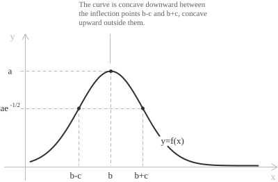
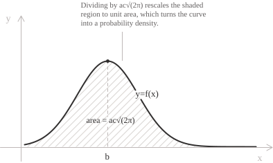

## Definition

A Gaussian [function](../functions/) of a real variable is a real multiple of the [exponential function](../exponential-function/) with a negative quadratic exponent. Its general form depends on three parameters:

$$f(x) = ae^{-\frac{(x-b)^{2}}{2c^{2}}}$$

Here $a$ and $b$ are real and $c \neq 0.$ Replacing $c$ by $-c$ leaves the function unchanged, so we take $c > 0.$ We assume $a > 0.$ Under these assumptions, $a$ is the maximum value, $b$ is the center, and $c$ controls the width.

+ The [domain](../determining-the-domain-of-a-function/) is $\mathbb{R},$ because the formula is defined for every real $x.$
+ Since $a > 0$ and the exponential is positive, $f(x) > 0$ for every $x,$ and the range is $(0, a].$
+ The graph is symmetric about $x = b.$
+ The [limits](../limits/) at infinity are $\lim_{x \to -\infty} f(x) = 0$ and $\lim_{x \to +\infty} f(x) = 0,$ so the horizontal axis is a [horizontal asymptote](../asymptotes/).

The exponent $-(x-b)^{2}/(2c^{2})$ has maximum $0$ at $x = b.$ Since the exponential is [strictly increasing](../increasing-and-decreasing-functions/), $f$ has maximum value $a$ at the same point. Its tails satisfy $\lim_{|x| \to +\infty}f(x)e^{k|x|} = 0$ for every $k > 0.$

- - -

Dividing by $a$ and setting $t = (x-b)/c$ gives the reduced Gaussian:

$$g(t) = e^{-\frac{t^{2}}{2}}$$

In the identity $f(x) = ag((x-b)/c),$ the parameter $b$ translates the graph horizontally, $c$ scales it horizontally, and $a$ scales it vertically. The properties of $g$ transfer to $f$ under this change of variable.

## Derivative and monotonicity

Differentiating the exponent and applying the [chain rule](../chain-rule/) gives a [derivative](../derivatives/) proportional to $f:$

$$f'(x) = -\frac{a(x-b)}{c^{2}}e^{-\frac{(x-b)^{2}}{2c^{2}}} = -\frac{x-b}{c^{2}}f(x)$$

Since $f(x) > 0$ for every $x,$ the sign of $f'$ is opposite to the sign of $x - b.$ The function is therefore strictly increasing on $(-\infty, b)$ and strictly decreasing on $(b, +\infty),$ with a single stationary point at $x = b.$ That point is an absolute [maximum](../maximum-minimum-and-inflection-points/) with value $a,$ and the function has no local minimum.

> The identity $f'(x) = -\dfrac{x-b}{c^{2}}f(x)$ shows that $f$ solves the [separable differential equation](../separable-differential-equations/) $y' = -\dfrac{x-b}{c^{2}}y.$ Separating the variables and imposing $y(b) = a$ recovers $f$ uniquely. Its relative rate of change is $f'(x)/f(x) = -(x-b)/c^{2},$ a decreasing linear function of $x.$

## Inflection points and concavity

Differentiating $f'(x) = -\dfrac{x-b}{c^{2}}f(x)$ with the [product rule](../differentiation-rules/) and substituting the expression for $f'$ gives the [second derivative](../higher-order-derivatives/):

$$
\begin{align}
f''(x) &= -\frac{1}{c^{2}}f(x) - \frac{x-b}{c^{2}}f'(x) \\[6pt]
&= -\frac{1}{c^{2}}f(x) + \frac{(x-b)^{2}}{c^{4}}f(x) \\[6pt]
&= \frac{f(x)}{c^{2}}\left(\frac{(x-b)^{2}}{c^{2}} - 1\right)
\end{align}
$$

Since $f(x)/c^{2} > 0,$ $f''$ has the sign of $(x-b)^{2} - c^{2}.$ This expression is negative on $(b-c, b+c),$ positive outside this interval, and zero at $x = b-c$ and $x = b+c.$ Hence the function is [concave downward](../convexity-and-concavity-of-functions/) on $(b-c, b+c)$ and concave upward outside this interval, with inflection points at:

$$x = b - c \qquad x = b + c$$

The function has the same value at both inflection points:

$$f(b \pm c) = ae^{-\frac{1}{2}} \approx 0.6065a$$

The horizontal distance from the axis of symmetry to either inflection point is $c.$

## Width at half maximum

A second measure of the spread is the width of the curve at half its height. Setting $f(x) = a/2$ and dividing by $a$ gives:

$$e^{-\frac{(x-b)^{2}}{2c^{2}}} = \frac{1}{2}$$

Taking [logarithms](../logarithms/) of both sides and using $\ln(1/2) = -\ln 2$ gives $(x-b)^{2} = 2c^{2}\ln 2,$ so the two solutions are:

$$x = b \pm c\sqrt{2\ln 2}$$

Their distance is the full width at half maximum:

$$\mathrm{FWHM} = 2c\sqrt{2\ln 2} \approx 2.3548c$$

The full width at half maximum is independent of $a$ and $b.$ Multiplying $c$ by a positive factor $k$ multiplies the width by $k$ and leaves the maximum value $a$ unchanged.

## The Gaussian integral

The area under the curve is finite despite its unbounded domain. We first evaluate the [improper integral](../improper-integrals/):

$$I = \int_{-\infty}^{+\infty} e^{-x^{2}} \ dx = \sqrt{\pi}$$

Since the integrand has no elementary antiderivative, we compute $I^{2}.$ Writing the second factor with a different variable of integration, the square is a double integral over the plane:

$$I^{2} = \left(\int_{-\infty}^{+\infty} e^{-x^{2}} \ dx\right)\left(\int_{-\infty}^{+\infty} e^{-y^{2}} \ dy\right) = \iint_{\mathbb{R}^{2}} e^{-(x^{2}+y^{2})} \ dx \ dy$$

Because the integrand is nonnegative, Tonelli's theorem justifies the double-integral identity.

- - -

The exponent depends on $x$ and $y$ only through $x^{2} + y^{2},$ so we use [polar coordinates](../polar-coordinates/). With $x = r\cos\theta$ and $y = r\sin\theta,$ we have $x^{2} + y^{2} = r^{2},$ the area element is $r \ dr \ d\theta,$ and $\mathbb{R}^{2}$ corresponds to $r \in [0, +\infty)$ and $\theta \in [0, 2\pi]:$

$$I^{2} = \int_{0}^{2\pi} \int_{0}^{+\infty} e^{-r^{2}} r \ dr \ d\theta$$

The [substitution](../integration-by-substitution/) $u = r^{2},$ with $du = 2r \ dr,$ gives:

$$\int_{0}^{+\infty} e^{-r^{2}} r \ dr = \frac{1}{2}\int_{0}^{+\infty} e^{-u} \ du = \frac{1}{2}$$

Since the inner integral equals $1/2,$ the remaining integral is:

$$I^{2} = \int_{0}^{2\pi} \frac{1}{2} \ d\theta = \pi$$

Since the integrand is positive, $I > 0,$ so $I = \sqrt{\pi}.$

> The change to polar coordinates works because the level curves of $e^{-(x^{2}+y^{2})}$ are circles centered at the origin.

## Area under a general Gaussian

The value of $I$ determines the area under any curve of the form $ae^{-(x-b)^{2}/(2c^{2})}.$ The substitution $t = (x-b)/(c\sqrt{2}),$ with $dx = c\sqrt{2} \ dt,$ turns the exponent into $-t^{2}$ and leaves the limits at $\pm\infty$ unchanged:

$$
\begin{align}
\int_{-\infty}^{+\infty} ae^{-\frac{(x-b)^{2}}{2c^{2}}} \ dx &= ac\sqrt{2}\int_{-\infty}^{+\infty} e^{-t^{2}} \ dt \\[6pt]
&= ac\sqrt{2}\sqrt{\pi} \\[6pt]
&= ac\sqrt{2\pi}
\end{align}
$$

The area is proportional to the height $a$ and to the width parameter $c,$ and it is independent of the center $b,$ since a translation leaves the area unchanged.

Unit area requires $ac\sqrt{2\pi} = 1,$ so $a = 1/(c\sqrt{2\pi}).$ The normalized function is:

$$f(x) = \frac{1}{c\sqrt{2\pi}}e^{-\frac{(x-b)^{2}}{2c^{2}}}$$

This is the density of the [normal distribution](../normal-distribution/) with mean $b$ and standard deviation $c.$ It is nonnegative and has total integral $1,$ the two requirements for a probability density. Its axis of symmetry is $x = b,$ and the horizontal distance from this line to either inflection point is the standard deviation $c.$

## The error function

The function $e^{-x^{2}}$ has no elementary antiderivative. The error function is its [definite integral](../definite-integrals/) from $0$ to $x,$ scaled so that its limit at $+\infty$ is $1:$

$$\mathrm{erf}(x) = \frac{2}{\sqrt{\pi}}\int_{0}^{x} e^{-t^{2}} \ dt$$

Since $I = \sqrt{\pi}$ and the integrand is even, $\int_{0}^{+\infty} e^{-t^{2}} \ dt = \sqrt{\pi}/2.$ Thus the factor $2/\sqrt{\pi}$ makes $\mathrm{erf}(x)$ tend to $1$ as $x \to +\infty.$ The integral of an even function from $0$ to $x$ is odd, and the positive integrand makes $\mathrm{erf}$ strictly increasing. By oddness, $\mathrm{erf}(x)$ tends to $-1$ as $x \to -\infty,$ so its range is $(-1, 1),$ and $\mathrm{erf}(0) = 0.$

The cumulative distribution function $\Phi$ of the standard normal variable is a rescaling of $\mathrm{erf}.$ Splitting the integral defining $\Phi$ at the origin and substituting $t = u\sqrt{2}$ gives:

$$\Phi(z) = \frac{1}{2}\left(1 + \mathrm{erf}\left(\frac{z}{\sqrt{2}}\right)\right)$$

The [standard normal Z table](../standard-normal-z-table/) lists values of $\Phi$ obtained from this identity or from [numerical integration](../numerical-integration/) of the density.

## Moments of the Gaussian

For $\lambda > 0,$ the Gaussian integral determines $\int_{-\infty}^{+\infty} x^{n}e^{-\lambda x^{2}} \ dx$ for every nonnegative integer $n.$ When $n = 0,$ the substitution $t = x\sqrt{\lambda}$ gives:

$$J(\lambda) = \int_{-\infty}^{+\infty} e^{-\lambda x^{2}} \ dx = \sqrt{\frac{\pi}{\lambda}}$$

For $\lambda > 0,$ exponential decay justifies differentiation under the integral sign. Differentiating with respect to $\lambda$ brings down a factor $-x^{2}:$

$$\int_{-\infty}^{+\infty} x^{2}e^{-\lambda x^{2}} \ dx = -J'(\lambda) = \frac{1}{2}\sqrt{\frac{\pi}{\lambda^{3}}}$$

Each differentiation with respect to $\lambda$ raises the exponent of $x$ by two, so repeated differentiation gives every even case. When $n$ is odd, the integrand is odd and the integral vanishes.

- - -

Applying the case $n = 2$ with $\lambda = 1/2$ and dividing by the normalizing constant $\sqrt{2\pi}$ gives the [variance](../variance-and-covariance-of-a-random-variable/) of the standard normal variable:

$$\frac{1}{\sqrt{2\pi}}\int_{-\infty}^{+\infty} x^{2}e^{-\frac{x^{2}}{2}} \ dx = \frac{1}{\sqrt{2\pi}}\sqrt{2\pi} = 1$$

For the general density, the substitution $x = b + ct$ reduces the integrals for the [expected value](../mean-or-expected-value-of-a-random-variable/) and variance to standard normal integrals. Hence the expected value is $b$ and the variance is $c^{2}.$ For $n \geq 1,$ the even moments of the standard normal variable are the products of the odd integers up to $2n-1:$

$$E(X^{2n}) = (2n-1)!! = 1 \cdot 3 \cdot 5 \cdots (2n-1)$$

The odd moments are $0$ by symmetry. The substitution $t = u^{2}$ in $\Gamma(1/2) = \int_{0}^{+\infty} t^{-1/2}e^{-t} \ dt$ gives:

$$\Gamma\left(\frac{1}{2}\right) = 2\int_{0}^{+\infty} e^{-u^{2}} \ du = \sqrt{\pi}$$

Together with $\Gamma(s+1) = s\Gamma(s),$ this identity determines $\Gamma(n+1/2)$ for every nonnegative integer $n.$ These values occur in the normalizing constants of [gamma distributions](../gamma-distribution/) with half-integer shape parameters and [chi-square distributions](../chi-square-distribution/) with odd degrees of freedom. A chi-square variable with $k$ degrees of freedom is the sum of the squares of $k$ independent standard normal variables.

## Products and convolutions

The product of two Gaussian functions is again a Gaussian function. Multiplying $e^{-(x-b_1)^{2}/(2c_1^{2})}$ and $e^{-(x-b_2)^{2}/(2c_2^{2})}$ adds the exponents, and the sum is a quadratic polynomial in $x$ with negative leading coefficient. After [completing the square](../completing-the-square/), that polynomial has the form $-(x-b_3)^{2}/(2c_3^{2}) + k,$ where $k$ is independent of $x.$ The parameters satisfy:

$$\frac{1}{c_3^{2}} = \frac{1}{c_1^{2}} + \frac{1}{c_2^{2}} \qquad b_3 = c_3^{2}\left(\frac{b_1}{c_1^{2}} + \frac{b_2}{c_2^{2}}\right)$$

The factor $e^{k}$ multiplies the two height factors. The product has center $b_3$ and width parameter $c_3.$ The reciprocals of the squared widths add, so the product is narrower than either factor.

The convolution of two normalized Gaussians is a normalized Gaussian. If $f_1$ and $f_2$ have parameters $(b_1, c_1)$ and $(b_2, c_2),$ completing the square in the convolution integral and using the Gaussian integral shows that the convolution has parameters:

$$b = b_1 + b_2 \qquad c = \sqrt{c_1^{2} + c_2^{2}}$$

The centers add, and the squared widths add. The convolution of two densities is the density of the sum of two independent variables. Hence a sum of independent normal variables is normal. Its mean and variance are the sums of the component means and variances. Among nondegenerate distributions stable under sums up to a change of location and scale, the normal distribution is the only one with finite variance. For independent, identically distributed random variables with finite nonzero variance, the [central limit theorem](../normal-distribution/) states that their centered and scaled sums converge in distribution to a normal law.

## Example

Consider the function:

$$f(x) = 5e^{-2(x-3)^{2}}$$

Matching the exponent with the general form gives $b = 3$ and $\dfrac{1}{2c^{2}} = 2.$ Since $c > 0,$ the equation $c^{2} = \dfrac{1}{4}$ gives $c = \dfrac{1}{2}.$ The coefficient of the exponential gives $a = 5.$

The maximum is $f(3) = 5,$ attained at $x = 3,$ and the curve is symmetric about the line $x = 3.$ The inflection points are at distance $c$ from the center:

$$x = 3 - \frac{1}{2} = 2.5 \qquad x = 3 + \frac{1}{2} = 3.5$$

At both points the function has value $5e^{-1/2} \approx 3.033.$ The full width at half maximum is:

$$\mathrm{FWHM} = 2c\sqrt{2\ln 2} = \sqrt{2\ln 2} \approx 1.177$$

The area under the curve is $ac\sqrt{2\pi}:$

$$\int_{-\infty}^{+\infty} 5e^{-2(x-3)^{2}} \ dx = 5 \cdot \frac{1}{2} \cdot \sqrt{2\pi} = \frac{5\sqrt{2\pi}}{2} \approx 6.267$$

Dividing $f$ by this area gives a function with unit integral:

$$\frac{2}{5\sqrt{2\pi}}f(x) = \frac{2}{\sqrt{2\pi}}e^{-2(x-3)^{2}}$$

This function is the density of a normal distribution with mean $3,$ standard deviation $\dfrac{1}{2},$ and variance $\dfrac{1}{4}.$
