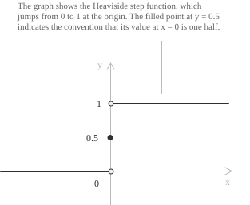
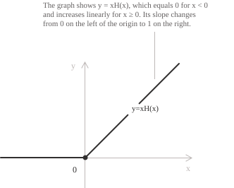
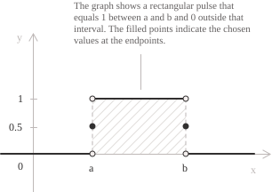

## Introduction

The Heaviside step function is $0$ to the left of the origin and $1$ to the right. With $H(0)=\frac{1}{2},$ its [piecewise definition](../piecewise-functions/) is:

$$
H(x) =
\begin{cases}
0 & \text{if } x < 0 \\[6pt]
\dfrac{1}{2} & \text{if } x = 0 \\[8pt]
1 & \text{if } x > 0
\end{cases}
\quad \forall \ x \in \mathbb{R}
$$

For example, the definition gives:

$$
H(-3) = 0 \qquad H(0) = \frac{1}{2} \qquad H(5) = 1
$$

When $x$ denotes time, $H(x)$ models a quantity that is $0$ for $x<0$ and has the constant value $1$ for $x>0,$ such as the normalised voltage of a circuit switched on at time zero.

The graph has two horizontal half-lines, one at height $0$ for $x<0$ and one at height $1$ for $x>0,$ together with the isolated point $\left(0, \frac{1}{2}\right)$ midway between them. Neither horizontal half-line meets the $y$-axis.

> The value of $H(0)$ depends on the convention. The choice $H(0)=0$ makes $H$ continuous from the left at the jump, while the choice $H(0)=1$ makes it continuous from the right. The value $\frac{1}{2}$ adopted here keeps the identity $H(x)+H(-x)=1$ valid on the whole real line and makes $H$ the [pointwise limit](../sequence-of-functions/) of the rescaled [sigmoid](../sigmoid-function/) $\sigma(kx)$ as $k \to +\infty.$

## Properties

+ [Domain](../determining-the-domain-of-a-function/): $\mathbb{R}$
+ Range: $\left\{ 0,\ \dfrac{1}{2},\ 1 \right\}$
+ The function is bounded, since $0 \leq H(x) \leq 1$ for every $x \in \mathbb{R}.$
+ The function is [non-decreasing](../increasing-and-decreasing-functions/) on $\mathbb{R}$ and is constant on each of the intervals $(-\infty, 0)$ and $(0, +\infty).$
+ The function is neither [even nor odd](../even-and-odd-functions/); it satisfies $H(x)+H(-x)=1$ for every $x \in \mathbb{R}.$
+ The function has a [jump discontinuity](../discontinuities-of-real-functions/) of amplitude $1$ at $x=0$ and is [continuous](../continuous-functions/) at every other point.
+ The [derivative](../derivatives/) exists and equals zero at each point of the two open half-lines. At the origin the derivative does not exist.
+ The function is idempotent away from the origin, since $H(x)^2 = H(x)$ whenever $x \neq 0.$
+ The function is [Riemann integrable](../riemann-integrability-criteria/) on every bounded interval, since it is bounded and its only discontinuity is at $x=0.$

The two [one-sided limits](../limits/) at the origin are:

$$
\begin{align}
\lim_{x \to 0^-} H(x) &= 0 \\[6pt]
\lim_{x \to 0^+} H(x) &= 1
\end{align}
$$

Their values differ, so the two-sided limit $\lim_{x \to 0} H(x)$ does not exist and $H$ has a jump discontinuity at the origin. The jump has amplitude $1-0=1.$

## Limits, derivatives, and integrals

Since $H$ is constant on each half-line, its limits at infinity are:

$$
\begin{align}
\lim_{x \to -\infty} H(x) &= 0 \\[6pt]
\lim_{x \to +\infty} H(x) &= 1
\end{align}
$$

The lines $y=0$ and $y=1$ are [horizontal asymptotes](../asymptotes/). The graph coincides with $y=0$ on $(-\infty,0)$ and with $y=1$ on $(0,+\infty).$

- - -

Since $H$ is constant on each open half-line, its derivative is:

$$
\frac{d}{dx} H(x) = 0 \quad \text{for } x \neq 0
$$

At $x=0$ the classical derivative does not exist, since a function that is not continuous at a point cannot be differentiable there. In the sense of distributions, the derivative of the Heaviside function is the Dirac delta:

$$
\frac{d}{dx} H(x) = \delta(x)
$$

The Dirac delta is supported at the origin and has total mass $1,$ equal to the amplitude of the jump. Equivalently, $H$ is a distributional primitive of $\delta.$ This identity does not determine the value at the origin, because changing a function at one point does not change its associated distribution.

The [sign function](../sign-function/) jumps from $-1$ to $1$ at the origin. Its jump has amplitude $2,$ and its distributional derivative is $2\delta(x).$

- - -

On each open half-line, $xH(x)+c$ is a classical [antiderivative](../indefinite-integrals/) of $H.$ No classical antiderivative exists on any open interval containing the origin, since [Darboux's theorem](../darboux-theorem/) gives every derivative the intermediate value property while $H$ has a jump. The [accumulated integral](../fundamental-theorem-of-calculus/) from the origin is:

$$
\int_0^x H(t) \ dt = xH(x)
$$

The [definite integral](../definite-integrals/) over an interval $[a,b]$ measures the part of that interval lying to the right of the origin. For $a<b$ we obtain:

$$
\int_a^b H(x) \ dx =
\begin{cases}
0 & \text{if } b \leq 0 \\[6pt]
b & \text{if } a < 0 < b \\[6pt]
b-a & \text{if } 0 \leq a
\end{cases}
$$

In the middle case, $H$ is $0$ on $[a,0)$ and $1$ on $(0,b].$ Its value at $0$ does not affect the integral, which is the length of $[0,b],$ namely $b.$

## The ramp function

The accumulated integral above is the ramp function:

$$R(x) = xH(x)$$

The graph is the negative half of the $x$-axis joined to the bisector $y=x$ in the first quadrant. In circuit models, $R$ describes a voltage that grows at a constant rate after the switch closes, whereas $H$ has an instantaneous jump.

The ramp function is [continuous](../continuous-functions/) at the origin, since both one-sided limits are zero and $R(0)=0.$ Differentiating on each half-line gives $R'(x)=0$ for $x<0$ and $R'(x)=1$ for $x>0.$ The two one-sided derivatives at the origin differ, so $R$ has a [corner point](../points-of-non-differentiability/) there. Thus $R'(x)=H(x)$ for every $x\neq 0.$

The ramp function has an equivalent expression in terms of the [absolute value](../absolute-value-function/):

$$R(x) = \frac{x+|x|}{2}$$

For $x>0$ the numerator equals $2x$ and the quotient equals $x.$ For $x<0$ we have $|x|=-x,$ so the numerator equals $x-x=0.$ At the origin both expressions vanish, and the two formulas agree on all of $\mathbb{R}.$

## Relationship with the sign function and the absolute value

The Heaviside function and the [sign function](../sign-function/) differ by an affine transformation of their values. Adding $1$ to $\mathrm{sgn}(x)$ and halving the result gives:

$$H(x) = \frac{1+\mathrm{sgn}(x)}{2}$$

Solving the relation for $\mathrm{sgn}(x)$ gives:

$$\mathrm{sgn}(x) = 2H(x)-1$$

At the origin, where $H(0)=\frac{1}{2},$ the two identities reduce to $\frac{1}{2}=\frac{1+0}{2}$ and $0=2\cdot\frac{1}{2}-1.$

Substituting the second identity into $|x| = x\mathrm{sgn}(x)$ gives an expression for the absolute value in terms of $H:$

$$|x| = x\left(2H(x)-1\right)$$

For $x>0$ the bracket equals $1$ and the product equals $x,$ while for $x<0$ the bracket equals $-1$ and the product equals $-x.$

## Translating the step and writing piecewise functions compactly

Replacing $x$ by $x-a$ moves the jump from the origin to the point $a:$

$$
H(x-a) =
\begin{cases}
0 & \text{if } x < a \\[6pt]
\dfrac{1}{2} & \text{if } x = a \\[8pt]
1 & \text{if } x > a
\end{cases}
$$

The translated step is $0$ for $x<a$ and $1$ for $x>a.$ Multiplying a formula by $H(x-a)$ retains it for $x>a$ and makes it zero for $x<a,$ which gives a compact notation for [piecewise functions](../piecewise-functions/). Given two formulas $f_1$ and $f_2$ joined at $a,$ consider the expression:

$$f(x) = f_1(x) + \left(f_2(x)-f_1(x)\right)H(x-a)$$

It equals $f_1(x)$ for $x<a$ and $f_2(x)$ for $x>a,$ because $H(x-a)=0$ in the first case and $H(x-a)=1$ in the second. At the junction, the expression has the value $\frac{f_1(a)+f_2(a)}{2}.$ Consider the function defined by:

$$
f(x) =
\begin{cases}
2 & \text{if } x < 3 \\[6pt]
x^2 & \text{if } x > 3
\end{cases}
$$

For $x\neq 3,$ it can be written as $f(x) = 2 + (x^2-2)H(x-3).$ At $x=3$ this expression has the value $\frac{11}{2},$ while the piecewise definition above does not specify a value.

- - -

Subtracting one translated step from another isolates a bounded interval. For $a<b,$ define:

$$p(x) = H(x-a)-H(x-b)$$

The function $p$ equals $1$ on $(a,b)$ and $0$ for $x<a$ or $x>b.$

Because $H(0)=\frac{1}{2},$ we have $p(a)=p(b)=\frac{1}{2}.$ The function $p$ is the rectangular pulse of unit height supported on $[a,b].$ Multiplying a formula by $p$ preserves it on $(a,b),$ makes it zero outside $[a,b],$ and halves its values at the endpoints. Away from the junctions, a function with formulas $f_1,$ $f_2,$ and $f_3$ on $(-\infty,a),$ $(a,b),$ and $(b,+\infty)$ can be written as:

$$f(x) = f_1(x) + \left(f_2(x)-f_1(x)\right)H(x-a) + \left(f_3(x)-f_2(x)\right)H(x-b)$$

At $a$ and $b,$ this formula assigns the averages of the adjacent values. Any other values at the junctions must be specified separately.

- - -

If $t$ denotes time, a switch that changes a voltage from $0$ to $120$ volts at $t=5$ is modelled by:

$$V(t) = 120H(t-5)$$

The voltage is $0$ for $t<5,$ is $120$ volts for $t>5,$ and equals $60$ volts at $t=5$ under the adopted convention.

A voltage that rises at a constant rate from $0$ to $120$ volts over the first $60$ seconds and then stays there is modelled by a linear combination of two ramps:

$$V(t) = 2tH(t)-2(t-60)H(t-60)$$

For $0<t<60$ the second term is zero and $V(t)=2t,$ which reaches $120$ at $t=60.$ For $t>60$ both Heaviside factors equal $1,$ and the difference is $2t-2(t-60)=120,$ so the voltage remains constant at $120$ volts.

## Laplace transform of the Heaviside function

For real $s,$ the Laplace transform of a function $f$ defined for $t \geq 0$ is the [improper integral](../improper-integrals/) below, whenever it converges:

$$\mathcal{L}\{f(t)\}(s) = \int_0^{+\infty} f(t)e^{-st} \ dt$$

For the translated step with $a \geq 0,$ the factor $H(t-a)$ is $0$ for $t<a$ and $1$ for $t>a.$ Its value $\frac{1}{2}$ at $t=a$ does not affect the integral, so the lower limit becomes $a:$

$$\mathcal{L}\{H(t-a)\}(s) = \int_a^{+\infty} e^{-st} \ dt$$

Integrating up to a finite bound $M$ and letting $M \to +\infty$ gives, for $s>0:$

$$
\begin{align}
\int_a^{M} e^{-st} \ dt &= \frac{e^{-as}-e^{-Ms}}{s} \\[6pt]
\lim_{M \to +\infty} \frac{e^{-as}-e^{-Ms}}{s} &= \frac{e^{-as}}{s}
\end{align}
$$

The transform of the translated step is therefore:

$$\mathcal{L}\{H(t-a)\}(s) = \frac{e^{-as}}{s} \quad \text{for } s>0$$

Setting $a=0$ recovers the transform of the step at the origin, $\mathcal{L}\{H(t)\}(s)=\frac{1}{s}.$ The restriction $s>0$ is needed for the improper integral to converge, since $e^{-Ms}$ tends to zero only when $s$ is positive.

For $a \geq 0,$ the same computation applied to a product yields the shifting rule. If $F(s)=\mathcal{L}\{f(t)\}(s),$ the [substitution](../integration-by-substitution/) $u=t-a$ in the defining integral gives:

$$\mathcal{L}\{H(t-a)f(t-a)\}(s) = e^{-as}F(s)$$

Thus $H(t-a)f(t-a)$ is the input $f$ delayed by $a,$ and its Laplace transform is $e^{-as}F(s).$
