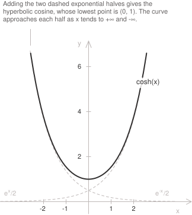

## Introduction

The geometric construction of the hyperbolic cosine from the area of a sector of the equilateral [hyperbola](../hyperbola/) appears in [hyperbolic sine and cosine](../hyperbolic-sine-and-cosine/). For real $x,$ the hyperbolic cosine is the [function](../functions/) defined by the [exponential](../exponential-function/) formula:

$$\cosh(x) = \frac{e^x + e^{-x}}{2}$$

The function $f(x) = \cosh(x)$ is half the sum of $e^x$ and $e^{-x}.$ It is defined for every real number and has range $[1, +\infty).$ Its graph is symmetric about the vertical axis and has a horizontal tangent at the point $(0, 1).$ The function tends to $+\infty$ as $x \to +\infty$ and as $x \to -\infty,$ while the [circular cosine](../cosine-function/) oscillates. For large positive $x,$ the term $e^{-x}$ is close to zero and $\cosh(x)$ is close to $e^x/2.$ By evenness, $\cosh(x)$ is close to $e^{-x}/2$ for large negative $x.$

A uniform chain suspended from two points has the shape of a catenary. After a translation of the coordinate axes, the catenary has equation $y = a\cosh(x/a)$ for $a > 0,$ and its vertex is the lowest point of the chain. The parameter $a$ is the horizontal component of the tension divided by the weight per unit length. The curve is flatter for larger values of $a.$

## Properties

The function has the following properties.

+ [Domain](../determining-the-domain-of-a-function/): $x \in \mathbb{R}$
+ Range: $y \geq 1$
+ Periodicity: the hyperbolic cosine is not periodic on the real line.
+ Parity: [even](../even-and-odd-functions/), with $\cosh(-x) = \cosh(x)$
+ Monotonicity: [decreasing](../increasing-and-decreasing-functions/) on $(-\infty, 0]$ and increasing on $[0, +\infty)$
+ Sign: positive at every point, since $\cosh(x) \geq 1$
+ Roots: none, since the function never takes the value zero
+ [Maximum and minimum points](../maximum-minimum-and-inflection-points/): the minimum value $1$ is attained at $x = 0,$ and the function is unbounded above.

Since the hyperbolic cosine is even and strictly increasing on $[0, +\infty),$ it takes every value of $(1, +\infty)$ twice and is not [injective](../injective-surjective-and-bijective-functions/) on $\mathbb{R}.$ The hyperbolic cosine and the [hyperbolic sine](../hyperbolic-sine-function/) satisfy the fundamental hyperbolic identity:

$$\cosh^2(x) - \sinh^2(x) = 1$$

For the circular functions, the [Pythagorean identity](../pythagorean-identity/) has a plus sign, $\cos^2(x) + \sin^2(x) = 1.$ Since $\sinh(x)$ has the sign of $x,$ the hyperbolic identity gives $\sinh(x) = \pm\sqrt{\cosh^2(x) - 1},$ with the plus sign for $x \geq 0$ and the minus sign for $x < 0.$ The addition and duplication formulas for $\cosh$ are collected in [hyperbolic identities](../hyperbolic-identities/).

## Limits, derivatives, and integrals of the hyperbolic cosine function

The [remarkable limit](../remarkable-limits/) of the exponential function determines the behaviour near the origin. The relevant quotient is

$$\frac{\cosh(x) - 1}{x} = \frac{1}{2}\left(\frac{e^x - 1}{x} + \frac{e^{-x} - 1}{x}\right)$$

As $x$ tends to zero, the first quotient in parentheses tends to $1$ and the second to $-1.$ Their half-sum tends to zero:

$$\lim_{x \to 0} \frac{\cosh(x) - 1}{x} = 0$$

Near the origin, both $\cosh(x) - 1$ and $\cos(x) - 1$ vanish faster than $x.$ From the identity $\cosh(x) - 1 = 2\sinh^2(x/2),$ we have

$$\frac{\cosh(x) - 1}{x^2} = \frac{1}{2}\left(\frac{\sinh(x/2)}{x/2}\right)^2$$

Since the same exponential limit implies $\lim_{u \to 0} \sinh(u)/u = 1,$ the second-order limit is

$$\lim_{x \to 0} \frac{\cosh(x) - 1}{x^2} = \frac{1}{2}$$

The limits at infinity and the comparison with $e^x/2$ at $+\infty$ are

$$
\begin{align}
\lim_{x \to +\infty} \cosh(x) &= +\infty \\[6pt]
\lim_{x \to -\infty} \cosh(x) &= +\infty \\[6pt]
\lim_{x \to +\infty} \left(\cosh(x) - \frac{e^x}{2}\right) &= 0
\end{align}
$$

The last limit holds because the difference equals $e^{-x}/2.$ The curve approaches $e^x/2$ from above. At $-\infty,$ the equality $\cosh(x) - e^{-x}/2 = e^x/2 \to 0$ shows that the curve approaches $e^{-x}/2,$ again from above. The graph has no vertical [asymptotes](../asymptotes/) because it is continuous on $\mathbb{R}.$ Since $\dfrac{\cosh(x)}{|x|} \to +\infty$ as $x \to \pm\infty,$ it has no horizontal or oblique asymptotes.

The function $\cosh(x)$ is [continuous](../continuous-functions/) and differentiable on $\mathbb{R}.$ Termwise differentiation of the exponential expression gives its [derivative](../derivatives/):

$$\frac{d}{dx}\cosh(x) = \frac{e^x - e^{-x}}{2} = \sinh(x)$$

A second differentiation returns the original function, so the derivatives alternate with period two:

$$\frac{d^2}{dx^2}\cosh(x) = \cosh(x)$$

The parity of $n$ determines the [$n$-th derivative](../higher-order-derivatives/):

$$
\frac{d^n}{dx^n}\cosh(x) =
\begin{cases}
\cosh(x) & \text{if } n \text{ is even} \\[6pt]
\sinh(x) & \text{if } n \text{ is odd}
\end{cases}
$$

> The hyperbolic cosine is the unique solution of the [differential equation](../differential-equations/) $y'' = y$ with $y(0) = 1$ and $y'(0) = 0.$ The circular cosine solves $y'' = -y$ with the same initial conditions.

- - -

Since the derivative of $\sinh(x)$ is $\cosh(x),$ the [indefinite integral](../indefinite-integrals/) of the hyperbolic cosine is:

$$\int \cosh(x) \ dx = \sinh(x) + c$$

Because the function is even, its [definite integral](../definite-integrals/) over an interval symmetric about the origin is twice the integral over the positive half:

$$\int_{-a}^{a} \cosh(x) \ dx = 2\sinh(a)$$

For integrals containing $\sqrt{x^2 - 1}$ on the branch $x \geq 1,$ the [substitution](../integration-by-substitution/) $x = \cosh(t)$ with $t \geq 0$ gives $\sqrt{x^2 - 1} = \sinh(t)$ and $dx = \sinh(t) \ dt,$ so the radical disappears. The [trigonometric substitution](../trigonometric-substitution-for-integrals/) on this branch is $x = \sec(t)$ with $0 \leq t < \pi/2.$

## Monotonicity and convexity

The derivative $\sinh(x)$ is negative for $x < 0$ and positive for $x > 0,$ so the hyperbolic cosine decreases on $(-\infty, 0]$ and increases on $[0, +\infty).$ The only stationary point is $(0, 1),$ where the tangent is the horizontal line $y = 1$ and the function has its absolute minimum.

The second derivative $\cosh(x)$ is at least $1$ at every point, so the graph is [convex](../convexity-and-concavity-of-functions/) on $\mathbb{R}$ and has no [inflection points](../maximum-minimum-and-inflection-points/).

Because the graph is convex, it lies above its tangent at $(0, 1):$

$$\cosh(x) \geq 1$$

Equality holds only at $x = 0.$ Every chord of a convex graph lies above the corresponding arc, so a hanging chain lies below the segment joining its suspension points.

## Inverse function

The hyperbolic cosine is even, so it has no inverse on $\mathbb{R}.$ On $[0, +\infty),$ it is continuous and strictly increasing, with range $[1, +\infty).$ This restriction is a bijection, and its [inverse function](../inverse-function/) is denoted by $\mathrm{arcosh}:$

$$\mathrm{arcosh} : [1, +\infty) \to [0, +\infty)$$

With $t = e^y,$ the equation $x = \cosh(y)$ becomes $2x = t + t^{-1},$ which is equivalent to the [quadratic equation](../quadratic-equations/):

$$t^2 - 2xt + 1 = 0$$

Its roots are $t = x \pm \sqrt{x^2 - 1}.$ Their product is $1,$ so they are reciprocal and correspond to the values $y$ and $-y,$ which have the same hyperbolic cosine. The plus sign is required because $y \geq 0$ implies $t \geq 1.$ Taking the [natural logarithm](../logarithms/) gives

$$\mathrm{arcosh}(x) = \ln\left(x + \sqrt{x^2 - 1}\right)$$

The [derivative of the inverse function](../derivative-of-the-inverse-function/) is the reciprocal of $\sinh(\mathrm{arcosh}(x)).$ Since $\sinh$ is positive on $(0, +\infty),$ the fundamental hyperbolic identity gives $\sinh(\mathrm{arcosh}(x)) = \sqrt{x^2 - 1}.$ The derivative is

$$\frac{d}{dx}\mathrm{arcosh}(x) = \frac{1}{\sqrt{x^2 - 1}}$$

The formula holds for $x > 1.$ As $x \to 1^+,$ the derivative tends to $+\infty,$ so the graph of $\mathrm{arcosh}$ has a vertical tangent at $(1, 0).$ This tangent is the reflection across the line $y = x$ of the horizontal tangent to the graph of $\cosh$ at $(0, 1).$ On $(1, +\infty),$ the antiderivatives of $\dfrac{1}{\sqrt{x^2 - 1}}$ are

$$\int \frac{1}{\sqrt{x^2 - 1}} \ dx = \ln\left(x + \sqrt{x^2 - 1}\right) + c$$

## Maclaurin series

The Maclaurin series of the hyperbolic cosine follows from the series of the exponential function. Adding the expansion of $e^{-x}$ to that of $e^x$ cancels the odd powers and doubles the even powers. Dividing by $2$ gives a [power series](../power-series/) that converges for every [real number](../real-numbers/):

$$\cosh(x) = \sum_{n=0}^{\infty} \frac{x^{2n}}{(2n)!} = 1 + \frac{x^2}{2!} + \frac{x^4}{4!} + \frac{x^6}{6!} + \cdots$$

The coefficients of the even powers are positive, whereas the [Taylor series](../taylor-series/) of the circular cosine has the same terms with alternating signs. For $x \neq 0$ every partial sum is strictly less than the value of the function. In particular, the first two terms give

$$\cosh(x) > 1 + \frac{x^2}{2}$$

Near the vertex, the first two terms give the parabolic approximation $y = 1 + x^2/2.$

## Relation to the circular cosine

The [exponential definitions](../eulers-formula/) of $\cosh(x)$ and $\cos(x)$ extend to [complex](../complex-numbers/) values of $x:$

$$
\begin{align}
\cosh(x) &= \frac{e^x + e^{-x}}{2} \\[6pt]
\cos(x) &= \frac{e^{ix} + e^{-ix}}{2}
\end{align}
$$

Substituting $ix$ for $x$ in both formulas gives

$$\cosh(ix) = \cos(x) \qquad \cos(ix) = \cosh(x)$$

The map $z \mapsto iz$ is a rotation through an angle $\pi/2$ about the origin. In the Maclaurin series of $\cosh,$ the same substitution multiplies the term of degree $2n$ by $i^{2n} = (-1)^n.$ The factors $(-1)^n$ are the alternating signs in the series of the circular cosine. Both functions are even, so neither relation has a factor of $i.$
