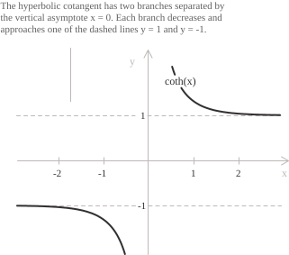

## Introduction

This entry treats the hyperbolic cotangent as a real [function](../functions/). Its geometric construction from the coordinates of a point on the equilateral [hyperbola](../hyperbola/) is described in [hyperbolic tangent and cotangent](../hyperbolic-tangent-and-cotangent/).

For real $x \neq 0,$ the hyperbolic cotangent is defined as the ratio of the [hyperbolic cosine](../hyperbolic-cosine-function/) to the [hyperbolic sine](../hyperbolic-sine-function/):

$$\coth(x) = \frac{\cosh(x)}{\sinh(x)} = \frac{e^x + e^{-x}}{e^x - e^{-x}}$$

The hyperbolic sine vanishes only at the origin, so $\coth(x)$ is defined for every $x \neq 0.$ The function has range $(-\infty, -1) \cup (1, +\infty).$ Its graph is symmetric about the origin and has two branches separated by the vertical asymptote $x=0.$ Both branches are strictly decreasing; the branch on $(-\infty,0)$ has horizontal asymptote $y=-1,$ and the branch on $(0,+\infty)$ has horizontal asymptote $y=1.$

Multiplying numerator and denominator by $e^x$ and using $e^{2x}+1=(e^{2x}-1)+2$ gives another form of the hyperbolic cotangent:

$$\coth(x) = \frac{e^{2x} + 1}{e^{2x} - 1} = 1 + \frac{2}{e^{2x} - 1}$$

The term $2/(e^{2x}-1)$ is strictly decreasing on each half-line, positive for $x\gt 0$ and smaller than $-2$ for $x\lt 0.$ Hence $\coth(x)\gt 1$ for positive $x,$ $\coth(x)\lt -1$ for negative $x,$ and $\coth$ is strictly decreasing on each half-line.

## Properties

+ [Domain](../determining-the-domain-of-a-function/): $x \in \mathbb{R},$ with $x \neq 0$
+ Range: $y \lt -1$ or $y \gt 1$
+ Periodicity: not periodic
+ Parity: [odd](../even-and-odd-functions/), with $\coth(-x) = -\coth(x)$
+ Monotonicity: strictly [decreasing](../increasing-and-decreasing-functions/) on $(-\infty, 0)$ and on $(0, +\infty)$
+ Sign: negative on $(-\infty, 0)$ and positive on $(0, +\infty)$
+ Roots: none
+ [Maximum and minimum points](../maximum-minimum-and-inflection-points/): none; the negative branch has supremum $-1,$ and the positive branch has infimum $1,$ neither of which is attained.

Dividing the [hyperbolic identity](../hyperbolic-identities/) $\cosh^2(x)-\sinh^2(x)=1$ by $\sinh^2(x)$ gives:

$$\coth^2(x) - 1 = \frac{1}{\sinh^2(x)}$$

The right side is positive, so $|\coth(x)|\gt 1.$ For $x\gt 0,$ where $\sinh(x)\gt 0,$ the same identity expresses the hyperbolic sine and cosine in terms of the hyperbolic cotangent:

$$
\begin{align}
\sinh(x) &= \frac{1}{\sqrt{\coth^2(x) - 1}} \\[6pt]
\cosh(x) &= \frac{\coth(x)}{\sqrt{\coth^2(x) - 1}}
\end{align}
$$

For $x\lt 0,$ both formulas have a minus sign on the right side.

The bound $|\tanh(x)|\leq |x|$ established for the [hyperbolic tangent](../hyperbolic-tangent-function/) is strict for $x\neq 0.$ Taking reciprocals gives:

$$|\coth(x)| \gt \frac{1}{|x|}$$

## Limits, derivatives, and integrals of the hyperbolic cotangent function

The behaviour near the origin follows from the [limit](../remarkable-limits/) $\lim_{x\to 0}\sinh(x)/x=1$ and the factorization:

$$x\coth(x) = \frac{x}{\sinh(x)}\cdot\cosh(x)$$

As $x$ tends to zero, both factors tend to $1,$ so their product has limit $1:$

$$\lim_{x \to 0} x\coth(x) = 1$$

Thus $\coth(x)\sim 1/x$ as $x\to 0;$ similarly, $\cot(x)\sim 1/x.$ On the two sides of the origin the hyperbolic sine tends to zero with the sign of $x,$ while the hyperbolic cosine tends to $1:$

$$
\begin{align}
\lim_{x \to 0^+} \coth(x) &= +\infty \\[6pt]
\lim_{x \to 0^-} \coth(x) &= -\infty
\end{align}
$$

The line $x=0$ is a vertical [asymptote](../asymptotes/). As $x\to +\infty,$ $e^{2x}\to +\infty;$ as $x\to -\infty,$ $e^{2x}\to 0.$ Substituting these limits into $\coth(x)=1+2/(e^{2x}-1)$ gives:

$$
\begin{align}
\lim_{x \to +\infty} \coth(x) &= 1 \\[6pt]
\lim_{x \to -\infty} \coth(x) &= -1
\end{align}
$$

The lines $y=1$ and $y=-1$ are horizontal asymptotes. As $x\to +\infty,$ the difference $\coth(x)-1$ is asymptotic to $2e^{-2x}:$

$$\lim_{x \to +\infty} e^{2x}\left(\coth(x) - 1\right) = 2$$

- - -

The functions $\sinh(x)$ and $\cosh(x)$ are differentiable, and $\sinh(x)$ vanishes only at the origin, so $\coth(x)$ is [continuous](../continuous-functions/) and differentiable on its domain. By the quotient rule and the identity $\cosh^2(x)-\sinh^2(x)=1,$ we have:

$$\frac{d}{dx}\coth(x) = \frac{\sinh^2(x) - \cosh^2(x)}{\sinh^2(x)} = -\frac{1}{\sinh^2(x)}$$

The identity $1/\sinh^2(x)=\coth^2(x)-1$ gives the equivalent form of the [derivative](../derivatives/):

$$\frac{d}{dx}\coth(x) = 1 - \coth^2(x)$$

Differentiating once more and using $\coth'(x)=1-\coth^2(x)$ gives:

$$\frac{d^2}{dx^2}\coth(x) = -2\coth(x)\left(1 - \coth^2(x)\right) = \frac{2\cosh(x)}{\sinh^3(x)}$$

The first derivative is a polynomial in $\coth(x).$ If $\coth^{(n)}(x)=P(\coth(x))$ for a polynomial $P,$ the chain rule gives $\coth^{(n+1)}(x)=P'(\coth(x))(1-\coth^2(x)).$ By induction, every [higher-order derivative](../higher-order-derivatives/) of $\coth$ is a polynomial in $\coth(x).$

> The hyperbolic tangent and each branch of the hyperbolic cotangent solve the same [differential equation](../differential-equations/) $y'=1-y^2.$ The hyperbolic tangent has values in $(-1,1),$ while the hyperbolic cotangent has values outside $[-1,1].$ The circular cotangent solves $y'=-1-y^2.$

- - -

On each of the two intervals of the domain, $\dfrac{d}{dx}\ln|\sinh(x)|=\coth(x),$ so the [indefinite integral](../indefinite-integrals/) is:

$$\int \coth(x) \ dx = \ln|\sinh(x)| + c$$

Unlike the hyperbolic tangent, the improper integral of the hyperbolic cotangent over an interval containing the origin does not converge. Near zero it behaves like $1/x,$ so for $a\gt 0$ the [definite integral](../definite-integrals/) diverges:

$$\int_{0}^{a} \coth(x) \ dx = +\infty$$

Since $\coth'(x)=-1/\sinh^2(x),$ we also have:

$$\int \frac{1}{\sinh^2(x)} \ dx = -\coth(x) + c$$

> For integrals involving powers of $x^2-1$ on $(1,+\infty),$ the [substitution](../integration-by-substitution/) $x=\coth(t)$ with $t\gt 0$ gives $x^2-1=1/\sinh^2(t)$ and $dx=-dt/\sinh^2(t).$

## Monotonicity and convexity

The derivative $-1/\sinh^2(x)$ is negative on the domain, so the hyperbolic cotangent is strictly decreasing on each branch and has no stationary points. Since the domain is not an interval, this does not make the function decreasing on its entire domain; indeed, $\coth(-1)\lt 0\lt \coth(1).$ The derivative is unbounded near the origin and tends to $0$ at $\pm\infty.$ Since a differentiable Lipschitz function has a bounded derivative, the hyperbolic cotangent is not Lipschitz on its domain.

The second derivative $2\cosh(x)/\sinh^3(x)$ has the sign of $x,$ so the graph is strictly concave on $(-\infty,0)$ and strictly [convex](../convexity-and-concavity-of-functions/) on $(0,+\infty).$ The origin is not in the domain, so the change from concavity to convexity does not give an [inflection point](../maximum-minimum-and-inflection-points/).

## Inverse function

Each branch is strictly decreasing, and the two branches have the disjoint ranges $(-\infty,-1)$ and $(1,+\infty),$ so the hyperbolic cotangent is injective on its whole domain. The circular [cotangent](../cotangent-function/) is not injective on its domain because its period $\pi$ makes the same values recur on different branches. The hyperbolic cotangent is therefore a [bijection](../injective-surjective-and-bijective-functions/) from $\mathbb{R}\setminus\{0\}$ onto $(-\infty,-1)\cup(1,+\infty),$ and its [inverse function](../inverse-function/) is denoted by:

$$\mathrm{arcoth} : (-\infty, -1) \cup (1, +\infty) \to \mathbb{R}\setminus\{0\}$$

With $t=e^{2y},$ the equation $x=\coth(y)$ becomes a linear equation in $t:$

$$x = \frac{t + 1}{t - 1}$$

After clearing the denominator, we have $t(x-1)=1+x.$ Since $|x|\gt 1$ on the domain, we can solve for $t:$

$$t = \frac{x + 1}{x - 1}$$

For $|x|\gt 1,$ the numerator and denominator have the same sign, so the right side is positive and its logarithm is defined. Taking the natural logarithm of both sides and dividing by $2$ gives:

$$\mathrm{arcoth}(x) = \frac{1}{2}\ln\left(\frac{x + 1}{x - 1}\right)$$

For $|x|\gt 1,$ set $y=\mathrm{arcoth}(x).$ The [derivative of the inverse function](../derivative-of-the-inverse-function/) gives $\mathrm{arcoth}'(x)=1/\coth'(y).$ Since $1-\coth^2(y)=1-x^2,$ we obtain:

$$\frac{d}{dx}\mathrm{arcoth}(x) = \frac{1}{1 - x^2}$$

The logarithmic formula gives $\mathrm{arcoth}(x)\to +\infty$ as $x\to 1^+$ and $\mathrm{arcoth}(x)\to -\infty$ as $x\to -1^-.$ Hence the lines $x=1$ and $x=-1$ are vertical asymptotes of $\mathrm{arcoth},$ and they are the reflections across $y=x$ of the horizontal asymptotes of $\coth.$ As $x\to\pm\infty,$ $\mathrm{arcoth}(x)\to 0,$ so the line $y=0$ is a horizontal asymptote, the reflection of the vertical asymptote $x=0.$

The derivatives of $\mathrm{arcoth}$ and $\mathrm{artanh}$ are both $1/(1-x^2),$ with domains $|x|\gt 1$ and $|x|\lt 1,$ respectively. On each of the three intervals determined by $\pm 1,$ the antiderivatives of $\dfrac{1}{1-x^2}$ are:

$$\int \frac{1}{1 - x^2} \ dx = \frac{1}{2}\ln\left|\frac{1 + x}{1 - x}\right| + c$$

## Laurent series

The hyperbolic cotangent has a pole at the origin, so it has no Maclaurin series. The product $x\coth(x)$ extends to an even function that is analytic at the origin and takes the value $1$ there. Dividing its Maclaurin series by $x$ gives an expansion valid in a punctured neighbourhood of the origin:

$$\coth(x) = \frac{1}{x} + \frac{x}{3} - \frac{x^3}{45} + \frac{2x^5}{945} - \cdots$$

The Bernoulli numbers $B_n$ are defined by $t/(e^t-1)=\sum_{n=0}^{\infty}B_nt^n/n!.$ The Laurent expansion of $\coth$ in terms of these numbers is:

$$\coth(x) = \sum_{n=0}^{\infty} \frac{2^{2n}B_{2n}}{(2n)!} \ x^{2n-1}$$

For the complex extension $\coth(z),$ the singularities other than the origin are the zeros $z=ik\pi$ of $\sinh(z),$ with $k\in\mathbb{Z}\setminus\{0\}.$ The nearest ones to the origin are $\pm i\pi,$ so the real expansion above holds for:

$$0 \lt |x| \lt \pi$$

The relations $\cosh^2(x)+\sinh^2(x)=\cosh(2x)$ and $2\sinh(x)\cosh(x)=\sinh(2x)$ give the identity $\tanh(x)+\coth(x)=2\coth(2x).$ Substituting the Laurent series for $\coth$ into $\tanh(x)=2\coth(2x)-\coth(x)$ multiplies the coefficient of $x^{2n-1}$ by $2^{2n}-1$ and gives the [Taylor series](../taylor-series/) of the [hyperbolic tangent](../hyperbolic-tangent-function/):

$$\tanh(x) = \sum_{n=1}^{\infty} \frac{2^{2n}\left(2^{2n} - 1\right)B_{2n}}{(2n)!} \ x^{2n-1}$$

The term with $n=0$ cancels, so the pole at the origin disappears. Since $\tanh(z)=\sinh(z)/\cosh(z)$ and the nearest zeros of $\cosh(z)$ are $\pm i\pi/2,$ the radius of convergence is $\pi/2.$ The identities $\sinh(ix)=i\sin(x)$ and $\cosh(ix)=\cos(x)$ give $\coth(ix)=-i\cot(x).$ Replacing $x$ with $ix$ in this identity and using oddness gives $\cot(ix)=-i\coth(x).$
