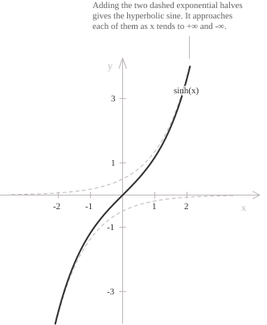

## Introduction

The geometric construction of the hyperbolic sine, based on the area of a sector of the equilateral [hyperbola](../hyperbola/), appears in [hyperbolic sine and cosine](../hyperbolic-sine-and-cosine/). For real $x,$ the hyperbolic sine is the [function](../functions/) defined by the [exponential](../exponential-function/) formula:

$$\sinh(x) = \frac{e^x - e^{-x}}{2}$$

The function $f(x) = \sinh(x)$ is half the difference of $e^x$ and $e^{-x}.$ It is defined for every real number and has range $\mathbb{R}.$ Its graph is symmetric about the origin and has tangent $y = x$ at the point $(0, 0).$ The function tends to $+\infty$ as $x \to +\infty$ and to $-\infty$ as $x \to -\infty,$ while the [circular sine](../sine-function/) oscillates. For large positive $x,$ the term $e^{-x}$ is close to zero and $\sinh(x)$ is close to $e^x/2.$ By oddness, $\sinh(x)$ is close to $-e^{-x}/2$ for large negative $x.$

The hyperbolic sine gives the arc length of the catenary $y = \cosh(x),$ along which a uniform chain hangs under its own weight. For $a \geq 0,$ the [length](../arc-length-of-a-curve/) of the arc from the vertex to the point of abscissa $a$ is $\sinh(a).$

## Properties

The function has the following properties.

+ [Domain](../determining-the-domain-of-a-function/): $x \in \mathbb{R}$
+ Range: $y \in \mathbb{R}$
+ Periodicity: not periodic
+ Parity: [odd](../even-and-odd-functions/), with $\sinh(-x) = -\sinh(x)$
+ Monotonicity: strictly [increasing](../increasing-and-decreasing-functions/) on $\mathbb{R}$
+ Sign: negative on $(-\infty, 0),$ zero at $x = 0,$ and positive on $(0, +\infty)$
+ Roots: $x = 0$
+ [Maximum and minimum points](../maximum-minimum-and-inflection-points/): the function has none and is unbounded above and below.

The hyperbolic sine and the [hyperbolic cosine](../hyperbolic-cosine-function/) satisfy the fundamental hyperbolic identity:

$$\cosh^2(x) - \sinh^2(x) = 1$$

Since $\cosh(x)$ is positive for every real $x,$ solving the [hyperbolic identity](../hyperbolic-identities/) for $\cosh(x)$ gives:

$$\cosh(x) = \sqrt{1 + \sinh^2(x)}$$

Every real value has exactly one preimage, so the hyperbolic sine is a [bijection](../injective-surjective-and-bijective-functions/) of $\mathbb{R}$ onto $\mathbb{R}.$

## Limits, derivatives, and integrals of the hyperbolic sine function

The [remarkable limit](../remarkable-limits/) of the exponential function determines the behaviour near the origin. The relevant quotient is:

$$\frac{\sinh(x)}{x} = \frac{1}{2}\left(\frac{e^x - 1}{x} + \frac{e^{-x} - 1}{-x}\right)$$

As $x$ tends to zero, both quotients in parentheses tend to $1.$ Their half-sum tends to one:

$$\lim_{x \to 0} \frac{\sinh(x)}{x} = 1$$

Near the origin, both $\sinh(x)$ and $\sin(x)$ are close to $x.$ The limits at infinity and the comparison with $e^x/2$ at $+\infty$ are:

$$
\begin{align}
\lim_{x \to +\infty} \sinh(x) &= +\infty \\[6pt]
\lim_{x \to -\infty} \sinh(x) &= -\infty \\[6pt]
\lim_{x \to +\infty} \left(\sinh(x) - \frac{e^x}{2}\right) &= 0
\end{align}
$$

The equality $\sinh(x) - e^x/2 = -e^{-x}/2$ shows that the curve approaches $e^x/2$ from below at $+\infty.$ At $-\infty,$ the equality $\sinh(x) + e^{-x}/2 = e^x/2 \to 0$ shows that the curve approaches $-e^{-x}/2$ from above. The graph has no vertical [asymptotes](../asymptotes/) because it is continuous on $\mathbb{R}.$ Since $\dfrac{\sinh(x)}{x} \to +\infty$ as $x \to \pm\infty,$ it has no horizontal or oblique asymptotes.

- - -

The function $\sinh(x)$ is [continuous](../continuous-functions/) and differentiable on $\mathbb{R}.$ Termwise differentiation of the exponential expression gives its [derivative](../derivatives/):

$$\frac{d}{dx}\sinh(x) = \frac{e^x + e^{-x}}{2} = \cosh(x)$$

A second differentiation returns the original function, so the derivatives alternate with period two:

$$\frac{d^2}{dx^2}\sinh(x) = \sinh(x)$$

The parity of $n$ determines the [$n$-th derivative](../higher-order-derivatives/):

$$
\frac{d^n}{dx^n}\sinh(x) =
\begin{cases}
\sinh(x) & \text{if } n \text{ is even} \\[6pt]
\cosh(x) & \text{if } n \text{ is odd}
\end{cases}
$$

> The hyperbolic sine is the unique solution of the [differential equation](../differential-equations/) $y'' = y$ with $y(0) = 0$ and $y'(0) = 1.$ The circular sine solves $y'' = -y$ with the same initial conditions.

- - -

The [indefinite integral](../indefinite-integrals/) of the hyperbolic sine is:

$$\int \sinh(x) \ dx = \cosh(x) + c$$

Because the function is odd, its [definite integral](../definite-integrals/) over an interval symmetric about the origin vanishes:

$$\int_{-a}^{a} \sinh(x) \ dx = 0$$

For the catenary $y = \cosh(x),$ the derivative satisfies $y'(x) = \sinh(x),$ and the fundamental hyperbolic identity gives $\sqrt{1 + [y'(x)]^2} = \cosh(x).$ The arc-length formula therefore yields $\int_0^a \cosh(x) \ dx = \sinh(a)$ for $a \geq 0.$

For integrals containing $\sqrt{1 + x^2},$ the [substitution](../integration-by-substitution/) $x = \sinh(t)$ gives $\sqrt{1 + x^2} = \cosh(t)$ and $dx = \cosh(t) \ dt,$ so the radical disappears. The [trigonometric substitution](../trigonometric-substitution-for-integrals/) for $\sqrt{1 - x^2}$ is $x = \sin(t)$ with $-\pi/2 \leq t \leq \pi/2.$

## Monotonicity and convexity

The derivative $\cosh(x)$ is at least $1$ at every point, so the hyperbolic sine is strictly increasing on $\mathbb{R}$ and has no stationary points. Equality holds only at $x = 0,$ where the tangent is the line $y = x.$ Thus the smallest slope is $1.$

Since $\sinh''(x) = \sinh(x)$ is negative for $x < 0$ and positive for $x > 0,$ the graph is strictly [concave](../convexity-and-concavity-of-functions/) on $(-\infty, 0)$ and strictly convex on $(0, +\infty).$ The origin is an [inflection point](../maximum-minimum-and-inflection-points/), where the second derivative vanishes and changes sign.

## Inverse function

The hyperbolic sine is continuous and strictly increasing, with range $\mathbb{R}.$ It is a bijection of $\mathbb{R}$ onto $\mathbb{R},$ and its [inverse function](../inverse-function/) is denoted by:

$$\mathrm{arsinh} : \mathbb{R} \to \mathbb{R}$$

With $t = e^y,$ the equation $x = \sinh(y)$ becomes $2x = t - t^{-1},$ which is equivalent to the [quadratic equation](../quadratic-equations/):

$$t^2 - 2xt - 1 = 0$$

Its roots are $t = x \pm \sqrt{x^2 + 1}.$ Since $\sqrt{x^2 + 1} > |x|,$ only the root with the plus sign satisfies $t = e^y,$ because $e^y$ is positive. Taking the [natural logarithm](../logarithms/) gives:

$$\mathrm{arsinh}(x) = \ln\left(x + \sqrt{x^2 + 1}\right)$$

For every real $x,$ the positivity of $\cosh$ and the fundamental hyperbolic identity give $\cosh(\mathrm{arsinh}(x)) = \sqrt{1 + x^2},$ so the [derivative of the inverse function](../derivative-of-the-inverse-function/) is:

$$\frac{d}{dx}\mathrm{arsinh}(x) = \frac{1}{\sqrt{1 + x^2}}$$

On $\mathbb{R},$ the antiderivatives of $\dfrac{1}{\sqrt{1 + x^2}}$ are:

$$\int \frac{1}{\sqrt{1 + x^2}} \ dx = \ln\left(x + \sqrt{x^2 + 1}\right) + c$$

## Maclaurin series

The Maclaurin series of the hyperbolic sine follows from the series of the exponential function. Subtracting the expansion of $e^{-x}$ from that of $e^x$ cancels the even powers and doubles the odd powers. Dividing by $2$ gives a [power series](../power-series/) that converges for every [real number](../real-numbers/):

$$\sinh(x) = \sum_{n=0}^{\infty} \frac{x^{2n+1}}{(2n+1)!} = x + \frac{x^3}{3!} + \frac{x^5}{5!} + \frac{x^7}{7!} + \cdots$$

Near the origin, the first term gives the linear approximation $y = x.$

For [complex](../complex-numbers/) $x,$ replacing $x$ by $ix$ multiplies each term of degree $2n + 1$ by $i^{2n+1} = i(-1)^n,$ so $\sinh(ix) = i\sin(x).$ Applying this identity to $ix$ and using oddness gives $\sin(ix) = i\sinh(x).$
