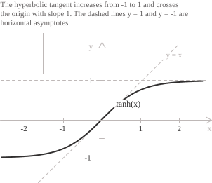

## Introduction

This entry treats the hyperbolic tangent as a real [function](../functions/). Its geometric construction from the coordinates of a point on the equilateral [hyperbola](../hyperbola/) is described in [hyperbolic tangent and cotangent](../hyperbolic-tangent-and-cotangent/).

For real $x,$ the hyperbolic tangent is defined as the ratio of the [hyperbolic sine](../hyperbolic-sine-function/) to the [hyperbolic cosine](../hyperbolic-cosine-function/):

$$\tanh(x) = \frac{\sinh(x)}{\cosh(x)} = \frac{e^x - e^{-x}}{e^x + e^{-x}}$$

Since $\cosh(x) \geq 1$ for every $x \in \mathbb{R},$ the denominator is always positive, so $\tanh(x)$ is defined for all $x \in \mathbb{R}.$ The function has range $(-1, 1),$ its graph is symmetric about the origin, its tangent at $(0, 0)$ is $y = x,$ and it is strictly increasing between the horizontal asymptotes $y = -1$ and $y = 1.$

Multiplying numerator and denominator by $e^x$ and using $e^{2x}-1=(e^{2x}+1)-2$ gives another form of the hyperbolic tangent:

$$\tanh(x) = \frac{e^{2x} - 1}{e^{2x} + 1} = 1 - \frac{2}{e^{2x} + 1}$$

The term $2/(e^{2x}+1)$ is positive and strictly decreasing on $\mathbb{R}.$ Hence $\tanh(x)<1$ for every real $x,$ and $\tanh$ is strictly increasing.

## Properties

The function has the following properties.

+ [Domain](../determining-the-domain-of-a-function/): $x \in \mathbb{R}$
+ Range: $-1 < y < 1$
+ Periodicity: not periodic
+ Parity: [odd](../even-and-odd-functions/), with $\tanh(-x) = -\tanh(x)$
+ Monotonicity: strictly [increasing](../increasing-and-decreasing-functions/) on $\mathbb{R}$
+ Sign: negative on $(-\infty, 0),$ zero at $x = 0,$ and positive on $(0, +\infty)$
+ Roots: $x = 0$
+ [Maximum and minimum points](../maximum-minimum-and-inflection-points/): the function has none, and the bounds $-1$ and $1$ are not attained.

Dividing the [hyperbolic identity](../hyperbolic-identities/) $\cosh^2(x)-\sinh^2(x)=1$ by $\cosh^2(x),$ gives:

$$1 - \tanh^2(x) = \frac{1}{\cosh^2(x)}$$

The left side is positive, so $|\tanh(x)|<1.$ Since $\cosh(x)>0,$ the same identity expresses the hyperbolic sine and cosine in terms of the hyperbolic tangent:

$$
\begin{align}
\cosh(x) &= \frac{1}{\sqrt{1 - \tanh^2(x)}} \\[6pt]
\sinh(x) &= \frac{\tanh(x)}{\sqrt{1 - \tanh^2(x)}}
\end{align}
$$

## Limits, derivatives, and integrals of the hyperbolic tangent function

The [remarkable limit](../remarkable-limits/) of the hyperbolic sine gives the behaviour near the origin, since the quotient factors as:

$$\frac{\tanh(x)}{x} = \frac{\sinh(x)}{x}\cdot\frac{1}{\cosh(x)}$$

As $x$ tends to zero, the first factor tends to $1$ and the second to $1,$ so their product has limit $1:$

$$\lim_{x \to 0} \frac{\tanh(x)}{x} = 1$$

The preceding limit means that $\tanh(x)\sim x$ as $x\to 0;$ similarly, $\tan(x)\sim x.$ As $x\to +\infty,$ $e^{2x}\to +\infty,$ whereas as $x\to -\infty,$ $e^{2x}\to 0.$ Substituting these limits into $\tanh(x)=1-2/(e^{2x}+1)$ gives:

$$
\begin{align}
\lim_{x \to +\infty} \tanh(x) &= 1 \\[6pt]
\lim_{x \to -\infty} \tanh(x) &= -1
\end{align}
$$

The lines $y=1$ and $y=-1$ are horizontal [asymptotes](../asymptotes/), and the graph has no vertical asymptotes because it is continuous on $\mathbb{R}.$ As $x\to +\infty,$ the difference $1-\tanh(x)$ is asymptotic to $2e^{-2x}:$

$$\lim_{x \to +\infty} e^{2x}\left(1 - \tanh(x)\right) = 2$$

- - -

The functions $\sinh(x)$ and $\cosh(x)$ are differentiable, and $\cosh(x)$ never vanishes, so $\tanh(x)$ is [continuous](../continuous-functions/) and differentiable on $\mathbb{R}.$ By the quotient rule and the identity $\cosh^2(x)-\sinh^2(x)=1,$ we have:

$$\frac{d}{dx}\tanh(x) = \frac{\cosh^2(x) - \sinh^2(x)}{\cosh^2(x)} = \frac{1}{\cosh^2(x)}$$

The identity $1/\cosh^2(x)=1-\tanh^2(x)$ gives the equivalent form of the [derivative](../derivatives/):

$$\frac{d}{dx}\tanh(x) = 1 - \tanh^2(x)$$

Differentiating once more and using $\tanh'(x)=1-\tanh^2(x)$ gives:

$$\frac{d^2}{dx^2}\tanh(x) = -2\tanh(x)\left(1 - \tanh^2(x)\right)$$

Every [higher-order derivative](../higher-order-derivatives/) of $\tanh$ is a polynomial in $\tanh(x).$ If $\tanh^{(n)}(x)=P(\tanh(x))$ for a polynomial $P,$ the chain rule gives $\tanh^{(n+1)}(x)=P'(\tanh(x))(1-\tanh^2(x)),$ which is again a polynomial in $\tanh(x).$

> The hyperbolic tangent is the unique solution of the [differential equation](../differential-equations/) $y'=1-y^2$ with $y(0)=0.$ The circular tangent solves $y'=1+y^2$ with the same initial condition.

- - -

The [indefinite integral](../indefinite-integrals/) of the hyperbolic tangent is:

$$\int \tanh(x) \ dx = \ln\left(\cosh(x)\right) + c$$

Because the function is odd, its [definite integral](../definite-integrals/) over an interval symmetric about the origin vanishes:

$$\int_{-a}^{a} \tanh(x) \ dx = 0$$

Since $\tanh'(x)=1/\cosh^2(x),$ we also have:

$$\int \frac{1}{\cosh^2(x)} \ dx = \tanh(x) + c$$

> For integrals involving powers of $1-x^2$ on $(-1,1),$ the [substitution](../integration-by-substitution/) $x=\tanh(t)$ gives $1-x^2=1/\cosh^2(t)$ and $dx=dt/\cosh^2(t).$

## Monotonicity and convexity

The derivative $1/\cosh^2(x)$ is positive on $\mathbb{R},$ so the hyperbolic tangent is strictly increasing and has no stationary points. Since $\cosh(x)\geq 1$ with equality only at $x=0,$ we have $\tanh'(x)\leq 1,$ with equality only at the origin. The tangent there is $y=x.$ By the [mean value theorem](../lagrange-theorem/), $\tanh$ therefore satisfies:

$$|\tanh(a) - \tanh(b)| \leq |a - b|$$

The second derivative $-2\tanh(x)/\cosh^2(x)$ has the sign opposite to $\tanh(x),$ so the graph is strictly [convex](../convexity-and-concavity-of-functions/) on $(-\infty,0)$ and strictly concave on $(0,+\infty).$ The origin is an [inflection point](../maximum-minimum-and-inflection-points/), where the second derivative vanishes and changes sign. For $x>0,$ concavity implies $\tanh(x)\leq x,$ and oddness extends the bound to the whole real line. The same conclusion follows by setting $b=0$ in the preceding inequality:

$$|\tanh(x)| \leq |x|$$

## Inverse function

Since the hyperbolic tangent is continuous and strictly increasing, with range $(-1,1),$ it is a [bijection](../injective-surjective-and-bijective-functions/) from $\mathbb{R}$ onto $(-1,1).$ Its [inverse function](../inverse-function/) is denoted by:

$$\mathrm{artanh} : (-1, 1) \to \mathbb{R}$$

With $t=e^{2y},$ the equation $x=\tanh(y)$ becomes a linear equation in $t:$

$$x = \frac{t - 1}{t + 1}$$

After clearing the denominator, we have $t(x-1)=-1-x.$ Since $x\neq 1$ on $(-1,1),$ we can solve for $t:$

$$t = \frac{1 + x}{1 - x}$$

For $-1<x<1,$ the right side is positive, so its logarithm is defined. Taking the natural logarithm of both sides and dividing by $2$ gives:

$$\mathrm{artanh}(x) = \frac{1}{2}\ln\left(\frac{1 + x}{1 - x}\right)$$

For $|x|<1,$ set $y=\mathrm{artanh}(x).$ The [derivative of the inverse function](../derivative-of-the-inverse-function/) gives $\mathrm{artanh}'(x)=1/\tanh'(y).$ Since $1-\tanh^2(y)=1-x^2,$ we obtain:

$$\frac{d}{dx}\mathrm{artanh}(x) = \frac{1}{1 - x^2}$$

The logarithmic formula gives $\mathrm{artanh}(x)\to +\infty$ as $x\to 1^-$ and $\mathrm{artanh}(x)\to -\infty$ as $x\to -1^+.$ The derivative tends to $+\infty$ at both endpoints. Hence the lines $x=1$ and $x=-1$ are vertical asymptotes of $\mathrm{artanh}.$ They are the reflections across $y=x$ of the horizontal asymptotes of $\tanh.$ On $(-1,1),$ the antiderivatives of $\dfrac{1}{1-x^2}$ are:

$$\int \frac{1}{1 - x^2} \ dx = \frac{1}{2}\ln\left(\frac{1 + x}{1 - x}\right) + c$$

## Maclaurin series

The Maclaurin series follows from the differential equation $y'=1-y^2$ with $y(0)=0.$ Since $\tanh$ is odd, its even coefficients vanish. Substituting the series into the equation determines the remaining coefficients one at a time:

$$\tanh(x) = x - \frac{x^3}{3} + \frac{2x^5}{15} - \frac{17x^7}{315} + \cdots$$

Near the origin, the first term gives the linear approximation $y=x.$ The Bernoulli numbers $B_n$ are defined by $t/(e^t-1)=\sum_{n=0}^{\infty}B_nt^n/n!.$ In terms of these numbers, the general series is:

$$\tanh(x) = \sum_{n=1}^{\infty} \frac{2^{2n}\left(2^{2n} - 1\right)B_{2n}}{(2n)!} \ x^{2n-1}$$

Unlike the series for the hyperbolic sine and cosine, this [power series](../power-series/) has a finite radius of convergence. The radius of a Taylor series in the [complex plane](../complex-numbers/) is the distance from its centre to the nearest singularity of the function. For $\tanh(z),$ the nearest singularities are the zeros $z=\pm i\pi/2$ of $\cosh(z),$ so the series converges for:

$$|x| < \frac{\pi}{2}$$

Since $\sinh(ix)=i\sin(x)$ and $\cosh(ix)=\cos(x),$ we have $\tanh(ix)=i\tan(x).$ This identity explains why the coefficients in the [Taylor series](../taylor-series/) of the circular tangent have the same absolute values and are all positive. Replacing $x$ with $ix$ in the identity and using oddness gives $\tan(ix)=i\tanh(x).$
