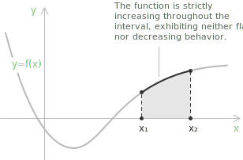
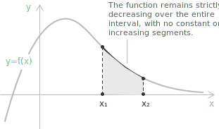
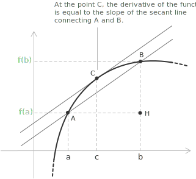

## Introduction

Understanding the behavior of [functions](../functions/) is fundamental in analysis. Depending on how their output values change with respect to the input, functions are classified as increasing, decreasing, or monotonic.

> These characteristics are tied to the geometry of the graph in the Cartesian plane, revealing whether a function rises, falls, or maintains a consistent directional trend.

- - -

**Definition 1.** Let $y = f(x)$ be a function defined on a [domain](../determining-the-domain-of-a-function/) $X \subseteq \mathbb{R}$. We say that $f$ is strictly increasing on an interval $I \subseteq X$ if, for any two values $x_1, x_2 \in I$ with $x_1 < x_2$, the following condition holds:

$$
f(x_1) < f(x_2)
$$

As the input $x$ increases within the interval $I$, the output $f(x)$ also strictly increases, without any flat or decreasing segments.

- - -

**Definition 2.** Let $y = f(x)$ be a function defined on a domain $X \subseteq \mathbb{R}$. We say that $f$ is strictly decreasing on an interval $I \subseteq X$ if, for any two values $x_1, x_2 \in I$ with $x_1 < x_2$, the following condition holds:

$$
f(x_1) > f(x_2)
$$

As the input $x$ increases within the interval $I$, the output $f(x)$ strictly decreases, with no flat or increasing sections.

- - -

A function with domain $X \subseteq \mathbb{R}$ is strictly monotonic on an interval $I \subseteq X$ if it is either strictly increasing or strictly decreasing throughout $I$, with no change in direction or flat segments. In other words, the function maintains a consistent trend, upward or downward, across $I$.

To summarize, let $X \subseteq \mathbb{R}$ and let $x_1, x_2 \in X$ with $x_1 < x_2$. The function $f : X \to \mathbb{R}$ is said to be:

[class="table-1"]
|  | |
|------|------|
| Increasing | \(f(x_1) \leq f(x_2)\) |
| Strictly increasing | \(f(x_1) < f(x_2)\) |
| Decreasing | \(f(x_1) \geq f(x_2)\) |
| Strictly decreasing | \(f(x_1) > f(x_2)\) |
| (Strictly) monotonic | Either (strictly) increasing or (strictly) decreasing |
[/class]

## Derivatives and monotonic behavior

The [derivative](../derivatives/) describes the shape of the graph of a function. In particular, the first derivative $f'(x)$ identifies the intervals where $f(x)$ increases and where it decreases. Given a function $y = f(x)$ that is [continuous](../continuous-functions/) on an interval $I$ and differentiable at the interior points of $I$:

+ If $f'(x) > 0$ for every $x$ in the interior of $I$, then $f(x)$ is strictly increasing on $I$.
+ If $f'(x) < 0$ for every $x$ in the interior of $I$, then $f(x)$ is strictly decreasing on $I$.
+ If $f'(x) = 0$ for every $x$ in the interior of $I$, then $f(x)$ is constant on $I$.

> A nonnegative derivative already gives monotonicity in the wide sense, since $f'(x) \geq 0$ on the interior of $I$ implies that $f$ is increasing. Strict monotonicity tolerates isolated points where the derivative vanishes, as $f(x) = x^3$ shows at $x = 0$, where $f'(0) = 0$ while $f$ remains strictly increasing.

- - -

To prove these properties, we use [Lagrange's theorem](../lagrange-theorem/). Take two points $a, b \in I$ with $a < b$, and consider a point $c$ in the open interval $(a, b)$. By Lagrange's theorem, there exists such a $c$ for which:

$$
f'(c) = \frac{f(b) - f(a)}{b - a}
$$

Since $b - a > 0$ and $f'(c) > 0$, it follows that $f(b) - f(a) > 0$, which implies $f(b) > f(a).$ As $a$ and $b$ are arbitrary points of $I$, the function is increasing on $I.$

In the opposite case, since $b - a > 0$ and $f'(c) < 0$, it follows that $f(b) - f(a) < 0$, which implies $f(b) < f(a)$. Again $a$ and $b$ are arbitrary, so the function is decreasing on $I$.

## Example 1

Let us consider the function:

$$f(x) = \frac{x^4}{4} - \frac{x^2}{2}$$

We compute its derivative $f'(x) = x(x^2 - 1)$ To find the intervals where the derivative is positive, we study the sign of each factor:

$$x > 0$$
$$x^2 - 1 > 0 \implies x < -1 \text{ or } x > 1$$

By multiplying the signs of the two factors, we obtain the intervals where the derivative is positive:

[class="table-sign"]

|               |                  |       $-1$       |       $0$        |       $1$        |
| :-----------: | :--------------: | :--------------: | :--------------: | :--------------: |
|    $x > 0$    | $\boldsymbol{-}$ | $\boldsymbol{-}$ | $\boldsymbol{+}$ | $\boldsymbol{+}$ |
| $x^2 - 1 > 0$ | $\boldsymbol{+}$ | $\boldsymbol{-}$ | $\boldsymbol{-}$ | $\boldsymbol{+}$ |
|    $f'(x)$    | $\boldsymbol{-}$ | $\boldsymbol{+}$ | $\boldsymbol{-}$ | $\boldsymbol{+}$ |
[/class]

Therefore, the derivative $x(x^2 - 1)$ is positive for $x \in (-1,0) \cup (1,+\infty).$

> The [sign analysis](../sign-analysis-in-inequalities/) of a product, as in this example, examines the sign of each individual factor and determines the overall sign on each interval by multiplying those signs.

- - -

Reading the sign of the derivative through the definition of monotonicity, $f$ is strictly increasing on each of the intervals $(-1, 0)$ and $(1, +\infty)$, where $f'(x) > 0$, and strictly decreasing on each of the intervals $(-\infty, -1)$ and $(0, 1)$, where $f'(x) < 0$.

> The function is not increasing on the union $(-1, 0) \cup (1, +\infty)$ taken as a single set. Monotonicity must be read on each interval separately, since comparing a point of $(-1, 0)$ with a point of $(1, +\infty)$ crosses the decreasing stretch $(0, 1)$ that lies between them.

## Strict monotonicity and injectivity

A strictly monotonic function is injective. Suppose $f$ is strictly increasing on $I$ and let $x_1, x_2 \in I$ be distinct. One of the two orderings holds, either $x_1 < x_2$ or $x_2 < x_1$, and in each case strict monotonicity turns the strict inequality between the inputs into a strict inequality between the outputs, so $f(x_1) \neq f(x_2)$. The same reasoning applies to a strictly decreasing function.

A strictly monotonic function therefore admits an [inverse](../inverse-function/) on its image, and the inverse keeps the same direction of monotonicity.

> Wide-sense monotonicity is not enough for injectivity. A function that is increasing with the condition $f(x_1) \leq f(x_2)$ may stay constant on a subinterval, where it takes one value at infinitely many points.

## One-sided limits of a monotonic function

Monotonicity constrains the local behavior of a function strongly enough to force the existence of both one-sided [limits](../limits/) at every interior point, even where the function is discontinuous.

**Definition 3.** Let $f$ be increasing on an open interval $(a, b)$. For every $x_0 \in (a, b)$ both one-sided limits exist and satisfy:

$$
\sup_{a < t < x_0} f(t) = f(x_0^-) \leq f(x_0) \leq f(x_0^+) = \inf_{x_0 < t < b} f(t)
$$

To prove the claim for the left limit, consider the set of values $\{\ f(t) \mid a < t < x_0 \ \}$. Since $f$ is increasing, every element of this set is bounded above by $f(x_0)$, so the set has a least upper bound:

$$
A := \sup_{a < t < x_0} f(t)
$$

Fix $\varepsilon > 0$. By definition of supremum there exists $t_0 \in (a, x_0)$ with $f(t_0) > A - \varepsilon$. For every $t \in [t_0, x_0)$ monotonicity gives:

$$
A - \varepsilon < f(t_0) \leq f(t) \leq A
$$

These inequalities state that $f(t)$ approaches $A$ as $t \to x_0^-$, hence $f(x_0^-) = A$. The proof that $f(x_0^+) = \inf_{x_0 < t < b} f(t)$ is symmetric, and the central inequality $f(x_0^-) \leq f(x_0) \leq f(x_0^+)$ follows from $f(t) \leq f(x_0) \leq f(s)$ whenever $t < x_0 < s$. A decreasing function is handled by applying the same result to $-f$, which is increasing.

- - -

The one-sided limits of an increasing function cannot overlap across distinct points. Let $x, y \in (a, b)$ with $x < y$ and choose any $z \in (x, y)$. Using the characterization above on both points:

$$
f(x^+) = \inf_{x < t < b} f(t) \leq f(z) \leq \sup_{a < t < y} f(t) = f(y^-)
$$

The value approached from the right of $x$ never exceeds the value approached from the left of any later point $y$.

## Discontinuities of a monotonic function

At an interior point $x_0$ both one-sided limits of an increasing function are finite and ordered as $f(x_0^-) \leq f(x_0) \leq f(x_0^+)$. Continuity at $x_0$ fails exactly when the outer terms differ, so the only [discontinuity](../discontinuities-of-real-functions/) a monotonic function can exhibit is a jump, and the nonnegative quantity

$$
f(x_0^+) - f(x_0^-)
$$

measures its size. A removable discontinuity is excluded, because $f(x_0^-) = f(x_0^+)$ would already force equality with $f(x_0)$ and hence continuity. A monotonic function never has a discontinuity where a one-sided limit fails to exist.

The set of points where a monotonic function is discontinuous is at most countable. Take $f$ increasing on $(a, b)$. At each discontinuity $x$ we have $f(x^-) < f(x^+)$, so the open interval $(f(x^-), f(x^+))$ is nonempty and contains a rational number $r_x$. If $x < y$ are two discontinuities, the bound $f(x^+) \leq f(y^-)$ keeps the intervals $(f(x^-), f(x^+))$ and $(f(y^-), f(y^+))$ disjoint, so $r_x \neq r_y$. The map $x \mapsto r_x$ is an injection from the set of discontinuities into $\mathbb{Q}$, and any set that injects into $\mathbb{Q}$ is at most countable.

> The discontinuities of a monotonic function need not be isolated. Given any countable set $E \subseteq (a, b)$, even a dense one such as $\mathbb{Q} \cap (a, b)$, one can build an increasing function that is discontinuous exactly at the points of $E$ and continuous everywhere else.
