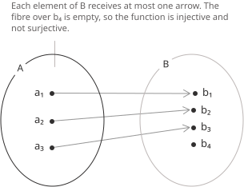
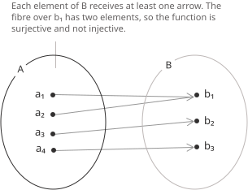
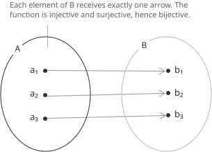
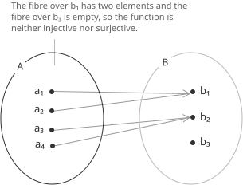
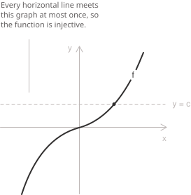
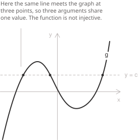

## Introduction

Let $f \colon A \to B$ be a [function](../functions/) with [domain](../determining-the-domain-of-a-function/) $A$ and codomain $B.$ For a fixed $y \in B,$ the set of arguments that the function sends to $y$ is the fibre of $f$ over $y:$

$$
f^{-1}(\{\ y\ \}) = \{\ x \in A \mid f(x) = y \ \}
$$

The notation $f^{-1}(\{\ y\ \})$ denotes the preimage of the singleton $\{\ y\ \}$ and does not assume that $f$ has an inverse function.

The elements of this set are the solutions of the equation $f(x) = y$ in the unknown $x.$ Injectivity, surjectivity and bijectivity describe the number of solutions of this equation as $y$ ranges over the codomain.

> A function assigns exactly one value $y = f(x)$ to each $x \in A.$ Here $x$ is fixed and $y$ is the unknown. The three properties instead fix $y$ and count its preimages in $A.$ A function that fails one of them is still a function.

## Definitions

The function $f$ is injective when the equation $f(x) = y$ has at most one solution for every $y \in B,$ so that no fibre contains two distinct elements. The same condition can be written in terms of two arguments:

$$
\forall x_1, x_2 \in A, \quad f(x_1) = f(x_2) \ \Rightarrow \ x_1 = x_2
$$

The contrapositive form of the same implication says that distinct arguments have distinct images:

$$
\forall x_1, x_2 \in A, \quad x_1 \neq x_2 \ \Rightarrow \ f(x_1) \neq f(x_2)
$$

An injective function is an injection. The value $f(x)$ determines the argument $x,$ so an injection can be reversed on the set of values it attains.

- - -

The function $f$ is surjective when the equation $f(x) = y$ has at least one solution for every $y \in B,$ so that no fibre is empty:

$$
\forall y \in B, \ \exists x \in A \ \text{ such that } \ f(x) = y
$$

The range of $f$ is the set $f(A)$ of attained values. Since $f(A) \subseteq B$ for every function, $f$ is surjective exactly when the reverse inclusion $B \subseteq f(A)$ also holds. Equivalently:

$$
f(A) = B
$$

A surjective function is a surjection. The property depends on the declared codomain. Replacing $B$ by $f(A)$ produces a surjective function with the same values.

- - -

The function $f$ is bijective when the equation $f(x) = y$ has exactly one solution for every $y \in B,$ so that every fibre consists of a single element:

$$
\forall y \in B, \ \exists! x \in A \ \text{ such that } \ f(x) = y
$$

The symbol $\exists!$ abbreviates the phrase "there exists exactly one". Existence for every $y$ is surjectivity, while uniqueness is injectivity. Thus a function is bijective exactly when it is injective and surjective.

A bijective function is a bijection. Each element of $A$ has one image in $B,$ and each element of $B$ is the image of exactly one element of $A.$

- - -

A function can fail either condition or both.

To prove that either property fails, give an explicit witness. To show that $f$ is not injective, exhibit two arguments $x_1 \neq x_2$ with $f(x_1) = f(x_2).$ To show that $f$ is not surjective, exhibit an element $y \in B$ and prove that $f(x) = y$ has no solution.

Consider the function $f \colon \mathbb{Z} \to \mathbb{Z}$ defined on the [integers](../integers/) by:

$$
f(n) = n(n - 1)
$$

Since $0 \neq 1$ but $f(0) = f(1),$ the function $f$ is not injective. One of the two consecutive integers $n$ and $n - 1$ is even, so $f(n)$ is even for every $n.$ The odd integer $1$ therefore has an empty fibre, and $f$ is not surjective.

## Four functions on the integers

All four combinations of the two properties occur among functions from $\mathbb{Z}$ to $\mathbb{Z}.$ Consider the translation $t,$ the doubling map $d,$ the halving map $h$ defined using the [floor function](../floor-and-ceiling-functions/), and the squaring map $q:$

$$
t(n) = n + 3, \quad d(n) = 2n, \quad h(n) = \left\lfloor \frac{n}{2} \right\rfloor, \quad q(n) = n^2
$$

The translation is bijective because $n \mapsto n - 3$ is its inverse. The doubling map is injective, since $2n = 2m$ gives $n = m,$ and it is not surjective, since an odd integer is never twice an integer. The halving map is surjective, because $h(2k) = k$ for every $k \in \mathbb{Z},$ and it is not injective, because $h(0) = h(1) = 0.$ The squaring map is neither injective nor surjective, since $q(-1) = q(1)$ and no integer has square $-1.$

| Function on $\mathbb{Z}$ | Injective | Surjective |
|---|---|---|
| $t(n) = n + 3$ | yes | yes |
| $d(n) = 2n$ | yes | no |
| $h(n) = \lfloor n/2 \rfloor$ | no | yes |
| $q(n) = n^2$ | no | no |

If the codomain of each map is replaced by its range, every map becomes surjective and its injectivity is unchanged.

## Reading the two conditions on the graph

For a function $f \colon A \to B$ with $A, B \subseteq \mathbb{R},$ both conditions can be read from the graph:

$$
G_f = \{\ (x, f(x)) \mid x \in A \ \}
$$

Fix a height $c \in B$ and intersect $G_f$ with the horizontal line $y = c.$ A point of the intersection has the form $(x, c)$ with $f(x) = c,$ so the intersection points correspond to the elements of the fibre over $c.$ Thus the number of intersection points equals the size of the fibre:

+ The function is injective when every horizontal line of height $c \in B$ meets the graph at most once.
+ The function is surjective when every such line meets the graph at least once.
+ The function is bijective when every such line meets the graph exactly once.

This criterion is the horizontal line test. It differs from the vertical line test, which decides whether a curve in the plane is the graph of a function at all, as described in the entry on [functions](../functions/). Heights outside the codomain impose no condition, so the test must be applied only to the lines $y = c$ with $c \in B.$

- - -

The graph of a [strictly increasing](../increasing-and-decreasing-functions/) function meets each horizontal line at most once.

If a horizontal line met the graph at two points $(x_1, c)$ and $(x_2, c)$ with $x_1 < x_2,$ strict increase would give $f(x_1) < f(x_2),$ a contradiction. Thus every fibre has at most one element and $f$ is injective. Injectivity requires this conclusion for every $c \in B,$ rather than for the height shown alone.

- - -

A single horizontal line that meets the graph more than once proves that the function is not injective.

The line $y = c$ crosses this graph at three points, so the equation $g(x) = c$ has three solutions and the fibre over $c$ has three elements. Hence $g$ is not injective. Every horizontal line meets the graph, so $g$ is surjective.

- - -

Three functions from $\mathbb{R}$ to $\mathbb{R}$ show how the graph and the codomain determine the two properties. The [exponential function](../exponential-function/) $x \mapsto e^x$ is strictly increasing, hence injective. Its values are positive, so the equation $e^x = -1$ has no solution and the function is not surjective onto $\mathbb{R}.$

The cubic [polynomial function](../polynomial-function/) $x \mapsto x^3 - x$ takes arbitrarily large positive and negative values. It is [continuous](../continuous-functions/), so the [intermediate value theorem](../intermediate-value-theorem/) gives a solution of $x^3 - x = y$ for every real $y,$ and the function is surjective. It is not injective, because $x^3 - x$ vanishes at $-1,$ at $0$ and at $1.$

The third function uses the [absolute value](../absolute-value/):

$$
g(x) = \frac{x}{1 + |x|}
$$

Its values satisfy $|g(x)| < 1,$ so $g$ is not surjective onto $\mathbb{R}.$ The function is strictly increasing on each of the two half-lines. If $x < 0 \leq z,$ then $g(x) < 0 \leq g(z),$ so $g$ is strictly increasing on $\mathbb{R}$ and is injective. It is continuous, and its limits at $-\infty$ and $+\infty$ are $-1$ and $1,$ respectively. Its range is therefore the [interval](../intervals/) $(-1, 1),$ and the same formula with that codomain defines a bijection.

For $0 \leq y < 1,$ the unique preimage $x$ satisfies $x \geq 0,$ and the equation $y = x/(1 + x)$ gives $x = y/(1 - y).$ For $-1 < y < 0,$ the unique preimage $x$ satisfies $x < 0,$ and the equation $y = x/(1 - x)$ gives $x = y/(1 + y).$ Thus, for every $y \in (-1, 1),$ the [inverse](../inverse-function/) is:

$$
g^{-1}(y) = \frac{y}{1 - |y|}
$$

## The domain and the codomain are part of the data

Two functions are equal when they have the same domain, the same codomain and the same values. Changing either set changes the function and may change its injectivity, surjectivity or bijectivity. Two versions of the exponential function differ only in the codomain:

$$
\exp \colon \mathbb{R} \to \mathbb{R} \quad \text{and} \quad \exp \colon \mathbb{R} \to (0, +\infty)
$$

The first function is injective but not surjective. The second has the same formula and domain but is bijective; its inverse is the [natural logarithm](../logarithmic-function/).

For any function, replacing $B$ by the range $f(A)$ leaves the values unchanged. The resulting map is the corestriction:

$$
\tilde{f} \colon A \to f(A), \quad \tilde{f}(x) = f(x)
$$

By definition of the range, every element of $f(A)$ is attained, so $\tilde{f}$ is surjective. Let $\iota \colon f(A) \to B$ be the inclusion. This map is injective, and the original function factors as:

$$
f = \iota \circ \tilde{f}
$$

Thus every function factors as the composition of a surjection and an injection. Changing the codomain affects the two properties differently. Enlarging $B$ leaves injectivity unchanged and can destroy surjectivity, while shrinking $B$ to the range restores surjectivity.

- - -

Restricting the domain can restore injectivity. If $E \subseteq A$ and $f$ is injective on $E,$ the restriction $f|_E$ with codomain $f(E)$ is a bijection. The [cosine function](../cosine-function/) is not injective on $\mathbb{R},$ since $\cos(-x) = \cos x,$ but its restriction to $[0, \pi]$ is strictly decreasing and attains every value of $[-1, 1].$ That restriction is:

$$
\cos|_{[0, \pi]} \colon [0, \pi] \to [-1, 1]
$$

It is bijective, and its inverse is the [arccosine function](../arccosine-function/).

## Left inverses, right inverses and invertibility

Each of the three properties corresponds to the existence of a function in the opposite direction. Throughout this section, let $f \colon A \to B,$ and let $\mathrm{id}_A$ denote the identity function on $A.$

Assume $A$ is non-empty. The function $f$ is injective if and only if it has a left inverse, that is, a function $g \colon B \to A$ satisfying $g \circ f = \mathrm{id}_A.$ If such a $g$ exists and $f(x_1) = f(x_2),$ applying $g$ gives $x_1 = g(f(x_1)) = g(f(x_2)) = x_2.$ Conversely, suppose $f$ is injective and fix $a_0 \in A.$ Each $y \in f(A)$ has exactly one preimage, so setting $g(y)$ equal to that preimage for $y \in f(A)$ and $g(y) = a_0$ for the remaining $y$ defines a function with $g(f(x)) = x.$

Assuming the [axiom of choice](../sets/), the function $f$ is surjective if and only if it has a right inverse, that is, a function $g \colon B \to A$ satisfying $f \circ g = \mathrm{id}_B.$ If such a $g$ exists, then $y = f(g(y)),$ so $g(y)$ is a preimage of each $y \in B.$ Conversely, every fibre of a surjective function is non-empty, and choosing one element $g(y)$ in each fibre gives $f(g(y)) = y.$

> A particular surjection may have a right inverse defined by an explicit rule. The assertion that every surjection has a right inverse is equivalent to the axiom of choice. The construction of a left inverse above needs no such principle, because $g(y) = a_0$ for every $y \notin f(A),$ while injectivity determines the preimage of every $y \in f(A).$

The function $f$ is bijective if and only if it admits a two-sided inverse, that is, a function $g \colon B \to A$ satisfying both identities:

$$
g \circ f = \mathrm{id}_A \quad \text{and} \quad f \circ g = \mathrm{id}_B
$$

A two-sided inverse is unique. If $g_1$ is a left inverse and $g_2$ is a right inverse, associativity of composition gives:

$$
g_1 = g_1 \circ \mathrm{id}_B = g_1 \circ (f \circ g_2) = (g_1 \circ f) \circ g_2 = \mathrm{id}_A \circ g_2 = g_2
$$

The unique two-sided inverse is the [inverse function](../inverse-function/) $f^{-1}.$

- - -

One-sided inverses need not be unique, and a left inverse need not also be a right inverse of the same function. On the [natural numbers](../natural-numbers/), let $s$ be the successor and define $p$ by subtracting one from every positive argument:

$$
s(n) = n + 1, \qquad p(n) = \begin{cases} n - 1 & \text{if } n \geq 1 \\[6pt] 0 & \text{if } n = 0 \end{cases}
$$

Then $p(s(n)) = n$ for every $n,$ so $p \circ s = \mathrm{id}_{\mathbb{N}},$ while $s(p(0)) = 1,$ so $s \circ p \neq \mathrm{id}_{\mathbb{N}}.$ Thus $s$ is injective but not surjective, since $0$ is not a successor, while $p$ is surjective but not injective, since $p(0) = p(1) = 0.$ Replacing the value $p(0) = 0$ by any other natural number produces a different left inverse of $s.$

## Behaviour under composition

Let $f \colon A \to B$ and $g \colon B \to C,$ and consider the [composite function](../composite-functions/) $g \circ f \colon A \to C.$ Both properties are preserved by composition.

If $f$ and $g$ are injective and $g(f(x_1)) = g(f(x_2)),$ injectivity of $g$ gives $f(x_1) = f(x_2)$ and injectivity of $f$ gives $x_1 = x_2.$ If $f$ and $g$ are surjective and $c \in C,$ some $b \in B$ satisfies $g(b) = c$ and some $a \in A$ satisfies $f(a) = b,$ hence $g(f(a)) = c.$ The composite of two bijections is therefore a bijection, with inverse:

$$
(g \circ f)^{-1} = f^{-1} \circ g^{-1}
$$

Only one converse implication holds for each property. If $g \circ f$ is injective, then $f(x_1) = f(x_2)$ gives $g(f(x_1)) = g(f(x_2))$ and hence $x_1 = x_2,$ so $f$ is injective. If $g \circ f$ is surjective, every $c \in C$ is $g(f(a))$ for some $a,$ so $c$ lies in the range of $g$ and $g$ is surjective.

The maps $s$ and $p$ of the previous section show that the other two converse implications fail. Their composite $p \circ s$ is the identity of $\mathbb{N},$ which is bijective, although the inner map $s$ is not surjective and the outer map $p$ is not injective.

## Counting arguments and cardinality

For finite sets the two properties are linked by counting. If $A$ and $B$ are finite with $|A| > |B|,$ no function $A \to B$ is injective, because injectivity would place $|A|$ distinct images inside a set with fewer than $|A|$ elements. This statement is the pigeonhole principle. Symmetrically, if $|A| < |B|,$ no function $A \to B$ is surjective.

When the two finite sets have the same cardinality $n,$ the two properties become equivalent. An injective $f \colon A \to B$ has $|f(A)| = n,$ and a subset of $B$ with $n$ elements is $B$ itself, so $f$ is surjective. If a surjective $f$ were not injective, two arguments would share a value, the set $f(A)$ would have fewer than $n$ elements, and the equality $f(A) = B$ would fail. Either property alone therefore implies that $f$ is bijective. To count the injections from an $n$-element set to an $m$-element set with $1 \leq n \leq m,$ fix an ordering of the elements of the first set. The first element has $m$ possible images, the second has $m - 1,$ and the last has $m - n + 1.$ The number of injections is therefore:

$$
m(m - 1) \cdots (m - n + 1) = \frac{m!}{(m - n)!}
$$

For $m = n$ this count is the [factorial](../factorial/) $n!,$ the number of bijections of an $n$-element set to itself. Those bijections form the [symmetric group](../symmetric-group/) under composition.

- - -

The equivalence can fail for infinite sets. The successor map $s(n) = n + 1$ is injective but not surjective as a function from $\mathbb{N}$ to itself, and the map $h(n) = \lfloor n/2 \rfloor$ is surjective but not injective. A set with an injective self-map that is not surjective cannot be finite. Such a set is called Dedekind-infinite.

Bijections extend the comparison of sizes beyond finite sets. Two sets are equipotent when a bijection between them exists, and the relation $|A| \leq |B|$ means that an injection from $A$ into $B$ exists. The Cantor-Bernstein theorem states that two injections in opposite directions produce a bijection, so the relation is antisymmetric. A set is countable when it is finite or equipotent with $\mathbb{N},$ and the entry on [cardinality and countable sets](../cardinality-and-countable-sets/) develops these criteria and proves that $\mathbb{R}$ is not countable.

## The same conditions in other structures

A map between algebraic structures is a function between the underlying sets, so the definitions above apply without change. For groups and vector spaces, an injective [homomorphism](../homomorphisms-and-isomorphisms/) is a monomorphism, a surjective homomorphism is an epimorphism, and a bijective homomorphism is an isomorphism.

For a [linear map](../linear-maps/) $T \colon V \to W$ between [vector spaces](../vector-spaces/), injectivity is determined by the [kernel](../kernel-and-image-of-a-linear-map/). Linearity gives $T(\mathbf{u}) - T(\mathbf{v}) = T(\mathbf{u} - \mathbf{v}),$ so the equation $T(\mathbf{u}) = T(\mathbf{v})$ reduces to $T(\mathbf{u} - \mathbf{v}) = \mathbf{0}.$ The kernel is the fibre over $\mathbf{0},$ and $T$ is injective exactly when it contains only the zero vector. When $V$ and $W$ are finite-dimensional with $\dim V = \dim W,$ the rank-nullity theorem shows that injectivity and surjectivity are equivalent, in analogy with functions between finite sets of equal cardinality.
