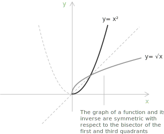

## Definition of inverse function

In the introduction to [functions](../functions/), we saw that a function $f: X \to Y$ is bijective if it is both injective and surjective, that is, for every $y \in Y$ there exists a unique $x \in X$ such that $f(x) = y.$

+ $X$ is the [domain](../determining-the-domain-of-a-function/).
+ $Y$ is the codomain.
+ A function is injective if for every $x_1, x_2 \in X$ with $x_1 \ne x_2$ we have $f(x_1) \ne f(x_2).$ Equivalently, for every $y \in Y$ there exists at most one $x \in X$ such that $f(x) = y.$
+ A function is surjective if for every $y \in Y$ there exists at least one $x \in X$ such that $f(x) = y.$

Injectivity has a direct graphical reading. A function is injective exactly when no horizontal line meets its graph more than once. A horizontal line $y = c$ that crossed the graph at two distinct points would produce two inputs with the same image $c,$ which contradicts injectivity.

- - -

A function $f : X \to Y$ is bijective if and only if there exists a function $g : Y \to X$ such that:

+ $(g \circ f)(x) = g(f(x)) = x$ for every $x \in X$
+ $(f \circ g)(y) = f(g(y)) = y$ for every $y \in Y$

In this case the function $g$ is unique and is called the inverse function of $f,$ denoted by:

$$f^{-1} = g$$

> The expression $(g \circ f)(x) = g(f(x))$ is the [composite function](../composite-functions/), obtained by applying $f$ to $x$ first and then applying $g$ to the result.

## Making a function invertible by restricting its domain

Consider the function $f(x) = x^2,$ defined on $\mathbb{R}.$ This is a quadratic function, represented by a [parabola](../parabola/) with its vertex at the origin of the Cartesian plane. On its full domain $\mathbb{R}$ the function is not invertible, since it is not injective, because distinct inputs can produce the same output, for example $f(-2) = f(2).$

If we restrict the domain to $[0, +\infty),$ the function becomes bijective and therefore invertible. In this case the inverse function is:

$$
f(x) = x^2 \rightarrow f^{-1}(x) = \sqrt{x} \quad \text{for} \; x \geq 0
$$

The graph of a function and that of its inverse are symmetric about the line $y = x,$ the diagonal bisecting the first and third quadrants of the Cartesian plane.

The same symmetry shows that the inverse keeps the direction of variation. Reflecting an increasing graph across the line $y = x$ produces another increasing graph, so the inverse of an increasing function is increasing, and the inverse of a decreasing function is decreasing.

If a function $f$ is [composed](../composite-functions/) with its inverse $f^{-1},$ the result is the identity function, which maps each element of a set to itself:

$$
f(f^{-1}(x)) = f^{-1}(f(x)) = x
$$

Reversing the correspondence between input and output a second time restores the original function. The inverse of $f^{-1}$ is again $f,$ so:

$$
\bigl(f^{-1}\bigr)^{-1} = f
$$

This equation also shows that $f^{-1}$ is itself bijective, since it has an inverse.

## How to find the inverse of a general function

+ Check whether the function is bijective, or determine a restriction of its domain that makes it bijective.
+ Replace $f(x)$ with $y,$ so that you work with the equation $y = f(x).$
+ Swap the variables $x$ and $y,$ writing $x = f(y).$ This reflects the idea of inverting input and output.
+ Solve the equation for $y,$ isolating it explicitly.
+ Rewrite the result as $f^{-1}(x) = \ldots,$ using $x$ as the input variable for the inverse.

## Example

We want to find the inverse of the function $f(x) = \dfrac{2x - 1}{x + 3}.$

> The function $f$ is bijective on its domain $\mathbb{R} \setminus \{-3\},$ because it is [strictly increasing](../increasing-and-decreasing-functions/), since its [derivative](../derivatives/) is always positive. This ensures that $f$ is injective, and since the image of $f$ covers all real numbers except a single point, it is also surjective onto its codomain.

- - -

Write the function as an equation:

$$
y = \dfrac{2x - 1}{x + 3}
$$

Swap $x$ and $y$:

$$
x = \dfrac{2y - 1}{y + 3}
$$

Solve for $y.$ Multiply both sides by $y + 3$:

$$
x(y + 3) = 2y - 1
$$

Distribute the left-hand side:

$$
xy + 3x = 2y - 1
$$

Bring all terms involving $y$ to one side and factor $y$:

$$
\begin{align}
xy - 2y &= -1 - 3x \\[6pt]
y(x - 2) &= -1 - 3x
\end{align}
$$

Dividing by $x - 2,$ we solve for $y$:

$$
y = \dfrac{-1 - 3x}{x - 2}
$$

The inverse function is therefore:

$$
f^{-1}(x) = \dfrac{-1 - 3x}{x - 2}
$$

## Inverse function theorem

A useful result from basic analysis is the one-dimensional version of the inverse function theorem. Its content is intuitive, since a function that behaves regularly on an interval can be inverted without difficulty. Suppose a function $f$ is [continuous](../continuous-functions/) and differentiable on an interval $I,$ and its [derivative](../derivatives/) never vanishes:

$$
f'(x) \neq 0 \quad \forall \, x \in I
$$

A derivative that keeps a constant sign on $I$ makes the function [strictly monotonic](../increasing-and-decreasing-functions/), and strict monotonicity makes $f$ injective. An inverse function $f^{-1}$ therefore exists on $f(I),$ and it is continuous and differentiable. Its derivative is given by the relation:

$$
\bigl(f^{-1}\bigr)'(y) = \frac{1}{f'\!\bigl(f^{-1}(y)\bigr)}
$$

The form of this relation follows from differentiating the identity $f\bigl(f^{-1}(y)\bigr) = y.$ Applying the [chain rule](../chain-rule/) to the left-hand side gives:

$$
f'\!\bigl(f^{-1}(y)\bigr) \cdot \bigl(f^{-1}\bigr)'(y) = 1
$$

Solving for $\bigl(f^{-1}\bigr)'(y)$ produces the formula above. The computation presupposes that $f^{-1}$ is differentiable, a property the hypothesis $f' \neq 0$ guarantees.

The hypothesis $f' \neq 0$ cannot be dropped. When $f'\bigl(f^{-1}(a)\bigr) = 0,$ the identity above would force $0 \cdot \bigl(f^{-1}\bigr)'(a) = 1,$ so $f^{-1}$ is not differentiable at $a.$ The function $f(x) = x^3$ shows this. Its inverse is $f^{-1}(x) = \sqrt[3]{x}$ and $f'(0) = 0,$ so the cube root is not differentiable at the origin, where its graph has a vertical tangent, although $f$ is differentiable on all of $\mathbb{R}.$
