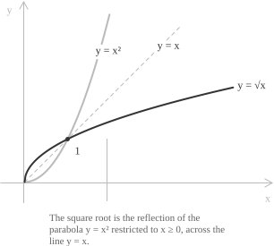
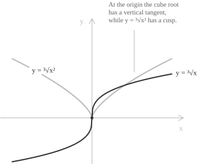
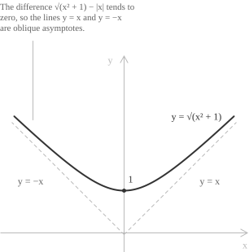
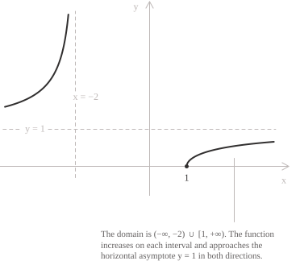

## Definition

An irrational function is an algebraic [function](../functions/) defined by an expression that, after simplification, contains the independent variable under a [radical](../radicals/) of index greater than one. A rational power with a non-integer exponent can denote a radical, but the equivalence depends on the domain conventions for negative bases. A basic form is a root applied to a rational expression:

$$y = \sqrt[n]{f(x)} = f(x)^{1/n} \qquad n \in \mathbb{N}, \ n \geq 2$$

The radicand $f$ is a [rational function](../rational-functions/). More general irrational functions combine rational functions with finitely many root extractions and retain at least one radical containing the variable after simplification. The remaining sections focus on the basic form $\sqrt[n]{f(x)}.$

The following formulas define irrational functions:

$$y = \sqrt{x^2 - 4} \qquad y = \sqrt[3]{\frac{x + 1}{x}} \qquad y = \sqrt[5]{x^3}$$

Whether a function is irrational depends on where the variable occurs after simplification, not on the numbers in the formula. The function $y = \sqrt{2}x + 1$ is a [degree-one polynomial](../polynomial-function/) with an irrational coefficient, while $y = \sqrt{5}$ is constant. In both cases the variable remains outside every radical.

> A radical may disappear upon simplification. Since $\sqrt{x^2} = |x|$ for every real $x,$ the formula $y = \sqrt{x^2}$ defines the [absolute value](../absolute-value-function/) rather than an irrational function.

## Irrational and algebraic functions

Every function of the form $\sqrt[n]{f(x)}$ with $f$ rational is algebraic, which means that it satisfies a polynomial equation in two variables. For $y = \sqrt{x},$ squaring both sides gives:

$$y^2 - x = 0$$

For $y = \sqrt[3]{(x + 1)/x},$ cubing both sides gives $xy^3 - x - 1 = 0.$ Rational functions are also algebraic because $y = P(x)/Q(x)$ satisfies $Q(x)y - P(x) = 0.$ Every irrational function is also algebraic, but its simplified expression is not a rational expression.

Irrational functions do not exhaust the non-rational algebraic functions. Some non-rational algebraic functions cannot be obtained from rational functions through finitely many arithmetic operations and root extractions, even though they satisfy a polynomial equation $P(x, y) = 0.$ Irrational functions therefore form a proper subclass of the algebraic functions.

## Domain

The domain depends on the parity of the index. When $n$ is odd, every real number has exactly one real $n$-th root, and the radical imposes no condition:

$$D = \mathrm{dom}(f) \qquad (n \ \text{odd})$$

When $n$ is even, the root is defined only for non-negative radicands, which restricts the domain to the set where $f$ is non-negative:

$$D = \{\ x \in \mathrm{dom}(f) \mid f(x) \geq 0 \ \}$$

Determining the domain of an even-index radical therefore amounts to solving $f(x) \geq 0,$ usually through a [sign analysis](../sign-analysis-in-inequalities/) of the radicand. Consider the function

$$y = \sqrt{\frac{x - 3}{x + 1}}$$

The radicand is a ratio of two first-degree polynomials and is undefined at $x = -1.$ The quotient is positive when the numerator and denominator have the same sign, namely for $x < -1$ and $x > 3,$ and it vanishes at $x = 3.$ The function therefore has domain

$$(-\infty, -1) \cup [3, +\infty)$$

If an even-index radical is in a denominator, its radicand must be strictly positive. If an odd-index radical is in a denominator, its radicand must be nonzero. If the radicand contains a fraction or another root, the [domain](../determining-the-domain-of-a-function/) is the intersection of the conditions imposed by the inner expressions and the outer radical.

The parity of the index also determines the sign of the values. An even root is non-negative, so $\sqrt[n]{f(x)} \geq 0$ throughout the domain and its graph never crosses below the $x$-axis. An odd root has the same sign as the radicand, so the function is positive, negative, or zero exactly where $f$ is.

## The square root function

The simplest irrational function is $y = \sqrt{x},$ with domain and range both equal to $[0, +\infty).$ It is the [inverse](../inverse-function/) of $x \mapsto x^2$ on $[0, +\infty),$ where squaring is injective. Its graph is the reflection of the right half of the [parabola](../parabola/) $y = x^2$ across the line $y = x.$

The function is strictly increasing because $0 \leq x_1 < x_2$ implies $\sqrt{x_1} < \sqrt{x_2}.$ On $(0, +\infty),$ its first two derivatives are

$$y' = \frac{1}{2\sqrt{x}} \qquad y'' = -\frac{1}{4x^{3/2}}$$

The negative second derivative shows that the graph is [concave](../convexity-and-concavity-of-functions/) on $(0, +\infty),$ while the first derivative tends to zero as $x \to +\infty.$ As $x \to 0^+,$ $y' \to +\infty,$ so the graph has a vertical half-tangent at the origin. The function is continuous at $0$ but not differentiable there, so the origin is a [point of non-differentiability](../points-of-non-differentiability/).

As $x \to +\infty,$ the square root tends to $+\infty,$ while $\sqrt{x}/x$ tends to zero. Hence the graph has neither a horizontal nor an oblique asymptote.

## Roots of odd index

The cube root $y = \sqrt[3]{x}$ is defined on all of $\mathbb{R}$ and takes every real value. It is the inverse of $x \mapsto x^3$ on the whole line. It is also an [odd function](../even-and-odd-functions/) and is strictly increasing. For $x \neq 0,$ its first two derivatives are

$$y' = \frac{1}{3\sqrt[3]{x^2}} \qquad y'' = -\frac{2}{9\sqrt[3]{x^5}}$$

The first derivative is positive for $x \neq 0$ and tends to $+\infty$ as $x \to 0,$ so the graph has a vertical tangent at the origin. The second derivative is positive for $x < 0$ and negative for $x > 0.$ Thus the curve is convex on the negative half-line and concave on the positive half-line, and the origin is an inflection point.

The function $y = \sqrt[3]{x^2}$ has the same domain but behaves differently at the origin. It equals $|x|^{2/3}$ and is even. For $x \neq 0,$ its derivative is

$$y' = \frac{2}{3\sqrt[3]{x}}$$

This derivative tends to $-\infty$ as $x \to 0^-$ and to $+\infty$ as $x \to 0^+.$ The graph has a cusp at the origin, with two oppositely directed vertical half-tangents. The function attains its minimum value $0$ there.

## Fractional exponents and reduction of the index

For positive integers $p$ and $q,$ with $q \geq 2,$ the notations $\sqrt[q]{x^p}$ and $x^{p/q}$ agree for $x \geq 0.$ For $x < 0,$ write $p/q = r/s$ in lowest terms. The [power function](../power-function/) with exponent $p/q$ takes the value $\sqrt[s]{x^r}$ when $s$ is odd; if $s$ is even, it is not defined at $x.$

The reduction of a radical to a smaller index requires the same care. For positive integers $m,$ $n,$ and $k,$ with $n \geq 2,$ the [rules for powers](../powers/) give the following identity when $x \geq 0:$

$$\sqrt[nk]{x^{mk}} = \sqrt[n]{x^m}$$

Canceling the common factor in the index and exponent for negative $x$ can change the domain or the values. The function $y = \sqrt[4]{x^2}$ is defined for every real $x$ and equals $\sqrt{|x|},$ whereas canceling the factor $2$ gives $\sqrt{x},$ which is defined only for $x \geq 0.$ The expressions agree for $x \geq 0,$ while only the original expression is defined for $x < 0.$

> Simplifying a radical is legitimate only after determining the domain of the original expression. A reduced expression may have a different natural domain or different values at negative inputs. The original domain must be retained, and the reduced form may be used only where the two expressions agree.

## Continuity and differentiability

For every index $n$ the map $t \mapsto \sqrt[n]{t}$ is [continuous](../continuous-functions/) on its domain. Since rational functions are continuous wherever they are defined, the [composition](../composite-functions/) $x \mapsto \sqrt[n]{f(x)}$ is continuous throughout its domain.

The [chain rule](../chain-rule/) gives the general derivative formula

$$\frac{d}{dx}\sqrt[n]{f(x)} = \frac{f'(x)}{n\sqrt[n]{f(x)^{n-1}}}$$

This formula is valid at the points where $f$ is differentiable and $f(x) \neq 0.$ At a zero of the radicand it is undefined, and differentiability requires a separate analysis. If $f(x_0) = 0$ and $f'(x_0) \neq 0,$ the [difference quotient](../difference-quotient/) is unbounded. The graph has a vertical tangent when $n$ is odd. When $n$ is even, only one side of $x_0$ belongs to the domain and the graph has a vertical half-tangent.

## Monotonicity and extrema

The map $t \mapsto \sqrt[n]{t}$ is strictly increasing on its domain. On each interval contained in the domain, $\sqrt[n]{f(x)}$ has the same [monotonicity](../increasing-and-decreasing-functions/) as $f$ and reaches its [maximum and minimum](../maximum-minimum-and-inflection-points/) at the same points. Its monotonicity can thus be determined from the radicand, which is a rational function and is often easier to analyze.

Concavity is not inherited in the same way. The radicand $x$ is affine on $[0, +\infty),$ so it is both convex and concave, while its square root is strictly concave. The radicand $x^2 + 1$ is convex, and $\sqrt{x^2 + 1}$ is convex as well, since its second derivative equals $(x^2 + 1)^{-3/2}.$ The sign of the second derivative must be computed case by case.

## Asymptotes

Irrational functions can have vertical, horizontal, and oblique [asymptotes](../asymptotes/). For a function of the basic form, a vertical asymptote occurs at a finite boundary point where the radicand tends to an infinite value. When the index is even, the radicand must tend to $+\infty;$ when it is odd, the radicand may tend to either $+\infty$ or $-\infty.$ If the radicand tends to a finite limit $L$ as $x \to +\infty$ or $x \to -\infty,$ the function tends to $\sqrt[n]{L}$ and has the horizontal asymptote $y = \sqrt[n]{L}.$ For even $n,$ this requires $L \geq 0,$ while for odd $n,$ any real $L$ is admissible.

Square roots of quadratic polynomials can have oblique asymptotes. For $a > 0,$ consider the function

$$y = \sqrt{ax^2 + bx + c}$$

Its two oblique asymptotes are

$$y = \pm\sqrt{a}\left(x + \frac{b}{2a}\right)$$

The line with the positive sign is approached as $x \to +\infty,$ and the line with the negative sign is approached as $x \to -\infty.$ The simplest example is $y = \sqrt{x^2 + 1},$ whose asymptotes are the bisectors $y = x$ and $y = -x.$ The first asymptote follows by rationalizing the difference with its conjugate.

$$
\begin{align}
\sqrt{x^2 + 1} - x &= \frac{(x^2 + 1) - x^2}{\sqrt{x^2 + 1} + x} \\[6pt]
&= \frac{1}{\sqrt{x^2 + 1} + x}
\end{align}
$$

The denominator tends to $+\infty$ as $x \to +\infty,$ so the difference tends to $0$ and the line $y = x$ is an asymptote. Replacing $x$ by $-x$ gives the asymptote $y = -x$ as $x \to -\infty.$

## Example 1

We study the function

$$f(x) = \sqrt{\frac{x - 1}{x + 2}}$$

The index is even, so the radicand must be non-negative and the denominator must not vanish. The quotient $(x - 1)/(x + 2)$ is positive when the numerator and denominator have the same sign, and it is zero at $x = 1.$ The domain is

$$D = (-\infty, -2) \cup [1, +\infty)$$

The point $x = -2$ is excluded because the radicand is undefined there, while $x = 1$ belongs to the domain and gives $f(1) = 0,$ the only zero of the function.

- - -

As $x \to \pm\infty,$ the radicand tends to $1.$ Both limits are

$$\lim_{x \to \pm\infty} f(x) = 1$$

Hence the line $y = 1$ is a horizontal asymptote in both directions. As $x \to -2^-,$ the numerator tends to $-3$ and the denominator tends to $0$ through negative values, so the radicand tends to $+\infty.$ The corresponding one-sided limit is

$$\lim_{x \to -2^-} f(x) = +\infty$$

Thus $x = -2$ is a vertical asymptote.

- - -

To determine monotonicity, we differentiate the radicand $g(x) = (x - 1)/(x + 2)$ with the [quotient rule](../differentiation-rules/).

$$g'(x) = \frac{(x + 2) - (x - 1)}{(x + 2)^2} = \frac{3}{(x + 2)^2}$$

The derivative of $g$ is positive at every point of the domain, so $g$ increases on each of the two intervals. Since the square-root function is strictly increasing, $f$ has the same monotonicity. The derivative of $f$ is

$$f'(x) = \frac{g'(x)}{2\sqrt{g(x)}} = \frac{3}{2(x + 2)^2}\sqrt{\frac{x + 2}{x - 1}}$$

This derivative is positive wherever it is defined. As $x \to 1^+,$ the radicand tends to zero and $f'(x) \to +\infty,$ so the graph has a vertical half-tangent at the endpoint $(1, 0).$

- - -

The function $f$ increases from $1$ to $+\infty$ on $(-\infty, -2)$ and from $0$ to $1$ on $[1, +\infty),$ without attaining the value $1$ on either interval. Its range is

$$[0, 1) \cup (1, +\infty)$$

## Example 2

We study the function

$$f(x) = \sqrt{x^2 - 4x}$$

The radicand factors as $x(x - 4)$ and is non-negative for $x \leq 0$ or $x \geq 4.$ Thus the domain is

$$D = (-\infty, 0] \cup [4, +\infty)$$

The function vanishes at $x = 0$ and $x = 4.$ On the excluded interval $(0, 4)$ the radicand is negative, so its square root is not a [real number](../real-numbers/).

- - -

The radicand is a second-degree polynomial with $a = 1$ and $b = -4,$ so the asymptote formula gives the lines $y = x - 2$ and $y = -(x - 2).$ For the branch on the right, rationalizing the difference gives

$$
\begin{align}
\sqrt{x^2 - 4x} - (x - 2) &= \frac{(x^2 - 4x) - (x - 2)^2}{\sqrt{x^2 - 4x} + x - 2} \\[6pt]
&= \frac{-4}{\sqrt{x^2 - 4x} + x - 2}
\end{align}
$$

The last expression tends to $0$ as $x \to +\infty.$ The corresponding computation on the left branch confirms the asymptote $y = -(x - 2).$

- - -

The derivative is

$$f'(x) = \frac{2x - 4}{2\sqrt{x^2 - 4x}} = \frac{x - 2}{\sqrt{x^2 - 4x}}$$

The numerator is negative on $(-\infty, 0),$ so the function decreases there. It is positive on $(4, +\infty),$ so the function increases there. The derivative tends to $-\infty$ as $x \to 0^-$ and to $+\infty$ as $x \to 4^+,$ so the graph meets the $x$-axis with a vertical half-tangent at each endpoint. The function attains its minimum value $0$ at both endpoints, and its range is $[0, +\infty).$

## Irrational functions in equations and inequalities

Equations and inequalities containing irrational functions require care when a radical is removed by raising both sides to a power. For even $n,$ this operation is not reversible. Although $u = v$ implies $u^n = v^n,$ the converse holds only when $u$ and $v$ have the same sign. The transformed equation may therefore have solutions that do not satisfy the original equation.

Before raising both sides to a power, one must record the domain and sign conditions. Each candidate must then be tested in the original equation. Detailed procedures are given in [irrational equations](../irrational-equations/) and [irrational inequalities](../irrational-inequalities/), while [loss of roots](../loss-of-roots/) describes the effects of non-equivalent transformations.
